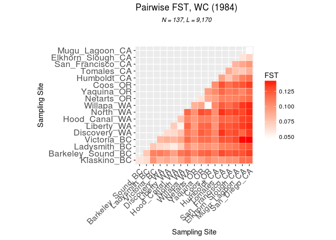
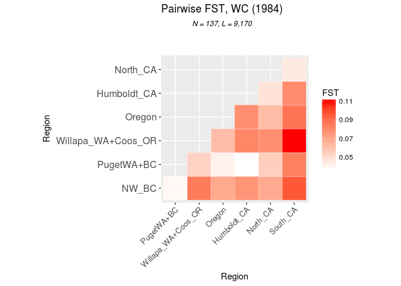
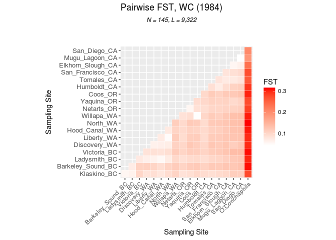
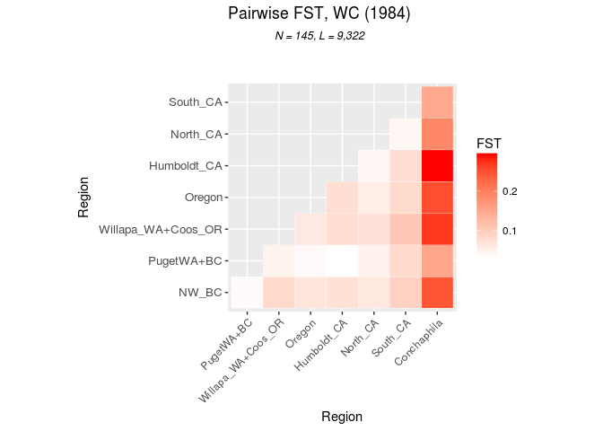

Fst Analysis of Ostrea lurida
================
Katherine Silliman

-   [Dataset with only Ostrea lurida](#dataset-with-only-ostrea-lurida)
    -   [Plotting](#plotting)
    -   [Basic PopGen stats](#basic-popgen-stats)
-   [Dataset with both O. lurida and O. conchaphila](#dataset-with-both-o.-lurida-and-o.-conchaphila)
    -   [Plotting](#plotting-1)

``` r
library(hierfstat) #For calculating pairwise Fst
library(ggplot2) #For plotting
library(reshape2) #For plotting
library("adegenet") #For storing genotype data
```

    ## Loading required package: ade4

    ## 
    ##    /// adegenet 2.0.1 is loaded ////////////
    ## 
    ##    > overview: '?adegenet'
    ##    > tutorials/doc/questions: 'adegenetWeb()' 
    ##    > bug reports/feature requests: adegenetIssues()

    ## 
    ## Attaching package: 'adegenet'

    ## The following object is masked from 'package:hierfstat':
    ## 
    ##     read.fstat

Dataset with only Ostrea lurida
===============================

Load previously created Adegenet genind objects. Made by loading .str file into adegenet and saving as an R object.

``` r
load("../../../../c80-denovo/Analysis/PCA/OL-c80-66-s67-m70x62-maf025-u.adegenet")
g.indF
```

    ## /// GENIND OBJECT /////////
    ## 
    ##  // 137 individuals; 9,170 loci; 18,340 alleles; size: 13.9 Mb
    ## 
    ##  // Basic content
    ##    @tab:  137 x 18340 matrix of allele counts
    ##    @loc.n.all: number of alleles per locus (range: 2-2)
    ##    @loc.fac: locus factor for the 18340 columns of @tab
    ##    @all.names: list of allele names for each locus
    ##    @ploidy: ploidy of each individual  (range: 2-2)
    ##    @type:  codom
    ##    @call: read.structure(file = infile, n.ind = nind.65, n.loc = nloci.m50x65, 
    ##     onerowperind = FALSE, col.lab = 1, col.pop = 2, row.marknames = 1, 
    ##     ask = FALSE)
    ## 
    ##  // Optional content
    ##    @pop: population of each individual (group size range: 3-11)
    ##    @strata: a data frame with 3 columns ( Population, Region, North.South )

Calculating Weir and Cockerham pairwise Fst between all pairs of populations. This can take a while...

``` r
gindF.fst.mat <- pairwise.fst(g.indF, pop = strata(g.indF)$Population,res.type = "matrix")
gindF.fst.mat
```

    ##                   Victoria_BC Klaskino_BC Barkeley_BC Ladysmith_BC
    ## Victoria_BC        0.00000000  0.10093973  0.10856297   0.07496538
    ## Klaskino_BC        0.10093973  0.00000000  0.06069430   0.06452118
    ## Barkeley_BC        0.10856297  0.06069430  0.00000000   0.07450935
    ## Ladysmith_BC       0.07496538  0.06452118  0.07450935   0.00000000
    ## San_Diego_CA       0.14291633  0.11520974  0.13389188   0.12628354
    ## San_Francisco_CA   0.12455686  0.10003975  0.12390428   0.10918192
    ## Netarts_OR         0.10465487  0.08609423  0.10718465   0.08864575
    ## Tomales_CA         0.12624177  0.09498810  0.12964989   0.10808370
    ## Elkhorn_Slough_CA  0.13008053  0.09948871  0.12675916   0.11275510
    ## Humboldt_CA        0.10856171  0.09704187  0.11216557   0.09607019
    ## Mugu_Lagoon_CA     0.14239204  0.11543524  0.12652761   0.12205764
    ## Coos_OR            0.11674638  0.10395279  0.12211816   0.10020116
    ## Yaquina_OR         0.11681447  0.09290189  0.11974269   0.09894919
    ## Hood_Canal_WA      0.08359368  0.08189789  0.09415272   0.05679713
    ## Liberty_WA         0.08632469  0.09046730  0.10573846   0.06446979
    ## Discovery_WA       0.08173055  0.08426389  0.11039929   0.06699393
    ## North_WA           0.09206649  0.09161748  0.11362344   0.07146291
    ## Willapa_WA         0.11762644  0.10622126  0.11919695   0.10019604
    ##                   San_Diego_CA San_Francisco_CA Netarts_OR Tomales_CA
    ## Victoria_BC         0.14291633       0.12455686 0.10465487 0.12624177
    ## Klaskino_BC         0.11520974       0.10003975 0.08609423 0.09498810
    ## Barkeley_BC         0.13389188       0.12390428 0.10718465 0.12964989
    ## Ladysmith_BC        0.12628354       0.10918192 0.08864575 0.10808370
    ## San_Diego_CA        0.00000000       0.09838606 0.11763944 0.08567611
    ## San_Francisco_CA    0.09838606       0.00000000 0.10672195 0.08885016
    ## Netarts_OR          0.11763944       0.10672195 0.00000000 0.10843232
    ## Tomales_CA          0.08567611       0.08885016 0.10843232 0.00000000
    ## Elkhorn_Slough_CA   0.06907592       0.08415435 0.10855712 0.07793838
    ## Humboldt_CA         0.11441767       0.07522313 0.09457581 0.09277755
    ## Mugu_Lagoon_CA      0.04729287       0.09089254 0.11198898 0.07404573
    ## Coos_OR             0.13375618       0.11487035 0.08852166 0.12749075
    ## Yaquina_OR          0.11810711       0.11009855 0.06074500 0.11949823
    ## Hood_Canal_WA       0.13432663       0.11812833 0.09693791 0.11996514
    ## Liberty_WA          0.13777611       0.12443697 0.09594766 0.12746880
    ## Discovery_WA        0.13344440       0.12581314 0.10145803 0.13630183
    ## North_WA            0.13823217       0.12946777 0.10059883 0.13657459
    ## Willapa_WA          0.13864955       0.11646398 0.08525048 0.12377787
    ##                   Elkhorn_Slough_CA Humboldt_CA Mugu_Lagoon_CA    Coos_OR
    ## Victoria_BC              0.13008053  0.10856171     0.14239204 0.11674638
    ## Klaskino_BC              0.09948871  0.09704187     0.11543524 0.10395279
    ## Barkeley_BC              0.12675916  0.11216557     0.12652761 0.12211816
    ## Ladysmith_BC             0.11275510  0.09607019     0.12205764 0.10020116
    ## San_Diego_CA             0.06907592  0.11441767     0.04729287 0.13375618
    ## San_Francisco_CA         0.08415435  0.07522313     0.09089254 0.11487035
    ## Netarts_OR               0.10855712  0.09457581     0.11198898 0.08852166
    ## Tomales_CA               0.07793838  0.09277755     0.07404573 0.12749075
    ## Elkhorn_Slough_CA        0.00000000  0.09266500     0.06106591 0.12330257
    ## Humboldt_CA              0.09266500  0.00000000     0.10810670 0.10213511
    ## Mugu_Lagoon_CA           0.06106591  0.10810670     0.00000000 0.12593627
    ## Coos_OR                  0.12330257  0.10213511     0.12593627 0.00000000
    ## Yaquina_OR               0.11308720  0.10390309     0.10536122 0.09534508
    ## Hood_Canal_WA            0.12201207  0.10092245     0.13176652 0.10927148
    ## Liberty_WA               0.12845297  0.09974793     0.13373779 0.12001002
    ## Discovery_WA             0.12979454  0.10545997     0.11946920 0.11788126
    ## North_WA                 0.13294884  0.10259109     0.13038571 0.12393094
    ## Willapa_WA               0.12498421  0.10494713     0.13490987 0.04919433
    ##                   Yaquina_OR Hood_Canal_WA Liberty_WA Discovery_WA
    ## Victoria_BC       0.11681447    0.08359368 0.08632469   0.08173055
    ## Klaskino_BC       0.09290189    0.08189789 0.09046730   0.08426389
    ## Barkeley_BC       0.11974269    0.09415272 0.10573846   0.11039929
    ## Ladysmith_BC      0.09894919    0.05679713 0.06446979   0.06699393
    ## San_Diego_CA      0.11810711    0.13432663 0.13777611   0.13344440
    ## San_Francisco_CA  0.11009855    0.11812833 0.12443697   0.12581314
    ## Netarts_OR        0.06074500    0.09693791 0.09594766   0.10145803
    ## Tomales_CA        0.11949823    0.11996514 0.12746880   0.13630183
    ## Elkhorn_Slough_CA 0.11308720    0.12201207 0.12845297   0.12979454
    ## Humboldt_CA       0.10390309    0.10092245 0.09974793   0.10545997
    ## Mugu_Lagoon_CA    0.10536122    0.13176652 0.13373779   0.11946920
    ## Coos_OR           0.09534508    0.10927148 0.12001002   0.11788126
    ## Yaquina_OR        0.00000000    0.10992688 0.11887405   0.12328030
    ## Hood_Canal_WA     0.10992688    0.00000000 0.07296196   0.06623130
    ## Liberty_WA        0.11887405    0.07296196 0.00000000   0.06502927
    ## Discovery_WA      0.12328030    0.06623130 0.06502927   0.00000000
    ## North_WA          0.12884790    0.07624583 0.05356819   0.07626919
    ## Willapa_WA        0.09151440    0.10739993 0.11905949   0.11088279
    ##                     North_WA Willapa_WA
    ## Victoria_BC       0.09206649 0.11762644
    ## Klaskino_BC       0.09161748 0.10622126
    ## Barkeley_BC       0.11362344 0.11919695
    ## Ladysmith_BC      0.07146291 0.10019604
    ## San_Diego_CA      0.13823217 0.13864955
    ## San_Francisco_CA  0.12946777 0.11646398
    ## Netarts_OR        0.10059883 0.08525048
    ## Tomales_CA        0.13657459 0.12377787
    ## Elkhorn_Slough_CA 0.13294884 0.12498421
    ## Humboldt_CA       0.10259109 0.10494713
    ## Mugu_Lagoon_CA    0.13038571 0.13490987
    ## Coos_OR           0.12393094 0.04919433
    ## Yaquina_OR        0.12884790 0.09151440
    ## Hood_Canal_WA     0.07624583 0.10739993
    ## Liberty_WA        0.05356819 0.11905949
    ## Discovery_WA      0.07626919 0.11088279
    ## North_WA          0.00000000 0.11935037
    ## Willapa_WA        0.11935037 0.00000000

Calculating WC pairwise Fst betwen all pairs of regions.

``` r
gindF.fst.reg.mat <- pairwise.fst(g.indF, pop = strata(g.indF)$Region,res.type = "matrix")
gindF.fst.reg.mat
```

    ##                  Puget+      NW_BC      SoCal      NoCal   Oregon23
    ## Puget+       0.00000000 0.03871855 0.08399003 0.05495440 0.04116943
    ## NW_BC        0.03871855 0.00000000 0.09654322 0.06862818 0.06920149
    ## SoCal        0.08399003 0.09654322 0.00000000 0.04419911 0.08788940
    ## NoCal        0.05495440 0.06862818 0.04419911 0.00000000 0.06186276
    ## Oregon23     0.04116943 0.06920149 0.08788940 0.06186276 0.00000000
    ## Humboldt     0.03594506 0.07602745 0.07985898 0.04690247 0.07871157
    ## Willapa_Coos 0.05309742 0.08521937 0.11038780 0.07875389 0.06181764
    ##                Humboldt Willapa_Coos
    ## Puget+       0.03594506   0.05309742
    ## NW_BC        0.07602745   0.08521937
    ## SoCal        0.07985898   0.11038780
    ## NoCal        0.04690247   0.07875389
    ## Oregon23     0.07871157   0.06181764
    ## Humboldt     0.00000000   0.08132018
    ## Willapa_Coos 0.08132018   0.00000000

Editing region names for a prettier graph.

``` r
#Editing to have state in name
reg_names = c("PugetWA+BC","NW_BC","South_CA","North_CA","Oregon","Humboldt_CA","Willapa_WA+Coos_OR")
colnames(gindF.fst.reg.mat)<- reg_names
rownames(gindF.fst.reg.mat)<- reg_names

#Rearranging by North to South
N_S_reg <- c("NW_BC","PugetWA+BC","Willapa_WA+Coos_OR","Oregon","Humboldt_CA","North_CA","South_CA")
             
gindF.fst.reg.mat.NS <- gindF.fst.reg.mat[N_S_reg,N_S_reg]
#Save pairwise Fst values to a file
write.table(gindF.fst.reg.mat.NS, file="OL-m70x62-maf025-Reg.pwfst",row.names = T,col.names = T)
```

Editing population names for a prettier graph.

``` r
#Editing to have state in name
state_names = c("Victoria_BC","Klaskino_BC","Barkeley_Sound_BC","Ladysmith_BC","San_Diego_CA","San_Francisco_CA","Netarts_OR","Tomales_CA","Elkhorn_Slough_CA","Humboldt_CA","Mugu_Lagoon_CA","Coos_OR","Yaquina_OR","Hood_Canal_WA","Liberty_WA","Discovery_WA","North_WA","Willapa_WA")
colnames(gindF.fst.mat)<- state_names
rownames(gindF.fst.mat)<- state_names

#Rearranging North-South
N_S <- c("Klaskino_BC","Barkeley_Sound_BC","Ladysmith_BC","Victoria_BC","Discovery_WA","Liberty_WA","Hood_Canal_WA","North_WA","Willapa_WA","Netarts_OR","Yaquina_OR","Coos_OR", "Humboldt_CA","Tomales_CA","San_Francisco_CA","Elkhorn_Slough_CA","Mugu_Lagoon_CA","San_Diego_CA")
gindF.fst.mat.NS <- gindF.fst.mat[N_S,N_S]
write.table(gindF.fst.mat.NS, file="OL-m70x62-maf025.pwfst",row.names = T,col.names = T)
```

Plotting
--------

``` r
#Melting
gindF.fst.mat.tri <- gindF.fst.mat.NS
gindF.fst.mat.tri[lower.tri(gindF.fst.mat.NS, diag=TRUE)] <- NA
melted <- melt(gindF.fst.mat.tri, na.rm =TRUE)

#Melting
gindF.fst.reg.mat.tri <- gindF.fst.reg.mat.NS
gindF.fst.reg.mat.tri[lower.tri(gindF.fst.reg.mat.NS, diag=TRUE)] <- NA
melted.reg <- melt(gindF.fst.reg.mat.tri, na.rm =TRUE)

par(mfrow=c(2,1))
ggplot(data = melted, aes(Var2, Var1, fill = value))+ geom_tile(color = "white")+ 
  scale_fill_gradient(low = "white", high = "red", name="FST")  +
  ggtitle(expression(atop("Pairwise FST, WC (1984)", atop(italic("N = 137, L = 9,170"), ""))))+
  labs( x = "Sampling Site", y = "Sampling Site") + 
  theme(axis.text.x = element_text(angle = 45, vjust = 1, size = 12, hjust = 1),axis.text.y = element_text(size = 13)) + 
  coord_fixed()
```



``` r
ggplot(data = melted.reg, aes(Var2, Var1, fill = value))+ geom_tile(color = "white")+ 
  scale_fill_gradient(low = "white", high = "red", name="FST")  + 
  ggtitle(expression(atop("Pairwise FST, WC (1984)", atop(italic("N = 137, L = 9,170"), ""))))+ 
  labs( x = "Region", y = "Region")+ 
  theme(axis.text.x = element_text(angle = 45, vjust = 1, size = 10, hjust = 1),axis.text.y = element_text(size = 12)) + 
  coord_fixed()
```



Basic PopGen stats
------------------

Calculating popgen stats using heirfstat. Done for the population level, regional level, and north/south level.

``` r
#Creating genind objects with North/South strata set for population
temp.gind <- g.indF
pop(temp.gind) <- strata(g.indF)$North.South
#Calculating popgen stats 
NS.stats <- basic.stats(temp.gind,diploid = TRUE,digits=2)
print("North-South")
```

    ## [1] "North-South"

``` r
print("Observed heterozygosity")
```

    ## [1] "Observed heterozygosity"

``` r
colMeans(NS.stats$Ho,na.rm = T)
```

    ##     North     South 
    ## 0.1661210 0.1858386

``` r
print("Expected heterozygosity")
```

    ## [1] "Expected heterozygosity"

``` r
colMeans(NS.stats$Hs,na.rm=T)
```

    ##     North     South 
    ## 0.1979204 0.2354580

``` r
NS.stats$overall
```

    ##   Ho   Hs   Ht  Dst  Htp Dstp  Fst Fstp  Fis Dest 
    ## 0.18 0.22 0.22 0.01 0.23 0.01 0.03 0.06 0.19 0.02

``` r
#Creating genind objects with Region strata set for population
pop(temp.gind) <- strata(g.indF)$Region
#Calculating popgen stats 
Reg.stats <- basic.stats(temp.gind,diploid = TRUE,digits=2)
print("Regions")
```

    ## [1] "Regions"

``` r
print("Observed heterozygosity")
```

    ## [1] "Observed heterozygosity"

``` r
colMeans(Reg.stats$Ho,na.rm = T)
```

    ##       Puget+        NW_BC        SoCal        NoCal     Oregon23 
    ##    0.1649335    0.1698386    0.2065987    0.1990011    0.1751036 
    ##     Humboldt Willapa_Coos 
    ##    0.1797480    0.1588746

``` r
print("Expected heterozygosity")
```

    ## [1] "Expected heterozygosity"

``` r
colMeans(Reg.stats$Hs,na.rm=T)
```

    ##       Puget+        NW_BC        SoCal        NoCal     Oregon23 
    ##    0.1910545    0.1966216    0.2505573    0.2311767    0.1970534 
    ##     Humboldt Willapa_Coos 
    ##    0.2130663    0.1826827

``` r
Reg.stats$overall
```

    ##   Ho   Hs   Ht  Dst  Htp Dstp  Fst Fstp  Fis Dest 
    ## 0.18 0.21 0.23 0.02 0.23 0.02 0.09 0.10 0.14 0.03

``` r
#Creating genind objects with Region strata set for population
pop(temp.gind) <- strata(g.indF)$Population
#Calculating popgen stats 
Pop.stats <- basic.stats(temp.gind,diploid = TRUE,digits=2)
print("Populations")
```

    ## [1] "Populations"

``` r
print("Observed heterozygosity")
```

    ## [1] "Observed heterozygosity"

``` r
colMeans(Pop.stats$Ho,na.rm = T)
```

    ##       Victoria_BC       Klaskino_BC       Barkeley_BC      Ladysmith_BC 
    ##         0.1536358         0.1727285         0.1651603         0.1919433 
    ##      San_Diego_CA  San_Francisco_CA        Netarts_OR        Tomales_CA 
    ##         0.2027593         0.1917243         0.1751145         0.1983355 
    ## Elkhorn_Slough_CA       Humboldt_CA    Mugu_Lagoon_CA           Coos_OR 
    ##         0.2086225         0.1797480         0.2090720         0.1635998 
    ##        Yaquina_OR     Hood_Canal_WA        Liberty_WA      Discovery_WA 
    ##         0.1764620         0.1596150         0.1630273         0.1637867 
    ##          North_WA        Willapa_WA 
    ##         0.1633010         0.1559967

``` r
print("Expected heterozygosity")
```

    ## [1] "Expected heterozygosity"

``` r
colMeans(Pop.stats$Hs,na.rm=T)
```

    ##       Victoria_BC       Klaskino_BC       Barkeley_BC      Ladysmith_BC 
    ##         0.1736806         0.1935780         0.1920526         0.1981658 
    ##      San_Diego_CA  San_Francisco_CA        Netarts_OR        Tomales_CA 
    ##         0.2454490         0.2198613         0.1971179         0.2235440 
    ## Elkhorn_Slough_CA       Humboldt_CA    Mugu_Lagoon_CA           Coos_OR 
    ##         0.2382325         0.2130663         0.2523146         0.1838150 
    ##        Yaquina_OR     Hood_Canal_WA        Liberty_WA      Discovery_WA 
    ##         0.1956173         0.1827604         0.1768870         0.1859644 
    ##          North_WA        Willapa_WA 
    ##         0.1782577         0.1816943

``` r
Pop.stats$overall
```

    ##   Ho   Hs   Ht  Dst  Htp Dstp  Fst Fstp  Fis Dest 
    ## 0.18 0.20 0.23 0.02 0.23 0.03 0.11 0.11 0.12 0.03

Dataset with both O. lurida and O. conchaphila
==============================================

``` r
load("../../../../c80-denovo/Analysis/PCA/All5C-c80-66-s67-m70x62-mac4-u.adegenet")
All.g.indm70
```

    ## /// GENIND OBJECT /////////
    ## 
    ##  // 145 individuals; 9,322 loci; 18,644 alleles; size: 14.7 Mb
    ## 
    ##  // Basic content
    ##    @tab:  145 x 18644 matrix of allele counts
    ##    @loc.n.all: number of alleles per locus (range: 2-2)
    ##    @loc.fac: locus factor for the 18644 columns of @tab
    ##    @all.names: list of allele names for each locus
    ##    @ploidy: ploidy of each individual  (range: 2-2)
    ##    @type:  codom
    ##    @call: read.structure(file = infile, n.ind = nind.65, n.loc = nloci.m50x65, 
    ##     onerowperind = FALSE, col.lab = 1, col.pop = 2, row.marknames = 1, 
    ##     ask = FALSE)
    ## 
    ##  // Optional content
    ##    @pop: population of each individual (group size range: 2-11)
    ##    @strata: a data frame with 3 columns ( Population, Region, North.South )

By population:

``` r
gind.all.mat <- pairwise.fst(All.g.indm70, pop = strata(All.g.indm70)$Population,res.type = "matrix")
gind.all.mat
```

    ##                  Victoria   Klaskino Barkeley_Sound  Ladysmith  San_Diego
    ## Victoria       0.00000000 0.10195548     0.10838220 0.07535027 0.13685465
    ## Klaskino       0.10195548 0.00000000     0.05820777 0.06335914 0.11144353
    ## Barkeley_Sound 0.10838220 0.05820777     0.00000000 0.07120271 0.12849227
    ## Ladysmith      0.07535027 0.06335914     0.07120271 0.00000000 0.12398737
    ## San_Diego      0.13685465 0.11144353     0.12849227 0.12398737 0.00000000
    ## San_Francisco  0.11845133 0.09578937     0.11752811 0.10419504 0.09482432
    ## Netarts        0.10419952 0.08529554     0.10543749 0.08837926 0.11142368
    ## Tomales        0.11651463 0.09009135     0.11916943 0.10078083 0.08245211
    ## Elkhorn_Slough 0.12645549 0.09955825     0.12422897 0.11148479 0.06469699
    ## Humboldt       0.10468768 0.09398073     0.10806763 0.09192051 0.11258493
    ## Mugu_Lagoon    0.13641188 0.11349201     0.12217721 0.11986032 0.04525117
    ## Coos           0.11326345 0.10019353     0.11851606 0.09733901 0.12713126
    ## Yaquina        0.11457676 0.09029598     0.11571604 0.09595484 0.10531651
    ## Triton_Cove    0.08384318 0.08038780     0.09247576 0.05497189 0.13029345
    ## Liberty_Bay    0.08705069 0.08967443     0.10380636 0.06338624 0.12740188
    ## Discovery_Bay  0.08389559 0.08428730     0.10927354 0.06710162 0.12352084
    ## North_Bay      0.08994166 0.09211203     0.10665833 0.07236779 0.13348962
    ## Willapa        0.11577038 0.10458219     0.11580939 0.09826664 0.13432244
    ## Conchaphila    0.30848048 0.27469004     0.30839717 0.29993888 0.20328065
    ##                San_Francisco    Netarts    Tomales Elkhorn_Slough
    ## Victoria          0.11845133 0.10419952 0.11651463     0.12645549
    ## Klaskino          0.09578937 0.08529554 0.09009135     0.09955825
    ## Barkeley_Sound    0.11752811 0.10543749 0.11916943     0.12422897
    ## Ladysmith         0.10419504 0.08837926 0.10078083     0.11148479
    ## San_Diego         0.09482432 0.11142368 0.08245211     0.06469699
    ## San_Francisco     0.00000000 0.10252580 0.08229850     0.08241873
    ## Netarts           0.10252580 0.00000000 0.10236750     0.10604065
    ## Tomales           0.08229850 0.10236750 0.00000000     0.07431134
    ## Elkhorn_Slough    0.08241873 0.10604065 0.07431134     0.00000000
    ## Humboldt          0.07130214 0.09167083 0.08791266     0.09295374
    ## Mugu_Lagoon       0.08850667 0.10679819 0.07511035     0.05760074
    ## Coos              0.10801176 0.08735793 0.11625222     0.11927788
    ## Yaquina           0.10508146 0.05832242 0.10810812     0.10671422
    ## Triton_Cove       0.11238047 0.09691563 0.11081890     0.12005836
    ## Liberty_Bay       0.11710906 0.09309742 0.11646012     0.12320019
    ## Discovery_Bay     0.11773555 0.10124532 0.12316410     0.12505315
    ## North_Bay         0.11974378 0.09696928 0.11843860     0.12466054
    ## Willapa           0.11043920 0.08547658 0.11665568     0.12231466
    ## Conchaphila       0.27017132 0.28291066 0.25958753     0.23337665
    ##                  Humboldt Mugu_Lagoon       Coos    Yaquina Triton_Cove
    ## Victoria       0.10468768  0.13641188 0.11326345 0.11457676  0.08384318
    ## Klaskino       0.09398073  0.11349201 0.10019353 0.09029598  0.08038780
    ## Barkeley_Sound 0.10806763  0.12217721 0.11851606 0.11571604  0.09247576
    ## Ladysmith      0.09192051  0.11986032 0.09733901 0.09595484  0.05497189
    ## San_Diego      0.11258493  0.04525117 0.12713126 0.10531651  0.13029345
    ## San_Francisco  0.07130214  0.08850667 0.10801176 0.10508146  0.11238047
    ## Netarts        0.09167083  0.10679819 0.08735793 0.05832242  0.09691563
    ## Tomales        0.08791266  0.07511035 0.11625222 0.10810812  0.11081890
    ## Elkhorn_Slough 0.09295374  0.05760074 0.11927788 0.10671422  0.12005836
    ## Humboldt       0.00000000  0.10674620 0.09878934 0.09912873  0.09623080
    ## Mugu_Lagoon    0.10674620  0.00000000 0.12020574 0.09619669  0.12821095
    ## Coos           0.09878934  0.12020574 0.00000000 0.09296364  0.10465952
    ## Yaquina        0.09912873  0.09619669 0.09296364 0.00000000  0.10792905
    ## Triton_Cove    0.09623080  0.12821095 0.10465952 0.10792905  0.00000000
    ## Liberty_Bay    0.09396181  0.12553373 0.11478066 0.11354652  0.07308577
    ## Discovery_Bay  0.10120498  0.11295701 0.11369890 0.12157736  0.06691661
    ## North_Bay      0.09436231  0.13132901 0.11426776 0.11859733  0.07465173
    ## Willapa        0.10089672  0.13109105 0.04730178 0.09189066  0.10478976
    ## Conchaphila    0.29038908  0.18664347 0.30086360 0.27308667  0.30518426
    ##                Liberty_Bay Discovery_Bay  North_Bay    Willapa Conchaphila
    ## Victoria        0.08705069    0.08389559 0.08994166 0.11577038   0.3084805
    ## Klaskino        0.08967443    0.08428730 0.09211203 0.10458219   0.2746900
    ## Barkeley_Sound  0.10380636    0.10927354 0.10665833 0.11580939   0.3083972
    ## Ladysmith       0.06338624    0.06710162 0.07236779 0.09826664   0.2999389
    ## San_Diego       0.12740188    0.12352084 0.13348962 0.13432244   0.2032807
    ## San_Francisco   0.11710906    0.11773555 0.11974378 0.11043920   0.2701713
    ## Netarts         0.09309742    0.10124532 0.09696928 0.08547658   0.2829107
    ## Tomales         0.11646012    0.12316410 0.11843860 0.11665568   0.2595875
    ## Elkhorn_Slough  0.12320019    0.12505315 0.12466054 0.12231466   0.2333766
    ## Humboldt        0.09396181    0.10120498 0.09436231 0.10089672   0.2903891
    ## Mugu_Lagoon     0.12553373    0.11295701 0.13132901 0.13109105   0.1866435
    ## Coos            0.11478066    0.11369890 0.11426776 0.04730178   0.3008636
    ## Yaquina         0.11354652    0.12157736 0.11859733 0.09189066   0.2730867
    ## Triton_Cove     0.07308577    0.06691661 0.07465173 0.10478976   0.3051843
    ## Liberty_Bay     0.00000000    0.06413076 0.05048434 0.11482335   0.2969858
    ## Discovery_Bay   0.06413076    0.00000000 0.06938690 0.10749315   0.2967263
    ## North_Bay       0.05048434    0.06938690 0.00000000 0.11364354   0.3108058
    ## Willapa         0.11482335    0.10749315 0.11364354 0.00000000   0.3042585
    ## Conchaphila     0.29698578    0.29672627 0.31080579 0.30425851   0.0000000

``` r
#Editing to have state in name
all_names = c("Victoria_BC","Klaskino_BC","Barkeley_Sound_BC","Ladysmith_BC","San_Diego_CA","San_Francisco_CA","Netarts_OR","Tomales_CA","Elkhorn_Slough_CA","Humboldt_CA","Mugu_Lagoon_CA","Coos_OR","Yaquina_OR","Hood_Canal_WA","Liberty_WA","Discovery_WA","North_WA","Willapa_WA","O.Conchaphila")
colnames(gind.all.mat)<- all_names
rownames(gind.all.mat)<- all_names

#Rearranging North-South
N_S_C <- c("Klaskino_BC","Barkeley_Sound_BC","Ladysmith_BC","Victoria_BC","Discovery_WA","Liberty_WA","Hood_Canal_WA","North_WA","Willapa_WA","Netarts_OR","Yaquina_OR","Coos_OR", "Humboldt_CA","Tomales_CA","San_Francisco_CA","Elkhorn_Slough_CA","Mugu_Lagoon_CA","San_Diego_CA", "O.Conchaphila")
gind.all.mat.NS <- gind.all.mat[N_S_C,N_S_C]
write.table(gind.all.mat.NS, file="All5C-c80-66-s67-m70x62-mac4.pwfst",row.names = T,col.names = T)
```

By region:

``` r
gind.all.reg.mat <- pairwise.fst(All.g.indm70, pop = strata(All.g.indm70)$Region,res.type = "matrix")
gind.all.reg.mat
```

    ##                  Puget+      NW_BC      SoCal      NoCal   Oregon23
    ## Puget+       0.00000000 0.03801290 0.08314800 0.05078502 0.03952795
    ## NW_BC        0.03801290 0.00000000 0.09468213 0.06494769 0.06837612
    ## SoCal        0.08314800 0.09468213 0.00000000 0.04421013 0.08167271
    ## NoCal        0.05078502 0.06494769 0.04421013 0.00000000 0.05745751
    ## Oregon23     0.03952795 0.06837612 0.08167271 0.05745751 0.00000000
    ## Humboldt     0.03321900 0.07412865 0.07730635 0.04386131 0.07616800
    ## Willapa_Coos 0.05009149 0.08356700 0.10657342 0.07283054 0.06235863
    ## Conchaphila  0.15213563 0.24435787 0.14818437 0.18974152 0.25139667
    ##                Humboldt Willapa_Coos Conchaphila
    ## Puget+       0.03321900   0.05009149   0.1521356
    ## NW_BC        0.07412865   0.08356700   0.2443579
    ## SoCal        0.07730635   0.10657342   0.1481844
    ## NoCal        0.04386131   0.07283054   0.1897415
    ## Oregon23     0.07616800   0.06235863   0.2513967
    ## Humboldt     0.00000000   0.07885582   0.2903891
    ## Willapa_Coos 0.07885582   0.00000000   0.2668437
    ## Conchaphila  0.29038908   0.26684366   0.0000000

``` r
#Editing to have state in name
all_names_reg = c("PugetWA+BC","NW_BC","South_CA","North_CA","Oregon","Humboldt_CA","Willapa_WA+Coos_OR","Conchaphila")
colnames(gind.all.reg.mat)<- all_names_reg
rownames(gind.all.reg.mat)<- all_names_reg

#Rearranging North-South
N_S_C.reg <- c("NW_BC","PugetWA+BC","Willapa_WA+Coos_OR","Oregon","Humboldt_CA","North_CA","South_CA","Conchaphila")
gind.all.reg.mat.NS <- gind.all.reg.mat[N_S_C.reg,N_S_C.reg]
write.table(gind.all.reg.mat.NS, file="All5C-c80-66-s67-m70x62-mac4-Reg.pwfst",row.names = T,col.names = T)
```

Plotting
--------

``` r
#Melting
gind.all.mat.tri <- gind.all.mat.NS
gind.all.mat.tri[lower.tri(gind.all.mat.NS, diag=TRUE)] <- NA
melted.all <- melt(gind.all.mat.tri, na.rm =TRUE)

gind.all.mat.reg.tri <- gind.all.reg.mat.NS
gind.all.mat.reg.tri[lower.tri(gind.all.reg.mat.NS, diag=TRUE)] <- NA
melted.all.reg <- melt(gind.all.mat.reg.tri, na.rm =TRUE)

par(mfrow=c(2,1))
ggplot(data = melted.all, aes(Var2, Var1, fill = value))+ geom_tile(color = "white")+ scale_fill_gradient(low = "white", high = "red", name="FST")  + ggtitle(expression(atop("Pairwise FST, WC (1984)", atop(italic("N = 145, L = 9,322"), ""))))+labs( x = "Sampling Site", y = "Sampling Site") + theme(axis.text.x = element_text(angle = 45, vjust = 1, size = 9, hjust = 1),axis.text.y = element_text(size = 10)) + coord_fixed()
```



``` r
ggplot(data = melted.all.reg, aes(Var2, Var1, fill = value))+ geom_tile(color = "white")+ scale_fill_gradient(low = "white", high = "red", name="FST")  + ggtitle(expression(atop("Pairwise FST, WC (1984)", atop(italic("N = 145, L = 9,322"), ""))))+labs( x = "Region", y = "Region") + theme(axis.text.x = element_text(angle = 45, vjust = 1, size = 9, hjust = 1),axis.text.y = element_text(size = 10)) + coord_fixed()
```

 \#\#Popgen stats Calculating popgen stats using heirfstat. Done for the population level, regional level, and north/south/conchaphila level.

``` r
#Creating genind objects with North/South strata set for population
temp.gind <- All.g.indm70
pop(temp.gind) <- strata(All.g.indm70)$North.South
#Calculating popgen stats 
NS.All.stats <- basic.stats(temp.gind,diploid = TRUE,digits=2)
print("North-South")
```

    ## [1] "North-South"

``` r
print("Observed heterozygosity")
```

    ## [1] "Observed heterozygosity"

``` r
colMeans(NS.All.stats$Ho,na.rm = T)
```

    ##       North       South Conchaphila 
    ##   0.1101019   0.1323064   0.1880305

``` r
print("Expected heterozygosity")
```

    ## [1] "Expected heterozygosity"

``` r
colMeans(NS.All.stats$Hs,na.rm=T)
```

    ##       North       South Conchaphila 
    ##   0.1301931   0.1644154   0.2577208

``` r
NS.All.stats$overall
```

    ##   Ho   Hs   Ht  Dst  Htp Dstp  Fst Fstp  Fis Dest 
    ## 0.14 0.18 0.23 0.05 0.25 0.07 0.22 0.29 0.20 0.09

``` r
#Creating genind objects with Region strata set for population
pop(temp.gind) <- strata(All.g.indm70)$Region
#Calculating popgen stats 
Reg.All.stats <- basic.stats(temp.gind,diploid = TRUE,digits=2)
print("Regions")
```

    ## [1] "Regions"

``` r
print("Observed heterozygosity")
```

    ## [1] "Observed heterozygosity"

``` r
colMeans(Reg.All.stats$Ho,na.rm = T)
```

    ##       Puget+        NW_BC        SoCal        NoCal     Oregon23 
    ##    0.1089176    0.1134156    0.1601427    0.1402221    0.1183930 
    ##     Humboldt Willapa_Coos  Conchaphila 
    ##    0.1231209    0.1064289    0.1880305

``` r
print("Expected heterozygosity")
```

    ## [1] "Expected heterozygosity"

``` r
colMeans(Reg.All.stats$Hs,na.rm=T)
```

    ##       Puget+        NW_BC        SoCal        NoCal     Oregon23 
    ##    0.1255578    0.1296567    0.1904988    0.1605836    0.1308078 
    ##     Humboldt Willapa_Coos  Conchaphila 
    ##    0.1431196    0.1202886    0.2577208

``` r
Reg.All.stats$overall
```

    ##   Ho   Hs   Ht  Dst  Htp Dstp  Fst Fstp  Fis Dest 
    ## 0.13 0.15 0.19 0.03 0.19 0.04 0.18 0.20 0.15 0.05

``` r
#Creating genind objects with Region strata set for population
pop(temp.gind) <- strata(All.g.indm70)$Population
#Calculating popgen stats 
Pop.All.stats <- basic.stats(temp.gind,diploid = TRUE,digits=2)
print("Populations")
```

    ## [1] "Populations"

``` r
print("Observed heterozygosity")
```

    ## [1] "Observed heterozygosity"

``` r
colMeans(Pop.All.stats$Ho,na.rm = T)
```

    ##       Victoria       Klaskino Barkeley_Sound      Ladysmith      San_Diego 
    ##      0.1020695      0.1149646      0.1105398      0.1263141      0.1597404 
    ##  San_Francisco        Netarts        Tomales Elkhorn_Slough       Humboldt 
    ##      0.1338655      0.1180991      0.1377116      0.1508550      0.1231209 
    ##    Mugu_Lagoon           Coos        Yaquina    Triton_Cove    Liberty_Bay 
    ##      0.1596192      0.1096878      0.1198992      0.1047554      0.1081839 
    ##  Discovery_Bay      North_Bay        Willapa    Conchaphila 
    ##      0.1065244      0.1084681      0.1043875      0.1880305

``` r
print("Expected heterozygosity")
```

    ## [1] "Expected heterozygosity"

``` r
colMeans(Pop.All.stats$Hs,na.rm=T)
```

    ##       Victoria       Klaskino Barkeley_Sound      Ladysmith      San_Diego 
    ##      0.1142387      0.1275713      0.1269207      0.1296707      0.1889322 
    ##  San_Francisco        Netarts        Tomales Elkhorn_Slough       Humboldt 
    ##      0.1512428      0.1303176      0.1527927      0.1696468      0.1431196 
    ##    Mugu_Lagoon           Coos        Yaquina    Triton_Cove    Liberty_Bay 
    ##      0.1896256      0.1214031      0.1307578      0.1189518      0.1154372 
    ##  Discovery_Bay      North_Bay        Willapa    Conchaphila 
    ##      0.1206457      0.1195687      0.1193358      0.2577208

``` r
Pop.All.stats$overall
```

    ##   Ho   Hs   Ht  Dst  Htp Dstp  Fst Fstp  Fis Dest 
    ## 0.13 0.14 0.17 0.02 0.17 0.03 0.15 0.16 0.12 0.03
