Treemix- making files and visualization
================
Katherine Silliman

-   [Make Treemix file](#make-treemix-file)
-   [Run Treemix](#run-treemix)
-   [Running Treemix on All](#running-treemix-on-all)

Make Treemix file
=================

The MakingFilesR.Rmd notebook details how to make a Treemix input file using Adegenet and a custom python script.

Run Treemix
===========

Can also just be done in Terminal.

``` r
system("treemix -i OL/OL-m70x62-maf025.pop.TM.gz -o OL/OL-m70x62-maf025-pop_unrooted > out")
```

``` r
source("../../../../General_Methods/treemix-1.13/src/plotting_funcs.R")
```

``` r
plot_tree("OL/OL-m70x62-maf025-pop_unrooted")
```

    ## Warning in plot_tree("OL/OL-m70x62-maf025-pop_unrooted"): NAs introduced by
    ## coercion

    ## Warning in plot_tree("OL/OL-m70x62-maf025-pop_unrooted"): NAs introduced by
    ## coercion

    ## Warning in plot_tree("OL/OL-m70x62-maf025-pop_unrooted"): NAs introduced by
    ## coercion

    ## Warning in plot_tree("OL/OL-m70x62-maf025-pop_unrooted"): NAs introduced by
    ## coercion

    ##     V1             V2       V3      V4      V5  V6  V7 V8  V9 V10
    ## 1    0           <NA> NOT_ROOT NOT_MIG NOT_TIP 604 355  1 536  16
    ## 2    1       Humboldt NOT_ROOT NOT_MIG     TIP   2  NA NA  NA  NA
    ## 3    2           <NA> NOT_ROOT NOT_MIG NOT_TIP  76   1  1 412   5
    ## 4    3        Tomales NOT_ROOT NOT_MIG     TIP  32  NA NA  NA  NA
    ## 5    4        Yaquina NOT_ROOT NOT_MIG     TIP 472  NA NA  NA  NA
    ## 6   15       Klaskino NOT_ROOT NOT_MIG     TIP 104  NA NA  NA  NA
    ## 7   16           <NA> NOT_ROOT NOT_MIG NOT_TIP 356 256 13 211   1
    ## 8   31    Mugu_Lagoon NOT_ROOT NOT_MIG     TIP 136  NA NA  NA  NA
    ## 9   32           <NA> NOT_ROOT NOT_MIG NOT_TIP 412   3  1  52   3
    ## 10  51 Elkhorn_Slough NOT_ROOT NOT_MIG     TIP  52  NA NA  NA  NA
    ## 11  52           <NA> NOT_ROOT NOT_MIG NOT_TIP  32  51  1 136   2
    ## 12  75      Ladysmith NOT_ROOT NOT_MIG     TIP 256  NA NA  NA  NA
    ## 13  76           <NA> NOT_ROOT NOT_MIG NOT_TIP 212   2  6 172   4
    ## 14 103 Barkeley_Sound NOT_ROOT NOT_MIG     TIP 104  NA NA  NA  NA
    ## 15 104           <NA> NOT_ROOT NOT_MIG NOT_TIP 212  15  1 103   1
    ## 16 135      San_Diego NOT_ROOT NOT_MIG     TIP 136  NA NA  NA  NA
    ## 17 136           <NA> NOT_ROOT NOT_MIG NOT_TIP  52  31  1 135   1
    ## 18 171        Willapa NOT_ROOT NOT_MIG     TIP 304  NA NA  NA  NA
    ## 19 172           <NA> NOT_ROOT NOT_MIG NOT_TIP  76 304  2 472   2
    ## 20 211       Victoria NOT_ROOT NOT_MIG     TIP  16  NA NA  NA  NA
    ## 21 212           <NA> NOT_ROOT NOT_MIG NOT_TIP 256 104  2  76  10
    ## 22 255    Triton_Cove NOT_ROOT NOT_MIG     TIP 356  NA NA  NA  NA
    ## 23 256           <NA> NOT_ROOT NOT_MIG NOT_TIP  16  75  1 212  12
    ## 24 303           Coos NOT_ROOT NOT_MIG     TIP 304  NA NA  NA  NA
    ## 25 304           <NA> NOT_ROOT NOT_MIG NOT_TIP 172 171  1 303   1
    ## 26 355      North_Bay NOT_ROOT NOT_MIG     TIP   0  NA NA  NA  NA
    ## 27 356           <NA> NOT_ROOT NOT_MIG NOT_TIP 536 255  1  16  14
    ## 28 411  San_Francisco NOT_ROOT NOT_MIG     TIP 412  NA NA  NA  NA
    ## 29 412           <NA> NOT_ROOT NOT_MIG NOT_TIP   2  32  4 411   1
    ## 30 471        Netarts NOT_ROOT NOT_MIG     TIP 472  NA NA  NA  NA
    ## 31 472           <NA> NOT_ROOT NOT_MIG NOT_TIP 172   4  1 471   1
    ## 32 535  Discovery_Bay NOT_ROOT NOT_MIG     TIP 536  NA NA  NA  NA
    ## 33 536           <NA> NOT_ROOT NOT_MIG NOT_TIP   0 356 15 535   1
    ## 34 604           <NA>     ROOT NOT_MIG NOT_TIP 604   0 17 603   1
    ## 35 603    Liberty_Bay NOT_ROOT NOT_MIG     TIP 604  NA NA  NA  NA
    ##                                                                                                                                                                                                                                                                                                                                                                                                                                                                                                                                                                                                           V11
    ## 1                             (North_Bay:0.0017081,((Triton_Cove:0.00465998,((Ladysmith:0.00281884,((Klaskino:0.00417629,Barkeley_Sound:0.0057068):0.00558429,((Humboldt:0.00520956,((Tomales:0.00292234,(Elkhorn_Slough:0,(Mugu_Lagoon:0.00308493,San_Diego:0.00259041):0.008256):0.00569018):0.00269245,San_Francisco:0.0064065):0.00502326):0.00731955,((Willapa:0.00213151,Coos:0.000729554):0.00994842,(Yaquina:0.00392218,Netarts:0.000641806):0.00413904):0.00366749):0.00351236):0.00415034):0.00102267,Victoria:0.0109886):0.000976419):0.00300292,Discovery_Bay:0.00140807):0.00345711):0.000985941
    ## 2                                                                                                                                                                                                                                                                                                                                                                                                                                                                                                                                                                                         Humboldt:0.00520956
    ## 3                                                                                                                                                                                                                                                                                                                                                                                                                  (Humboldt:0.00520956,((Tomales:0.00292234,(Elkhorn_Slough:0,(Mugu_Lagoon:0.00308493,San_Diego:0.00259041):0.008256):0.00569018):0.00269245,San_Francisco:0.0064065):0.00502326):0.00731955
    ## 4                                                                                                                                                                                                                                                                                                                                                                                                                                                                                                                                                                                          Tomales:0.00292234
    ## 5                                                                                                                                                                                                                                                                                                                                                                                                                                                                                                                                                                                          Yaquina:0.00392218
    ## 6                                                                                                                                                                                                                                                                                                                                                                                                                                                                                                                                                                                         Klaskino:0.00417629
    ## 7                                                                                                                                         ((Ladysmith:0.00281884,((Klaskino:0.00417629,Barkeley_Sound:0.0057068):0.00558429,((Humboldt:0.00520956,((Tomales:0.00292234,(Elkhorn_Slough:0,(Mugu_Lagoon:0.00308493,San_Diego:0.00259041):0.008256):0.00569018):0.00269245,San_Francisco:0.0064065):0.00502326):0.00731955,((Willapa:0.00213151,Coos:0.000729554):0.00994842,(Yaquina:0.00392218,Netarts:0.000641806):0.00413904):0.00366749):0.00351236):0.00415034):0.00102267,Victoria:0.0109886):0.000976419
    ## 8                                                                                                                                                                                                                                                                                                                                                                                                                                                                                                                                                                                      Mugu_Lagoon:0.00308493
    ## 9                                                                                                                                                                                                                                                                                                                                                                                                                                                                                        (Tomales:0.00292234,(Elkhorn_Slough:0,(Mugu_Lagoon:0.00308493,San_Diego:0.00259041):0.008256):0.00569018):0.00269245
    ## 10                                                                                                                                                                                                                                                                                                                                                                                                                                                                                                                                                                                           Elkhorn_Slough:0
    ## 11                                                                                                                                                                                                                                                                                                                                                                                                                                                                                                                       (Elkhorn_Slough:0,(Mugu_Lagoon:0.00308493,San_Diego:0.00259041):0.008256):0.00569018
    ## 12                                                                                                                                                                                                                                                                                                                                                                                                                                                                                                                                                                                       Ladysmith:0.00281884
    ## 13                                                                                                                                                                                                                                                                                  ((Humboldt:0.00520956,((Tomales:0.00292234,(Elkhorn_Slough:0,(Mugu_Lagoon:0.00308493,San_Diego:0.00259041):0.008256):0.00569018):0.00269245,San_Francisco:0.0064065):0.00502326):0.00731955,((Willapa:0.00213151,Coos:0.000729554):0.00994842,(Yaquina:0.00392218,Netarts:0.000641806):0.00413904):0.00366749):0.00351236
    ## 14                                                                                                                                                                                                                                                                                                                                                                                                                                                                                                                                                                                   Barkeley_Sound:0.0057068
    ## 15                                                                                                                                                                                                                                                                                                                                                                                                                                                                                                                                                  (Klaskino:0.00417629,Barkeley_Sound:0.0057068):0.00558429
    ## 16                                                                                                                                                                                                                                                                                                                                                                                                                                                                                                                                                                                       San_Diego:0.00259041
    ## 17                                                                                                                                                                                                                                                                                                                                                                                                                                                                                                                                                     (Mugu_Lagoon:0.00308493,San_Diego:0.00259041):0.008256
    ## 18                                                                                                                                                                                                                                                                                                                                                                                                                                                                                                                                                                                         Willapa:0.00213151
    ## 19                                                                                                                                                                                                                                                                                                                                                                                                                                                                                          ((Willapa:0.00213151,Coos:0.000729554):0.00994842,(Yaquina:0.00392218,Netarts:0.000641806):0.00413904):0.00366749
    ## 20                                                                                                                                                                                                                                                                                                                                                                                                                                                                                                                                                                                         Victoria:0.0109886
    ## 21                                                                                                                                                                                                           ((Klaskino:0.00417629,Barkeley_Sound:0.0057068):0.00558429,((Humboldt:0.00520956,((Tomales:0.00292234,(Elkhorn_Slough:0,(Mugu_Lagoon:0.00308493,San_Diego:0.00259041):0.008256):0.00569018):0.00269245,San_Francisco:0.0064065):0.00502326):0.00731955,((Willapa:0.00213151,Coos:0.000729554):0.00994842,(Yaquina:0.00392218,Netarts:0.000641806):0.00413904):0.00366749):0.00351236):0.00415034
    ## 22                                                                                                                                                                                                                                                                                                                                                                                                                                                                                                                                                                                     Triton_Cove:0.00465998
    ## 23                                                                                                                                                                         (Ladysmith:0.00281884,((Klaskino:0.00417629,Barkeley_Sound:0.0057068):0.00558429,((Humboldt:0.00520956,((Tomales:0.00292234,(Elkhorn_Slough:0,(Mugu_Lagoon:0.00308493,San_Diego:0.00259041):0.008256):0.00569018):0.00269245,San_Francisco:0.0064065):0.00502326):0.00731955,((Willapa:0.00213151,Coos:0.000729554):0.00994842,(Yaquina:0.00392218,Netarts:0.000641806):0.00413904):0.00366749):0.00351236):0.00415034):0.00102267
    ## 24                                                                                                                                                                                                                                                                                                                                                                                                                                                                                                                                                                                           Coos:0.000729554
    ## 25                                                                                                                                                                                                                                                                                                                                                                                                                                                                                                                                                           (Willapa:0.00213151,Coos:0.000729554):0.00994842
    ## 26                                                                                                                                                                                                                                                                                                                                                                                                                                                                                                                                                                                        North_Bay:0.0017081
    ## 27                                                                                                    (Triton_Cove:0.00465998,((Ladysmith:0.00281884,((Klaskino:0.00417629,Barkeley_Sound:0.0057068):0.00558429,((Humboldt:0.00520956,((Tomales:0.00292234,(Elkhorn_Slough:0,(Mugu_Lagoon:0.00308493,San_Diego:0.00259041):0.008256):0.00569018):0.00269245,San_Francisco:0.0064065):0.00502326):0.00731955,((Willapa:0.00213151,Coos:0.000729554):0.00994842,(Yaquina:0.00392218,Netarts:0.000641806):0.00413904):0.00366749):0.00351236):0.00415034):0.00102267,Victoria:0.0109886):0.000976419):0.00300292
    ## 28                                                                                                                                                                                                                                                                                                                                                                                                                                                                                                                                                                                    San_Francisco:0.0064065
    ## 29                                                                                                                                                                                                                                                                                                                                                                                                                                                  ((Tomales:0.00292234,(Elkhorn_Slough:0,(Mugu_Lagoon:0.00308493,San_Diego:0.00259041):0.008256):0.00569018):0.00269245,San_Francisco:0.0064065):0.00502326
    ## 30                                                                                                                                                                                                                                                                                                                                                                                                                                                                                                                                                                                        Netarts:0.000641806
    ## 31                                                                                                                                                                                                                                                                                                                                                                                                                                                                                                                                                        (Yaquina:0.00392218,Netarts:0.000641806):0.00413904
    ## 32                                                                                                                                                                                                                                                                                                                                                                                                                                                                                                                                                                                   Discovery_Bay:0.00140807
    ## 33                                                              ((Triton_Cove:0.00465998,((Ladysmith:0.00281884,((Klaskino:0.00417629,Barkeley_Sound:0.0057068):0.00558429,((Humboldt:0.00520956,((Tomales:0.00292234,(Elkhorn_Slough:0,(Mugu_Lagoon:0.00308493,San_Diego:0.00259041):0.008256):0.00569018):0.00269245,San_Francisco:0.0064065):0.00502326):0.00731955,((Willapa:0.00213151,Coos:0.000729554):0.00994842,(Yaquina:0.00392218,Netarts:0.000641806):0.00413904):0.00366749):0.00351236):0.00415034):0.00102267,Victoria:0.0109886):0.000976419):0.00300292,Discovery_Bay:0.00140807):0.00345711
    ## 34 ((North_Bay:0.0017081,((Triton_Cove:0.00465998,((Ladysmith:0.00281884,((Klaskino:0.00417629,Barkeley_Sound:0.0057068):0.00558429,((Humboldt:0.00520956,((Tomales:0.00292234,(Elkhorn_Slough:0,(Mugu_Lagoon:0.00308493,San_Diego:0.00259041):0.008256):0.00569018):0.00269245,San_Francisco:0.0064065):0.00502326):0.00731955,((Willapa:0.00213151,Coos:0.000729554):0.00994842,(Yaquina:0.00392218,Netarts:0.000641806):0.00413904):0.00366749):0.00351236):0.00415034):0.00102267,Victoria:0.0109886):0.000976419):0.00300292,Discovery_Bay:0.00140807):0.00345711):0.000985941,Liberty_Bay:0.000985941);
    ## 35                                                                                                                                                                                                                                                                                                                                                                                                                                                                                                                                                                                    Liberty_Bay:0.000985941
    ##              x          y       ymin       ymax
    ## 1  0.000985941 0.94444444 0.05555556 1.00000000
    ## 2  0.029636870 0.69444444 0.66666667 0.72222222
    ## 3  0.024427310 0.66666667 0.38888889 0.72222222
    ## 4  0.035065360 0.63888889 0.61111111 0.66666667
    ## 5  0.028836470 0.25000000 0.22222222 0.27777778
    ## 6  0.023355980 0.80555556 0.77777778 0.83333333
    ## 7  0.008422390 0.16666667 0.11111111 0.88888889
    ## 8  0.049174130 0.52777778 0.50000000 0.55555556
    ## 9  0.032143020 0.61111111 0.44444444 0.66666667
    ## 10 0.037833200 0.58333333 0.55555556 0.61111111
    ## 11 0.037833200 0.55555556 0.44444444 0.61111111
    ## 12 0.012263900 0.86111111 0.83333333 0.88888889
    ## 13 0.017107760 0.38888889 0.16666667 0.72222222
    ## 14 0.024886490 0.75000000 0.72222222 0.77777778
    ## 15 0.019179690 0.77777778 0.72222222 0.83333333
    ## 16 0.048679610 0.47222222 0.44444444 0.50000000
    ## 17 0.046089200 0.50000000 0.44444444 0.55555556
    ## 18 0.032855180 0.36111111 0.33333333 0.38888889
    ## 19 0.020775250 0.27777778 0.16666667 0.38888889
    ## 20 0.019410990 0.13888889 0.11111111 0.16666667
    ## 21 0.013595400 0.72222222 0.16666667 0.83333333
    ## 22 0.012105951 0.91666667 0.88888889 0.94444444
    ## 23 0.009445060 0.83333333 0.16666667 0.88888889
    ## 24 0.031453224 0.30555556 0.27777778 0.33333333
    ## 25 0.030723670 0.33333333 0.27777778 0.38888889
    ## 26 0.002694041 0.97222222 0.94444444 1.00000000
    ## 27 0.007445971 0.88888889 0.11111111 0.94444444
    ## 28 0.035857070 0.41666667 0.38888889 0.44444444
    ## 29 0.029450570 0.44444444 0.38888889 0.66666667
    ## 30 0.025556096 0.19444444 0.16666667 0.22222222
    ## 31 0.024914290 0.22222222 0.16666667 0.27777778
    ## 32 0.005851121 0.08333333 0.05555556 0.11111111
    ## 33 0.004443051 0.11111111 0.05555556 0.94444444
    ## 34 0.000000000 0.05555556 0.00000000 1.00000000
    ## 35 0.000985941 0.02777778 0.00000000 0.05555556

    ## Warning in max(e[e[, 5] == "MIG", 4]): no non-missing arguments to max;
    ## returning -Inf

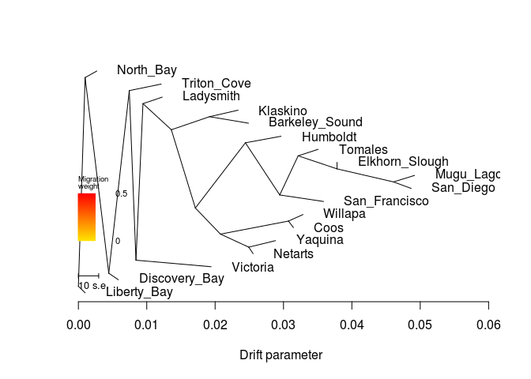

    ##  [1] 0.029636870 0.035065360 0.028836470 0.023355980 0.049174130
    ##  [6] 0.037833200 0.012263900 0.024886490 0.048679610 0.032855180
    ## [11] 0.019410990 0.012105951 0.031453224 0.002694041 0.035857070
    ## [16] 0.025556096 0.005851121 0.000985941
    ## [1] 0.003
    ## [1] "mse 0.000296893558641975"

    ## $d
    ##     V1             V2       V3      V4      V5  V6  V7 V8  V9 V10
    ## 1    0           <NA> NOT_ROOT NOT_MIG NOT_TIP 604 355  1 536  16
    ## 2    1       Humboldt NOT_ROOT NOT_MIG     TIP   2  NA NA  NA  NA
    ## 3    2           <NA> NOT_ROOT NOT_MIG NOT_TIP  76   1  1 412   5
    ## 4    3        Tomales NOT_ROOT NOT_MIG     TIP  32  NA NA  NA  NA
    ## 5    4        Yaquina NOT_ROOT NOT_MIG     TIP 472  NA NA  NA  NA
    ## 6   15       Klaskino NOT_ROOT NOT_MIG     TIP 104  NA NA  NA  NA
    ## 7   16           <NA> NOT_ROOT NOT_MIG NOT_TIP 356 256 13 211   1
    ## 8   31    Mugu_Lagoon NOT_ROOT NOT_MIG     TIP 136  NA NA  NA  NA
    ## 9   32           <NA> NOT_ROOT NOT_MIG NOT_TIP 412   3  1  52   3
    ## 10  51 Elkhorn_Slough NOT_ROOT NOT_MIG     TIP  52  NA NA  NA  NA
    ## 11  52           <NA> NOT_ROOT NOT_MIG NOT_TIP  32  51  1 136   2
    ## 12  75      Ladysmith NOT_ROOT NOT_MIG     TIP 256  NA NA  NA  NA
    ## 13  76           <NA> NOT_ROOT NOT_MIG NOT_TIP 212   2  6 172   4
    ## 14 103 Barkeley_Sound NOT_ROOT NOT_MIG     TIP 104  NA NA  NA  NA
    ## 15 104           <NA> NOT_ROOT NOT_MIG NOT_TIP 212  15  1 103   1
    ## 16 135      San_Diego NOT_ROOT NOT_MIG     TIP 136  NA NA  NA  NA
    ## 17 136           <NA> NOT_ROOT NOT_MIG NOT_TIP  52  31  1 135   1
    ## 18 171        Willapa NOT_ROOT NOT_MIG     TIP 304  NA NA  NA  NA
    ## 19 172           <NA> NOT_ROOT NOT_MIG NOT_TIP  76 304  2 472   2
    ## 20 211       Victoria NOT_ROOT NOT_MIG     TIP  16  NA NA  NA  NA
    ## 21 212           <NA> NOT_ROOT NOT_MIG NOT_TIP 256 104  2  76  10
    ## 22 255    Triton_Cove NOT_ROOT NOT_MIG     TIP 356  NA NA  NA  NA
    ## 23 256           <NA> NOT_ROOT NOT_MIG NOT_TIP  16  75  1 212  12
    ## 24 303           Coos NOT_ROOT NOT_MIG     TIP 304  NA NA  NA  NA
    ## 25 304           <NA> NOT_ROOT NOT_MIG NOT_TIP 172 171  1 303   1
    ## 26 355      North_Bay NOT_ROOT NOT_MIG     TIP   0  NA NA  NA  NA
    ## 27 356           <NA> NOT_ROOT NOT_MIG NOT_TIP 536 255  1  16  14
    ## 28 411  San_Francisco NOT_ROOT NOT_MIG     TIP 412  NA NA  NA  NA
    ## 29 412           <NA> NOT_ROOT NOT_MIG NOT_TIP   2  32  4 411   1
    ## 30 471        Netarts NOT_ROOT NOT_MIG     TIP 472  NA NA  NA  NA
    ## 31 472           <NA> NOT_ROOT NOT_MIG NOT_TIP 172   4  1 471   1
    ## 32 535  Discovery_Bay NOT_ROOT NOT_MIG     TIP 536  NA NA  NA  NA
    ## 33 536           <NA> NOT_ROOT NOT_MIG NOT_TIP   0 356 15 535   1
    ## 34 604           <NA>     ROOT NOT_MIG NOT_TIP 604   0 17 603   1
    ## 35 603    Liberty_Bay NOT_ROOT NOT_MIG     TIP 604  NA NA  NA  NA
    ##                                                                                                                                                                                                                                                                                                                                                                                                                                                                                                                                                                                                           V11
    ## 1                             (North_Bay:0.0017081,((Triton_Cove:0.00465998,((Ladysmith:0.00281884,((Klaskino:0.00417629,Barkeley_Sound:0.0057068):0.00558429,((Humboldt:0.00520956,((Tomales:0.00292234,(Elkhorn_Slough:0,(Mugu_Lagoon:0.00308493,San_Diego:0.00259041):0.008256):0.00569018):0.00269245,San_Francisco:0.0064065):0.00502326):0.00731955,((Willapa:0.00213151,Coos:0.000729554):0.00994842,(Yaquina:0.00392218,Netarts:0.000641806):0.00413904):0.00366749):0.00351236):0.00415034):0.00102267,Victoria:0.0109886):0.000976419):0.00300292,Discovery_Bay:0.00140807):0.00345711):0.000985941
    ## 2                                                                                                                                                                                                                                                                                                                                                                                                                                                                                                                                                                                         Humboldt:0.00520956
    ## 3                                                                                                                                                                                                                                                                                                                                                                                                                  (Humboldt:0.00520956,((Tomales:0.00292234,(Elkhorn_Slough:0,(Mugu_Lagoon:0.00308493,San_Diego:0.00259041):0.008256):0.00569018):0.00269245,San_Francisco:0.0064065):0.00502326):0.00731955
    ## 4                                                                                                                                                                                                                                                                                                                                                                                                                                                                                                                                                                                          Tomales:0.00292234
    ## 5                                                                                                                                                                                                                                                                                                                                                                                                                                                                                                                                                                                          Yaquina:0.00392218
    ## 6                                                                                                                                                                                                                                                                                                                                                                                                                                                                                                                                                                                         Klaskino:0.00417629
    ## 7                                                                                                                                         ((Ladysmith:0.00281884,((Klaskino:0.00417629,Barkeley_Sound:0.0057068):0.00558429,((Humboldt:0.00520956,((Tomales:0.00292234,(Elkhorn_Slough:0,(Mugu_Lagoon:0.00308493,San_Diego:0.00259041):0.008256):0.00569018):0.00269245,San_Francisco:0.0064065):0.00502326):0.00731955,((Willapa:0.00213151,Coos:0.000729554):0.00994842,(Yaquina:0.00392218,Netarts:0.000641806):0.00413904):0.00366749):0.00351236):0.00415034):0.00102267,Victoria:0.0109886):0.000976419
    ## 8                                                                                                                                                                                                                                                                                                                                                                                                                                                                                                                                                                                      Mugu_Lagoon:0.00308493
    ## 9                                                                                                                                                                                                                                                                                                                                                                                                                                                                                        (Tomales:0.00292234,(Elkhorn_Slough:0,(Mugu_Lagoon:0.00308493,San_Diego:0.00259041):0.008256):0.00569018):0.00269245
    ## 10                                                                                                                                                                                                                                                                                                                                                                                                                                                                                                                                                                                           Elkhorn_Slough:0
    ## 11                                                                                                                                                                                                                                                                                                                                                                                                                                                                                                                       (Elkhorn_Slough:0,(Mugu_Lagoon:0.00308493,San_Diego:0.00259041):0.008256):0.00569018
    ## 12                                                                                                                                                                                                                                                                                                                                                                                                                                                                                                                                                                                       Ladysmith:0.00281884
    ## 13                                                                                                                                                                                                                                                                                  ((Humboldt:0.00520956,((Tomales:0.00292234,(Elkhorn_Slough:0,(Mugu_Lagoon:0.00308493,San_Diego:0.00259041):0.008256):0.00569018):0.00269245,San_Francisco:0.0064065):0.00502326):0.00731955,((Willapa:0.00213151,Coos:0.000729554):0.00994842,(Yaquina:0.00392218,Netarts:0.000641806):0.00413904):0.00366749):0.00351236
    ## 14                                                                                                                                                                                                                                                                                                                                                                                                                                                                                                                                                                                   Barkeley_Sound:0.0057068
    ## 15                                                                                                                                                                                                                                                                                                                                                                                                                                                                                                                                                  (Klaskino:0.00417629,Barkeley_Sound:0.0057068):0.00558429
    ## 16                                                                                                                                                                                                                                                                                                                                                                                                                                                                                                                                                                                       San_Diego:0.00259041
    ## 17                                                                                                                                                                                                                                                                                                                                                                                                                                                                                                                                                     (Mugu_Lagoon:0.00308493,San_Diego:0.00259041):0.008256
    ## 18                                                                                                                                                                                                                                                                                                                                                                                                                                                                                                                                                                                         Willapa:0.00213151
    ## 19                                                                                                                                                                                                                                                                                                                                                                                                                                                                                          ((Willapa:0.00213151,Coos:0.000729554):0.00994842,(Yaquina:0.00392218,Netarts:0.000641806):0.00413904):0.00366749
    ## 20                                                                                                                                                                                                                                                                                                                                                                                                                                                                                                                                                                                         Victoria:0.0109886
    ## 21                                                                                                                                                                                                           ((Klaskino:0.00417629,Barkeley_Sound:0.0057068):0.00558429,((Humboldt:0.00520956,((Tomales:0.00292234,(Elkhorn_Slough:0,(Mugu_Lagoon:0.00308493,San_Diego:0.00259041):0.008256):0.00569018):0.00269245,San_Francisco:0.0064065):0.00502326):0.00731955,((Willapa:0.00213151,Coos:0.000729554):0.00994842,(Yaquina:0.00392218,Netarts:0.000641806):0.00413904):0.00366749):0.00351236):0.00415034
    ## 22                                                                                                                                                                                                                                                                                                                                                                                                                                                                                                                                                                                     Triton_Cove:0.00465998
    ## 23                                                                                                                                                                         (Ladysmith:0.00281884,((Klaskino:0.00417629,Barkeley_Sound:0.0057068):0.00558429,((Humboldt:0.00520956,((Tomales:0.00292234,(Elkhorn_Slough:0,(Mugu_Lagoon:0.00308493,San_Diego:0.00259041):0.008256):0.00569018):0.00269245,San_Francisco:0.0064065):0.00502326):0.00731955,((Willapa:0.00213151,Coos:0.000729554):0.00994842,(Yaquina:0.00392218,Netarts:0.000641806):0.00413904):0.00366749):0.00351236):0.00415034):0.00102267
    ## 24                                                                                                                                                                                                                                                                                                                                                                                                                                                                                                                                                                                           Coos:0.000729554
    ## 25                                                                                                                                                                                                                                                                                                                                                                                                                                                                                                                                                           (Willapa:0.00213151,Coos:0.000729554):0.00994842
    ## 26                                                                                                                                                                                                                                                                                                                                                                                                                                                                                                                                                                                        North_Bay:0.0017081
    ## 27                                                                                                    (Triton_Cove:0.00465998,((Ladysmith:0.00281884,((Klaskino:0.00417629,Barkeley_Sound:0.0057068):0.00558429,((Humboldt:0.00520956,((Tomales:0.00292234,(Elkhorn_Slough:0,(Mugu_Lagoon:0.00308493,San_Diego:0.00259041):0.008256):0.00569018):0.00269245,San_Francisco:0.0064065):0.00502326):0.00731955,((Willapa:0.00213151,Coos:0.000729554):0.00994842,(Yaquina:0.00392218,Netarts:0.000641806):0.00413904):0.00366749):0.00351236):0.00415034):0.00102267,Victoria:0.0109886):0.000976419):0.00300292
    ## 28                                                                                                                                                                                                                                                                                                                                                                                                                                                                                                                                                                                    San_Francisco:0.0064065
    ## 29                                                                                                                                                                                                                                                                                                                                                                                                                                                  ((Tomales:0.00292234,(Elkhorn_Slough:0,(Mugu_Lagoon:0.00308493,San_Diego:0.00259041):0.008256):0.00569018):0.00269245,San_Francisco:0.0064065):0.00502326
    ## 30                                                                                                                                                                                                                                                                                                                                                                                                                                                                                                                                                                                        Netarts:0.000641806
    ## 31                                                                                                                                                                                                                                                                                                                                                                                                                                                                                                                                                        (Yaquina:0.00392218,Netarts:0.000641806):0.00413904
    ## 32                                                                                                                                                                                                                                                                                                                                                                                                                                                                                                                                                                                   Discovery_Bay:0.00140807
    ## 33                                                              ((Triton_Cove:0.00465998,((Ladysmith:0.00281884,((Klaskino:0.00417629,Barkeley_Sound:0.0057068):0.00558429,((Humboldt:0.00520956,((Tomales:0.00292234,(Elkhorn_Slough:0,(Mugu_Lagoon:0.00308493,San_Diego:0.00259041):0.008256):0.00569018):0.00269245,San_Francisco:0.0064065):0.00502326):0.00731955,((Willapa:0.00213151,Coos:0.000729554):0.00994842,(Yaquina:0.00392218,Netarts:0.000641806):0.00413904):0.00366749):0.00351236):0.00415034):0.00102267,Victoria:0.0109886):0.000976419):0.00300292,Discovery_Bay:0.00140807):0.00345711
    ## 34 ((North_Bay:0.0017081,((Triton_Cove:0.00465998,((Ladysmith:0.00281884,((Klaskino:0.00417629,Barkeley_Sound:0.0057068):0.00558429,((Humboldt:0.00520956,((Tomales:0.00292234,(Elkhorn_Slough:0,(Mugu_Lagoon:0.00308493,San_Diego:0.00259041):0.008256):0.00569018):0.00269245,San_Francisco:0.0064065):0.00502326):0.00731955,((Willapa:0.00213151,Coos:0.000729554):0.00994842,(Yaquina:0.00392218,Netarts:0.000641806):0.00413904):0.00366749):0.00351236):0.00415034):0.00102267,Victoria:0.0109886):0.000976419):0.00300292,Discovery_Bay:0.00140807):0.00345711):0.000985941,Liberty_Bay:0.000985941);
    ## 35                                                                                                                                                                                                                                                                                                                                                                                                                                                                                                                                                                                    Liberty_Bay:0.000985941
    ##              x          y       ymin       ymax
    ## 1  0.000985941 0.94444444 0.05555556 1.00000000
    ## 2  0.029636870 0.69444444 0.66666667 0.72222222
    ## 3  0.024427310 0.66666667 0.38888889 0.72222222
    ## 4  0.035065360 0.63888889 0.61111111 0.66666667
    ## 5  0.028836470 0.25000000 0.22222222 0.27777778
    ## 6  0.023355980 0.80555556 0.77777778 0.83333333
    ## 7  0.008422390 0.16666667 0.11111111 0.88888889
    ## 8  0.049174130 0.52777778 0.50000000 0.55555556
    ## 9  0.032143020 0.61111111 0.44444444 0.66666667
    ## 10 0.037833200 0.58333333 0.55555556 0.61111111
    ## 11 0.037833200 0.55555556 0.44444444 0.61111111
    ## 12 0.012263900 0.86111111 0.83333333 0.88888889
    ## 13 0.017107760 0.38888889 0.16666667 0.72222222
    ## 14 0.024886490 0.75000000 0.72222222 0.77777778
    ## 15 0.019179690 0.77777778 0.72222222 0.83333333
    ## 16 0.048679610 0.47222222 0.44444444 0.50000000
    ## 17 0.046089200 0.50000000 0.44444444 0.55555556
    ## 18 0.032855180 0.36111111 0.33333333 0.38888889
    ## 19 0.020775250 0.27777778 0.16666667 0.38888889
    ## 20 0.019410990 0.13888889 0.11111111 0.16666667
    ## 21 0.013595400 0.72222222 0.16666667 0.83333333
    ## 22 0.012105951 0.91666667 0.88888889 0.94444444
    ## 23 0.009445060 0.83333333 0.16666667 0.88888889
    ## 24 0.031453224 0.30555556 0.27777778 0.33333333
    ## 25 0.030723670 0.33333333 0.27777778 0.38888889
    ## 26 0.002694041 0.97222222 0.94444444 1.00000000
    ## 27 0.007445971 0.88888889 0.11111111 0.94444444
    ## 28 0.035857070 0.41666667 0.38888889 0.44444444
    ## 29 0.029450570 0.44444444 0.38888889 0.66666667
    ## 30 0.025556096 0.19444444 0.16666667 0.22222222
    ## 31 0.024914290 0.22222222 0.16666667 0.27777778
    ## 32 0.005851121 0.08333333 0.05555556 0.11111111
    ## 33 0.004443051 0.11111111 0.05555556 0.94444444
    ## 34 0.000000000 0.05555556 0.00000000 1.00000000
    ## 35 0.000985941 0.02777778 0.00000000 0.05555556
    ## 
    ## $e
    ##     V1  V2          V3 V4      V5 V6 V7
    ## 1    2   1 0.005209560  1 NOT_MIG  0  1
    ## 2   32   3 0.002922340  1 NOT_MIG  0  1
    ## 3   32  52 0.005690180  1 NOT_MIG  0  1
    ## 4   52  51 0.000000000  1 NOT_MIG  0  1
    ## 5  104  15 0.004176290  1 NOT_MIG  0  1
    ## 6  104 103 0.005706800  1 NOT_MIG  0  1
    ## 7   76   2 0.007319550  1 NOT_MIG  0  1
    ## 8   52 136 0.008256000  1 NOT_MIG  0  1
    ## 9  136  31 0.003084930  1 NOT_MIG  0  1
    ## 10 136 135 0.002590410  1 NOT_MIG  0  1
    ## 11  76 172 0.003667490  1 NOT_MIG  0  1
    ## 12  16 256 0.001022670  1 NOT_MIG  0  1
    ## 13 212 104 0.005584290  1 NOT_MIG  0  1
    ## 14 172 304 0.009948420  1 NOT_MIG  0  1
    ## 15 304 171 0.002131510  1 NOT_MIG  0  1
    ## 16 304 303 0.000729554  1 NOT_MIG  0  1
    ## 17 356 255 0.004659980  1 NOT_MIG  0  1
    ## 18   2 412 0.005023260  1 NOT_MIG  0  1
    ## 19 412  32 0.002692450  1 NOT_MIG  0  1
    ## 20 412 411 0.006406500  1 NOT_MIG  0  1
    ## 21 212  76 0.003512360  1 NOT_MIG  0  1
    ## 22 256  75 0.002818840  1 NOT_MIG  0  1
    ## 23 256 212 0.004150340  1 NOT_MIG  0  1
    ## 24  16 211 0.010988600  1 NOT_MIG  0  1
    ## 25 172 472 0.004139040  1 NOT_MIG  0  1
    ## 26 472   4 0.003922180  1 NOT_MIG  0  1
    ## 27 472 471 0.000641806  1 NOT_MIG  0  1
    ## 28 356  16 0.000976419  1 NOT_MIG  0  1
    ## 29   0 355 0.001708100  1 NOT_MIG  0  1
    ## 30   0 536 0.003457110  1 NOT_MIG  0  1
    ## 31 536 356 0.003002920  1 NOT_MIG  0  1
    ## 32 536 535 0.001408070  1 NOT_MIG  0  1
    ## 33 604   0 0.000985941  1 NOT_MIG  0  1
    ## 34 604 603 0.000985941  1 NOT_MIG  0  1

``` r
plot_resid("OL/OL-m70x62-maf025-pop_unrooted","TMorder")
```

    ## [1] 0.0002968936
    ## [1] "here"

    ## Warning in xy.coords(x, y, xlabel, ylabel, log): NAs introduced by coercion

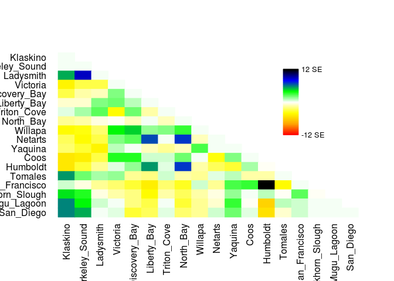

    ## [1] "1 1 1.00000000001141e-07"
    ## [1] "2 1 1.9999999999968e-07"
    ## [1] "2 2 9.99999999994061e-08"
    ## [1] "3 1 0.00152437"
    ## [1] "3 2 0.00260246"
    ## [1] "3 3 1.00000000001141e-07"
    ## [1] "4 1 -0.001285421"
    ## [1] "4 2 -0.0008313555"
    ## [1] "4 3 -0.00086148"
    ## [1] "4 4 9.99999999994061e-08"
    ## [1] "5 1 -0.000800549"
    ## [1] "5 2 -0.000413588"
    ## [1] "5 3 -0.00027089"
    ## [1] "5 4 0.00055676"
    ## [1] "5 5 8.99999999994655e-08"
    ## [1] "6 1 -0.000255662"
    ## [1] "6 2 -0.00019779407"
    ## [1] "6 3 0.00057298"
    ## [1] "6 4 0.00063095"
    ## [1] "6 5 0.00026872"
    ## [1] "6 6 1.00000000001141e-07"
    ## [1] "7 1 0.00016925"
    ## [1] "7 2 0.00043346"
    ## [1] "7 3 0.000716420000000001"
    ## [1] "7 4 -0.00116508"
    ## [1] "7 5 0.00065358"
    ## [1] "7 6 -0.0003559"
    ## [1] "7 7 1.00000000001141e-07"
    ## [1] "8 1 -0.000524389"
    ## [1] "8 2 -0.000418457"
    ## [1] "8 3 -0.00015606"
    ## [1] "8 4 -2.18600000000003e-05"
    ## [1] "8 5 -0.000268329999999999"
    ## [1] "8 6 2.00000000000547e-07"
    ## [1] "8 7 -0.0002971"
    ## [1] "8 8 1.00000000001141e-07"
    ## [1] "9 1 -0.001198944"
    ## [1] "9 2 -0.001096096"
    ## [1] "9 3 -0.00070172"
    ## [1] "9 4 0.00120678"
    ## [1] "9 5 0.00137879"
    ## [1] "9 6 0.00045361"
    ## [1] "9 7 0.00059251"
    ## [1] "9 8 0.00092105"
    ## [1] "9 9 9.99999999994061e-08"
    ## [1] "10 1 -0.000724534"
    ## [1] "10 2 -0.001164944"
    ## [1] "10 3 -0.000866347"
    ## [1] "10 4 0.000584447"
    ## [1] "10 5 0.000781532"
    ## [1] "10 6 0.001986809"
    ## [1] "10 7 4.09999999999994e-06"
    ## [1] "10 8 0.0021092637"
    ## [1] "10 9 -0.00035383"
    ## [1] "10 10 8.99999999994655e-08"
    ## [1] "11 1 -0.000692715"
    ## [1] "11 2 -0.000947471"
    ## [1] "11 3 -0.001317234"
    ## [1] "11 4 0.00030462"
    ## [1] "11 5 3.99299999999999e-05"
    ## [1] "11 6 -0.00029927"
    ## [1] "11 7 -0.00050132"
    ## [1] "11 8 -0.00034341"
    ## [1] "11 9 0.00082546"
    ## [1] "11 10 1.90000000000606e-07"
    ## [1] "11 11 9.99999999994061e-08"
    ## [1] "12 1 -0.001496071"
    ## [1] "12 2 -0.001349672"
    ## [1] "12 3 -0.00082309"
    ## [1] "12 4 0.00105845"
    ## [1] "12 5 0.00101402"
    ## [1] "12 6 0.000232"
    ## [1] "12 7 0.00020501"
    ## [1] "12 8 0.00065611"
    ## [1] "12 9 2.00000000000547e-07"
    ## [1] "12 10 -0.00108528"
    ## [1] "12 11 0.00061441"
    ## [1] "12 12 1.00000000001141e-07"
    ## [1] "13 1 -0.00143208"
    ## [1] "13 2 -0.00089885"
    ## [1] "13 3 -0.00049817"
    ## [1] "13 4 0.00016483"
    ## [1] "13 5 0.0005018"
    ## [1] "13 6 0.00165609"
    ## [1] "13 7 0.00012104"
    ## [1] "13 8 0.00207752"
    ## [1] "13 9 -0.00037099"
    ## [1] "13 10 -0.000782527"
    ## [1] "13 11 -0.000913054"
    ## [1] "13 12 0.000376719"
    ## [1] "13 13 0"
    ## [1] "14 1 0.0016385"
    ## [1] "14 2 0.00062708"
    ## [1] "14 3 0.00041773"
    ## [1] "14 4 0.00049958"
    ## [1] "14 5 -0.00048404"
    ## [1] "14 6 -0.00057758"
    ## [1] "14 7 0.00023814"
    ## [1] "14 8 -0.00043424"
    ## [1] "14 9 -0.00049015"
    ## [1] "14 10 0.00015427"
    ## [1] "14 11 0.00035404"
    ## [1] "14 12 -0.00036635"
    ## [1] "14 13 -0.00041026"
    ## [1] "14 14 9.99999999994061e-08"
    ## [1] "15 1 0.00025608"
    ## [1] "15 2 -0.00010262"
    ## [1] "15 3 -0.00044621"
    ## [1] "15 4 -0.00067472"
    ## [1] "15 5 -0.00094472"
    ## [1] "15 6 -0.00136452"
    ## [1] "15 7 -0.000691600000000001"
    ## [1] "15 8 -0.00098627"
    ## [1] "15 9 0.00023065"
    ## [1] "15 10 -0.00046399"
    ## [1] "15 11 0.00080431"
    ## [1] "15 12 0.00090213"
    ## [1] "15 13 0.003484"
    ## [1] "15 14 -0.00116401"
    ## [1] "15 15 9.99999999994061e-08"
    ## [1] "16 1 0.00130874"
    ## [1] "16 2 0.00101931"
    ## [1] "16 3 -9.12399999999994e-05"
    ## [1] "16 4 -0.00037176"
    ## [1] "16 5 -0.000554720000000001"
    ## [1] "16 6 -0.00115705"
    ## [1] "16 7 -0.000359699999999999"
    ## [1] "16 8 -0.00078962"
    ## [1] "16 9 -0.00037861"
    ## [1] "16 10 -0.00016591"
    ## [1] "16 11 0.00051819"
    ## [1] "16 12 2.48499999999999e-05"
    ## [1] "16 13 0.00029085"
    ## [1] "16 14 -9.93999999999995e-06"
    ## [1] "16 15 0.00072628"
    ## [1] "16 16 -6.07999999999997e-05"
    ## [1] "17 1 0.00177472"
    ## [1] "17 2 0.00121883"
    ## [1] "17 3 0.00019098"
    ## [1] "17 4 5.34699999999999e-05"
    ## [1] "17 5 -0.00053969"
    ## [1] "17 6 -0.00081143"
    ## [1] "17 7 6.91299999999997e-05"
    ## [1] "17 8 -0.000888720000000001"
    ## [1] "17 9 -0.000497900000000001"
    ## [1] "17 10 -0.00019645"
    ## [1] "17 11 0.00089135"
    ## [1] "17 12 -6.10100000000002e-05"
    ## [1] "17 13 -0.0017688252"
    ## [1] "17 14 0.000267950000000001"
    ## [1] "17 15 0.00025312"
    ## [1] "17 16 4.42000000000012e-05"
    ## [1] "17 17 1.00000000002876e-07"
    ## [1] "18 1 0.0017384"
    ## [1] "18 2 0.00151943"
    ## [1] "18 3 7.39000000000035e-06"
    ## [1] "18 4 0.0001517"
    ## [1] "18 5 -0.0009187"
    ## [1] "18 6 -0.00078221"
    ## [1] "18 7 0.00016799"
    ## [1] "18 8 -0.000635790000000001"
    ## [1] "18 9 -0.0005209"
    ## [1] "18 10 0.0001831"
    ## [1] "18 11 0.00066185"
    ## [1] "18 12 9.75000000000004e-05"
    ## [1] "18 13 -0.001598177"
    ## [1] "18 14 -0.00026082"
    ## [1] "18 15 0.00018201"
    ## [1] "18 16 6.89999999999892e-06"
    ## [1] "18 17 1.99999999998812e-07"
    ## [1] "18 18 9.99999999994061e-08"
    ##  [1] "#FF0000" "#FF0C00" "#FF1900" "#FF2500" "#FF3200" "#FF3E00" "#FF4B00"
    ##  [8] "#FF5700" "#FF6400" "#FF7000" "#FF7D00" "#FF8900" "#FF9600" "#FFA200"
    ## [15] "#FFAA00" "#FFB100" "#FFB800" "#FFBF00" "#FFC600" "#FFCC00" "#FFD300"
    ## [22] "#FFDA00" "#FFE100" "#FFE800" "#FFEF00" "#FFF500" "#FFFC00" "#FFFF0C"
    ## [29] "#FFFF20" "#FFFF33" "#FFFF47" "#FFFF5A" "#FFFF6D" "#FFFF81" "#FFFF94"
    ## [36] "#FFFFA7" "#FFFFBB" "#FFFFCE" "#FFFFE1" "#FFFFF5" "#F5FFF5" "#E1FFE1"
    ## [43] "#CEFFCE" "#BBFFBB" "#A7FFA7" "#94FF94" "#81FF81" "#6DFF6D" "#5AFF5A"
    ## [50] "#47FF47" "#33FF33" "#20FF20" "#0CFF0C" "#00F806" "#00E519" "#00D12D"
    ## [57] "#00BE40" "#00AB53" "#009767" "#00847A" "#00708E" "#005DA1" "#004AB4"
    ## [64] "#0036C8" "#0023DB" "#0010EE" "#0000FB" "#0000E8" "#0000D5" "#0000C1"
    ## [71] "#0000AE" "#00009A" "#000087" "#000074" "#000060" "#00004D" "#00003A"
    ## [78] "#000026" "#000013" "#000000"
    ##  [1] 0.500 0.505 0.510 0.515 0.520 0.525 0.530 0.535 0.540 0.545 0.550
    ## [12] 0.555 0.560 0.565 0.570 0.575 0.580 0.585 0.590 0.595 0.600 0.605
    ## [23] 0.610 0.615 0.620 0.625 0.630 0.635 0.640 0.645 0.650 0.655 0.660
    ## [34] 0.665 0.670 0.675 0.680 0.685 0.690 0.695 0.700 0.705 0.710 0.715
    ## [45] 0.720 0.725 0.730 0.735 0.740 0.745 0.750 0.755 0.760 0.765 0.770
    ## [56] 0.775 0.780 0.785 0.790 0.795 0.800 0.805 0.810 0.815 0.820 0.825
    ## [67] 0.830 0.835 0.840 0.845 0.850 0.855 0.860 0.865 0.870 0.875 0.880
    ## [78] 0.885 0.890 0.895 0.900

    ##        Klaskino Barkeley_Sound    Ladysmith      Victoria Discovery_Bay
    ## 1   0.000000100   0.0000002000  0.001524370 -0.0012854210  -0.000800549
    ## 2   0.000000200   0.0000001000  0.002602460 -0.0008313555  -0.000413588
    ## 3   0.001524370   0.0026024600  0.000000100 -0.0008614800  -0.000270890
    ## 4  -0.001285421  -0.0008313555 -0.000861480  0.0000001000   0.000556760
    ## 5  -0.000800549  -0.0004135880 -0.000270890  0.0005567600   0.000000090
    ## 6  -0.000255662  -0.0001977941  0.000572980  0.0006309500   0.000268720
    ## 7   0.000169250   0.0004334600  0.000716420 -0.0011650800   0.000653580
    ## 8  -0.000524389  -0.0004184570 -0.000156060 -0.0000218600  -0.000268330
    ## 9  -0.001198944  -0.0010960960 -0.000701720  0.0012067800   0.001378790
    ## 10 -0.000724534  -0.0011649440 -0.000866347  0.0005844470   0.000781532
    ## 11 -0.000692715  -0.0009474710 -0.001317234  0.0003046200   0.000039930
    ## 12 -0.001496071  -0.0013496720 -0.000823090  0.0010584500   0.001014020
    ## 13 -0.001432080  -0.0008988500 -0.000498170  0.0001648300   0.000501800
    ## 14  0.001638500   0.0006270800  0.000417730  0.0004995800  -0.000484040
    ## 15  0.000256080  -0.0001026200 -0.000446210 -0.0006747200  -0.000944720
    ## 16  0.001308740   0.0010193100 -0.000091240 -0.0003717600  -0.000554720
    ## 17  0.001774720   0.0012188300  0.000190980  0.0000534700  -0.000539690
    ## 18  0.001738400   0.0015194300  0.000007390  0.0001517000  -0.000918700
    ##      Liberty_Bay Triton_Cove    North_Bay      Willapa      Netarts
    ## 1  -0.0002556620  0.00016925 -0.000524389 -0.001198944 -0.000724534
    ## 2  -0.0001977941  0.00043346 -0.000418457 -0.001096096 -0.001164944
    ## 3   0.0005729800  0.00071642 -0.000156060 -0.000701720 -0.000866347
    ## 4   0.0006309500 -0.00116508 -0.000021860  0.001206780  0.000584447
    ## 5   0.0002687200  0.00065358 -0.000268330  0.001378790  0.000781532
    ## 6   0.0000001000 -0.00035590  0.000000200  0.000453610  0.001986809
    ## 7  -0.0003559000  0.00000010 -0.000297100  0.000592510  0.000004100
    ## 8   0.0000002000 -0.00029710  0.000000100  0.000921050  0.002109264
    ## 9   0.0004536100  0.00059251  0.000921050  0.000000100 -0.000353830
    ## 10  0.0019868090  0.00000410  0.002109264 -0.000353830  0.000000090
    ## 11 -0.0002992700 -0.00050132 -0.000343410  0.000825460  0.000000190
    ## 12  0.0002320000  0.00020501  0.000656110  0.000000200 -0.001085280
    ## 13  0.0016560900  0.00012104  0.002077520 -0.000370990 -0.000782527
    ## 14 -0.0005775800  0.00023814 -0.000434240 -0.000490150  0.000154270
    ## 15 -0.0013645200 -0.00069160 -0.000986270  0.000230650 -0.000463990
    ## 16 -0.0011570500 -0.00035970 -0.000789620 -0.000378610 -0.000165910
    ## 17 -0.0008114300  0.00006913 -0.000888720 -0.000497900 -0.000196450
    ## 18 -0.0007822100  0.00016799 -0.000635790 -0.000520900  0.000183100
    ##         Yaquina         Coos     Humboldt     Tomales San_Francisco
    ## 1  -0.000692715 -0.001496071 -0.001432080  0.00163850    0.00025608
    ## 2  -0.000947471 -0.001349672 -0.000898850  0.00062708   -0.00010262
    ## 3  -0.001317234 -0.000823090 -0.000498170  0.00041773   -0.00044621
    ## 4   0.000304620  0.001058450  0.000164830  0.00049958   -0.00067472
    ## 5   0.000039930  0.001014020  0.000501800 -0.00048404   -0.00094472
    ## 6  -0.000299270  0.000232000  0.001656090 -0.00057758   -0.00136452
    ## 7  -0.000501320  0.000205010  0.000121040  0.00023814   -0.00069160
    ## 8  -0.000343410  0.000656110  0.002077520 -0.00043424   -0.00098627
    ## 9   0.000825460  0.000000200 -0.000370990 -0.00049015    0.00023065
    ## 10  0.000000190 -0.001085280 -0.000782527  0.00015427   -0.00046399
    ## 11  0.000000100  0.000614410 -0.000913054  0.00035404    0.00080431
    ## 12  0.000614410  0.000000100  0.000376719 -0.00036635    0.00090213
    ## 13 -0.000913054  0.000376719  0.000000000 -0.00041026    0.00348400
    ## 14  0.000354040 -0.000366350 -0.000410260  0.00000010   -0.00116401
    ## 15  0.000804310  0.000902130  0.003484000 -0.00116401    0.00000010
    ## 16  0.000518190  0.000024850  0.000290850 -0.00000994    0.00072628
    ## 17  0.000891350 -0.000061010 -0.001768825  0.00026795    0.00025312
    ## 18  0.000661850  0.000097500 -0.001598177 -0.00026082    0.00018201
    ##    Elkhorn_Slough  Mugu_Lagoon    San_Diego
    ## 1      0.00130874  0.001774720  0.001738400
    ## 2      0.00101931  0.001218830  0.001519430
    ## 3     -0.00009124  0.000190980  0.000007390
    ## 4     -0.00037176  0.000053470  0.000151700
    ## 5     -0.00055472 -0.000539690 -0.000918700
    ## 6     -0.00115705 -0.000811430 -0.000782210
    ## 7     -0.00035970  0.000069130  0.000167990
    ## 8     -0.00078962 -0.000888720 -0.000635790
    ## 9     -0.00037861 -0.000497900 -0.000520900
    ## 10    -0.00016591 -0.000196450  0.000183100
    ## 11     0.00051819  0.000891350  0.000661850
    ## 12     0.00002485 -0.000061010  0.000097500
    ## 13     0.00029085 -0.001768825 -0.001598177
    ## 14    -0.00000994  0.000267950 -0.000260820
    ## 15     0.00072628  0.000253120  0.000182010
    ## 16    -0.00006080  0.000044200  0.000006900
    ## 17     0.00004420  0.000000100  0.000000200
    ## 18     0.00000690  0.000000200  0.000000100

Possible candidates for admixture: \* Tomakes &lt;-&gt; Humboldt \* North\_Bay &lt;-&gt; Humboldt \* North\_Bay &lt;-&gt; Netarts \* Netarts &lt;-&gt; Liberty \* Ladysmith &lt;-&gt; Barkeley

``` r
system("treemix -i OL/OL-m70x62-maf025.pop.TM.gz -root Klaskino,Barkeley_Sound -o OL/OL-m70x62-maf025-pop_NWBCrooted > out")
```

``` r
plot_tree("OL/OL-m70x62-maf025-pop_NWBCrooted")
```

    ## Warning in plot_tree("OL/OL-m70x62-maf025-pop_NWBCrooted"): NAs introduced
    ## by coercion

    ## Warning in plot_tree("OL/OL-m70x62-maf025-pop_NWBCrooted"): NAs introduced
    ## by coercion

    ## Warning in plot_tree("OL/OL-m70x62-maf025-pop_NWBCrooted"): NAs introduced
    ## by coercion

    ## Warning in plot_tree("OL/OL-m70x62-maf025-pop_NWBCrooted"): NAs introduced
    ## by coercion

    ##     V1             V2       V3      V4      V5  V6  V7 V8  V9 V10
    ## 1    0           <NA> NOT_ROOT NOT_MIG NOT_TIP 172   3  1 604   3
    ## 2    1           Coos NOT_ROOT NOT_MIG     TIP  16  NA NA  NA  NA
    ## 3    2           <NA> NOT_ROOT NOT_MIG NOT_TIP 605  52 10 256   6
    ## 4    3    Triton_Cove NOT_ROOT NOT_MIG     TIP   0  NA NA  NA  NA
    ## 5    4 Barkeley_Sound NOT_ROOT NOT_MIG     TIP 412  NA NA  NA  NA
    ## 6   15        Willapa NOT_ROOT NOT_MIG     TIP  16  NA NA  NA  NA
    ## 7   16           <NA> NOT_ROOT NOT_MIG NOT_TIP  32   1  1  15   1
    ## 8   31        Yaquina NOT_ROOT NOT_MIG     TIP 212  NA NA  NA  NA
    ## 9   32           <NA> NOT_ROOT NOT_MIG NOT_TIP  52  16  2 212   2
    ## 10  51    Mugu_Lagoon NOT_ROOT NOT_MIG     TIP 304  NA NA  NA  NA
    ## 11  52           <NA> NOT_ROOT NOT_MIG NOT_TIP   2  32  4 104   6
    ## 12  75        Tomales NOT_ROOT NOT_MIG     TIP  76  NA NA  NA  NA
    ## 13  76           <NA> NOT_ROOT NOT_MIG NOT_TIP 136  75  1 356   3
    ## 14 103       Humboldt NOT_ROOT NOT_MIG     TIP 104  NA NA  NA  NA
    ## 15 104           <NA> NOT_ROOT NOT_MIG NOT_TIP  52 103  1 136   5
    ## 16 135  San_Francisco NOT_ROOT NOT_MIG     TIP 136  NA NA  NA  NA
    ## 17 136           <NA> NOT_ROOT NOT_MIG NOT_TIP 104  76  4 135   1
    ## 18 171      Ladysmith NOT_ROOT NOT_MIG     TIP 256  NA NA  NA  NA
    ## 19 172           <NA> NOT_ROOT NOT_MIG NOT_TIP 256 255  1   0   4
    ## 20 211        Netarts NOT_ROOT NOT_MIG     TIP 212  NA NA  NA  NA
    ## 21 212           <NA> NOT_ROOT NOT_MIG NOT_TIP  32  31  1 211   1
    ## 22 255       Victoria NOT_ROOT NOT_MIG     TIP 172  NA NA  NA  NA
    ## 23 256           <NA> NOT_ROOT NOT_MIG NOT_TIP   2 171  1 172   5
    ## 24 303      San_Diego NOT_ROOT NOT_MIG     TIP 304  NA NA  NA  NA
    ## 25 304           <NA> NOT_ROOT NOT_MIG NOT_TIP 356  51  1 303   1
    ## 26 355 Elkhorn_Slough NOT_ROOT NOT_MIG     TIP 356  NA NA  NA  NA
    ## 27 356           <NA> NOT_ROOT NOT_MIG NOT_TIP  76 304  2 355   1
    ## 28 411       Klaskino NOT_ROOT NOT_MIG     TIP 412  NA NA  NA  NA
    ## 29 412           <NA> NOT_ROOT NOT_MIG NOT_TIP 605   4  1 411   1
    ## 30 471      North_Bay NOT_ROOT NOT_MIG     TIP 536  NA NA  NA  NA
    ## 31 535    Liberty_Bay NOT_ROOT NOT_MIG     TIP 536  NA NA  NA  NA
    ## 32 536           <NA> NOT_ROOT NOT_MIG NOT_TIP 604 471  1 535   1
    ## 33 603  Discovery_Bay NOT_ROOT NOT_MIG     TIP 604  NA NA  NA  NA
    ## 34 604           <NA> NOT_ROOT NOT_MIG NOT_TIP   0 603  1 536   2
    ## 35 605           <NA>     ROOT NOT_MIG NOT_TIP 605 412  2   2  16
    ##                                                                                                                                                                                                                                                                                                                                                                                                                                                                                                                                                                                                         V11
    ## 1                                                                                                                                                                                                                                                                                                                                                                                                                                                                        (Triton_Cove:0.00465998,(Discovery_Bay:0.00140807,(North_Bay:0.0017081,Liberty_Bay:0.00197188):0.00345711):0.00300292):0.000976419
    ## 2                                                                                                                                                                                                                                                                                                                                                                                                                                                                                                                                                                                          Coos:0.000729554
    ## 3                                                               ((((Coos:0.000729554,Willapa:0.00213151):0.00994842,(Yaquina:0.00392218,Netarts:0.000641806):0.00413904):0.00366749,(Humboldt:0.00520956,((Tomales:0.00292234,((Mugu_Lagoon:0.00308493,San_Diego:0.00259041):0.008256,Elkhorn_Slough:0):0.00569018):0.00269245,San_Francisco:0.0064065):0.00502326):0.00731955):0.00351236,(Ladysmith:0.00281884,(Victoria:0.0109886,(Triton_Cove:0.00465998,(Discovery_Bay:0.00140807,(North_Bay:0.0017081,Liberty_Bay:0.00197188):0.00345711):0.00300292):0.000976419):0.00102267):0.00415034):0.00279215
    ## 4                                                                                                                                                                                                                                                                                                                                                                                                                                                                                                                                                                                    Triton_Cove:0.00465998
    ## 5                                                                                                                                                                                                                                                                                                                                                                                                                                                                                                                                                                                  Barkeley_Sound:0.0057068
    ## 6                                                                                                                                                                                                                                                                                                                                                                                                                                                                                                                                                                                        Willapa:0.00213151
    ## 7                                                                                                                                                                                                                                                                                                                                                                                                                                                                                                                                                          (Coos:0.000729554,Willapa:0.00213151):0.00994842
    ## 8                                                                                                                                                                                                                                                                                                                                                                                                                                                                                                                                                                                        Yaquina:0.00392218
    ## 9                                                                                                                                                                                                                                                                                                                                                                                                                                                                                         ((Coos:0.000729554,Willapa:0.00213151):0.00994842,(Yaquina:0.00392218,Netarts:0.000641806):0.00413904):0.00366749
    ## 10                                                                                                                                                                                                                                                                                                                                                                                                                                                                                                                                                                                   Mugu_Lagoon:0.00308493
    ## 11                                                                                                                                                                                                                                                                                (((Coos:0.000729554,Willapa:0.00213151):0.00994842,(Yaquina:0.00392218,Netarts:0.000641806):0.00413904):0.00366749,(Humboldt:0.00520956,((Tomales:0.00292234,((Mugu_Lagoon:0.00308493,San_Diego:0.00259041):0.008256,Elkhorn_Slough:0):0.00569018):0.00269245,San_Francisco:0.0064065):0.00502326):0.00731955):0.00351236
    ## 12                                                                                                                                                                                                                                                                                                                                                                                                                                                                                                                                                                                       Tomales:0.00292234
    ## 13                                                                                                                                                                                                                                                                                                                                                                                                                                                                                     (Tomales:0.00292234,((Mugu_Lagoon:0.00308493,San_Diego:0.00259041):0.008256,Elkhorn_Slough:0):0.00569018):0.00269245
    ## 14                                                                                                                                                                                                                                                                                                                                                                                                                                                                                                                                                                                      Humboldt:0.00520956
    ## 15                                                                                                                                                                                                                                                                                                                                                                                                               (Humboldt:0.00520956,((Tomales:0.00292234,((Mugu_Lagoon:0.00308493,San_Diego:0.00259041):0.008256,Elkhorn_Slough:0):0.00569018):0.00269245,San_Francisco:0.0064065):0.00502326):0.00731955
    ## 16                                                                                                                                                                                                                                                                                                                                                                                                                                                                                                                                                                                  San_Francisco:0.0064065
    ## 17                                                                                                                                                                                                                                                                                                                                                                                                                                                ((Tomales:0.00292234,((Mugu_Lagoon:0.00308493,San_Diego:0.00259041):0.008256,Elkhorn_Slough:0):0.00569018):0.00269245,San_Francisco:0.0064065):0.00502326
    ## 18                                                                                                                                                                                                                                                                                                                                                                                                                                                                                                                                                                                     Ladysmith:0.00281884
    ## 19                                                                                                                                                                                                                                                                                                                                                                                                                                       (Victoria:0.0109886,(Triton_Cove:0.00465998,(Discovery_Bay:0.00140807,(North_Bay:0.0017081,Liberty_Bay:0.00197188):0.00345711):0.00300292):0.000976419):0.00102267
    ## 20                                                                                                                                                                                                                                                                                                                                                                                                                                                                                                                                                                                      Netarts:0.000641806
    ## 21                                                                                                                                                                                                                                                                                                                                                                                                                                                                                                                                                      (Yaquina:0.00392218,Netarts:0.000641806):0.00413904
    ## 22                                                                                                                                                                                                                                                                                                                                                                                                                                                                                                                                                                                       Victoria:0.0109886
    ## 23                                                                                                                                                                                                                                                                                                                                                                                                     (Ladysmith:0.00281884,(Victoria:0.0109886,(Triton_Cove:0.00465998,(Discovery_Bay:0.00140807,(North_Bay:0.0017081,Liberty_Bay:0.00197188):0.00345711):0.00300292):0.000976419):0.00102267):0.00415034
    ## 24                                                                                                                                                                                                                                                                                                                                                                                                                                                                                                                                                                                     San_Diego:0.00259041
    ## 25                                                                                                                                                                                                                                                                                                                                                                                                                                                                                                                                                   (Mugu_Lagoon:0.00308493,San_Diego:0.00259041):0.008256
    ## 26                                                                                                                                                                                                                                                                                                                                                                                                                                                                                                                                                                                         Elkhorn_Slough:0
    ## 27                                                                                                                                                                                                                                                                                                                                                                                                                                                                                                                     ((Mugu_Lagoon:0.00308493,San_Diego:0.00259041):0.008256,Elkhorn_Slough:0):0.00569018
    ## 28                                                                                                                                                                                                                                                                                                                                                                                                                                                                                                                                                                                      Klaskino:0.00417629
    ## 29                                                                                                                                                                                                                                                                                                                                                                                                                                                                                                                                                (Barkeley_Sound:0.0057068,Klaskino:0.00417629):0.00279215
    ## 30                                                                                                                                                                                                                                                                                                                                                                                                                                                                                                                                                                                      North_Bay:0.0017081
    ## 31                                                                                                                                                                                                                                                                                                                                                                                                                                                                                                                                                                                   Liberty_Bay:0.00197188
    ## 32                                                                                                                                                                                                                                                                                                                                                                                                                                                                                                                                                  (North_Bay:0.0017081,Liberty_Bay:0.00197188):0.00345711
    ## 33                                                                                                                                                                                                                                                                                                                                                                                                                                                                                                                                                                                 Discovery_Bay:0.00140807
    ## 34                                                                                                                                                                                                                                                                                                                                                                                                                                                                                                            (Discovery_Bay:0.00140807,(North_Bay:0.0017081,Liberty_Bay:0.00197188):0.00345711):0.00300292
    ## 35 ((Barkeley_Sound:0.0057068,Klaskino:0.00417629):0.00279215,((((Coos:0.000729554,Willapa:0.00213151):0.00994842,(Yaquina:0.00392218,Netarts:0.000641806):0.00413904):0.00366749,(Humboldt:0.00520956,((Tomales:0.00292234,((Mugu_Lagoon:0.00308493,San_Diego:0.00259041):0.008256,Elkhorn_Slough:0):0.00569018):0.00269245,San_Francisco:0.0064065):0.00502326):0.00731955):0.00351236,(Ladysmith:0.00281884,(Victoria:0.0109886,(Triton_Cove:0.00465998,(Discovery_Bay:0.00140807,(North_Bay:0.0017081,Liberty_Bay:0.00197188):0.00345711):0.00300292):0.000976419):0.00102267):0.00415034):0.00279215);
    ##              x          y       ymin       ymax
    ## 1  0.008941579 0.16666667 0.00000000 0.22222222
    ## 2  0.020649974 0.86111111 0.83333333 0.88888889
    ## 3  0.002792150 0.33333333 0.00000000 0.88888889
    ## 4  0.013601559 0.19444444 0.16666667 0.22222222
    ## 5  0.008498950 0.97222222 0.94444444 1.00000000
    ## 6  0.022051930 0.80555556 0.77777778 0.83333333
    ## 7  0.019920420 0.83333333 0.77777778 0.88888889
    ## 8  0.018033220 0.75000000 0.72222222 0.77777778
    ## 9  0.009972000 0.77777778 0.66666667 0.88888889
    ## 10 0.038370880 0.52777778 0.50000000 0.55555556
    ## 11 0.006304510 0.66666667 0.33333333 0.88888889
    ## 12 0.024262110 0.58333333 0.55555556 0.61111111
    ## 13 0.021339770 0.55555556 0.38888889 0.61111111
    ## 14 0.018833620 0.63888889 0.61111111 0.66666667
    ## 15 0.013624060 0.61111111 0.33333333 0.66666667
    ## 16 0.025053820 0.36111111 0.33333333 0.38888889
    ## 17 0.018647320 0.38888889 0.33333333 0.61111111
    ## 18 0.009761330 0.30555556 0.27777778 0.33333333
    ## 19 0.007965160 0.22222222 0.00000000 0.27777778
    ## 20 0.014752846 0.69444444 0.66666667 0.72222222
    ## 21 0.014111040 0.72222222 0.66666667 0.77777778
    ## 22 0.018953760 0.25000000 0.22222222 0.27777778
    ## 23 0.006942490 0.27777778 0.00000000 0.33333333
    ## 24 0.037876360 0.47222222 0.44444444 0.50000000
    ## 25 0.035285950 0.50000000 0.44444444 0.55555556
    ## 26 0.027029950 0.41666667 0.38888889 0.44444444
    ## 27 0.027029950 0.44444444 0.38888889 0.55555556
    ## 28 0.006968440 0.91666667 0.88888889 0.94444444
    ## 29 0.002792150 0.94444444 0.88888889 1.00000000
    ## 30 0.017109709 0.08333333 0.05555556 0.11111111
    ## 31 0.017373489 0.02777778 0.00000000 0.05555556
    ## 32 0.015401609 0.05555556 0.00000000 0.11111111
    ## 33 0.013352569 0.13888889 0.11111111 0.16666667
    ## 34 0.011944499 0.11111111 0.00000000 0.16666667
    ## 35 0.000000000 0.88888889 0.00000000 1.00000000

    ## Warning in max(e[e[, 5] == "MIG", 4]): no non-missing arguments to max;
    ## returning -Inf

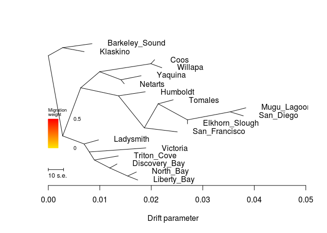

    ##  [1] 0.02064997 0.01360156 0.00849895 0.02205193 0.01803322 0.03837088
    ##  [7] 0.02426211 0.01883362 0.02505382 0.00976133 0.01475285 0.01895376
    ## [13] 0.03787636 0.02702995 0.00696844 0.01710971 0.01737349 0.01335257
    ## [1] 0.003
    ## [1] "mse 0.000296893558641975"

    ## $d
    ##     V1             V2       V3      V4      V5  V6  V7 V8  V9 V10
    ## 1    0           <NA> NOT_ROOT NOT_MIG NOT_TIP 172   3  1 604   3
    ## 2    1           Coos NOT_ROOT NOT_MIG     TIP  16  NA NA  NA  NA
    ## 3    2           <NA> NOT_ROOT NOT_MIG NOT_TIP 605  52 10 256   6
    ## 4    3    Triton_Cove NOT_ROOT NOT_MIG     TIP   0  NA NA  NA  NA
    ## 5    4 Barkeley_Sound NOT_ROOT NOT_MIG     TIP 412  NA NA  NA  NA
    ## 6   15        Willapa NOT_ROOT NOT_MIG     TIP  16  NA NA  NA  NA
    ## 7   16           <NA> NOT_ROOT NOT_MIG NOT_TIP  32   1  1  15   1
    ## 8   31        Yaquina NOT_ROOT NOT_MIG     TIP 212  NA NA  NA  NA
    ## 9   32           <NA> NOT_ROOT NOT_MIG NOT_TIP  52  16  2 212   2
    ## 10  51    Mugu_Lagoon NOT_ROOT NOT_MIG     TIP 304  NA NA  NA  NA
    ## 11  52           <NA> NOT_ROOT NOT_MIG NOT_TIP   2  32  4 104   6
    ## 12  75        Tomales NOT_ROOT NOT_MIG     TIP  76  NA NA  NA  NA
    ## 13  76           <NA> NOT_ROOT NOT_MIG NOT_TIP 136  75  1 356   3
    ## 14 103       Humboldt NOT_ROOT NOT_MIG     TIP 104  NA NA  NA  NA
    ## 15 104           <NA> NOT_ROOT NOT_MIG NOT_TIP  52 103  1 136   5
    ## 16 135  San_Francisco NOT_ROOT NOT_MIG     TIP 136  NA NA  NA  NA
    ## 17 136           <NA> NOT_ROOT NOT_MIG NOT_TIP 104  76  4 135   1
    ## 18 171      Ladysmith NOT_ROOT NOT_MIG     TIP 256  NA NA  NA  NA
    ## 19 172           <NA> NOT_ROOT NOT_MIG NOT_TIP 256 255  1   0   4
    ## 20 211        Netarts NOT_ROOT NOT_MIG     TIP 212  NA NA  NA  NA
    ## 21 212           <NA> NOT_ROOT NOT_MIG NOT_TIP  32  31  1 211   1
    ## 22 255       Victoria NOT_ROOT NOT_MIG     TIP 172  NA NA  NA  NA
    ## 23 256           <NA> NOT_ROOT NOT_MIG NOT_TIP   2 171  1 172   5
    ## 24 303      San_Diego NOT_ROOT NOT_MIG     TIP 304  NA NA  NA  NA
    ## 25 304           <NA> NOT_ROOT NOT_MIG NOT_TIP 356  51  1 303   1
    ## 26 355 Elkhorn_Slough NOT_ROOT NOT_MIG     TIP 356  NA NA  NA  NA
    ## 27 356           <NA> NOT_ROOT NOT_MIG NOT_TIP  76 304  2 355   1
    ## 28 411       Klaskino NOT_ROOT NOT_MIG     TIP 412  NA NA  NA  NA
    ## 29 412           <NA> NOT_ROOT NOT_MIG NOT_TIP 605   4  1 411   1
    ## 30 471      North_Bay NOT_ROOT NOT_MIG     TIP 536  NA NA  NA  NA
    ## 31 535    Liberty_Bay NOT_ROOT NOT_MIG     TIP 536  NA NA  NA  NA
    ## 32 536           <NA> NOT_ROOT NOT_MIG NOT_TIP 604 471  1 535   1
    ## 33 603  Discovery_Bay NOT_ROOT NOT_MIG     TIP 604  NA NA  NA  NA
    ## 34 604           <NA> NOT_ROOT NOT_MIG NOT_TIP   0 603  1 536   2
    ## 35 605           <NA>     ROOT NOT_MIG NOT_TIP 605 412  2   2  16
    ##                                                                                                                                                                                                                                                                                                                                                                                                                                                                                                                                                                                                         V11
    ## 1                                                                                                                                                                                                                                                                                                                                                                                                                                                                        (Triton_Cove:0.00465998,(Discovery_Bay:0.00140807,(North_Bay:0.0017081,Liberty_Bay:0.00197188):0.00345711):0.00300292):0.000976419
    ## 2                                                                                                                                                                                                                                                                                                                                                                                                                                                                                                                                                                                          Coos:0.000729554
    ## 3                                                               ((((Coos:0.000729554,Willapa:0.00213151):0.00994842,(Yaquina:0.00392218,Netarts:0.000641806):0.00413904):0.00366749,(Humboldt:0.00520956,((Tomales:0.00292234,((Mugu_Lagoon:0.00308493,San_Diego:0.00259041):0.008256,Elkhorn_Slough:0):0.00569018):0.00269245,San_Francisco:0.0064065):0.00502326):0.00731955):0.00351236,(Ladysmith:0.00281884,(Victoria:0.0109886,(Triton_Cove:0.00465998,(Discovery_Bay:0.00140807,(North_Bay:0.0017081,Liberty_Bay:0.00197188):0.00345711):0.00300292):0.000976419):0.00102267):0.00415034):0.00279215
    ## 4                                                                                                                                                                                                                                                                                                                                                                                                                                                                                                                                                                                    Triton_Cove:0.00465998
    ## 5                                                                                                                                                                                                                                                                                                                                                                                                                                                                                                                                                                                  Barkeley_Sound:0.0057068
    ## 6                                                                                                                                                                                                                                                                                                                                                                                                                                                                                                                                                                                        Willapa:0.00213151
    ## 7                                                                                                                                                                                                                                                                                                                                                                                                                                                                                                                                                          (Coos:0.000729554,Willapa:0.00213151):0.00994842
    ## 8                                                                                                                                                                                                                                                                                                                                                                                                                                                                                                                                                                                        Yaquina:0.00392218
    ## 9                                                                                                                                                                                                                                                                                                                                                                                                                                                                                         ((Coos:0.000729554,Willapa:0.00213151):0.00994842,(Yaquina:0.00392218,Netarts:0.000641806):0.00413904):0.00366749
    ## 10                                                                                                                                                                                                                                                                                                                                                                                                                                                                                                                                                                                   Mugu_Lagoon:0.00308493
    ## 11                                                                                                                                                                                                                                                                                (((Coos:0.000729554,Willapa:0.00213151):0.00994842,(Yaquina:0.00392218,Netarts:0.000641806):0.00413904):0.00366749,(Humboldt:0.00520956,((Tomales:0.00292234,((Mugu_Lagoon:0.00308493,San_Diego:0.00259041):0.008256,Elkhorn_Slough:0):0.00569018):0.00269245,San_Francisco:0.0064065):0.00502326):0.00731955):0.00351236
    ## 12                                                                                                                                                                                                                                                                                                                                                                                                                                                                                                                                                                                       Tomales:0.00292234
    ## 13                                                                                                                                                                                                                                                                                                                                                                                                                                                                                     (Tomales:0.00292234,((Mugu_Lagoon:0.00308493,San_Diego:0.00259041):0.008256,Elkhorn_Slough:0):0.00569018):0.00269245
    ## 14                                                                                                                                                                                                                                                                                                                                                                                                                                                                                                                                                                                      Humboldt:0.00520956
    ## 15                                                                                                                                                                                                                                                                                                                                                                                                               (Humboldt:0.00520956,((Tomales:0.00292234,((Mugu_Lagoon:0.00308493,San_Diego:0.00259041):0.008256,Elkhorn_Slough:0):0.00569018):0.00269245,San_Francisco:0.0064065):0.00502326):0.00731955
    ## 16                                                                                                                                                                                                                                                                                                                                                                                                                                                                                                                                                                                  San_Francisco:0.0064065
    ## 17                                                                                                                                                                                                                                                                                                                                                                                                                                                ((Tomales:0.00292234,((Mugu_Lagoon:0.00308493,San_Diego:0.00259041):0.008256,Elkhorn_Slough:0):0.00569018):0.00269245,San_Francisco:0.0064065):0.00502326
    ## 18                                                                                                                                                                                                                                                                                                                                                                                                                                                                                                                                                                                     Ladysmith:0.00281884
    ## 19                                                                                                                                                                                                                                                                                                                                                                                                                                       (Victoria:0.0109886,(Triton_Cove:0.00465998,(Discovery_Bay:0.00140807,(North_Bay:0.0017081,Liberty_Bay:0.00197188):0.00345711):0.00300292):0.000976419):0.00102267
    ## 20                                                                                                                                                                                                                                                                                                                                                                                                                                                                                                                                                                                      Netarts:0.000641806
    ## 21                                                                                                                                                                                                                                                                                                                                                                                                                                                                                                                                                      (Yaquina:0.00392218,Netarts:0.000641806):0.00413904
    ## 22                                                                                                                                                                                                                                                                                                                                                                                                                                                                                                                                                                                       Victoria:0.0109886
    ## 23                                                                                                                                                                                                                                                                                                                                                                                                     (Ladysmith:0.00281884,(Victoria:0.0109886,(Triton_Cove:0.00465998,(Discovery_Bay:0.00140807,(North_Bay:0.0017081,Liberty_Bay:0.00197188):0.00345711):0.00300292):0.000976419):0.00102267):0.00415034
    ## 24                                                                                                                                                                                                                                                                                                                                                                                                                                                                                                                                                                                     San_Diego:0.00259041
    ## 25                                                                                                                                                                                                                                                                                                                                                                                                                                                                                                                                                   (Mugu_Lagoon:0.00308493,San_Diego:0.00259041):0.008256
    ## 26                                                                                                                                                                                                                                                                                                                                                                                                                                                                                                                                                                                         Elkhorn_Slough:0
    ## 27                                                                                                                                                                                                                                                                                                                                                                                                                                                                                                                     ((Mugu_Lagoon:0.00308493,San_Diego:0.00259041):0.008256,Elkhorn_Slough:0):0.00569018
    ## 28                                                                                                                                                                                                                                                                                                                                                                                                                                                                                                                                                                                      Klaskino:0.00417629
    ## 29                                                                                                                                                                                                                                                                                                                                                                                                                                                                                                                                                (Barkeley_Sound:0.0057068,Klaskino:0.00417629):0.00279215
    ## 30                                                                                                                                                                                                                                                                                                                                                                                                                                                                                                                                                                                      North_Bay:0.0017081
    ## 31                                                                                                                                                                                                                                                                                                                                                                                                                                                                                                                                                                                   Liberty_Bay:0.00197188
    ## 32                                                                                                                                                                                                                                                                                                                                                                                                                                                                                                                                                  (North_Bay:0.0017081,Liberty_Bay:0.00197188):0.00345711
    ## 33                                                                                                                                                                                                                                                                                                                                                                                                                                                                                                                                                                                 Discovery_Bay:0.00140807
    ## 34                                                                                                                                                                                                                                                                                                                                                                                                                                                                                                            (Discovery_Bay:0.00140807,(North_Bay:0.0017081,Liberty_Bay:0.00197188):0.00345711):0.00300292
    ## 35 ((Barkeley_Sound:0.0057068,Klaskino:0.00417629):0.00279215,((((Coos:0.000729554,Willapa:0.00213151):0.00994842,(Yaquina:0.00392218,Netarts:0.000641806):0.00413904):0.00366749,(Humboldt:0.00520956,((Tomales:0.00292234,((Mugu_Lagoon:0.00308493,San_Diego:0.00259041):0.008256,Elkhorn_Slough:0):0.00569018):0.00269245,San_Francisco:0.0064065):0.00502326):0.00731955):0.00351236,(Ladysmith:0.00281884,(Victoria:0.0109886,(Triton_Cove:0.00465998,(Discovery_Bay:0.00140807,(North_Bay:0.0017081,Liberty_Bay:0.00197188):0.00345711):0.00300292):0.000976419):0.00102267):0.00415034):0.00279215);
    ##              x          y       ymin       ymax
    ## 1  0.008941579 0.16666667 0.00000000 0.22222222
    ## 2  0.020649974 0.86111111 0.83333333 0.88888889
    ## 3  0.002792150 0.33333333 0.00000000 0.88888889
    ## 4  0.013601559 0.19444444 0.16666667 0.22222222
    ## 5  0.008498950 0.97222222 0.94444444 1.00000000
    ## 6  0.022051930 0.80555556 0.77777778 0.83333333
    ## 7  0.019920420 0.83333333 0.77777778 0.88888889
    ## 8  0.018033220 0.75000000 0.72222222 0.77777778
    ## 9  0.009972000 0.77777778 0.66666667 0.88888889
    ## 10 0.038370880 0.52777778 0.50000000 0.55555556
    ## 11 0.006304510 0.66666667 0.33333333 0.88888889
    ## 12 0.024262110 0.58333333 0.55555556 0.61111111
    ## 13 0.021339770 0.55555556 0.38888889 0.61111111
    ## 14 0.018833620 0.63888889 0.61111111 0.66666667
    ## 15 0.013624060 0.61111111 0.33333333 0.66666667
    ## 16 0.025053820 0.36111111 0.33333333 0.38888889
    ## 17 0.018647320 0.38888889 0.33333333 0.61111111
    ## 18 0.009761330 0.30555556 0.27777778 0.33333333
    ## 19 0.007965160 0.22222222 0.00000000 0.27777778
    ## 20 0.014752846 0.69444444 0.66666667 0.72222222
    ## 21 0.014111040 0.72222222 0.66666667 0.77777778
    ## 22 0.018953760 0.25000000 0.22222222 0.27777778
    ## 23 0.006942490 0.27777778 0.00000000 0.33333333
    ## 24 0.037876360 0.47222222 0.44444444 0.50000000
    ## 25 0.035285950 0.50000000 0.44444444 0.55555556
    ## 26 0.027029950 0.41666667 0.38888889 0.44444444
    ## 27 0.027029950 0.44444444 0.38888889 0.55555556
    ## 28 0.006968440 0.91666667 0.88888889 0.94444444
    ## 29 0.002792150 0.94444444 0.88888889 1.00000000
    ## 30 0.017109709 0.08333333 0.05555556 0.11111111
    ## 31 0.017373489 0.02777778 0.00000000 0.05555556
    ## 32 0.015401609 0.05555556 0.00000000 0.11111111
    ## 33 0.013352569 0.13888889 0.11111111 0.16666667
    ## 34 0.011944499 0.11111111 0.00000000 0.16666667
    ## 35 0.000000000 0.88888889 0.00000000 1.00000000
    ## 
    ## $e
    ##     V1  V2          V3 V4      V5 V6 V7
    ## 1   16   1 0.000729554  1 NOT_MIG  0  1
    ## 2   16  15 0.002131510  1 NOT_MIG  0  1
    ## 3   32  16 0.009948420  1 NOT_MIG  0  1
    ## 4   52  32 0.003667490  1 NOT_MIG  0  1
    ## 5   76  75 0.002922340  1 NOT_MIG  0  1
    ## 6   52 104 0.007319550  1 NOT_MIG  0  1
    ## 7  104 103 0.005209560  1 NOT_MIG  0  1
    ## 8  104 136 0.005023260  1 NOT_MIG  0  1
    ## 9  136  76 0.002692450  1 NOT_MIG  0  1
    ## 10 136 135 0.006406500  1 NOT_MIG  0  1
    ## 11  32 212 0.004139040  1 NOT_MIG  0  1
    ## 12 212  31 0.003922180  1 NOT_MIG  0  1
    ## 13 212 211 0.000641806  1 NOT_MIG  0  1
    ## 14 304  51 0.003084930  1 NOT_MIG  0  1
    ## 15 304 303 0.002590410  1 NOT_MIG  0  1
    ## 16  76 356 0.005690180  1 NOT_MIG  0  1
    ## 17 356 304 0.008256000  1 NOT_MIG  0  1
    ## 18 356 355 0.000000000  1 NOT_MIG  0  1
    ## 19   2  52 0.003512360  1 NOT_MIG  0  1
    ## 20 412   4 0.005706800  1 NOT_MIG  0  1
    ## 21 412 411 0.004176290  1 NOT_MIG  0  1
    ## 22   0   3 0.004659980  1 NOT_MIG  0  1
    ## 23 256 171 0.002818840  1 NOT_MIG  0  1
    ## 24 172 255 0.010988600  1 NOT_MIG  0  1
    ## 25 536 471 0.001708100  1 NOT_MIG  0  1
    ## 26 536 535 0.001971880  1 NOT_MIG  0  1
    ## 27 604 603 0.001408070  1 NOT_MIG  0  1
    ## 28   0 604 0.003002920  1 NOT_MIG  0  1
    ## 29 256 172 0.001022670  1 NOT_MIG  0  1
    ## 30   2 256 0.004150340  1 NOT_MIG  0  1
    ## 31 172   0 0.000976419  1 NOT_MIG  0  1
    ## 32 605 412 0.002792150  1 NOT_MIG  0  1
    ## 33 605   2 0.002792150  1 NOT_MIG  0  1
    ## 34 604 536 0.003457110  1 NOT_MIG  0  1

``` r
system("treemix -i OL/OL-m70x62-maf025.pop.TM.gz -root Mugu_Lagoon,San_Diego -o OL/OL-m70x62-maf025-pop_SoCalrooted > out")
```

``` r
plot_tree("OL/OL-m70x62-maf025-pop_SoCalrooted")
```

    ## Warning in plot_tree("OL/OL-m70x62-maf025-pop_SoCalrooted"): NAs introduced
    ## by coercion

    ## Warning in plot_tree("OL/OL-m70x62-maf025-pop_SoCalrooted"): NAs introduced
    ## by coercion

    ## Warning in plot_tree("OL/OL-m70x62-maf025-pop_SoCalrooted"): NAs introduced
    ## by coercion

    ## Warning in plot_tree("OL/OL-m70x62-maf025-pop_SoCalrooted"): NAs introduced
    ## by coercion

    ##     V1             V2       V3      V4      V5  V6  V7 V8  V9 V10
    ## 1    1      Ladysmith NOT_ROOT NOT_MIG     TIP 212  NA NA  NA  NA
    ## 2    2           <NA> NOT_ROOT NOT_MIG NOT_TIP  16  76  2 212   6
    ## 3    3 Elkhorn_Slough NOT_ROOT NOT_MIG     TIP  32  NA NA  NA  NA
    ## 4    4       Klaskino NOT_ROOT NOT_MIG     TIP  76  NA NA  NA  NA
    ## 5   15        Willapa NOT_ROOT NOT_MIG     TIP  52  NA NA  NA  NA
    ## 6   16           <NA> NOT_ROOT NOT_MIG NOT_TIP 304 136  4   2   8
    ## 7   31    Mugu_Lagoon NOT_ROOT NOT_MIG     TIP 172  NA NA  NA  NA
    ## 8   32           <NA> NOT_ROOT NOT_MIG NOT_TIP 605   3  1 536  15
    ## 9   51           Coos NOT_ROOT NOT_MIG     TIP  52  NA NA  NA  NA
    ## 10  52           <NA> NOT_ROOT NOT_MIG NOT_TIP 136  15  1  51   1
    ## 11  75 Barkeley_Sound NOT_ROOT NOT_MIG     TIP  76  NA NA  NA  NA
    ## 12  76           <NA> NOT_ROOT NOT_MIG NOT_TIP   2   4  1  75   1
    ## 13 103  San_Francisco NOT_ROOT NOT_MIG     TIP 104  NA NA  NA  NA
    ## 14 104           <NA> NOT_ROOT NOT_MIG NOT_TIP 536 103  1 304  13
    ## 15 135        Yaquina NOT_ROOT NOT_MIG     TIP 256  NA NA  NA  NA
    ## 16 136           <NA> NOT_ROOT NOT_MIG NOT_TIP  16  52  2 256   2
    ## 17 171      San_Diego NOT_ROOT NOT_MIG     TIP 172  NA NA  NA  NA
    ## 18 172           <NA> NOT_ROOT NOT_MIG NOT_TIP 605  31  1 171   1
    ## 19 211      North_Bay NOT_ROOT NOT_MIG     TIP 472  NA NA  NA  NA
    ## 20 212           <NA> NOT_ROOT NOT_MIG NOT_TIP   2   1  1 356   5
    ## 21 255        Netarts NOT_ROOT NOT_MIG     TIP 256  NA NA  NA  NA
    ## 22 256           <NA> NOT_ROOT NOT_MIG NOT_TIP 136 135  1 255   1
    ## 23 303       Humboldt NOT_ROOT NOT_MIG     TIP 304  NA NA  NA  NA
    ## 24 304           <NA> NOT_ROOT NOT_MIG NOT_TIP 104 303  1  16  12
    ## 25 355       Victoria NOT_ROOT NOT_MIG     TIP 356  NA NA  NA  NA
    ## 26 356           <NA> NOT_ROOT NOT_MIG NOT_TIP 212 355  1 412   4
    ## 27 411    Triton_Cove NOT_ROOT NOT_MIG     TIP 412  NA NA  NA  NA
    ## 28 412           <NA> NOT_ROOT NOT_MIG NOT_TIP 356 411  1 604   3
    ## 29 471    Liberty_Bay NOT_ROOT NOT_MIG     TIP 472  NA NA  NA  NA
    ## 30 472           <NA> NOT_ROOT NOT_MIG NOT_TIP 604 211  1 471   1
    ## 31 535        Tomales NOT_ROOT NOT_MIG     TIP 536  NA NA  NA  NA
    ## 32 536           <NA> NOT_ROOT NOT_MIG NOT_TIP  32 535  1 104  14
    ## 33 603  Discovery_Bay NOT_ROOT NOT_MIG     TIP 604  NA NA  NA  NA
    ## 34 604           <NA> NOT_ROOT NOT_MIG NOT_TIP 412 472  2 603   1
    ## 35 605           <NA>     ROOT NOT_MIG NOT_TIP 605 172  2  32  16
    ##                                                                                                                                                                                                                                                                                                                                                                                                                                                                                                                                                                                                       V11
    ## 1                                                                                                                                                                                                                                                                                                                                                                                                                                                                                                                                                                                    Ladysmith:0.00281884
    ## 2                                                                                                                                                                                                                                                                                                                             ((Klaskino:0.00417629,Barkeley_Sound:0.0057068):0.00558429,(Ladysmith:0.00281884,(Victoria:0.0109886,(Triton_Cove:0.00465998,((North_Bay:0.0017081,Liberty_Bay:0.00197188):0.00345711,Discovery_Bay:0.00140807):0.00300292):0.000976419):0.00102267):0.00415034):0.00351236
    ## 3                                                                                                                                                                                                                                                                                                                                                                                                                                                                                                                                                                                        Elkhorn_Slough:0
    ## 4                                                                                                                                                                                                                                                                                                                                                                                                                                                                                                                                                                                     Klaskino:0.00417629
    ## 5                                                                                                                                                                                                                                                                                                                                                                                                                                                                                                                                                                                      Willapa:0.00213151
    ## 6                                                                                                                                                                                              (((Willapa:0.00213151,Coos:0.000729554):0.00994842,(Yaquina:0.00392218,Netarts:0.000641806):0.00413904):0.00366749,((Klaskino:0.00417629,Barkeley_Sound:0.0057068):0.00558429,(Ladysmith:0.00281884,(Victoria:0.0109886,(Triton_Cove:0.00465998,((North_Bay:0.0017081,Liberty_Bay:0.00197188):0.00345711,Discovery_Bay:0.00140807):0.00300292):0.000976419):0.00102267):0.00415034):0.00351236):0.00731955
    ## 7                                                                                                                                                                                                                                                                                                                                                                                                                                                                                                                                                                                  Mugu_Lagoon:0.00308493
    ## 8                                                            (Elkhorn_Slough:0,(Tomales:0.00292234,(San_Francisco:0.0064065,(Humboldt:0.00520956,(((Willapa:0.00213151,Coos:0.000729554):0.00994842,(Yaquina:0.00392218,Netarts:0.000641806):0.00413904):0.00366749,((Klaskino:0.00417629,Barkeley_Sound:0.0057068):0.00558429,(Ladysmith:0.00281884,(Victoria:0.0109886,(Triton_Cove:0.00465998,((North_Bay:0.0017081,Liberty_Bay:0.00197188):0.00345711,Discovery_Bay:0.00140807):0.00300292):0.000976419):0.00102267):0.00415034):0.00351236):0.00731955):0.00502326):0.00269245):0.00569018):0.004128
    ## 9                                                                                                                                                                                                                                                                                                                                                                                                                                                                                                                                                                                        Coos:0.000729554
    ## 10                                                                                                                                                                                                                                                                                                                                                                                                                                                                                                                                                       (Willapa:0.00213151,Coos:0.000729554):0.00994842
    ## 11                                                                                                                                                                                                                                                                                                                                                                                                                                                                                                                                                                               Barkeley_Sound:0.0057068
    ## 12                                                                                                                                                                                                                                                                                                                                                                                                                                                                                                                                              (Klaskino:0.00417629,Barkeley_Sound:0.0057068):0.00558429
    ## 13                                                                                                                                                                                                                                                                                                                                                                                                                                                                                                                                                                                San_Francisco:0.0064065
    ## 14                                                                                                                       (San_Francisco:0.0064065,(Humboldt:0.00520956,(((Willapa:0.00213151,Coos:0.000729554):0.00994842,(Yaquina:0.00392218,Netarts:0.000641806):0.00413904):0.00366749,((Klaskino:0.00417629,Barkeley_Sound:0.0057068):0.00558429,(Ladysmith:0.00281884,(Victoria:0.0109886,(Triton_Cove:0.00465998,((North_Bay:0.0017081,Liberty_Bay:0.00197188):0.00345711,Discovery_Bay:0.00140807):0.00300292):0.000976419):0.00102267):0.00415034):0.00351236):0.00731955):0.00502326):0.00269245
    ## 15                                                                                                                                                                                                                                                                                                                                                                                                                                                                                                                                                                                     Yaquina:0.00392218
    ## 16                                                                                                                                                                                                                                                                                                                                                                                                                                                                                      ((Willapa:0.00213151,Coos:0.000729554):0.00994842,(Yaquina:0.00392218,Netarts:0.000641806):0.00413904):0.00366749
    ## 17                                                                                                                                                                                                                                                                                                                                                                                                                                                                                                                                                                                   San_Diego:0.00259041
    ## 18                                                                                                                                                                                                                                                                                                                                                                                                                                                                                                                                                 (Mugu_Lagoon:0.00308493,San_Diego:0.00259041):0.004128
    ## 19                                                                                                                                                                                                                                                                                                                                                                                                                                                                                                                                                                                    North_Bay:0.0017081
    ## 20                                                                                                                                                                                                                                                                                                                                                                                                   (Ladysmith:0.00281884,(Victoria:0.0109886,(Triton_Cove:0.00465998,((North_Bay:0.0017081,Liberty_Bay:0.00197188):0.00345711,Discovery_Bay:0.00140807):0.00300292):0.000976419):0.00102267):0.00415034
    ## 21                                                                                                                                                                                                                                                                                                                                                                                                                                                                                                                                                                                    Netarts:0.000641806
    ## 22                                                                                                                                                                                                                                                                                                                                                                                                                                                                                                                                                    (Yaquina:0.00392218,Netarts:0.000641806):0.00413904
    ## 23                                                                                                                                                                                                                                                                                                                                                                                                                                                                                                                                                                                    Humboldt:0.00520956
    ## 24                                                                                                                                                            (Humboldt:0.00520956,(((Willapa:0.00213151,Coos:0.000729554):0.00994842,(Yaquina:0.00392218,Netarts:0.000641806):0.00413904):0.00366749,((Klaskino:0.00417629,Barkeley_Sound:0.0057068):0.00558429,(Ladysmith:0.00281884,(Victoria:0.0109886,(Triton_Cove:0.00465998,((North_Bay:0.0017081,Liberty_Bay:0.00197188):0.00345711,Discovery_Bay:0.00140807):0.00300292):0.000976419):0.00102267):0.00415034):0.00351236):0.00731955):0.00502326
    ## 25                                                                                                                                                                                                                                                                                                                                                                                                                                                                                                                                                                                     Victoria:0.0109886
    ## 26                                                                                                                                                                                                                                                                                                                                                                                                                                     (Victoria:0.0109886,(Triton_Cove:0.00465998,((North_Bay:0.0017081,Liberty_Bay:0.00197188):0.00345711,Discovery_Bay:0.00140807):0.00300292):0.000976419):0.00102267
    ## 27                                                                                                                                                                                                                                                                                                                                                                                                                                                                                                                                                                                 Triton_Cove:0.00465998
    ## 28                                                                                                                                                                                                                                                                                                                                                                                                                                                                     (Triton_Cove:0.00465998,((North_Bay:0.0017081,Liberty_Bay:0.00197188):0.00345711,Discovery_Bay:0.00140807):0.00300292):0.000976419
    ## 29                                                                                                                                                                                                                                                                                                                                                                                                                                                                                                                                                                                 Liberty_Bay:0.00197188
    ## 30                                                                                                                                                                                                                                                                                                                                                                                                                                                                                                                                                (North_Bay:0.0017081,Liberty_Bay:0.00197188):0.00345711
    ## 31                                                                                                                                                                                                                                                                                                                                                                                                                                                                                                                                                                                     Tomales:0.00292234
    ## 32                                                                                       (Tomales:0.00292234,(San_Francisco:0.0064065,(Humboldt:0.00520956,(((Willapa:0.00213151,Coos:0.000729554):0.00994842,(Yaquina:0.00392218,Netarts:0.000641806):0.00413904):0.00366749,((Klaskino:0.00417629,Barkeley_Sound:0.0057068):0.00558429,(Ladysmith:0.00281884,(Victoria:0.0109886,(Triton_Cove:0.00465998,((North_Bay:0.0017081,Liberty_Bay:0.00197188):0.00345711,Discovery_Bay:0.00140807):0.00300292):0.000976419):0.00102267):0.00415034):0.00351236):0.00731955):0.00502326):0.00269245):0.00569018
    ## 33                                                                                                                                                                                                                                                                                                                                                                                                                                                                                                                                                                               Discovery_Bay:0.00140807
    ## 34                                                                                                                                                                                                                                                                                                                                                                                                                                                                                                          ((North_Bay:0.0017081,Liberty_Bay:0.00197188):0.00345711,Discovery_Bay:0.00140807):0.00300292
    ## 35 ((Mugu_Lagoon:0.00308493,San_Diego:0.00259041):0.004128,(Elkhorn_Slough:0,(Tomales:0.00292234,(San_Francisco:0.0064065,(Humboldt:0.00520956,(((Willapa:0.00213151,Coos:0.000729554):0.00994842,(Yaquina:0.00392218,Netarts:0.000641806):0.00413904):0.00366749,((Klaskino:0.00417629,Barkeley_Sound:0.0057068):0.00558429,(Ladysmith:0.00281884,(Victoria:0.0109886,(Triton_Cove:0.00465998,((North_Bay:0.0017081,Liberty_Bay:0.00197188):0.00345711,Discovery_Bay:0.00140807):0.00300292):0.000976419):0.00102267):0.00415034):0.00351236):0.00731955):0.00502326):0.00269245):0.00569018):0.004128);
    ##             x          y       ymin       ymax
    ## 1  0.03533498 0.30555556 0.27777778 0.33333333
    ## 2  0.02836580 0.33333333 0.00000000 0.44444444
    ## 3  0.00412800 0.86111111 0.83333333 0.88888889
    ## 4  0.03812638 0.41666667 0.38888889 0.44444444
    ## 5  0.04060086 0.63888889 0.61111111 0.66666667
    ## 6  0.02485344 0.44444444 0.00000000 0.66666667
    ## 7  0.00721293 0.97222222 0.94444444 1.00000000
    ## 8  0.00412800 0.83333333 0.00000000 0.88888889
    ## 9  0.03919890 0.58333333 0.55555556 0.61111111
    ## 10 0.03846935 0.61111111 0.55555556 0.66666667
    ## 11 0.03965689 0.36111111 0.33333333 0.38888889
    ## 12 0.03395009 0.38888889 0.33333333 0.44444444
    ## 13 0.01891713 0.75000000 0.72222222 0.77777778
    ## 14 0.01251063 0.72222222 0.00000000 0.77777778
    ## 15 0.03658215 0.52777778 0.50000000 0.55555556
    ## 16 0.02852093 0.55555556 0.44444444 0.66666667
    ## 17 0.00671841 0.91666667 0.88888889 0.94444444
    ## 18 0.00412800 0.94444444 0.88888889 1.00000000
    ## 19 0.04268336 0.13888889 0.11111111 0.16666667
    ## 20 0.03251614 0.27777778 0.00000000 0.33333333
    ## 21 0.03330178 0.47222222 0.44444444 0.50000000
    ## 22 0.03265997 0.50000000 0.44444444 0.55555556
    ## 23 0.02274345 0.69444444 0.66666667 0.72222222
    ## 24 0.01753389 0.66666667 0.00000000 0.72222222
    ## 25 0.04452741 0.25000000 0.22222222 0.27777778
    ## 26 0.03353881 0.22222222 0.00000000 0.27777778
    ## 27 0.03917521 0.19444444 0.16666667 0.22222222
    ## 28 0.03451523 0.16666667 0.00000000 0.22222222
    ## 29 0.04294714 0.08333333 0.05555556 0.11111111
    ## 30 0.04097526 0.11111111 0.05555556 0.16666667
    ## 31 0.01274052 0.80555556 0.77777778 0.83333333
    ## 32 0.00981818 0.77777778 0.00000000 0.83333333
    ## 33 0.03892622 0.02777778 0.00000000 0.05555556
    ## 34 0.03751815 0.05555556 0.00000000 0.16666667
    ## 35 0.00000000 0.88888889 0.00000000 1.00000000

    ## Warning in max(e[e[, 5] == "MIG", 4]): no non-missing arguments to max;
    ## returning -Inf

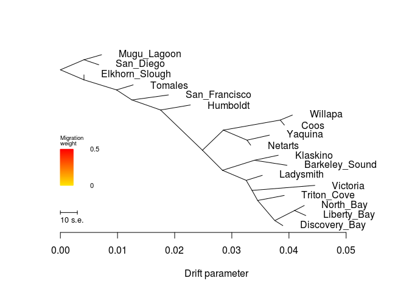

    ##  [1] 0.03533498 0.00412800 0.03812638 0.04060086 0.00721293 0.03919890
    ##  [7] 0.03965689 0.01891713 0.03658215 0.00671841 0.04268336 0.03330178
    ## [13] 0.02274345 0.04452741 0.03917521 0.04294714 0.01274052 0.03892622
    ## [1] 0.003
    ## [1] "mse 0.000296893558641975"

    ## $d
    ##     V1             V2       V3      V4      V5  V6  V7 V8  V9 V10
    ## 1    1      Ladysmith NOT_ROOT NOT_MIG     TIP 212  NA NA  NA  NA
    ## 2    2           <NA> NOT_ROOT NOT_MIG NOT_TIP  16  76  2 212   6
    ## 3    3 Elkhorn_Slough NOT_ROOT NOT_MIG     TIP  32  NA NA  NA  NA
    ## 4    4       Klaskino NOT_ROOT NOT_MIG     TIP  76  NA NA  NA  NA
    ## 5   15        Willapa NOT_ROOT NOT_MIG     TIP  52  NA NA  NA  NA
    ## 6   16           <NA> NOT_ROOT NOT_MIG NOT_TIP 304 136  4   2   8
    ## 7   31    Mugu_Lagoon NOT_ROOT NOT_MIG     TIP 172  NA NA  NA  NA
    ## 8   32           <NA> NOT_ROOT NOT_MIG NOT_TIP 605   3  1 536  15
    ## 9   51           Coos NOT_ROOT NOT_MIG     TIP  52  NA NA  NA  NA
    ## 10  52           <NA> NOT_ROOT NOT_MIG NOT_TIP 136  15  1  51   1
    ## 11  75 Barkeley_Sound NOT_ROOT NOT_MIG     TIP  76  NA NA  NA  NA
    ## 12  76           <NA> NOT_ROOT NOT_MIG NOT_TIP   2   4  1  75   1
    ## 13 103  San_Francisco NOT_ROOT NOT_MIG     TIP 104  NA NA  NA  NA
    ## 14 104           <NA> NOT_ROOT NOT_MIG NOT_TIP 536 103  1 304  13
    ## 15 135        Yaquina NOT_ROOT NOT_MIG     TIP 256  NA NA  NA  NA
    ## 16 136           <NA> NOT_ROOT NOT_MIG NOT_TIP  16  52  2 256   2
    ## 17 171      San_Diego NOT_ROOT NOT_MIG     TIP 172  NA NA  NA  NA
    ## 18 172           <NA> NOT_ROOT NOT_MIG NOT_TIP 605  31  1 171   1
    ## 19 211      North_Bay NOT_ROOT NOT_MIG     TIP 472  NA NA  NA  NA
    ## 20 212           <NA> NOT_ROOT NOT_MIG NOT_TIP   2   1  1 356   5
    ## 21 255        Netarts NOT_ROOT NOT_MIG     TIP 256  NA NA  NA  NA
    ## 22 256           <NA> NOT_ROOT NOT_MIG NOT_TIP 136 135  1 255   1
    ## 23 303       Humboldt NOT_ROOT NOT_MIG     TIP 304  NA NA  NA  NA
    ## 24 304           <NA> NOT_ROOT NOT_MIG NOT_TIP 104 303  1  16  12
    ## 25 355       Victoria NOT_ROOT NOT_MIG     TIP 356  NA NA  NA  NA
    ## 26 356           <NA> NOT_ROOT NOT_MIG NOT_TIP 212 355  1 412   4
    ## 27 411    Triton_Cove NOT_ROOT NOT_MIG     TIP 412  NA NA  NA  NA
    ## 28 412           <NA> NOT_ROOT NOT_MIG NOT_TIP 356 411  1 604   3
    ## 29 471    Liberty_Bay NOT_ROOT NOT_MIG     TIP 472  NA NA  NA  NA
    ## 30 472           <NA> NOT_ROOT NOT_MIG NOT_TIP 604 211  1 471   1
    ## 31 535        Tomales NOT_ROOT NOT_MIG     TIP 536  NA NA  NA  NA
    ## 32 536           <NA> NOT_ROOT NOT_MIG NOT_TIP  32 535  1 104  14
    ## 33 603  Discovery_Bay NOT_ROOT NOT_MIG     TIP 604  NA NA  NA  NA
    ## 34 604           <NA> NOT_ROOT NOT_MIG NOT_TIP 412 472  2 603   1
    ## 35 605           <NA>     ROOT NOT_MIG NOT_TIP 605 172  2  32  16
    ##                                                                                                                                                                                                                                                                                                                                                                                                                                                                                                                                                                                                       V11
    ## 1                                                                                                                                                                                                                                                                                                                                                                                                                                                                                                                                                                                    Ladysmith:0.00281884
    ## 2                                                                                                                                                                                                                                                                                                                             ((Klaskino:0.00417629,Barkeley_Sound:0.0057068):0.00558429,(Ladysmith:0.00281884,(Victoria:0.0109886,(Triton_Cove:0.00465998,((North_Bay:0.0017081,Liberty_Bay:0.00197188):0.00345711,Discovery_Bay:0.00140807):0.00300292):0.000976419):0.00102267):0.00415034):0.00351236
    ## 3                                                                                                                                                                                                                                                                                                                                                                                                                                                                                                                                                                                        Elkhorn_Slough:0
    ## 4                                                                                                                                                                                                                                                                                                                                                                                                                                                                                                                                                                                     Klaskino:0.00417629
    ## 5                                                                                                                                                                                                                                                                                                                                                                                                                                                                                                                                                                                      Willapa:0.00213151
    ## 6                                                                                                                                                                                              (((Willapa:0.00213151,Coos:0.000729554):0.00994842,(Yaquina:0.00392218,Netarts:0.000641806):0.00413904):0.00366749,((Klaskino:0.00417629,Barkeley_Sound:0.0057068):0.00558429,(Ladysmith:0.00281884,(Victoria:0.0109886,(Triton_Cove:0.00465998,((North_Bay:0.0017081,Liberty_Bay:0.00197188):0.00345711,Discovery_Bay:0.00140807):0.00300292):0.000976419):0.00102267):0.00415034):0.00351236):0.00731955
    ## 7                                                                                                                                                                                                                                                                                                                                                                                                                                                                                                                                                                                  Mugu_Lagoon:0.00308493
    ## 8                                                            (Elkhorn_Slough:0,(Tomales:0.00292234,(San_Francisco:0.0064065,(Humboldt:0.00520956,(((Willapa:0.00213151,Coos:0.000729554):0.00994842,(Yaquina:0.00392218,Netarts:0.000641806):0.00413904):0.00366749,((Klaskino:0.00417629,Barkeley_Sound:0.0057068):0.00558429,(Ladysmith:0.00281884,(Victoria:0.0109886,(Triton_Cove:0.00465998,((North_Bay:0.0017081,Liberty_Bay:0.00197188):0.00345711,Discovery_Bay:0.00140807):0.00300292):0.000976419):0.00102267):0.00415034):0.00351236):0.00731955):0.00502326):0.00269245):0.00569018):0.004128
    ## 9                                                                                                                                                                                                                                                                                                                                                                                                                                                                                                                                                                                        Coos:0.000729554
    ## 10                                                                                                                                                                                                                                                                                                                                                                                                                                                                                                                                                       (Willapa:0.00213151,Coos:0.000729554):0.00994842
    ## 11                                                                                                                                                                                                                                                                                                                                                                                                                                                                                                                                                                               Barkeley_Sound:0.0057068
    ## 12                                                                                                                                                                                                                                                                                                                                                                                                                                                                                                                                              (Klaskino:0.00417629,Barkeley_Sound:0.0057068):0.00558429
    ## 13                                                                                                                                                                                                                                                                                                                                                                                                                                                                                                                                                                                San_Francisco:0.0064065
    ## 14                                                                                                                       (San_Francisco:0.0064065,(Humboldt:0.00520956,(((Willapa:0.00213151,Coos:0.000729554):0.00994842,(Yaquina:0.00392218,Netarts:0.000641806):0.00413904):0.00366749,((Klaskino:0.00417629,Barkeley_Sound:0.0057068):0.00558429,(Ladysmith:0.00281884,(Victoria:0.0109886,(Triton_Cove:0.00465998,((North_Bay:0.0017081,Liberty_Bay:0.00197188):0.00345711,Discovery_Bay:0.00140807):0.00300292):0.000976419):0.00102267):0.00415034):0.00351236):0.00731955):0.00502326):0.00269245
    ## 15                                                                                                                                                                                                                                                                                                                                                                                                                                                                                                                                                                                     Yaquina:0.00392218
    ## 16                                                                                                                                                                                                                                                                                                                                                                                                                                                                                      ((Willapa:0.00213151,Coos:0.000729554):0.00994842,(Yaquina:0.00392218,Netarts:0.000641806):0.00413904):0.00366749
    ## 17                                                                                                                                                                                                                                                                                                                                                                                                                                                                                                                                                                                   San_Diego:0.00259041
    ## 18                                                                                                                                                                                                                                                                                                                                                                                                                                                                                                                                                 (Mugu_Lagoon:0.00308493,San_Diego:0.00259041):0.004128
    ## 19                                                                                                                                                                                                                                                                                                                                                                                                                                                                                                                                                                                    North_Bay:0.0017081
    ## 20                                                                                                                                                                                                                                                                                                                                                                                                   (Ladysmith:0.00281884,(Victoria:0.0109886,(Triton_Cove:0.00465998,((North_Bay:0.0017081,Liberty_Bay:0.00197188):0.00345711,Discovery_Bay:0.00140807):0.00300292):0.000976419):0.00102267):0.00415034
    ## 21                                                                                                                                                                                                                                                                                                                                                                                                                                                                                                                                                                                    Netarts:0.000641806
    ## 22                                                                                                                                                                                                                                                                                                                                                                                                                                                                                                                                                    (Yaquina:0.00392218,Netarts:0.000641806):0.00413904
    ## 23                                                                                                                                                                                                                                                                                                                                                                                                                                                                                                                                                                                    Humboldt:0.00520956
    ## 24                                                                                                                                                            (Humboldt:0.00520956,(((Willapa:0.00213151,Coos:0.000729554):0.00994842,(Yaquina:0.00392218,Netarts:0.000641806):0.00413904):0.00366749,((Klaskino:0.00417629,Barkeley_Sound:0.0057068):0.00558429,(Ladysmith:0.00281884,(Victoria:0.0109886,(Triton_Cove:0.00465998,((North_Bay:0.0017081,Liberty_Bay:0.00197188):0.00345711,Discovery_Bay:0.00140807):0.00300292):0.000976419):0.00102267):0.00415034):0.00351236):0.00731955):0.00502326
    ## 25                                                                                                                                                                                                                                                                                                                                                                                                                                                                                                                                                                                     Victoria:0.0109886
    ## 26                                                                                                                                                                                                                                                                                                                                                                                                                                     (Victoria:0.0109886,(Triton_Cove:0.00465998,((North_Bay:0.0017081,Liberty_Bay:0.00197188):0.00345711,Discovery_Bay:0.00140807):0.00300292):0.000976419):0.00102267
    ## 27                                                                                                                                                                                                                                                                                                                                                                                                                                                                                                                                                                                 Triton_Cove:0.00465998
    ## 28                                                                                                                                                                                                                                                                                                                                                                                                                                                                     (Triton_Cove:0.00465998,((North_Bay:0.0017081,Liberty_Bay:0.00197188):0.00345711,Discovery_Bay:0.00140807):0.00300292):0.000976419
    ## 29                                                                                                                                                                                                                                                                                                                                                                                                                                                                                                                                                                                 Liberty_Bay:0.00197188
    ## 30                                                                                                                                                                                                                                                                                                                                                                                                                                                                                                                                                (North_Bay:0.0017081,Liberty_Bay:0.00197188):0.00345711
    ## 31                                                                                                                                                                                                                                                                                                                                                                                                                                                                                                                                                                                     Tomales:0.00292234
    ## 32                                                                                       (Tomales:0.00292234,(San_Francisco:0.0064065,(Humboldt:0.00520956,(((Willapa:0.00213151,Coos:0.000729554):0.00994842,(Yaquina:0.00392218,Netarts:0.000641806):0.00413904):0.00366749,((Klaskino:0.00417629,Barkeley_Sound:0.0057068):0.00558429,(Ladysmith:0.00281884,(Victoria:0.0109886,(Triton_Cove:0.00465998,((North_Bay:0.0017081,Liberty_Bay:0.00197188):0.00345711,Discovery_Bay:0.00140807):0.00300292):0.000976419):0.00102267):0.00415034):0.00351236):0.00731955):0.00502326):0.00269245):0.00569018
    ## 33                                                                                                                                                                                                                                                                                                                                                                                                                                                                                                                                                                               Discovery_Bay:0.00140807
    ## 34                                                                                                                                                                                                                                                                                                                                                                                                                                                                                                          ((North_Bay:0.0017081,Liberty_Bay:0.00197188):0.00345711,Discovery_Bay:0.00140807):0.00300292
    ## 35 ((Mugu_Lagoon:0.00308493,San_Diego:0.00259041):0.004128,(Elkhorn_Slough:0,(Tomales:0.00292234,(San_Francisco:0.0064065,(Humboldt:0.00520956,(((Willapa:0.00213151,Coos:0.000729554):0.00994842,(Yaquina:0.00392218,Netarts:0.000641806):0.00413904):0.00366749,((Klaskino:0.00417629,Barkeley_Sound:0.0057068):0.00558429,(Ladysmith:0.00281884,(Victoria:0.0109886,(Triton_Cove:0.00465998,((North_Bay:0.0017081,Liberty_Bay:0.00197188):0.00345711,Discovery_Bay:0.00140807):0.00300292):0.000976419):0.00102267):0.00415034):0.00351236):0.00731955):0.00502326):0.00269245):0.00569018):0.004128);
    ##             x          y       ymin       ymax
    ## 1  0.03533498 0.30555556 0.27777778 0.33333333
    ## 2  0.02836580 0.33333333 0.00000000 0.44444444
    ## 3  0.00412800 0.86111111 0.83333333 0.88888889
    ## 4  0.03812638 0.41666667 0.38888889 0.44444444
    ## 5  0.04060086 0.63888889 0.61111111 0.66666667
    ## 6  0.02485344 0.44444444 0.00000000 0.66666667
    ## 7  0.00721293 0.97222222 0.94444444 1.00000000
    ## 8  0.00412800 0.83333333 0.00000000 0.88888889
    ## 9  0.03919890 0.58333333 0.55555556 0.61111111
    ## 10 0.03846935 0.61111111 0.55555556 0.66666667
    ## 11 0.03965689 0.36111111 0.33333333 0.38888889
    ## 12 0.03395009 0.38888889 0.33333333 0.44444444
    ## 13 0.01891713 0.75000000 0.72222222 0.77777778
    ## 14 0.01251063 0.72222222 0.00000000 0.77777778
    ## 15 0.03658215 0.52777778 0.50000000 0.55555556
    ## 16 0.02852093 0.55555556 0.44444444 0.66666667
    ## 17 0.00671841 0.91666667 0.88888889 0.94444444
    ## 18 0.00412800 0.94444444 0.88888889 1.00000000
    ## 19 0.04268336 0.13888889 0.11111111 0.16666667
    ## 20 0.03251614 0.27777778 0.00000000 0.33333333
    ## 21 0.03330178 0.47222222 0.44444444 0.50000000
    ## 22 0.03265997 0.50000000 0.44444444 0.55555556
    ## 23 0.02274345 0.69444444 0.66666667 0.72222222
    ## 24 0.01753389 0.66666667 0.00000000 0.72222222
    ## 25 0.04452741 0.25000000 0.22222222 0.27777778
    ## 26 0.03353881 0.22222222 0.00000000 0.27777778
    ## 27 0.03917521 0.19444444 0.16666667 0.22222222
    ## 28 0.03451523 0.16666667 0.00000000 0.22222222
    ## 29 0.04294714 0.08333333 0.05555556 0.11111111
    ## 30 0.04097526 0.11111111 0.05555556 0.16666667
    ## 31 0.01274052 0.80555556 0.77777778 0.83333333
    ## 32 0.00981818 0.77777778 0.00000000 0.83333333
    ## 33 0.03892622 0.02777778 0.00000000 0.05555556
    ## 34 0.03751815 0.05555556 0.00000000 0.16666667
    ## 35 0.00000000 0.88888889 0.00000000 1.00000000
    ## 
    ## $e
    ##     V1  V2          V3 V4      V5 V6 V7
    ## 1   32   3 0.000000000  1 NOT_MIG  0  1
    ## 2   52  15 0.002131510  1 NOT_MIG  0  1
    ## 3   52  51 0.000729554  1 NOT_MIG  0  1
    ## 4    2  76 0.005584290  1 NOT_MIG  0  1
    ## 5   76   4 0.004176290  1 NOT_MIG  0  1
    ## 6   76  75 0.005706800  1 NOT_MIG  0  1
    ## 7  104 103 0.006406500  1 NOT_MIG  0  1
    ## 8   16 136 0.003667490  1 NOT_MIG  0  1
    ## 9  136  52 0.009948420  1 NOT_MIG  0  1
    ## 10 172  31 0.003084930  1 NOT_MIG  0  1
    ## 11 172 171 0.002590410  1 NOT_MIG  0  1
    ## 12 136 256 0.004139040  1 NOT_MIG  0  1
    ## 13 256 135 0.003922180  1 NOT_MIG  0  1
    ## 14 256 255 0.000641806  1 NOT_MIG  0  1
    ## 15 304 303 0.005209560  1 NOT_MIG  0  1
    ## 16 412 411 0.004659980  1 NOT_MIG  0  1
    ## 17 472 211 0.001708100  1 NOT_MIG  0  1
    ## 18 472 471 0.001971880  1 NOT_MIG  0  1
    ## 19 356 355 0.010988600  1 NOT_MIG  0  1
    ## 20 212   1 0.002818840  1 NOT_MIG  0  1
    ## 21 536 535 0.002922340  1 NOT_MIG  0  1
    ## 22 604 472 0.003457110  1 NOT_MIG  0  1
    ## 23 604 603 0.001408070  1 NOT_MIG  0  1
    ## 24 412 604 0.003002920  1 NOT_MIG  0  1
    ## 25 304  16 0.007319550  1 NOT_MIG  0  1
    ## 26  16   2 0.003512360  1 NOT_MIG  0  1
    ## 27 536 104 0.002692450  1 NOT_MIG  0  1
    ## 28  32 536 0.005690180  1 NOT_MIG  0  1
    ## 29 212 356 0.001022670  1 NOT_MIG  0  1
    ## 30 104 304 0.005023260  1 NOT_MIG  0  1
    ## 31   2 212 0.004150340  1 NOT_MIG  0  1
    ## 32 605 172 0.004128000  1 NOT_MIG  0  1
    ## 33 605  32 0.004128000  1 NOT_MIG  0  1
    ## 34 356 412 0.000976419  1 NOT_MIG  0  1

``` r
system("treemix -i OL/OL-m70x62-maf025.pop.TM.gz -root Mugu_Lagoon,San_Diego,Elkhorn_Slough,Tomales,San_Francisco,Humboldt,Netarts,Yaquina,Willapa,Coos -o OL/OL-m70x62-maf025-pop_NSrooted > out")
```

``` r
plot_tree("OL/OL-m70x62-maf025-pop_NSrooted")
```

    ## Warning in plot_tree("OL/OL-m70x62-maf025-pop_NSrooted"): NAs introduced by
    ## coercion

    ## Warning in plot_tree("OL/OL-m70x62-maf025-pop_NSrooted"): NAs introduced by
    ## coercion

    ## Warning in plot_tree("OL/OL-m70x62-maf025-pop_NSrooted"): NAs introduced by
    ## coercion

    ## Warning in plot_tree("OL/OL-m70x62-maf025-pop_NSrooted"): NAs introduced by
    ## coercion

    ##     V1             V2       V3      V4      V5  V6  V7 V8  V9 V10
    ## 1    1 Barkeley_Sound NOT_ROOT NOT_MIG     TIP 172  NA NA  NA  NA
    ## 2    2           <NA> NOT_ROOT NOT_MIG NOT_TIP 605 172  2 256   6
    ## 3    3    Liberty_Bay NOT_ROOT NOT_MIG     TIP 356  NA NA  NA  NA
    ## 4    4           Coos NOT_ROOT NOT_MIG     TIP 412  NA NA  NA  NA
    ## 5   15       Humboldt NOT_ROOT NOT_MIG     TIP  32  NA NA  NA  NA
    ## 6   16           <NA> NOT_ROOT NOT_MIG NOT_TIP 605 212  4  32   6
    ## 7   31        Tomales NOT_ROOT NOT_MIG     TIP  52  NA NA  NA  NA
    ## 8   32           <NA> NOT_ROOT NOT_MIG NOT_TIP  16  15  1 536   5
    ## 9   51      San_Diego NOT_ROOT NOT_MIG     TIP 104  NA NA  NA  NA
    ## 10  52           <NA> NOT_ROOT NOT_MIG NOT_TIP 536  31  1  76   3
    ## 11  75 Elkhorn_Slough NOT_ROOT NOT_MIG     TIP  76  NA NA  NA  NA
    ## 12  76           <NA> NOT_ROOT NOT_MIG NOT_TIP  52  75  1 104   2
    ## 13 103    Mugu_Lagoon NOT_ROOT NOT_MIG     TIP 104  NA NA  NA  NA
    ## 14 104           <NA> NOT_ROOT NOT_MIG NOT_TIP  76  51  1 103   1
    ## 15 135       Victoria NOT_ROOT NOT_MIG     TIP 136  NA NA  NA  NA
    ## 16 136           <NA> NOT_ROOT NOT_MIG NOT_TIP 256 135  1 604   4
    ## 17 171       Klaskino NOT_ROOT NOT_MIG     TIP 172  NA NA  NA  NA
    ## 18 172           <NA> NOT_ROOT NOT_MIG NOT_TIP   2   1  1 171   1
    ## 19 211        Netarts NOT_ROOT NOT_MIG     TIP 472  NA NA  NA  NA
    ## 20 212           <NA> NOT_ROOT NOT_MIG NOT_TIP  16 412  2 472   2
    ## 21 255      Ladysmith NOT_ROOT NOT_MIG     TIP 256  NA NA  NA  NA
    ## 22 256           <NA> NOT_ROOT NOT_MIG NOT_TIP   2 255  1 136   5
    ## 23 303  Discovery_Bay NOT_ROOT NOT_MIG     TIP 304  NA NA  NA  NA
    ## 24 304           <NA> NOT_ROOT NOT_MIG NOT_TIP 604 303  1 356   2
    ## 25 355      North_Bay NOT_ROOT NOT_MIG     TIP 356  NA NA  NA  NA
    ## 26 356           <NA> NOT_ROOT NOT_MIG NOT_TIP 304   3  1 355   1
    ## 27 411        Willapa NOT_ROOT NOT_MIG     TIP 412  NA NA  NA  NA
    ## 28 412           <NA> NOT_ROOT NOT_MIG NOT_TIP 212   4  1 411   1
    ## 29 471        Yaquina NOT_ROOT NOT_MIG     TIP 472  NA NA  NA  NA
    ## 30 472           <NA> NOT_ROOT NOT_MIG NOT_TIP 212 211  1 471   1
    ## 31 535  San_Francisco NOT_ROOT NOT_MIG     TIP 536  NA NA  NA  NA
    ## 32 536           <NA> NOT_ROOT NOT_MIG NOT_TIP  32  52  4 535   1
    ## 33 603    Triton_Cove NOT_ROOT NOT_MIG     TIP 604  NA NA  NA  NA
    ## 34 604           <NA> NOT_ROOT NOT_MIG NOT_TIP 136 304  3 603   1
    ## 35 605           <NA>     ROOT NOT_MIG NOT_TIP 605  16 10   2   8
    ##                                                                                                                                                                                                                                                                                                                                                                                                                                                                                                                                                                                                         V11
    ## 1                                                                                                                                                                                                                                                                                                                                                                                                                                                                                                                                                                                  Barkeley_Sound:0.0057068
    ## 2                                                                                                                                                                                                                                                                                                                               ((Barkeley_Sound:0.0057068,Klaskino:0.00417629):0.00558429,(Ladysmith:0.00281884,(Victoria:0.0109886,((Discovery_Bay:0.00140807,(Liberty_Bay:0.00197188,North_Bay:0.0017081):0.00345711):0.00300292,Triton_Cove:0.00465998):0.000976419):0.00102267):0.00415034):0.00175618
    ## 3                                                                                                                                                                                                                                                                                                                                                                                                                                                                                                                                                                                    Liberty_Bay:0.00197188
    ## 4                                                                                                                                                                                                                                                                                                                                                                                                                                                                                                                                                                                          Coos:0.000729554
    ## 5                                                                                                                                                                                                                                                                                                                                                                                                                                                                                                                                                                                       Humboldt:0.00520956
    ## 6                                                                                                                                                                                                                                                                                 (((Coos:0.000729554,Willapa:0.00213151):0.00994842,(Netarts:0.000641806,Yaquina:0.00392218):0.00413904):0.00366749,(Humboldt:0.00520956,((Tomales:0.00292234,(Elkhorn_Slough:0,(San_Diego:0.00259041,Mugu_Lagoon:0.00308493):0.008256):0.00569018):0.00269245,San_Francisco:0.0064065):0.00502326):0.00731955):0.00175618
    ## 7                                                                                                                                                                                                                                                                                                                                                                                                                                                                                                                                                                                        Tomales:0.00292234
    ## 8                                                                                                                                                                                                                                                                                                                                                                                                                (Humboldt:0.00520956,((Tomales:0.00292234,(Elkhorn_Slough:0,(San_Diego:0.00259041,Mugu_Lagoon:0.00308493):0.008256):0.00569018):0.00269245,San_Francisco:0.0064065):0.00502326):0.00731955
    ## 9                                                                                                                                                                                                                                                                                                                                                                                                                                                                                                                                                                                      San_Diego:0.00259041
    ## 10                                                                                                                                                                                                                                                                                                                                                                                                                                                                                     (Tomales:0.00292234,(Elkhorn_Slough:0,(San_Diego:0.00259041,Mugu_Lagoon:0.00308493):0.008256):0.00569018):0.00269245
    ## 11                                                                                                                                                                                                                                                                                                                                                                                                                                                                                                                                                                                         Elkhorn_Slough:0
    ## 12                                                                                                                                                                                                                                                                                                                                                                                                                                                                                                                     (Elkhorn_Slough:0,(San_Diego:0.00259041,Mugu_Lagoon:0.00308493):0.008256):0.00569018
    ## 13                                                                                                                                                                                                                                                                                                                                                                                                                                                                                                                                                                                   Mugu_Lagoon:0.00308493
    ## 14                                                                                                                                                                                                                                                                                                                                                                                                                                                                                                                                                   (San_Diego:0.00259041,Mugu_Lagoon:0.00308493):0.008256
    ## 15                                                                                                                                                                                                                                                                                                                                                                                                                                                                                                                                                                                       Victoria:0.0109886
    ## 16                                                                                                                                                                                                                                                                                                                                                                                                                                       (Victoria:0.0109886,((Discovery_Bay:0.00140807,(Liberty_Bay:0.00197188,North_Bay:0.0017081):0.00345711):0.00300292,Triton_Cove:0.00465998):0.000976419):0.00102267
    ## 17                                                                                                                                                                                                                                                                                                                                                                                                                                                                                                                                                                                      Klaskino:0.00417629
    ## 18                                                                                                                                                                                                                                                                                                                                                                                                                                                                                                                                                (Barkeley_Sound:0.0057068,Klaskino:0.00417629):0.00558429
    ## 19                                                                                                                                                                                                                                                                                                                                                                                                                                                                                                                                                                                      Netarts:0.000641806
    ## 20                                                                                                                                                                                                                                                                                                                                                                                                                                                                                        ((Coos:0.000729554,Willapa:0.00213151):0.00994842,(Netarts:0.000641806,Yaquina:0.00392218):0.00413904):0.00366749
    ## 21                                                                                                                                                                                                                                                                                                                                                                                                                                                                                                                                                                                     Ladysmith:0.00281884
    ## 22                                                                                                                                                                                                                                                                                                                                                                                                     (Ladysmith:0.00281884,(Victoria:0.0109886,((Discovery_Bay:0.00140807,(Liberty_Bay:0.00197188,North_Bay:0.0017081):0.00345711):0.00300292,Triton_Cove:0.00465998):0.000976419):0.00102267):0.00415034
    ## 23                                                                                                                                                                                                                                                                                                                                                                                                                                                                                                                                                                                 Discovery_Bay:0.00140807
    ## 24                                                                                                                                                                                                                                                                                                                                                                                                                                                                                                            (Discovery_Bay:0.00140807,(Liberty_Bay:0.00197188,North_Bay:0.0017081):0.00345711):0.00300292
    ## 25                                                                                                                                                                                                                                                                                                                                                                                                                                                                                                                                                                                      North_Bay:0.0017081
    ## 26                                                                                                                                                                                                                                                                                                                                                                                                                                                                                                                                                  (Liberty_Bay:0.00197188,North_Bay:0.0017081):0.00345711
    ## 27                                                                                                                                                                                                                                                                                                                                                                                                                                                                                                                                                                                       Willapa:0.00213151
    ## 28                                                                                                                                                                                                                                                                                                                                                                                                                                                                                                                                                         (Coos:0.000729554,Willapa:0.00213151):0.00994842
    ## 29                                                                                                                                                                                                                                                                                                                                                                                                                                                                                                                                                                                       Yaquina:0.00392218
    ## 30                                                                                                                                                                                                                                                                                                                                                                                                                                                                                                                                                      (Netarts:0.000641806,Yaquina:0.00392218):0.00413904
    ## 31                                                                                                                                                                                                                                                                                                                                                                                                                                                                                                                                                                                  San_Francisco:0.0064065
    ## 32                                                                                                                                                                                                                                                                                                                                                                                                                                                ((Tomales:0.00292234,(Elkhorn_Slough:0,(San_Diego:0.00259041,Mugu_Lagoon:0.00308493):0.008256):0.00569018):0.00269245,San_Francisco:0.0064065):0.00502326
    ## 33                                                                                                                                                                                                                                                                                                                                                                                                                                                                                                                                                                                   Triton_Cove:0.00465998
    ## 34                                                                                                                                                                                                                                                                                                                                                                                                                                                                       ((Discovery_Bay:0.00140807,(Liberty_Bay:0.00197188,North_Bay:0.0017081):0.00345711):0.00300292,Triton_Cove:0.00465998):0.000976419
    ## 35 ((((Coos:0.000729554,Willapa:0.00213151):0.00994842,(Netarts:0.000641806,Yaquina:0.00392218):0.00413904):0.00366749,(Humboldt:0.00520956,((Tomales:0.00292234,(Elkhorn_Slough:0,(San_Diego:0.00259041,Mugu_Lagoon:0.00308493):0.008256):0.00569018):0.00269245,San_Francisco:0.0064065):0.00502326):0.00731955):0.00175618,((Barkeley_Sound:0.0057068,Klaskino:0.00417629):0.00558429,(Ladysmith:0.00281884,(Victoria:0.0109886,((Discovery_Bay:0.00140807,(Liberty_Bay:0.00197188,North_Bay:0.0017081):0.00345711):0.00300292,Triton_Cove:0.00465998):0.000976419):0.00102267):0.00415034):0.00175618);
    ##              x          y       ymin       ymax
    ## 1  0.013047270 0.41666667 0.38888889 0.44444444
    ## 2  0.001756180 0.33333333 0.00000000 0.44444444
    ## 3  0.016337519 0.13888889 0.11111111 0.16666667
    ## 4  0.016101644 0.97222222 0.94444444 1.00000000
    ## 5  0.014285290 0.75000000 0.72222222 0.77777778
    ## 6  0.001756180 0.77777778 0.44444444 1.00000000
    ## 7  0.019713780 0.69444444 0.66666667 0.72222222
    ## 8  0.009075730 0.72222222 0.44444444 0.77777778
    ## 9  0.033328030 0.58333333 0.55555556 0.61111111
    ## 10 0.016791440 0.66666667 0.50000000 0.72222222
    ## 11 0.022481620 0.63888889 0.61111111 0.66666667
    ## 12 0.022481620 0.61111111 0.50000000 0.66666667
    ## 13 0.033822550 0.52777778 0.50000000 0.55555556
    ## 14 0.030737620 0.55555556 0.50000000 0.61111111
    ## 15 0.017917790 0.25000000 0.22222222 0.27777778
    ## 16 0.006929190 0.22222222 0.00000000 0.27777778
    ## 17 0.011516760 0.36111111 0.33333333 0.38888889
    ## 18 0.007340470 0.38888889 0.33333333 0.44444444
    ## 19 0.010204516 0.86111111 0.83333333 0.88888889
    ## 20 0.005423670 0.88888889 0.77777778 1.00000000
    ## 21 0.008725360 0.30555556 0.27777778 0.33333333
    ## 22 0.005906520 0.27777778 0.00000000 0.33333333
    ## 23 0.012316599 0.19444444 0.16666667 0.22222222
    ## 24 0.010908529 0.16666667 0.05555556 0.22222222
    ## 25 0.016073739 0.08333333 0.05555556 0.11111111
    ## 26 0.014365639 0.11111111 0.05555556 0.16666667
    ## 27 0.017503600 0.91666667 0.88888889 0.94444444
    ## 28 0.015372090 0.94444444 0.88888889 1.00000000
    ## 29 0.013484890 0.80555556 0.77777778 0.83333333
    ## 30 0.009562710 0.83333333 0.77777778 0.88888889
    ## 31 0.020505490 0.47222222 0.44444444 0.50000000
    ## 32 0.014098990 0.50000000 0.44444444 0.72222222
    ## 33 0.012565589 0.02777778 0.00000000 0.05555556
    ## 34 0.007905609 0.05555556 0.00000000 0.22222222
    ## 35 0.000000000 0.44444444 0.00000000 1.00000000

    ## Warning in max(e[e[, 5] == "MIG", 4]): no non-missing arguments to max;
    ## returning -Inf

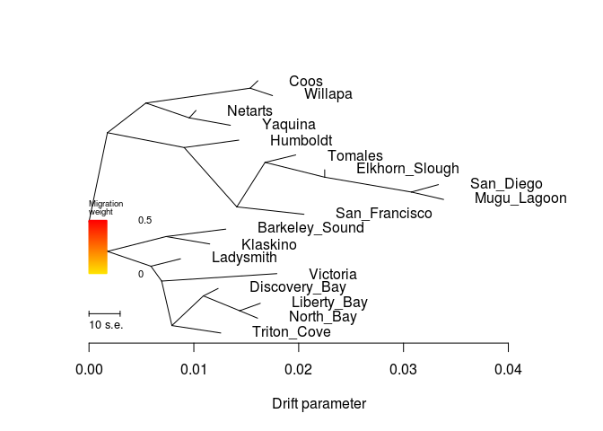

    ##  [1] 0.01304727 0.01633752 0.01610164 0.01428529 0.01971378 0.03332803
    ##  [7] 0.02248162 0.03382255 0.01791779 0.01151676 0.01020452 0.00872536
    ## [13] 0.01231660 0.01607374 0.01750360 0.01348489 0.02050549 0.01256559
    ## [1] 0.003
    ## [1] "mse 0.000296893558641975"

    ## $d
    ##     V1             V2       V3      V4      V5  V6  V7 V8  V9 V10
    ## 1    1 Barkeley_Sound NOT_ROOT NOT_MIG     TIP 172  NA NA  NA  NA
    ## 2    2           <NA> NOT_ROOT NOT_MIG NOT_TIP 605 172  2 256   6
    ## 3    3    Liberty_Bay NOT_ROOT NOT_MIG     TIP 356  NA NA  NA  NA
    ## 4    4           Coos NOT_ROOT NOT_MIG     TIP 412  NA NA  NA  NA
    ## 5   15       Humboldt NOT_ROOT NOT_MIG     TIP  32  NA NA  NA  NA
    ## 6   16           <NA> NOT_ROOT NOT_MIG NOT_TIP 605 212  4  32   6
    ## 7   31        Tomales NOT_ROOT NOT_MIG     TIP  52  NA NA  NA  NA
    ## 8   32           <NA> NOT_ROOT NOT_MIG NOT_TIP  16  15  1 536   5
    ## 9   51      San_Diego NOT_ROOT NOT_MIG     TIP 104  NA NA  NA  NA
    ## 10  52           <NA> NOT_ROOT NOT_MIG NOT_TIP 536  31  1  76   3
    ## 11  75 Elkhorn_Slough NOT_ROOT NOT_MIG     TIP  76  NA NA  NA  NA
    ## 12  76           <NA> NOT_ROOT NOT_MIG NOT_TIP  52  75  1 104   2
    ## 13 103    Mugu_Lagoon NOT_ROOT NOT_MIG     TIP 104  NA NA  NA  NA
    ## 14 104           <NA> NOT_ROOT NOT_MIG NOT_TIP  76  51  1 103   1
    ## 15 135       Victoria NOT_ROOT NOT_MIG     TIP 136  NA NA  NA  NA
    ## 16 136           <NA> NOT_ROOT NOT_MIG NOT_TIP 256 135  1 604   4
    ## 17 171       Klaskino NOT_ROOT NOT_MIG     TIP 172  NA NA  NA  NA
    ## 18 172           <NA> NOT_ROOT NOT_MIG NOT_TIP   2   1  1 171   1
    ## 19 211        Netarts NOT_ROOT NOT_MIG     TIP 472  NA NA  NA  NA
    ## 20 212           <NA> NOT_ROOT NOT_MIG NOT_TIP  16 412  2 472   2
    ## 21 255      Ladysmith NOT_ROOT NOT_MIG     TIP 256  NA NA  NA  NA
    ## 22 256           <NA> NOT_ROOT NOT_MIG NOT_TIP   2 255  1 136   5
    ## 23 303  Discovery_Bay NOT_ROOT NOT_MIG     TIP 304  NA NA  NA  NA
    ## 24 304           <NA> NOT_ROOT NOT_MIG NOT_TIP 604 303  1 356   2
    ## 25 355      North_Bay NOT_ROOT NOT_MIG     TIP 356  NA NA  NA  NA
    ## 26 356           <NA> NOT_ROOT NOT_MIG NOT_TIP 304   3  1 355   1
    ## 27 411        Willapa NOT_ROOT NOT_MIG     TIP 412  NA NA  NA  NA
    ## 28 412           <NA> NOT_ROOT NOT_MIG NOT_TIP 212   4  1 411   1
    ## 29 471        Yaquina NOT_ROOT NOT_MIG     TIP 472  NA NA  NA  NA
    ## 30 472           <NA> NOT_ROOT NOT_MIG NOT_TIP 212 211  1 471   1
    ## 31 535  San_Francisco NOT_ROOT NOT_MIG     TIP 536  NA NA  NA  NA
    ## 32 536           <NA> NOT_ROOT NOT_MIG NOT_TIP  32  52  4 535   1
    ## 33 603    Triton_Cove NOT_ROOT NOT_MIG     TIP 604  NA NA  NA  NA
    ## 34 604           <NA> NOT_ROOT NOT_MIG NOT_TIP 136 304  3 603   1
    ## 35 605           <NA>     ROOT NOT_MIG NOT_TIP 605  16 10   2   8
    ##                                                                                                                                                                                                                                                                                                                                                                                                                                                                                                                                                                                                         V11
    ## 1                                                                                                                                                                                                                                                                                                                                                                                                                                                                                                                                                                                  Barkeley_Sound:0.0057068
    ## 2                                                                                                                                                                                                                                                                                                                               ((Barkeley_Sound:0.0057068,Klaskino:0.00417629):0.00558429,(Ladysmith:0.00281884,(Victoria:0.0109886,((Discovery_Bay:0.00140807,(Liberty_Bay:0.00197188,North_Bay:0.0017081):0.00345711):0.00300292,Triton_Cove:0.00465998):0.000976419):0.00102267):0.00415034):0.00175618
    ## 3                                                                                                                                                                                                                                                                                                                                                                                                                                                                                                                                                                                    Liberty_Bay:0.00197188
    ## 4                                                                                                                                                                                                                                                                                                                                                                                                                                                                                                                                                                                          Coos:0.000729554
    ## 5                                                                                                                                                                                                                                                                                                                                                                                                                                                                                                                                                                                       Humboldt:0.00520956
    ## 6                                                                                                                                                                                                                                                                                 (((Coos:0.000729554,Willapa:0.00213151):0.00994842,(Netarts:0.000641806,Yaquina:0.00392218):0.00413904):0.00366749,(Humboldt:0.00520956,((Tomales:0.00292234,(Elkhorn_Slough:0,(San_Diego:0.00259041,Mugu_Lagoon:0.00308493):0.008256):0.00569018):0.00269245,San_Francisco:0.0064065):0.00502326):0.00731955):0.00175618
    ## 7                                                                                                                                                                                                                                                                                                                                                                                                                                                                                                                                                                                        Tomales:0.00292234
    ## 8                                                                                                                                                                                                                                                                                                                                                                                                                (Humboldt:0.00520956,((Tomales:0.00292234,(Elkhorn_Slough:0,(San_Diego:0.00259041,Mugu_Lagoon:0.00308493):0.008256):0.00569018):0.00269245,San_Francisco:0.0064065):0.00502326):0.00731955
    ## 9                                                                                                                                                                                                                                                                                                                                                                                                                                                                                                                                                                                      San_Diego:0.00259041
    ## 10                                                                                                                                                                                                                                                                                                                                                                                                                                                                                     (Tomales:0.00292234,(Elkhorn_Slough:0,(San_Diego:0.00259041,Mugu_Lagoon:0.00308493):0.008256):0.00569018):0.00269245
    ## 11                                                                                                                                                                                                                                                                                                                                                                                                                                                                                                                                                                                         Elkhorn_Slough:0
    ## 12                                                                                                                                                                                                                                                                                                                                                                                                                                                                                                                     (Elkhorn_Slough:0,(San_Diego:0.00259041,Mugu_Lagoon:0.00308493):0.008256):0.00569018
    ## 13                                                                                                                                                                                                                                                                                                                                                                                                                                                                                                                                                                                   Mugu_Lagoon:0.00308493
    ## 14                                                                                                                                                                                                                                                                                                                                                                                                                                                                                                                                                   (San_Diego:0.00259041,Mugu_Lagoon:0.00308493):0.008256
    ## 15                                                                                                                                                                                                                                                                                                                                                                                                                                                                                                                                                                                       Victoria:0.0109886
    ## 16                                                                                                                                                                                                                                                                                                                                                                                                                                       (Victoria:0.0109886,((Discovery_Bay:0.00140807,(Liberty_Bay:0.00197188,North_Bay:0.0017081):0.00345711):0.00300292,Triton_Cove:0.00465998):0.000976419):0.00102267
    ## 17                                                                                                                                                                                                                                                                                                                                                                                                                                                                                                                                                                                      Klaskino:0.00417629
    ## 18                                                                                                                                                                                                                                                                                                                                                                                                                                                                                                                                                (Barkeley_Sound:0.0057068,Klaskino:0.00417629):0.00558429
    ## 19                                                                                                                                                                                                                                                                                                                                                                                                                                                                                                                                                                                      Netarts:0.000641806
    ## 20                                                                                                                                                                                                                                                                                                                                                                                                                                                                                        ((Coos:0.000729554,Willapa:0.00213151):0.00994842,(Netarts:0.000641806,Yaquina:0.00392218):0.00413904):0.00366749
    ## 21                                                                                                                                                                                                                                                                                                                                                                                                                                                                                                                                                                                     Ladysmith:0.00281884
    ## 22                                                                                                                                                                                                                                                                                                                                                                                                     (Ladysmith:0.00281884,(Victoria:0.0109886,((Discovery_Bay:0.00140807,(Liberty_Bay:0.00197188,North_Bay:0.0017081):0.00345711):0.00300292,Triton_Cove:0.00465998):0.000976419):0.00102267):0.00415034
    ## 23                                                                                                                                                                                                                                                                                                                                                                                                                                                                                                                                                                                 Discovery_Bay:0.00140807
    ## 24                                                                                                                                                                                                                                                                                                                                                                                                                                                                                                            (Discovery_Bay:0.00140807,(Liberty_Bay:0.00197188,North_Bay:0.0017081):0.00345711):0.00300292
    ## 25                                                                                                                                                                                                                                                                                                                                                                                                                                                                                                                                                                                      North_Bay:0.0017081
    ## 26                                                                                                                                                                                                                                                                                                                                                                                                                                                                                                                                                  (Liberty_Bay:0.00197188,North_Bay:0.0017081):0.00345711
    ## 27                                                                                                                                                                                                                                                                                                                                                                                                                                                                                                                                                                                       Willapa:0.00213151
    ## 28                                                                                                                                                                                                                                                                                                                                                                                                                                                                                                                                                         (Coos:0.000729554,Willapa:0.00213151):0.00994842
    ## 29                                                                                                                                                                                                                                                                                                                                                                                                                                                                                                                                                                                       Yaquina:0.00392218
    ## 30                                                                                                                                                                                                                                                                                                                                                                                                                                                                                                                                                      (Netarts:0.000641806,Yaquina:0.00392218):0.00413904
    ## 31                                                                                                                                                                                                                                                                                                                                                                                                                                                                                                                                                                                  San_Francisco:0.0064065
    ## 32                                                                                                                                                                                                                                                                                                                                                                                                                                                ((Tomales:0.00292234,(Elkhorn_Slough:0,(San_Diego:0.00259041,Mugu_Lagoon:0.00308493):0.008256):0.00569018):0.00269245,San_Francisco:0.0064065):0.00502326
    ## 33                                                                                                                                                                                                                                                                                                                                                                                                                                                                                                                                                                                   Triton_Cove:0.00465998
    ## 34                                                                                                                                                                                                                                                                                                                                                                                                                                                                       ((Discovery_Bay:0.00140807,(Liberty_Bay:0.00197188,North_Bay:0.0017081):0.00345711):0.00300292,Triton_Cove:0.00465998):0.000976419
    ## 35 ((((Coos:0.000729554,Willapa:0.00213151):0.00994842,(Netarts:0.000641806,Yaquina:0.00392218):0.00413904):0.00366749,(Humboldt:0.00520956,((Tomales:0.00292234,(Elkhorn_Slough:0,(San_Diego:0.00259041,Mugu_Lagoon:0.00308493):0.008256):0.00569018):0.00269245,San_Francisco:0.0064065):0.00502326):0.00731955):0.00175618,((Barkeley_Sound:0.0057068,Klaskino:0.00417629):0.00558429,(Ladysmith:0.00281884,(Victoria:0.0109886,((Discovery_Bay:0.00140807,(Liberty_Bay:0.00197188,North_Bay:0.0017081):0.00345711):0.00300292,Triton_Cove:0.00465998):0.000976419):0.00102267):0.00415034):0.00175618);
    ##              x          y       ymin       ymax
    ## 1  0.013047270 0.41666667 0.38888889 0.44444444
    ## 2  0.001756180 0.33333333 0.00000000 0.44444444
    ## 3  0.016337519 0.13888889 0.11111111 0.16666667
    ## 4  0.016101644 0.97222222 0.94444444 1.00000000
    ## 5  0.014285290 0.75000000 0.72222222 0.77777778
    ## 6  0.001756180 0.77777778 0.44444444 1.00000000
    ## 7  0.019713780 0.69444444 0.66666667 0.72222222
    ## 8  0.009075730 0.72222222 0.44444444 0.77777778
    ## 9  0.033328030 0.58333333 0.55555556 0.61111111
    ## 10 0.016791440 0.66666667 0.50000000 0.72222222
    ## 11 0.022481620 0.63888889 0.61111111 0.66666667
    ## 12 0.022481620 0.61111111 0.50000000 0.66666667
    ## 13 0.033822550 0.52777778 0.50000000 0.55555556
    ## 14 0.030737620 0.55555556 0.50000000 0.61111111
    ## 15 0.017917790 0.25000000 0.22222222 0.27777778
    ## 16 0.006929190 0.22222222 0.00000000 0.27777778
    ## 17 0.011516760 0.36111111 0.33333333 0.38888889
    ## 18 0.007340470 0.38888889 0.33333333 0.44444444
    ## 19 0.010204516 0.86111111 0.83333333 0.88888889
    ## 20 0.005423670 0.88888889 0.77777778 1.00000000
    ## 21 0.008725360 0.30555556 0.27777778 0.33333333
    ## 22 0.005906520 0.27777778 0.00000000 0.33333333
    ## 23 0.012316599 0.19444444 0.16666667 0.22222222
    ## 24 0.010908529 0.16666667 0.05555556 0.22222222
    ## 25 0.016073739 0.08333333 0.05555556 0.11111111
    ## 26 0.014365639 0.11111111 0.05555556 0.16666667
    ## 27 0.017503600 0.91666667 0.88888889 0.94444444
    ## 28 0.015372090 0.94444444 0.88888889 1.00000000
    ## 29 0.013484890 0.80555556 0.77777778 0.83333333
    ## 30 0.009562710 0.83333333 0.77777778 0.88888889
    ## 31 0.020505490 0.47222222 0.44444444 0.50000000
    ## 32 0.014098990 0.50000000 0.44444444 0.72222222
    ## 33 0.012565589 0.02777778 0.00000000 0.05555556
    ## 34 0.007905609 0.05555556 0.00000000 0.22222222
    ## 35 0.000000000 0.44444444 0.00000000 1.00000000
    ## 
    ## $e
    ##     V1  V2          V3 V4      V5 V6 V7
    ## 1   32  15 0.005209560  1 NOT_MIG  0  1
    ## 2   52  31 0.002922340  1 NOT_MIG  0  1
    ## 3   52  76 0.005690180  1 NOT_MIG  0  1
    ## 4   76  75 0.000000000  1 NOT_MIG  0  1
    ## 5   76 104 0.008256000  1 NOT_MIG  0  1
    ## 6  104  51 0.002590410  1 NOT_MIG  0  1
    ## 7  104 103 0.003084930  1 NOT_MIG  0  1
    ## 8  136 135 0.010988600  1 NOT_MIG  0  1
    ## 9  172   1 0.005706800  1 NOT_MIG  0  1
    ## 10 172 171 0.004176290  1 NOT_MIG  0  1
    ## 11 256 255 0.002818840  1 NOT_MIG  0  1
    ## 12   2 172 0.005584290  1 NOT_MIG  0  1
    ## 13 304 303 0.001408070  1 NOT_MIG  0  1
    ## 14 304 356 0.003457110  1 NOT_MIG  0  1
    ## 15 356   3 0.001971880  1 NOT_MIG  0  1
    ## 16 356 355 0.001708100  1 NOT_MIG  0  1
    ## 17 212 412 0.009948420  1 NOT_MIG  0  1
    ## 18 412   4 0.000729554  1 NOT_MIG  0  1
    ## 19 412 411 0.002131510  1 NOT_MIG  0  1
    ## 20  16 212 0.003667490  1 NOT_MIG  0  1
    ## 21 212 472 0.004139040  1 NOT_MIG  0  1
    ## 22 472 211 0.000641806  1 NOT_MIG  0  1
    ## 23 472 471 0.003922180  1 NOT_MIG  0  1
    ## 24  32 536 0.005023260  1 NOT_MIG  0  1
    ## 25 536  52 0.002692450  1 NOT_MIG  0  1
    ## 26 536 535 0.006406500  1 NOT_MIG  0  1
    ## 27  16  32 0.007319550  1 NOT_MIG  0  1
    ## 28 136 604 0.000976419  1 NOT_MIG  0  1
    ## 29 604 304 0.003002920  1 NOT_MIG  0  1
    ## 30 604 603 0.004659980  1 NOT_MIG  0  1
    ## 31 256 136 0.001022670  1 NOT_MIG  0  1
    ## 32 605  16 0.001756180  1 NOT_MIG  0  1
    ## 33 605   2 0.001756180  1 NOT_MIG  0  1
    ## 34   2 256 0.004150340  1 NOT_MIG  0  1

``` r
system("treemix -i OL/OL-m70x62-maf025.pop.TM.gz -root Mugu_Lagoon,San_Diego,Elkhorn_Slough,Tomales,San_Francisco,Humboldt,Netarts,Yaquina,Willapa,Coos -m 1 -o OL/OL-m70x62-maf025-pop_m1 > out")
```

``` r
plot_tree("OL/OL-m70x62-maf025-pop_m1")
```

    ## Warning in plot_tree("OL/OL-m70x62-maf025-pop_m1"): NAs introduced by
    ## coercion

    ## Warning in plot_tree("OL/OL-m70x62-maf025-pop_m1"): NAs introduced by
    ## coercion

    ## Warning in plot_tree("OL/OL-m70x62-maf025-pop_m1"): NAs introduced by
    ## coercion

    ## Warning in plot_tree("OL/OL-m70x62-maf025-pop_m1"): NAs introduced by
    ## coercion

    ##     V1             V2       V3      V4      V5  V6  V7 V8  V9 V10
    ## 1    1    Liberty_Bay NOT_ROOT NOT_MIG     TIP  52  NA NA  NA  NA
    ## 2    2           <NA> NOT_ROOT NOT_MIG NOT_TIP  76   3  1 604   3
    ## 3    3    Triton_Cove NOT_ROOT NOT_MIG     TIP   2  NA NA  NA  NA
    ## 4    4        Yaquina NOT_ROOT NOT_MIG     TIP 472  NA NA  NA  NA
    ## 5   15           Coos NOT_ROOT NOT_MIG     TIP 172  NA NA  NA  NA
    ## 6   16           <NA> NOT_ROOT NOT_MIG NOT_TIP  32 472  2 172   2
    ## 7   31       Humboldt NOT_ROOT NOT_MIG     TIP 104  NA NA  NA  NA
    ## 8   32           <NA> NOT_ROOT NOT_MIG NOT_TIP 605  16  4 104   6
    ## 9   51      North_Bay NOT_ROOT NOT_MIG     TIP  52  NA NA  NA  NA
    ## 10  52           <NA> NOT_ROOT NOT_MIG NOT_TIP 604   1  1  51   1
    ## 11  75       Victoria NOT_ROOT NOT_MIG     TIP  76  NA NA  NA  NA
    ## 12  76           <NA> NOT_ROOT NOT_MIG NOT_TIP 356  75  1   2   4
    ## 13 103    Mugu_Lagoon NOT_ROOT NOT_MIG     TIP 212  NA NA  NA  NA
    ## 14 104           <NA> NOT_ROOT NOT_MIG NOT_TIP  32 136  5  31   1
    ## 15 135  San_Francisco NOT_ROOT NOT_MIG     TIP 136  NA NA  NA  NA
    ## 16 136           <NA> NOT_ROOT NOT_MIG NOT_TIP 104 536  4 135   1
    ## 17 171        Willapa NOT_ROOT NOT_MIG     TIP 172  NA NA  NA  NA
    ## 18 172           <NA> NOT_ROOT NOT_MIG NOT_TIP  16  15  1 171   1
    ## 19 211      San_Diego NOT_ROOT NOT_MIG     TIP 212  NA NA  NA  NA
    ## 20 212           <NA> NOT_ROOT NOT_MIG NOT_TIP 304 103  1 211   1
    ## 21 255 Barkeley_Sound NOT_ROOT NOT_MIG     TIP 412  NA NA  NA  NA
    ## 22 256           <NA> NOT_ROOT NOT_MIG NOT_TIP 605 412  2 356   6
    ## 23 303 Elkhorn_Slough NOT_ROOT NOT_MIG     TIP 304  NA NA  NA  NA
    ## 24 304           <NA> NOT_ROOT NOT_MIG NOT_TIP 536 212  2 303   1
    ## 25 355      Ladysmith NOT_ROOT NOT_MIG     TIP 356  NA NA  NA  NA
    ## 26 356           <NA> NOT_ROOT NOT_MIG NOT_TIP 256 355  1  76   5
    ## 27 411       Klaskino NOT_ROOT NOT_MIG     TIP 412  NA NA  NA  NA
    ## 28 412           <NA> NOT_ROOT NOT_MIG NOT_TIP 256 255  1 411   1
    ## 29 471        Netarts NOT_ROOT NOT_MIG     TIP 472  NA NA  NA  NA
    ## 30 472           <NA> NOT_ROOT NOT_MIG NOT_TIP  16   4  1 471   1
    ## 31 535        Tomales NOT_ROOT NOT_MIG     TIP 536  NA NA  NA  NA
    ## 32 536           <NA> NOT_ROOT NOT_MIG NOT_TIP 136 304  3 535   1
    ## 33 603  Discovery_Bay NOT_ROOT NOT_MIG     TIP 604  NA NA  NA  NA
    ## 34 604           <NA> NOT_ROOT NOT_MIG NOT_TIP   2 603  1  52   2
    ## 35 605           <NA>     ROOT NOT_MIG NOT_TIP 605  32 10 256   8
    ## 36 644           <NA> NOT_ROOT     MIG NOT_TIP  16 172 NA  NA  NA
    ##                                                                                                                                                                                                                                                                                                                                                                                                                                                                                                                                                                                             V11
    ## 1                                                                                                                                                                                                                                                                                                                                                                                                                                                                                                                                                                        Liberty_Bay:0.00197378
    ## 2                                                                                                                                                                                                                                                                                                                                                                                                                                                              (Triton_Cove:0.00466188,(Discovery_Bay:0.00140998,(Liberty_Bay:0.00197378,North_Bay:0.00171):0.00345711):0.00300292):0.000976419
    ## 3                                                                                                                                                                                                                                                                                                                                                                                                                                                                                                                                                                        Triton_Cove:0.00466188
    ## 4                                                                                                                                                                                                                                                                                                                                                                                                                                                                                                                                                                            Yaquina:0.00392408
    ## 5                                                                                                                                                                                                                                                                                                                                                                                                                                                                                                                                                                              Coos:0.000731455
    ## 6                                                                                                                                                                                                                                                                                                                                                                                                                                                                               ((Yaquina:0.00392408,Netarts:0.000643707):0.00372794,(Coos:0.000731455,Willapa:0.00213342):0.010077):0.00510535
    ## 7                                                                                                                                                                                                                                                                                                                                                                                                                                                                                                                                                                           Humboldt:0.00521146
    ## 8                                                                                                                                                                                                                                                                     (((Yaquina:0.00392408,Netarts:0.000643707):0.00372794,(Coos:0.000731455,Willapa:0.00213342):0.010077):0.00510535,(((((Mugu_Lagoon:0.00308683,San_Diego:0.00259231):0.00825551,Elkhorn_Slough:0):0.00569075,Tomales:0.00292425):0.00269245,San_Francisco:0.0064084):0.00502326,Humboldt:0.00521146):0.00609303):0.00298134
    ## 9                                                                                                                                                                                                                                                                                                                                                                                                                                                                                                                                                                             North_Bay:0.00171
    ## 10                                                                                                                                                                                                                                                                                                                                                                                                                                                                                                                                        (Liberty_Bay:0.00197378,North_Bay:0.00171):0.00345711
    ## 11                                                                                                                                                                                                                                                                                                                                                                                                                                                                                                                                                                           Victoria:0.0109905
    ## 12                                                                                                                                                                                                                                                                                                                                                                                                                             (Victoria:0.0109905,(Triton_Cove:0.00466188,(Discovery_Bay:0.00140998,(Liberty_Bay:0.00197378,North_Bay:0.00171):0.00345711):0.00300292):0.000976419):0.00762007
    ## 13                                                                                                                                                                                                                                                                                                                                                                                                                                                                                                                                                                       Mugu_Lagoon:0.00308683
    ## 14                                                                                                                                                                                                                                                                                                                                                                                                 (((((Mugu_Lagoon:0.00308683,San_Diego:0.00259231):0.00825551,Elkhorn_Slough:0):0.00569075,Tomales:0.00292425):0.00269245,San_Francisco:0.0064084):0.00502326,Humboldt:0.00521146):0.00609303
    ## 15                                                                                                                                                                                                                                                                                                                                                                                                                                                                                                                                                                      San_Francisco:0.0064084
    ## 16                                                                                                                                                                                                                                                                                                                                                                                                                                  ((((Mugu_Lagoon:0.00308683,San_Diego:0.00259231):0.00825551,Elkhorn_Slough:0):0.00569075,Tomales:0.00292425):0.00269245,San_Francisco:0.0064084):0.00502326
    ## 17                                                                                                                                                                                                                                                                                                                                                                                                                                                                                                                                                                           Willapa:0.00213342
    ## 18                                                                                                                                                                                                                                                                                                                                                                                                                                                                                                                                               (Coos:0.000731455,Willapa:0.00213342):0.010077
    ## 19                                                                                                                                                                                                                                                                                                                                                                                                                                                                                                                                                                         San_Diego:0.00259231
    ## 20                                                                                                                                                                                                                                                                                                                                                                                                                                                                                                                                     (Mugu_Lagoon:0.00308683,San_Diego:0.00259231):0.00825551
    ## 21                                                                                                                                                                                                                                                                                                                                                                                                                                                                                                                                                                     Barkeley_Sound:0.0057087
    ## 22                                                                                                                                                                                                                                                                                                                              ((Barkeley_Sound:0.0057087,Klaskino:0.00417819):0.0033753,(Ladysmith:0,(Victoria:0.0109905,(Triton_Cove:0.00466188,(Discovery_Bay:0.00140998,(Liberty_Bay:0.00197378,North_Bay:0.00171):0.00345711):0.00300292):0.000976419):0.00762007):0.00664684):0.00298134
    ## 23                                                                                                                                                                                                                                                                                                                                                                                                                                                                                                                                                                             Elkhorn_Slough:0
    ## 24                                                                                                                                                                                                                                                                                                                                                                                                                                                                                                       ((Mugu_Lagoon:0.00308683,San_Diego:0.00259231):0.00825551,Elkhorn_Slough:0):0.00569075
    ## 25                                                                                                                                                                                                                                                                                                                                                                                                                                                                                                                                                                                  Ladysmith:0
    ## 26                                                                                                                                                                                                                                                                                                                                                                                                    (Ladysmith:0,(Victoria:0.0109905,(Triton_Cove:0.00466188,(Discovery_Bay:0.00140998,(Liberty_Bay:0.00197378,North_Bay:0.00171):0.00345711):0.00300292):0.000976419):0.00762007):0.00664684
    ## 27                                                                                                                                                                                                                                                                                                                                                                                                                                                                                                                                                                          Klaskino:0.00417819
    ## 28                                                                                                                                                                                                                                                                                                                                                                                                                                                                                                                                     (Barkeley_Sound:0.0057087,Klaskino:0.00417819):0.0033753
    ## 29                                                                                                                                                                                                                                                                                                                                                                                                                                                                                                                                                                          Netarts:0.000643707
    ## 30                                                                                                                                                                                                                                                                                                                                                                                                                                                                                                                                          (Yaquina:0.00392408,Netarts:0.000643707):0.00372794
    ## 31                                                                                                                                                                                                                                                                                                                                                                                                                                                                                                                                                                           Tomales:0.00292425
    ## 32                                                                                                                                                                                                                                                                                                                                                                                                                                                                       (((Mugu_Lagoon:0.00308683,San_Diego:0.00259231):0.00825551,Elkhorn_Slough:0):0.00569075,Tomales:0.00292425):0.00269245
    ## 33                                                                                                                                                                                                                                                                                                                                                                                                                                                                                                                                                                     Discovery_Bay:0.00140998
    ## 34                                                                                                                                                                                                                                                                                                                                                                                                                                                                                                  (Discovery_Bay:0.00140998,(Liberty_Bay:0.00197378,North_Bay:0.00171):0.00345711):0.00300292
    ## 35 ((((Yaquina:0.00392408,Netarts:0.000643707):0.00372794,(Coos:0.000731455,Willapa:0.00213342):0.010077):0.00510535,(((((Mugu_Lagoon:0.00308683,San_Diego:0.00259231):0.00825551,Elkhorn_Slough:0):0.00569075,Tomales:0.00292425):0.00269245,San_Francisco:0.0064084):0.00502326,Humboldt:0.00521146):0.00609303):0.00298134,((Barkeley_Sound:0.0057087,Klaskino:0.00417819):0.0033753,(Ladysmith:0,(Victoria:0.0109905,(Triton_Cove:0.00466188,(Discovery_Bay:0.00140998,(Liberty_Bay:0.00197378,North_Bay:0.00171):0.00345711):0.00300292):0.000976419):0.00762007):0.00664684):0.00298134);
    ## 36                                                                                                                                                                                                                                                                                                                                                                                                                                                                                                                                                                                         <NA>
    ##             x          y       ymin       ymax
    ## 1  0.02263431 0.08333333 0.05555556 0.11111111
    ## 2  0.01420050 0.16666667 0.00000000 0.22222222
    ## 3  0.01886238 0.19444444 0.16666667 0.22222222
    ## 4  0.01573871 0.97222222 0.94444444 1.00000000
    ## 5  0.01889510 0.86111111 0.83333333 0.88888889
    ## 6  0.00808669 0.88888889 0.77777778 1.00000000
    ## 7  0.01428583 0.47222222 0.44444444 0.50000000
    ## 8  0.00298134 0.77777778 0.44444444 1.00000000
    ## 9  0.02237053 0.02777778 0.00000000 0.05555556
    ## 10 0.02066053 0.05555556 0.00000000 0.11111111
    ## 11 0.02421458 0.25000000 0.22222222 0.27777778
    ## 12 0.01322408 0.22222222 0.00000000 0.27777778
    ## 13 0.03382317 0.75000000 0.72222222 0.77777778
    ## 14 0.00907437 0.50000000 0.44444444 0.77777778
    ## 15 0.02050603 0.52777778 0.50000000 0.55555556
    ## 16 0.01409763 0.55555556 0.50000000 0.77777778
    ## 17 0.02029707 0.80555556 0.77777778 0.83333333
    ## 18 0.01816365 0.83333333 0.77777778 0.88888889
    ## 19 0.03332865 0.69444444 0.66666667 0.72222222
    ## 20 0.03073634 0.72222222 0.66666667 0.77777778
    ## 21 0.01206534 0.41666667 0.38888889 0.44444444
    ## 22 0.00298134 0.33333333 0.00000000 0.44444444
    ## 23 0.02248083 0.63888889 0.61111111 0.66666667
    ## 24 0.02248083 0.66666667 0.61111111 0.77777778
    ## 25 0.00962818 0.30555556 0.27777778 0.33333333
    ## 26 0.00962818 0.27777778 0.00000000 0.33333333
    ## 27 0.01053483 0.36111111 0.33333333 0.38888889
    ## 28 0.00635664 0.38888889 0.33333333 0.44444444
    ## 29 0.01245834 0.91666667 0.88888889 0.94444444
    ## 30 0.01181463 0.94444444 0.88888889 1.00000000
    ## 31 0.01971433 0.58333333 0.55555556 0.61111111
    ## 32 0.01679008 0.61111111 0.55555556 0.77777778
    ## 33 0.01861340 0.13888889 0.11111111 0.16666667
    ## 34 0.01720342 0.11111111 0.00000000 0.16666667
    ## 35 0.00000000 0.44444444 0.00000000 1.00000000
    ## 36 0.01050003         NA 0.77777778 0.88888889
    ## [1] "0.239491 0.00808669 0.01816365"

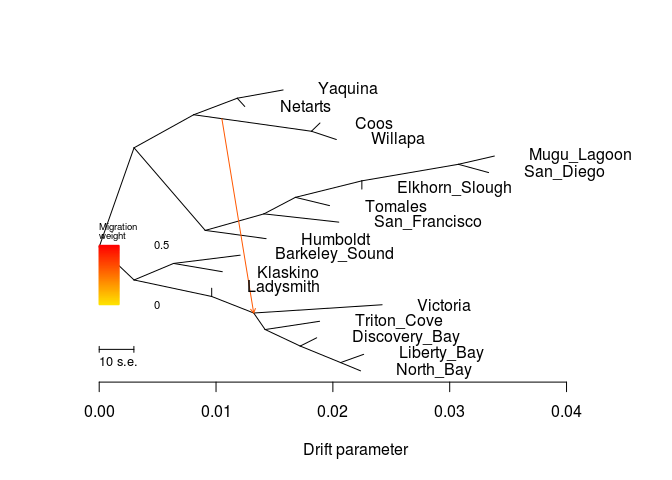

    ##  [1] 0.02263431 0.01886238 0.01573871 0.01889510 0.01428583 0.02237053
    ##  [7] 0.02421458 0.03382317 0.02050603 0.02029707 0.03332865 0.01206534
    ## [13] 0.02248083 0.00962818 0.01053483 0.01245834 0.01971433 0.01861340
    ## [1] 0.003
    ## [1] "mse 0.000296893558641975"

    ## $d
    ##     V1             V2       V3      V4      V5  V6  V7 V8  V9 V10
    ## 1    1    Liberty_Bay NOT_ROOT NOT_MIG     TIP  52  NA NA  NA  NA
    ## 2    2           <NA> NOT_ROOT NOT_MIG NOT_TIP  76   3  1 604   3
    ## 3    3    Triton_Cove NOT_ROOT NOT_MIG     TIP   2  NA NA  NA  NA
    ## 4    4        Yaquina NOT_ROOT NOT_MIG     TIP 472  NA NA  NA  NA
    ## 5   15           Coos NOT_ROOT NOT_MIG     TIP 172  NA NA  NA  NA
    ## 6   16           <NA> NOT_ROOT NOT_MIG NOT_TIP  32 472  2 172   2
    ## 7   31       Humboldt NOT_ROOT NOT_MIG     TIP 104  NA NA  NA  NA
    ## 8   32           <NA> NOT_ROOT NOT_MIG NOT_TIP 605  16  4 104   6
    ## 9   51      North_Bay NOT_ROOT NOT_MIG     TIP  52  NA NA  NA  NA
    ## 10  52           <NA> NOT_ROOT NOT_MIG NOT_TIP 604   1  1  51   1
    ## 11  75       Victoria NOT_ROOT NOT_MIG     TIP  76  NA NA  NA  NA
    ## 12  76           <NA> NOT_ROOT NOT_MIG NOT_TIP 356  75  1   2   4
    ## 13 103    Mugu_Lagoon NOT_ROOT NOT_MIG     TIP 212  NA NA  NA  NA
    ## 14 104           <NA> NOT_ROOT NOT_MIG NOT_TIP  32 136  5  31   1
    ## 15 135  San_Francisco NOT_ROOT NOT_MIG     TIP 136  NA NA  NA  NA
    ## 16 136           <NA> NOT_ROOT NOT_MIG NOT_TIP 104 536  4 135   1
    ## 17 171        Willapa NOT_ROOT NOT_MIG     TIP 172  NA NA  NA  NA
    ## 18 172           <NA> NOT_ROOT NOT_MIG NOT_TIP  16  15  1 171   1
    ## 19 211      San_Diego NOT_ROOT NOT_MIG     TIP 212  NA NA  NA  NA
    ## 20 212           <NA> NOT_ROOT NOT_MIG NOT_TIP 304 103  1 211   1
    ## 21 255 Barkeley_Sound NOT_ROOT NOT_MIG     TIP 412  NA NA  NA  NA
    ## 22 256           <NA> NOT_ROOT NOT_MIG NOT_TIP 605 412  2 356   6
    ## 23 303 Elkhorn_Slough NOT_ROOT NOT_MIG     TIP 304  NA NA  NA  NA
    ## 24 304           <NA> NOT_ROOT NOT_MIG NOT_TIP 536 212  2 303   1
    ## 25 355      Ladysmith NOT_ROOT NOT_MIG     TIP 356  NA NA  NA  NA
    ## 26 356           <NA> NOT_ROOT NOT_MIG NOT_TIP 256 355  1  76   5
    ## 27 411       Klaskino NOT_ROOT NOT_MIG     TIP 412  NA NA  NA  NA
    ## 28 412           <NA> NOT_ROOT NOT_MIG NOT_TIP 256 255  1 411   1
    ## 29 471        Netarts NOT_ROOT NOT_MIG     TIP 472  NA NA  NA  NA
    ## 30 472           <NA> NOT_ROOT NOT_MIG NOT_TIP  16   4  1 471   1
    ## 31 535        Tomales NOT_ROOT NOT_MIG     TIP 536  NA NA  NA  NA
    ## 32 536           <NA> NOT_ROOT NOT_MIG NOT_TIP 136 304  3 535   1
    ## 33 603  Discovery_Bay NOT_ROOT NOT_MIG     TIP 604  NA NA  NA  NA
    ## 34 604           <NA> NOT_ROOT NOT_MIG NOT_TIP   2 603  1  52   2
    ## 35 605           <NA>     ROOT NOT_MIG NOT_TIP 605  32 10 256   8
    ## 36 644           <NA> NOT_ROOT     MIG NOT_TIP  16 172 NA  NA  NA
    ##                                                                                                                                                                                                                                                                                                                                                                                                                                                                                                                                                                                             V11
    ## 1                                                                                                                                                                                                                                                                                                                                                                                                                                                                                                                                                                        Liberty_Bay:0.00197378
    ## 2                                                                                                                                                                                                                                                                                                                                                                                                                                                              (Triton_Cove:0.00466188,(Discovery_Bay:0.00140998,(Liberty_Bay:0.00197378,North_Bay:0.00171):0.00345711):0.00300292):0.000976419
    ## 3                                                                                                                                                                                                                                                                                                                                                                                                                                                                                                                                                                        Triton_Cove:0.00466188
    ## 4                                                                                                                                                                                                                                                                                                                                                                                                                                                                                                                                                                            Yaquina:0.00392408
    ## 5                                                                                                                                                                                                                                                                                                                                                                                                                                                                                                                                                                              Coos:0.000731455
    ## 6                                                                                                                                                                                                                                                                                                                                                                                                                                                                               ((Yaquina:0.00392408,Netarts:0.000643707):0.00372794,(Coos:0.000731455,Willapa:0.00213342):0.010077):0.00510535
    ## 7                                                                                                                                                                                                                                                                                                                                                                                                                                                                                                                                                                           Humboldt:0.00521146
    ## 8                                                                                                                                                                                                                                                                     (((Yaquina:0.00392408,Netarts:0.000643707):0.00372794,(Coos:0.000731455,Willapa:0.00213342):0.010077):0.00510535,(((((Mugu_Lagoon:0.00308683,San_Diego:0.00259231):0.00825551,Elkhorn_Slough:0):0.00569075,Tomales:0.00292425):0.00269245,San_Francisco:0.0064084):0.00502326,Humboldt:0.00521146):0.00609303):0.00298134
    ## 9                                                                                                                                                                                                                                                                                                                                                                                                                                                                                                                                                                             North_Bay:0.00171
    ## 10                                                                                                                                                                                                                                                                                                                                                                                                                                                                                                                                        (Liberty_Bay:0.00197378,North_Bay:0.00171):0.00345711
    ## 11                                                                                                                                                                                                                                                                                                                                                                                                                                                                                                                                                                           Victoria:0.0109905
    ## 12                                                                                                                                                                                                                                                                                                                                                                                                                             (Victoria:0.0109905,(Triton_Cove:0.00466188,(Discovery_Bay:0.00140998,(Liberty_Bay:0.00197378,North_Bay:0.00171):0.00345711):0.00300292):0.000976419):0.00762007
    ## 13                                                                                                                                                                                                                                                                                                                                                                                                                                                                                                                                                                       Mugu_Lagoon:0.00308683
    ## 14                                                                                                                                                                                                                                                                                                                                                                                                 (((((Mugu_Lagoon:0.00308683,San_Diego:0.00259231):0.00825551,Elkhorn_Slough:0):0.00569075,Tomales:0.00292425):0.00269245,San_Francisco:0.0064084):0.00502326,Humboldt:0.00521146):0.00609303
    ## 15                                                                                                                                                                                                                                                                                                                                                                                                                                                                                                                                                                      San_Francisco:0.0064084
    ## 16                                                                                                                                                                                                                                                                                                                                                                                                                                  ((((Mugu_Lagoon:0.00308683,San_Diego:0.00259231):0.00825551,Elkhorn_Slough:0):0.00569075,Tomales:0.00292425):0.00269245,San_Francisco:0.0064084):0.00502326
    ## 17                                                                                                                                                                                                                                                                                                                                                                                                                                                                                                                                                                           Willapa:0.00213342
    ## 18                                                                                                                                                                                                                                                                                                                                                                                                                                                                                                                                               (Coos:0.000731455,Willapa:0.00213342):0.010077
    ## 19                                                                                                                                                                                                                                                                                                                                                                                                                                                                                                                                                                         San_Diego:0.00259231
    ## 20                                                                                                                                                                                                                                                                                                                                                                                                                                                                                                                                     (Mugu_Lagoon:0.00308683,San_Diego:0.00259231):0.00825551
    ## 21                                                                                                                                                                                                                                                                                                                                                                                                                                                                                                                                                                     Barkeley_Sound:0.0057087
    ## 22                                                                                                                                                                                                                                                                                                                              ((Barkeley_Sound:0.0057087,Klaskino:0.00417819):0.0033753,(Ladysmith:0,(Victoria:0.0109905,(Triton_Cove:0.00466188,(Discovery_Bay:0.00140998,(Liberty_Bay:0.00197378,North_Bay:0.00171):0.00345711):0.00300292):0.000976419):0.00762007):0.00664684):0.00298134
    ## 23                                                                                                                                                                                                                                                                                                                                                                                                                                                                                                                                                                             Elkhorn_Slough:0
    ## 24                                                                                                                                                                                                                                                                                                                                                                                                                                                                                                       ((Mugu_Lagoon:0.00308683,San_Diego:0.00259231):0.00825551,Elkhorn_Slough:0):0.00569075
    ## 25                                                                                                                                                                                                                                                                                                                                                                                                                                                                                                                                                                                  Ladysmith:0
    ## 26                                                                                                                                                                                                                                                                                                                                                                                                    (Ladysmith:0,(Victoria:0.0109905,(Triton_Cove:0.00466188,(Discovery_Bay:0.00140998,(Liberty_Bay:0.00197378,North_Bay:0.00171):0.00345711):0.00300292):0.000976419):0.00762007):0.00664684
    ## 27                                                                                                                                                                                                                                                                                                                                                                                                                                                                                                                                                                          Klaskino:0.00417819
    ## 28                                                                                                                                                                                                                                                                                                                                                                                                                                                                                                                                     (Barkeley_Sound:0.0057087,Klaskino:0.00417819):0.0033753
    ## 29                                                                                                                                                                                                                                                                                                                                                                                                                                                                                                                                                                          Netarts:0.000643707
    ## 30                                                                                                                                                                                                                                                                                                                                                                                                                                                                                                                                          (Yaquina:0.00392408,Netarts:0.000643707):0.00372794
    ## 31                                                                                                                                                                                                                                                                                                                                                                                                                                                                                                                                                                           Tomales:0.00292425
    ## 32                                                                                                                                                                                                                                                                                                                                                                                                                                                                       (((Mugu_Lagoon:0.00308683,San_Diego:0.00259231):0.00825551,Elkhorn_Slough:0):0.00569075,Tomales:0.00292425):0.00269245
    ## 33                                                                                                                                                                                                                                                                                                                                                                                                                                                                                                                                                                     Discovery_Bay:0.00140998
    ## 34                                                                                                                                                                                                                                                                                                                                                                                                                                                                                                  (Discovery_Bay:0.00140998,(Liberty_Bay:0.00197378,North_Bay:0.00171):0.00345711):0.00300292
    ## 35 ((((Yaquina:0.00392408,Netarts:0.000643707):0.00372794,(Coos:0.000731455,Willapa:0.00213342):0.010077):0.00510535,(((((Mugu_Lagoon:0.00308683,San_Diego:0.00259231):0.00825551,Elkhorn_Slough:0):0.00569075,Tomales:0.00292425):0.00269245,San_Francisco:0.0064084):0.00502326,Humboldt:0.00521146):0.00609303):0.00298134,((Barkeley_Sound:0.0057087,Klaskino:0.00417819):0.0033753,(Ladysmith:0,(Victoria:0.0109905,(Triton_Cove:0.00466188,(Discovery_Bay:0.00140998,(Liberty_Bay:0.00197378,North_Bay:0.00171):0.00345711):0.00300292):0.000976419):0.00762007):0.00664684):0.00298134);
    ## 36                                                                                                                                                                                                                                                                                                                                                                                                                                                                                                                                                                                         <NA>
    ##             x          y       ymin       ymax
    ## 1  0.02263431 0.08333333 0.05555556 0.11111111
    ## 2  0.01420050 0.16666667 0.00000000 0.22222222
    ## 3  0.01886238 0.19444444 0.16666667 0.22222222
    ## 4  0.01573871 0.97222222 0.94444444 1.00000000
    ## 5  0.01889510 0.86111111 0.83333333 0.88888889
    ## 6  0.00808669 0.88888889 0.77777778 1.00000000
    ## 7  0.01428583 0.47222222 0.44444444 0.50000000
    ## 8  0.00298134 0.77777778 0.44444444 1.00000000
    ## 9  0.02237053 0.02777778 0.00000000 0.05555556
    ## 10 0.02066053 0.05555556 0.00000000 0.11111111
    ## 11 0.02421458 0.25000000 0.22222222 0.27777778
    ## 12 0.01322408 0.22222222 0.00000000 0.27777778
    ## 13 0.03382317 0.75000000 0.72222222 0.77777778
    ## 14 0.00907437 0.50000000 0.44444444 0.77777778
    ## 15 0.02050603 0.52777778 0.50000000 0.55555556
    ## 16 0.01409763 0.55555556 0.50000000 0.77777778
    ## 17 0.02029707 0.80555556 0.77777778 0.83333333
    ## 18 0.01816365 0.83333333 0.77777778 0.88888889
    ## 19 0.03332865 0.69444444 0.66666667 0.72222222
    ## 20 0.03073634 0.72222222 0.66666667 0.77777778
    ## 21 0.01206534 0.41666667 0.38888889 0.44444444
    ## 22 0.00298134 0.33333333 0.00000000 0.44444444
    ## 23 0.02248083 0.63888889 0.61111111 0.66666667
    ## 24 0.02248083 0.66666667 0.61111111 0.77777778
    ## 25 0.00962818 0.30555556 0.27777778 0.33333333
    ## 26 0.00962818 0.27777778 0.00000000 0.33333333
    ## 27 0.01053483 0.36111111 0.33333333 0.38888889
    ## 28 0.00635664 0.38888889 0.33333333 0.44444444
    ## 29 0.01245834 0.91666667 0.88888889 0.94444444
    ## 30 0.01181463 0.94444444 0.88888889 1.00000000
    ## 31 0.01971433 0.58333333 0.55555556 0.61111111
    ## 32 0.01679008 0.61111111 0.55555556 0.77777778
    ## 33 0.01861340 0.13888889 0.11111111 0.16666667
    ## 34 0.01720342 0.11111111 0.00000000 0.16666667
    ## 35 0.00000000 0.44444444 0.00000000 1.00000000
    ## 36 0.01050003 0.87558383 0.77777778 0.88888889
    ## 
    ## $e
    ##     V1  V2          V3       V4      V5       V6       V7
    ## 1    2   3 0.004661880 1.000000 NOT_MIG 0.000000 0.471899
    ## 2   76  75 0.010990500 1.000000 NOT_MIG 0.000000 0.471899
    ## 3  172  15 0.000731455 1.000000 NOT_MIG 0.000000 1.000000
    ## 4  172 171 0.002133420 1.000000 NOT_MIG 0.000000 1.000000
    ## 5   32  16 0.005105350 1.000000 NOT_MIG 0.000000 1.000000
    ## 6  104 136 0.005023260 1.000000 NOT_MIG 0.000000 1.000000
    ## 7  212 103 0.003086830 1.000000 NOT_MIG 0.000000 1.000000
    ## 8  212 211 0.002592310 1.000000 NOT_MIG 0.000000 1.000000
    ## 9  304 212 0.008255510 1.000000 NOT_MIG 0.000000 1.000000
    ## 10 304 303 0.000000000 1.000000 NOT_MIG 0.000000 1.000000
    ## 11 472   4 0.003924080 1.000000 NOT_MIG 0.000000 1.000000
    ## 12 136 536 0.002692450 1.000000 NOT_MIG 0.000000 1.000000
    ## 13 536 304 0.005690750 1.000000 NOT_MIG 0.000000 1.000000
    ## 14 536 535 0.002924250 1.000000 NOT_MIG 0.000000 1.000000
    ## 15 604 603 0.001409980 1.000000 NOT_MIG 0.000000 0.471899
    ## 16 605  32 0.002981340 1.000000 NOT_MIG 0.000000 1.000000
    ## 17 412 255 0.005708700 1.000000 NOT_MIG 0.000000 1.000000
    ## 18 256 412 0.003375300 1.000000 NOT_MIG 0.000000 1.000000
    ## 19 605 256 0.002981340 1.000000 NOT_MIG 0.000000 1.000000
    ## 20  76   2 0.000976419 1.000000 NOT_MIG 0.000000 0.471899
    ## 21  52   1 0.001973780 1.000000 NOT_MIG 0.000000 0.471899
    ## 22  52  51 0.001710000 1.000000 NOT_MIG 0.000000 0.471899
    ## 23 104  31 0.005211460 1.000000 NOT_MIG 0.000000 1.000000
    ## 24 136 135 0.006408400 1.000000 NOT_MIG 0.000000 1.000000
    ## 25  32 104 0.006093030 1.000000 NOT_MIG 0.000000 1.000000
    ## 26 412 411 0.004178190 1.000000 NOT_MIG 0.000000 1.000000
    ## 27 356 355 0.000000000 1.000000 NOT_MIG 0.000000 1.000000
    ## 28 604  52 0.003457110 1.000000 NOT_MIG 0.000000 0.471899
    ## 29   2 604 0.003002920 1.000000 NOT_MIG 0.000000 0.471899
    ## 30 356  76 0.003595903 0.686949 NOT_MIG 0.000000 0.471899
    ## 31 472 471 0.000643707 1.000000 NOT_MIG 0.000000 1.000000
    ## 32 256 356 0.006646840 1.000000 NOT_MIG 0.000000 1.000000
    ## 33  16 472 0.003727940 1.000000 NOT_MIG 0.000000 1.000000
    ## 34  16 644 0.002413340 1.000000 NOT_MIG 0.000000 1.000000
    ## 35 644 172 0.007663620 1.000000 NOT_MIG 0.239491 1.000000
    ## 36 644  76 0.000000000 0.313051     MIG 0.239491 0.000000

``` r
system("treemix -i OL/OL-m70x62-maf025.pop.TM.gz -root Mugu_Lagoon,San_Diego,Elkhorn_Slough,Tomales,San_Francisco,Humboldt,Netarts,Yaquina,Willapa,Coos -m 2 -o OL/OL-m70x62-maf025-pop_m2 > out")
```

``` r
plot_tree("OL/OL-m70x62-maf025-pop_m2")
```

    ## Warning in plot_tree("OL/OL-m70x62-maf025-pop_m2"): NAs introduced by
    ## coercion

    ## Warning in plot_tree("OL/OL-m70x62-maf025-pop_m2"): NAs introduced by
    ## coercion

    ## Warning in plot_tree("OL/OL-m70x62-maf025-pop_m2"): NAs introduced by
    ## coercion

    ## Warning in plot_tree("OL/OL-m70x62-maf025-pop_m2"): NAs introduced by
    ## coercion

    ##     V1             V2       V3      V4      V5  V6  V7 V8  V9 V10
    ## 1    1        Tomales NOT_ROOT NOT_MIG     TIP   2  NA NA  NA  NA
    ## 2    2           <NA> NOT_ROOT NOT_MIG NOT_TIP 256   1  1  16   3
    ## 3    3 Elkhorn_Slough NOT_ROOT NOT_MIG     TIP  16  NA NA  NA  NA
    ## 4    4  Discovery_Bay NOT_ROOT NOT_MIG     TIP  32  NA NA  NA  NA
    ## 5   15    Mugu_Lagoon NOT_ROOT NOT_MIG     TIP 104  NA NA  NA  NA
    ## 6   16           <NA> NOT_ROOT NOT_MIG NOT_TIP   2   3  1 104   2
    ## 7   31      North_Bay NOT_ROOT NOT_MIG     TIP 412  NA NA  NA  NA
    ## 8   32           <NA> NOT_ROOT NOT_MIG NOT_TIP 136   4  1 412   2
    ## 9   51           Coos NOT_ROOT NOT_MIG     TIP  76  NA NA  NA  NA
    ## 10  52           <NA> NOT_ROOT NOT_MIG NOT_TIP 605 304  4 256   6
    ## 11  75        Willapa NOT_ROOT NOT_MIG     TIP  76  NA NA  NA  NA
    ## 12  76           <NA> NOT_ROOT NOT_MIG NOT_TIP 304  51  1  75   1
    ## 13 103      San_Diego NOT_ROOT NOT_MIG     TIP 104  NA NA  NA  NA
    ## 14 104           <NA> NOT_ROOT NOT_MIG NOT_TIP  16  15  1 103   1
    ## 15 135    Triton_Cove NOT_ROOT NOT_MIG     TIP 136  NA NA  NA  NA
    ## 16 136           <NA> NOT_ROOT NOT_MIG NOT_TIP 212 135  1  32   3
    ## 17 171  San_Francisco NOT_ROOT NOT_MIG     TIP 172  NA NA  NA  NA
    ## 18 172           <NA> NOT_ROOT NOT_MIG NOT_TIP 256 171  1 255   1
    ## 19 211       Victoria NOT_ROOT NOT_MIG     TIP 212  NA NA  NA  NA
    ## 20 212           <NA> NOT_ROOT NOT_MIG NOT_TIP 604 211  1 136   4
    ## 21 255       Humboldt NOT_ROOT NOT_MIG     TIP 172  NA NA  NA  NA
    ## 22 256           <NA> NOT_ROOT NOT_MIG NOT_TIP  52   2  4 172   2
    ## 23 303        Yaquina NOT_ROOT NOT_MIG     TIP 536  NA NA  NA  NA
    ## 24 304           <NA> NOT_ROOT NOT_MIG NOT_TIP  52 536  2  76   2
    ## 25 355 Barkeley_Sound NOT_ROOT NOT_MIG     TIP 472  NA NA  NA  NA
    ## 26 356           <NA> NOT_ROOT NOT_MIG NOT_TIP 605 472  2 604   6
    ## 27 411    Liberty_Bay NOT_ROOT NOT_MIG     TIP 412  NA NA  NA  NA
    ## 28 412           <NA> NOT_ROOT NOT_MIG NOT_TIP  32 411  1  31   1
    ## 29 471       Klaskino NOT_ROOT NOT_MIG     TIP 472  NA NA  NA  NA
    ## 30 472           <NA> NOT_ROOT NOT_MIG NOT_TIP 356 355  1 471   1
    ## 31 535        Netarts NOT_ROOT NOT_MIG     TIP 536  NA NA  NA  NA
    ## 32 536           <NA> NOT_ROOT NOT_MIG NOT_TIP 304 303  1 535   1
    ## 33 603      Ladysmith NOT_ROOT NOT_MIG     TIP 604  NA NA  NA  NA
    ## 34 604           <NA> NOT_ROOT NOT_MIG NOT_TIP 356 603  1 212   5
    ## 35 605           <NA>     ROOT NOT_MIG NOT_TIP 605  52 10 356   8
    ## 36 640           <NA> NOT_ROOT     MIG NOT_TIP 304  76 NA  NA  NA
    ## 37 696           <NA> NOT_ROOT     MIG NOT_TIP  32 412 NA  NA  NA
    ##                                                                                                                                                                                                                                                                                                                                                                                                                                                                                                                                                                                            V11
    ## 1                                                                                                                                                                                                                                                                                                                                                                                                                                                                                                                                                                           Tomales:0.00292463
    ## 2                                                                                                                                                                                                                                                                                                                                                                                                                                                                        (Tomales:0.00292463,(Elkhorn_Slough:0,(Mugu_Lagoon:0.00308722,San_Diego:0.0025927):0.00825541):0.00569087):0.00281564
    ## 3                                                                                                                                                                                                                                                                                                                                                                                                                                                                                                                                                                             Elkhorn_Slough:0
    ## 4                                                                                                                                                                                                                                                                                                                                                                                                                                                                                                                                                                     Discovery_Bay:0.00145412
    ## 5                                                                                                                                                                                                                                                                                                                                                                                                                                                                                                                                                                       Mugu_Lagoon:0.00308722
    ## 6                                                                                                                                                                                                                                                                                                                                                                                                                                                                                                        (Elkhorn_Slough:0,(Mugu_Lagoon:0.00308722,San_Diego:0.0025927):0.00825541):0.00569087
    ## 7                                                                                                                                                                                                                                                                                                                                                                                                                                                                                                                                                                         North_Bay:0.00171039
    ## 8                                                                                                                                                                                                                                                                                                                                                                                                                                                                                                (Discovery_Bay:0.00145412,(Liberty_Bay:0.00197417,North_Bay:0.00171039):0.00360664):0.0030056
    ## 9                                                                                                                                                                                                                                                                                                                                                                                                                                                                                                                                                                              Coos:0.00073184
    ## 10                                                                                                                                                                                                                                                                       (((Yaquina:0.00392446,Netarts:0.000644093):0.00346696,(Coos:0.00073184,Willapa:0.0021338):0.0101035):0.00497479,((Tomales:0.00292463,(Elkhorn_Slough:0,(Mugu_Lagoon:0.00308722,San_Diego:0.0025927):0.00825541):0.00569087):0.00281564,(San_Francisco:0.00139595,Humboldt:0.0109377):0.00560247):0.0107144):0.0031061
    ## 11                                                                                                                                                                                                                                                                                                                                                                                                                                                                                                                                                                           Willapa:0.0021338
    ## 12                                                                                                                                                                                                                                                                                                                                                                                                                                                                                                                                               (Coos:0.00073184,Willapa:0.0021338):0.0101035
    ## 13                                                                                                                                                                                                                                                                                                                                                                                                                                                                                                                                                                         San_Diego:0.0025927
    ## 14                                                                                                                                                                                                                                                                                                                                                                                                                                                                                                                                     (Mugu_Lagoon:0.00308722,San_Diego:0.0025927):0.00825541
    ## 15                                                                                                                                                                                                                                                                                                                                                                                                                                                                                                                                                                      Triton_Cove:0.00460735
    ## 16                                                                                                                                                                                                                                                                                                                                                                                                                                                          (Triton_Cove:0.00460735,(Discovery_Bay:0.00145412,(Liberty_Bay:0.00197417,North_Bay:0.00171039):0.00360664):0.0030056):0.000989812
    ## 17                                                                                                                                                                                                                                                                                                                                                                                                                                                                                                                                                                    San_Francisco:0.00139595
    ## 18                                                                                                                                                                                                                                                                                                                                                                                                                                                                                                                                    (San_Francisco:0.00139595,Humboldt:0.0109377):0.00560247
    ## 19                                                                                                                                                                                                                                                                                                                                                                                                                                                                                                                                                                          Victoria:0.0109112
    ## 20                                                                                                                                                                                                                                                                                                                                                                                                                          (Victoria:0.0109112,(Triton_Cove:0.00460735,(Discovery_Bay:0.00145412,(Liberty_Bay:0.00197417,North_Bay:0.00171039):0.00360664):0.0030056):0.000989812):0.00807555
    ## 21                                                                                                                                                                                                                                                                                                                                                                                                                                                                                                                                                                          Humboldt:0.0109377
    ## 22                                                                                                                                                                                                                                                                                                                                                                                                  ((Tomales:0.00292463,(Elkhorn_Slough:0,(Mugu_Lagoon:0.00308722,San_Diego:0.0025927):0.00825541):0.00569087):0.00281564,(San_Francisco:0.00139595,Humboldt:0.0109377):0.00560247):0.0107144
    ## 23                                                                                                                                                                                                                                                                                                                                                                                                                                                                                                                                                                          Yaquina:0.00392446
    ## 24                                                                                                                                                                                                                                                                                                                                                                                                                                                                              ((Yaquina:0.00392446,Netarts:0.000644093):0.00346696,(Coos:0.00073184,Willapa:0.0021338):0.0101035):0.00497479
    ## 25                                                                                                                                                                                                                                                                                                                                                                                                                                                                                                                                                                   Barkeley_Sound:0.00570909
    ## 26                                                                                                                                                                                                                                                                                                                          ((Barkeley_Sound:0.00570909,Klaskino:0.00417857):0.00304686,(Ladysmith:0,(Victoria:0.0109112,(Triton_Cove:0.00460735,(Discovery_Bay:0.00145412,(Liberty_Bay:0.00197417,North_Bay:0.00171039):0.00360664):0.0030056):0.000989812):0.00807555):0.00688597):0.0031061
    ## 27                                                                                                                                                                                                                                                                                                                                                                                                                                                                                                                                                                      Liberty_Bay:0.00197417
    ## 28                                                                                                                                                                                                                                                                                                                                                                                                                                                                                                                                    (Liberty_Bay:0.00197417,North_Bay:0.00171039):0.00360664
    ## 29                                                                                                                                                                                                                                                                                                                                                                                                                                                                                                                                                                         Klaskino:0.00417857
    ## 30                                                                                                                                                                                                                                                                                                                                                                                                                                                                                                                                  (Barkeley_Sound:0.00570909,Klaskino:0.00417857):0.00304686
    ## 31                                                                                                                                                                                                                                                                                                                                                                                                                                                                                                                                                                         Netarts:0.000644093
    ## 32                                                                                                                                                                                                                                                                                                                                                                                                                                                                                                                                         (Yaquina:0.00392446,Netarts:0.000644093):0.00346696
    ## 33                                                                                                                                                                                                                                                                                                                                                                                                                                                                                                                                                                                 Ladysmith:0
    ## 34                                                                                                                                                                                                                                                                                                                                                                                                 (Ladysmith:0,(Victoria:0.0109112,(Triton_Cove:0.00460735,(Discovery_Bay:0.00145412,(Liberty_Bay:0.00197417,North_Bay:0.00171039):0.00360664):0.0030056):0.000989812):0.00807555):0.00688597
    ## 35 ((((Yaquina:0.00392446,Netarts:0.000644093):0.00346696,(Coos:0.00073184,Willapa:0.0021338):0.0101035):0.00497479,((Tomales:0.00292463,(Elkhorn_Slough:0,(Mugu_Lagoon:0.00308722,San_Diego:0.0025927):0.00825541):0.00569087):0.00281564,(San_Francisco:0.00139595,Humboldt:0.0109377):0.00560247):0.0107144):0.0031061,((Barkeley_Sound:0.00570909,Klaskino:0.00417857):0.00304686,(Ladysmith:0,(Victoria:0.0109112,(Triton_Cove:0.00460735,(Discovery_Bay:0.00145412,(Liberty_Bay:0.00197417,North_Bay:0.00171039):0.00360664):0.0030056):0.000989812):0.00807555):0.00688597):0.0031061);
    ## 36                                                                                                                                                                                                                                                                                                                                                                                                                                                                                                                                                                                        <NA>
    ## 37                                                                                                                                                                                                                                                                                                                                                                                                                                                                                                                                                                                        <NA>
    ##             x          y       ymin       ymax
    ## 1  0.01956077 0.75000000 0.72222222 0.77777778
    ## 2  0.01663614 0.72222222 0.55555556 0.77777778
    ## 3  0.02232701 0.69444444 0.66666667 0.72222222
    ## 4  0.01923178 0.13888889 0.11111111 0.16666667
    ## 5  0.03366964 0.63888889 0.61111111 0.66666667
    ## 6  0.02232701 0.66666667 0.55555556 0.72222222
    ## 7  0.02309469 0.02777778 0.00000000 0.05555556
    ## 8  0.01777766 0.11111111 0.00000000 0.16666667
    ## 9  0.01891619 0.86111111 0.83333333 0.88888889
    ## 10 0.00310610 0.77777778 0.44444444 1.00000000
    ## 11 0.02031815 0.80555556 0.77777778 0.83333333
    ## 12 0.01818435 0.83333333 0.77777778 0.88888889
    ## 13 0.03317512 0.58333333 0.55555556 0.61111111
    ## 14 0.03058242 0.61111111 0.55555556 0.66666667
    ## 15 0.01937941 0.19444444 0.16666667 0.22222222
    ## 16 0.01477206 0.16666667 0.00000000 0.22222222
    ## 17 0.02081892 0.52777778 0.50000000 0.55555556
    ## 18 0.01942297 0.50000000 0.44444444 0.55555556
    ## 19 0.02469345 0.25000000 0.22222222 0.27777778
    ## 20 0.01378225 0.22222222 0.00000000 0.27777778
    ## 21 0.02528386 0.47222222 0.44444444 0.50000000
    ## 22 0.01382050 0.55555556 0.44444444 0.77777778
    ## 23 0.01547231 0.97222222 0.94444444 1.00000000
    ## 24 0.00808089 0.88888889 0.77777778 1.00000000
    ## 25 0.01186205 0.41666667 0.38888889 0.44444444
    ## 26 0.00310610 0.33333333 0.00000000 0.44444444
    ## 27 0.02335847 0.08333333 0.05555556 0.11111111
    ## 28 0.02138430 0.05555556 0.00000000 0.11111111
    ## 29 0.01033153 0.36111111 0.33333333 0.38888889
    ## 30 0.00615296 0.38888889 0.33333333 0.44444444
    ## 31 0.01219194 0.91666667 0.88888889 0.94444444
    ## 32 0.01154785 0.94444444 0.88888889 1.00000000
    ## 33 0.00999207 0.30555556 0.27777778 0.33333333
    ## 34 0.00999207 0.27777778 0.00000000 0.33333333
    ## 35 0.00000000 0.44444444 0.00000000 1.00000000
    ## 36 0.01157088         NA 0.77777778 0.88888889
    ## 37 0.02037725         NA 0.00000000 0.11111111
    ## [1] "0.345425 0.00808089 0.01818435"
    ## [1] "0.72078 0.0177776613400251 0.0213843013400251"

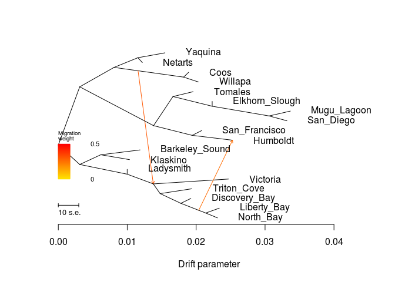

    ##  [1] 0.01956077 0.02232701 0.01923178 0.03366964 0.02309469 0.01891619
    ##  [7] 0.02031815 0.03317512 0.01937941 0.02081892 0.02469345 0.02528386
    ## [13] 0.01547231 0.01186205 0.02335847 0.01033153 0.01219194 0.00999207
    ## [1] 0.003
    ## [1] "mse 0.000296893558641975"

    ## $d
    ##     V1             V2       V3      V4      V5  V6  V7 V8  V9 V10
    ## 1    1        Tomales NOT_ROOT NOT_MIG     TIP   2  NA NA  NA  NA
    ## 2    2           <NA> NOT_ROOT NOT_MIG NOT_TIP 256   1  1  16   3
    ## 3    3 Elkhorn_Slough NOT_ROOT NOT_MIG     TIP  16  NA NA  NA  NA
    ## 4    4  Discovery_Bay NOT_ROOT NOT_MIG     TIP  32  NA NA  NA  NA
    ## 5   15    Mugu_Lagoon NOT_ROOT NOT_MIG     TIP 104  NA NA  NA  NA
    ## 6   16           <NA> NOT_ROOT NOT_MIG NOT_TIP   2   3  1 104   2
    ## 7   31      North_Bay NOT_ROOT NOT_MIG     TIP 412  NA NA  NA  NA
    ## 8   32           <NA> NOT_ROOT NOT_MIG NOT_TIP 136   4  1 412   2
    ## 9   51           Coos NOT_ROOT NOT_MIG     TIP  76  NA NA  NA  NA
    ## 10  52           <NA> NOT_ROOT NOT_MIG NOT_TIP 605 304  4 256   6
    ## 11  75        Willapa NOT_ROOT NOT_MIG     TIP  76  NA NA  NA  NA
    ## 12  76           <NA> NOT_ROOT NOT_MIG NOT_TIP 304  51  1  75   1
    ## 13 103      San_Diego NOT_ROOT NOT_MIG     TIP 104  NA NA  NA  NA
    ## 14 104           <NA> NOT_ROOT NOT_MIG NOT_TIP  16  15  1 103   1
    ## 15 135    Triton_Cove NOT_ROOT NOT_MIG     TIP 136  NA NA  NA  NA
    ## 16 136           <NA> NOT_ROOT NOT_MIG NOT_TIP 212 135  1  32   3
    ## 17 171  San_Francisco NOT_ROOT NOT_MIG     TIP 172  NA NA  NA  NA
    ## 18 172           <NA> NOT_ROOT NOT_MIG NOT_TIP 256 171  1 255   1
    ## 19 211       Victoria NOT_ROOT NOT_MIG     TIP 212  NA NA  NA  NA
    ## 20 212           <NA> NOT_ROOT NOT_MIG NOT_TIP 604 211  1 136   4
    ## 21 255       Humboldt NOT_ROOT NOT_MIG     TIP 172  NA NA  NA  NA
    ## 22 256           <NA> NOT_ROOT NOT_MIG NOT_TIP  52   2  4 172   2
    ## 23 303        Yaquina NOT_ROOT NOT_MIG     TIP 536  NA NA  NA  NA
    ## 24 304           <NA> NOT_ROOT NOT_MIG NOT_TIP  52 536  2  76   2
    ## 25 355 Barkeley_Sound NOT_ROOT NOT_MIG     TIP 472  NA NA  NA  NA
    ## 26 356           <NA> NOT_ROOT NOT_MIG NOT_TIP 605 472  2 604   6
    ## 27 411    Liberty_Bay NOT_ROOT NOT_MIG     TIP 412  NA NA  NA  NA
    ## 28 412           <NA> NOT_ROOT NOT_MIG NOT_TIP  32 411  1  31   1
    ## 29 471       Klaskino NOT_ROOT NOT_MIG     TIP 472  NA NA  NA  NA
    ## 30 472           <NA> NOT_ROOT NOT_MIG NOT_TIP 356 355  1 471   1
    ## 31 535        Netarts NOT_ROOT NOT_MIG     TIP 536  NA NA  NA  NA
    ## 32 536           <NA> NOT_ROOT NOT_MIG NOT_TIP 304 303  1 535   1
    ## 33 603      Ladysmith NOT_ROOT NOT_MIG     TIP 604  NA NA  NA  NA
    ## 34 604           <NA> NOT_ROOT NOT_MIG NOT_TIP 356 603  1 212   5
    ## 35 605           <NA>     ROOT NOT_MIG NOT_TIP 605  52 10 356   8
    ## 36 640           <NA> NOT_ROOT     MIG NOT_TIP 304  76 NA  NA  NA
    ## 37 696           <NA> NOT_ROOT     MIG NOT_TIP  32 412 NA  NA  NA
    ##                                                                                                                                                                                                                                                                                                                                                                                                                                                                                                                                                                                            V11
    ## 1                                                                                                                                                                                                                                                                                                                                                                                                                                                                                                                                                                           Tomales:0.00292463
    ## 2                                                                                                                                                                                                                                                                                                                                                                                                                                                                        (Tomales:0.00292463,(Elkhorn_Slough:0,(Mugu_Lagoon:0.00308722,San_Diego:0.0025927):0.00825541):0.00569087):0.00281564
    ## 3                                                                                                                                                                                                                                                                                                                                                                                                                                                                                                                                                                             Elkhorn_Slough:0
    ## 4                                                                                                                                                                                                                                                                                                                                                                                                                                                                                                                                                                     Discovery_Bay:0.00145412
    ## 5                                                                                                                                                                                                                                                                                                                                                                                                                                                                                                                                                                       Mugu_Lagoon:0.00308722
    ## 6                                                                                                                                                                                                                                                                                                                                                                                                                                                                                                        (Elkhorn_Slough:0,(Mugu_Lagoon:0.00308722,San_Diego:0.0025927):0.00825541):0.00569087
    ## 7                                                                                                                                                                                                                                                                                                                                                                                                                                                                                                                                                                         North_Bay:0.00171039
    ## 8                                                                                                                                                                                                                                                                                                                                                                                                                                                                                                (Discovery_Bay:0.00145412,(Liberty_Bay:0.00197417,North_Bay:0.00171039):0.00360664):0.0030056
    ## 9                                                                                                                                                                                                                                                                                                                                                                                                                                                                                                                                                                              Coos:0.00073184
    ## 10                                                                                                                                                                                                                                                                       (((Yaquina:0.00392446,Netarts:0.000644093):0.00346696,(Coos:0.00073184,Willapa:0.0021338):0.0101035):0.00497479,((Tomales:0.00292463,(Elkhorn_Slough:0,(Mugu_Lagoon:0.00308722,San_Diego:0.0025927):0.00825541):0.00569087):0.00281564,(San_Francisco:0.00139595,Humboldt:0.0109377):0.00560247):0.0107144):0.0031061
    ## 11                                                                                                                                                                                                                                                                                                                                                                                                                                                                                                                                                                           Willapa:0.0021338
    ## 12                                                                                                                                                                                                                                                                                                                                                                                                                                                                                                                                               (Coos:0.00073184,Willapa:0.0021338):0.0101035
    ## 13                                                                                                                                                                                                                                                                                                                                                                                                                                                                                                                                                                         San_Diego:0.0025927
    ## 14                                                                                                                                                                                                                                                                                                                                                                                                                                                                                                                                     (Mugu_Lagoon:0.00308722,San_Diego:0.0025927):0.00825541
    ## 15                                                                                                                                                                                                                                                                                                                                                                                                                                                                                                                                                                      Triton_Cove:0.00460735
    ## 16                                                                                                                                                                                                                                                                                                                                                                                                                                                          (Triton_Cove:0.00460735,(Discovery_Bay:0.00145412,(Liberty_Bay:0.00197417,North_Bay:0.00171039):0.00360664):0.0030056):0.000989812
    ## 17                                                                                                                                                                                                                                                                                                                                                                                                                                                                                                                                                                    San_Francisco:0.00139595
    ## 18                                                                                                                                                                                                                                                                                                                                                                                                                                                                                                                                    (San_Francisco:0.00139595,Humboldt:0.0109377):0.00560247
    ## 19                                                                                                                                                                                                                                                                                                                                                                                                                                                                                                                                                                          Victoria:0.0109112
    ## 20                                                                                                                                                                                                                                                                                                                                                                                                                          (Victoria:0.0109112,(Triton_Cove:0.00460735,(Discovery_Bay:0.00145412,(Liberty_Bay:0.00197417,North_Bay:0.00171039):0.00360664):0.0030056):0.000989812):0.00807555
    ## 21                                                                                                                                                                                                                                                                                                                                                                                                                                                                                                                                                                          Humboldt:0.0109377
    ## 22                                                                                                                                                                                                                                                                                                                                                                                                  ((Tomales:0.00292463,(Elkhorn_Slough:0,(Mugu_Lagoon:0.00308722,San_Diego:0.0025927):0.00825541):0.00569087):0.00281564,(San_Francisco:0.00139595,Humboldt:0.0109377):0.00560247):0.0107144
    ## 23                                                                                                                                                                                                                                                                                                                                                                                                                                                                                                                                                                          Yaquina:0.00392446
    ## 24                                                                                                                                                                                                                                                                                                                                                                                                                                                                              ((Yaquina:0.00392446,Netarts:0.000644093):0.00346696,(Coos:0.00073184,Willapa:0.0021338):0.0101035):0.00497479
    ## 25                                                                                                                                                                                                                                                                                                                                                                                                                                                                                                                                                                   Barkeley_Sound:0.00570909
    ## 26                                                                                                                                                                                                                                                                                                                          ((Barkeley_Sound:0.00570909,Klaskino:0.00417857):0.00304686,(Ladysmith:0,(Victoria:0.0109112,(Triton_Cove:0.00460735,(Discovery_Bay:0.00145412,(Liberty_Bay:0.00197417,North_Bay:0.00171039):0.00360664):0.0030056):0.000989812):0.00807555):0.00688597):0.0031061
    ## 27                                                                                                                                                                                                                                                                                                                                                                                                                                                                                                                                                                      Liberty_Bay:0.00197417
    ## 28                                                                                                                                                                                                                                                                                                                                                                                                                                                                                                                                    (Liberty_Bay:0.00197417,North_Bay:0.00171039):0.00360664
    ## 29                                                                                                                                                                                                                                                                                                                                                                                                                                                                                                                                                                         Klaskino:0.00417857
    ## 30                                                                                                                                                                                                                                                                                                                                                                                                                                                                                                                                  (Barkeley_Sound:0.00570909,Klaskino:0.00417857):0.00304686
    ## 31                                                                                                                                                                                                                                                                                                                                                                                                                                                                                                                                                                         Netarts:0.000644093
    ## 32                                                                                                                                                                                                                                                                                                                                                                                                                                                                                                                                         (Yaquina:0.00392446,Netarts:0.000644093):0.00346696
    ## 33                                                                                                                                                                                                                                                                                                                                                                                                                                                                                                                                                                                 Ladysmith:0
    ## 34                                                                                                                                                                                                                                                                                                                                                                                                 (Ladysmith:0,(Victoria:0.0109112,(Triton_Cove:0.00460735,(Discovery_Bay:0.00145412,(Liberty_Bay:0.00197417,North_Bay:0.00171039):0.00360664):0.0030056):0.000989812):0.00807555):0.00688597
    ## 35 ((((Yaquina:0.00392446,Netarts:0.000644093):0.00346696,(Coos:0.00073184,Willapa:0.0021338):0.0101035):0.00497479,((Tomales:0.00292463,(Elkhorn_Slough:0,(Mugu_Lagoon:0.00308722,San_Diego:0.0025927):0.00825541):0.00569087):0.00281564,(San_Francisco:0.00139595,Humboldt:0.0109377):0.00560247):0.0107144):0.0031061,((Barkeley_Sound:0.00570909,Klaskino:0.00417857):0.00304686,(Ladysmith:0,(Victoria:0.0109112,(Triton_Cove:0.00460735,(Discovery_Bay:0.00145412,(Liberty_Bay:0.00197417,North_Bay:0.00171039):0.00360664):0.0030056):0.000989812):0.00807555):0.00688597):0.0031061);
    ## 36                                                                                                                                                                                                                                                                                                                                                                                                                                                                                                                                                                                        <NA>
    ## 37                                                                                                                                                                                                                                                                                                                                                                                                                                                                                                                                                                                        <NA>
    ##             x          y       ymin       ymax
    ## 1  0.01956077 0.75000000 0.72222222 0.77777778
    ## 2  0.01663614 0.72222222 0.55555556 0.77777778
    ## 3  0.02232701 0.69444444 0.66666667 0.72222222
    ## 4  0.01923178 0.13888889 0.11111111 0.16666667
    ## 5  0.03366964 0.63888889 0.61111111 0.66666667
    ## 6  0.02232701 0.66666667 0.55555556 0.72222222
    ## 7  0.02309469 0.02777778 0.00000000 0.05555556
    ## 8  0.01777766 0.11111111 0.00000000 0.16666667
    ## 9  0.01891619 0.86111111 0.83333333 0.88888889
    ## 10 0.00310610 0.77777778 0.44444444 1.00000000
    ## 11 0.02031815 0.80555556 0.77777778 0.83333333
    ## 12 0.01818435 0.83333333 0.77777778 0.88888889
    ## 13 0.03317512 0.58333333 0.55555556 0.61111111
    ## 14 0.03058242 0.61111111 0.55555556 0.66666667
    ## 15 0.01937941 0.19444444 0.16666667 0.22222222
    ## 16 0.01477206 0.16666667 0.00000000 0.22222222
    ## 17 0.02081892 0.52777778 0.50000000 0.55555556
    ## 18 0.01942297 0.50000000 0.44444444 0.55555556
    ## 19 0.02469345 0.25000000 0.22222222 0.27777778
    ## 20 0.01378225 0.22222222 0.00000000 0.27777778
    ## 21 0.02528386 0.47222222 0.44444444 0.50000000
    ## 22 0.01382050 0.55555556 0.44444444 0.77777778
    ## 23 0.01547231 0.97222222 0.94444444 1.00000000
    ## 24 0.00808089 0.88888889 0.77777778 1.00000000
    ## 25 0.01186205 0.41666667 0.38888889 0.44444444
    ## 26 0.00310610 0.33333333 0.00000000 0.44444444
    ## 27 0.02335847 0.08333333 0.05555556 0.11111111
    ## 28 0.02138430 0.05555556 0.00000000 0.11111111
    ## 29 0.01033153 0.36111111 0.33333333 0.38888889
    ## 30 0.00615296 0.38888889 0.33333333 0.44444444
    ## 31 0.01219194 0.91666667 0.88888889 0.94444444
    ## 32 0.01154785 0.94444444 0.88888889 1.00000000
    ## 33 0.00999207 0.30555556 0.27777778 0.33333333
    ## 34 0.00999207 0.27777778 0.00000000 0.33333333
    ## 35 0.00000000 0.44444444 0.00000000 1.00000000
    ## 36 0.01157088 0.86969861 0.77777778 0.88888889
    ## 37 0.02037726 0.07106778 0.00000000 0.11111111
    ## 
    ## $e
    ##     V1  V2          V3       V4      V5       V6       V7
    ## 1    2   1 0.002924630 1.000000 NOT_MIG 0.000000 1.000000
    ## 2    2  16 0.005690870 1.000000 NOT_MIG 0.000000 1.000000
    ## 3   16   3 0.000000000 1.000000 NOT_MIG 0.000000 1.000000
    ## 4   32   4 0.001454120 1.000000 NOT_MIG 0.000000 0.469340
    ## 5   76  51 0.000731840 1.000000 NOT_MIG 0.000000 1.000000
    ## 6   76  75 0.002133800 1.000000 NOT_MIG 0.000000 1.000000
    ## 7   16 104 0.008255410 1.000000 NOT_MIG 0.000000 1.000000
    ## 8  104  15 0.003087220 1.000000 NOT_MIG 0.000000 1.000000
    ## 9  104 103 0.002592700 1.000000 NOT_MIG 0.000000 1.000000
    ## 10 136 135 0.004607350 1.000000 NOT_MIG 0.000000 0.469340
    ## 11 212 211 0.010911200 1.000000 NOT_MIG 0.000000 0.469340
    ## 12  52 304 0.004974790 1.000000 NOT_MIG 0.000000 1.000000
    ## 13 536 303 0.003924460 1.000000 NOT_MIG 0.000000 1.000000
    ## 14 605  52 0.003106100 1.000000 NOT_MIG 0.000000 1.000000
    ## 15 472 355 0.005709090 1.000000 NOT_MIG 0.000000 1.000000
    ## 16 356 472 0.003046860 1.000000 NOT_MIG 0.000000 1.000000
    ## 17 605 356 0.003106100 1.000000 NOT_MIG 0.000000 1.000000
    ## 18 172 171 0.001395950 1.000000 NOT_MIG 0.000000 1.000000
    ## 19 472 471 0.004178570 1.000000 NOT_MIG 0.000000 1.000000
    ## 20 604 603 0.000000000 1.000000 NOT_MIG 0.000000 1.000000
    ## 21 536 535 0.000644093 1.000000 NOT_MIG 0.000000 1.000000
    ## 22 304 536 0.003466960 1.000000 NOT_MIG 0.000000 1.000000
    ## 23 304 640 0.003489990 1.000000 NOT_MIG 0.000000 1.000000
    ## 24 640  76 0.006613470 1.000000 NOT_MIG 0.345425 1.000000
    ## 25 640 212 0.000000000 0.314916     MIG 0.345425 0.000000
    ## 26 412 411 0.001974170 1.000000 NOT_MIG 0.000000 0.469340
    ## 27 604 212 0.003790179 0.685084 NOT_MIG 0.000000 0.469340
    ## 28 356 604 0.006885970 1.000000 NOT_MIG 0.000000 1.000000
    ## 29 212 136 0.000989812 1.000000 NOT_MIG 0.000000 0.469340
    ## 30 136  32 0.003005600 1.000000 NOT_MIG 0.000000 0.469340
    ## 31  52 256 0.010714400 1.000000 NOT_MIG 0.000000 1.000000
    ## 32 256   2 0.002815640 1.000000 NOT_MIG 0.000000 1.000000
    ## 33 256 172 0.005602470 1.000000 NOT_MIG 0.000000 1.000000
    ## 34 172 255 0.005860890 0.732013 NOT_MIG 0.000000 0.535843
    ## 35 412  31 0.001710390 1.000000 NOT_MIG 0.000000 0.469340
    ## 36  32 696 0.002599590 1.000000 NOT_MIG 0.000000 0.469340
    ## 37 696 412 0.001007050 1.000000 NOT_MIG 0.720780 0.469340
    ## 38 696 255 0.000000000 0.267987     MIG 0.720780 0.000000

``` r
system("treemix -i OL/OL-m70x62-maf025.pop.TM.gz -root Mugu_Lagoon,San_Diego,Elkhorn_Slough,Tomales,San_Francisco,Humboldt,Netarts,Yaquina,Willapa,Coos -m 3 -o OL/OL-m70x62-maf025-pop_m3 > out")
```

``` r
plot_tree("OL/OL-m70x62-maf025-pop_m3")
```

    ## Warning in plot_tree("OL/OL-m70x62-maf025-pop_m3"): NAs introduced by
    ## coercion

    ## Warning in plot_tree("OL/OL-m70x62-maf025-pop_m3"): NAs introduced by
    ## coercion

    ## Warning in plot_tree("OL/OL-m70x62-maf025-pop_m3"): NAs introduced by
    ## coercion

    ## Warning in plot_tree("OL/OL-m70x62-maf025-pop_m3"): NAs introduced by
    ## coercion

    ##     V1             V2       V3      V4      V5  V6  V7 V8  V9 V10
    ## 1    1        Willapa NOT_ROOT NOT_MIG     TIP 136  NA NA  NA  NA
    ## 2    2           <NA> NOT_ROOT NOT_MIG NOT_TIP 605 536  6 212   4
    ## 3    3 Barkeley_Sound NOT_ROOT NOT_MIG     TIP 304  NA NA  NA  NA
    ## 4    4    Mugu_Lagoon NOT_ROOT NOT_MIG     TIP  52  NA NA  NA  NA
    ## 5   15       Victoria NOT_ROOT NOT_MIG     TIP  32  NA NA  NA  NA
    ## 6   16           <NA> NOT_ROOT NOT_MIG NOT_TIP 605 304  2  76   6
    ## 7   31    Liberty_Bay NOT_ROOT NOT_MIG     TIP 412  NA NA  NA  NA
    ## 8   32           <NA> NOT_ROOT NOT_MIG NOT_TIP  76  15  1 604   4
    ## 9   51      San_Diego NOT_ROOT NOT_MIG     TIP  52  NA NA  NA  NA
    ## 10  52           <NA> NOT_ROOT NOT_MIG NOT_TIP 356   4  1  51   1
    ## 11  75      Ladysmith NOT_ROOT NOT_MIG     TIP  76  NA NA  NA  NA
    ## 12  76           <NA> NOT_ROOT NOT_MIG NOT_TIP  16  75  1  32   5
    ## 13 103        Tomales NOT_ROOT NOT_MIG     TIP 104  NA NA  NA  NA
    ## 14 104           <NA> NOT_ROOT NOT_MIG NOT_TIP 536 103  1 356   3
    ## 15 135           Coos NOT_ROOT NOT_MIG     TIP 136  NA NA  NA  NA
    ## 16 136           <NA> NOT_ROOT NOT_MIG NOT_TIP 212   1  1 135   1
    ## 17 171  San_Francisco NOT_ROOT NOT_MIG     TIP 172  NA NA  NA  NA
    ## 18 172           <NA> NOT_ROOT NOT_MIG NOT_TIP 536 535  1 171   1
    ## 19 211        Netarts NOT_ROOT NOT_MIG     TIP 472  NA NA  NA  NA
    ## 20 212           <NA> NOT_ROOT NOT_MIG NOT_TIP   2 472  2 136   2
    ## 21 255  Discovery_Bay NOT_ROOT NOT_MIG     TIP 256  NA NA  NA  NA
    ## 22 256           <NA> NOT_ROOT NOT_MIG NOT_TIP 604 255  1 412   2
    ## 23 303       Klaskino NOT_ROOT NOT_MIG     TIP 304  NA NA  NA  NA
    ## 24 304           <NA> NOT_ROOT NOT_MIG NOT_TIP  16   3  1 303   1
    ## 25 355 Elkhorn_Slough NOT_ROOT NOT_MIG     TIP 356  NA NA  NA  NA
    ## 26 356           <NA> NOT_ROOT NOT_MIG NOT_TIP 104  52  2 355   1
    ## 27 411      North_Bay NOT_ROOT NOT_MIG     TIP 412  NA NA  NA  NA
    ## 28 412           <NA> NOT_ROOT NOT_MIG NOT_TIP 256 411  1  31   1
    ## 29 471        Yaquina NOT_ROOT NOT_MIG     TIP 472  NA NA  NA  NA
    ## 30 472           <NA> NOT_ROOT NOT_MIG NOT_TIP 212 471  1 211   1
    ## 31 535       Humboldt NOT_ROOT NOT_MIG     TIP 172  NA NA  NA  NA
    ## 32 536           <NA> NOT_ROOT NOT_MIG NOT_TIP   2 104  4 172   2
    ## 33 603    Triton_Cove NOT_ROOT NOT_MIG     TIP 604  NA NA  NA  NA
    ## 34 604           <NA> NOT_ROOT NOT_MIG NOT_TIP  32 603  1 256   3
    ## 35 605           <NA>     ROOT NOT_MIG NOT_TIP 605   2 10  16   8
    ## 36 711           <NA> NOT_ROOT     MIG NOT_TIP 412 411 NA  NA  NA
    ## 37 643           <NA> NOT_ROOT     MIG NOT_TIP 212 136 NA  NA  NA
    ## 38 780           <NA> NOT_ROOT     MIG NOT_TIP 412 411 NA  NA  NA
    ##                                                                                                                                                                                                                                                                                                                                                                                                                                                                                                                                                                                             V11
    ## 1                                                                                                                                                                                                                                                                                                                                                                                                                                                                                                                                                                            Willapa:0.00213291
    ## 2                                                                                                                                                                                                                                                                       (((Tomales:0.00292374,((Mugu_Lagoon:0.00308633,San_Diego:0.00259181):0.00825564,Elkhorn_Slough:0):0.0056906):0.00281442,(Humboldt:0.0105072,San_Francisco:0.00144215):0.00555539):0.0101292,((Yaquina:0.00132331,Netarts:0.00348244):0.00538472,(Willapa:0.00213291,Coos:0.000730948):0.00974837):0.00550062):0.0032009
    ## 3                                                                                                                                                                                                                                                                                                                                                                                                                                                                                                                                                                      Barkeley_Sound:0.0057082
    ## 4                                                                                                                                                                                                                                                                                                                                                                                                                                                                                                                                                                        Mugu_Lagoon:0.00308633
    ## 5                                                                                                                                                                                                                                                                                                                                                                                                                                                                                                                                                                             Victoria:0.010808
    ## 6                                                                                                                                                                                                                                                                                                                             ((Barkeley_Sound:0.0057082,Klaskino:0.00417768):0.00314236,(Ladysmith:0,(Victoria:0.010808,(Triton_Cove:0.00452252,(Discovery_Bay:0.00135973,(North_Bay:0.00178728,Liberty_Bay:0.00190703):0.00370341):0.00310668):0.000992672):0.00604959):0.00650409):0.0032009
    ## 7                                                                                                                                                                                                                                                                                                                                                                                                                                                                                                                                                                        Liberty_Bay:0.00190703
    ## 8                                                                                                                                                                                                                                                                                                                                                                                                                            (Victoria:0.010808,(Triton_Cove:0.00452252,(Discovery_Bay:0.00135973,(North_Bay:0.00178728,Liberty_Bay:0.00190703):0.00370341):0.00310668):0.000992672):0.00604959
    ## 9                                                                                                                                                                                                                                                                                                                                                                                                                                                                                                                                                                          San_Diego:0.00259181
    ## 10                                                                                                                                                                                                                                                                                                                                                                                                                                                                                                                                     (Mugu_Lagoon:0.00308633,San_Diego:0.00259181):0.00825564
    ## 11                                                                                                                                                                                                                                                                                                                                                                                                                                                                                                                                                                                  Ladysmith:0
    ## 12                                                                                                                                                                                                                                                                                                                                                                                                  (Ladysmith:0,(Victoria:0.010808,(Triton_Cove:0.00452252,(Discovery_Bay:0.00135973,(North_Bay:0.00178728,Liberty_Bay:0.00190703):0.00370341):0.00310668):0.000992672):0.00604959):0.00650409
    ## 13                                                                                                                                                                                                                                                                                                                                                                                                                                                                                                                                                                           Tomales:0.00292374
    ## 14                                                                                                                                                                                                                                                                                                                                                                                                                                                                        (Tomales:0.00292374,((Mugu_Lagoon:0.00308633,San_Diego:0.00259181):0.00825564,Elkhorn_Slough:0):0.0056906):0.00281442
    ## 15                                                                                                                                                                                                                                                                                                                                                                                                                                                                                                                                                                             Coos:0.000730948
    ## 16                                                                                                                                                                                                                                                                                                                                                                                                                                                                                                                                             (Willapa:0.00213291,Coos:0.000730948):0.00974837
    ## 17                                                                                                                                                                                                                                                                                                                                                                                                                                                                                                                                                                     San_Francisco:0.00144215
    ## 18                                                                                                                                                                                                                                                                                                                                                                                                                                                                                                                                     (Humboldt:0.0105072,San_Francisco:0.00144215):0.00555539
    ## 19                                                                                                                                                                                                                                                                                                                                                                                                                                                                                                                                                                           Netarts:0.00348244
    ## 20                                                                                                                                                                                                                                                                                                                                                                                                                                                                             ((Yaquina:0.00132331,Netarts:0.00348244):0.00538472,(Willapa:0.00213291,Coos:0.000730948):0.00974837):0.00550062
    ## 21                                                                                                                                                                                                                                                                                                                                                                                                                                                                                                                                                                     Discovery_Bay:0.00135973
    ## 22                                                                                                                                                                                                                                                                                                                                                                                                                                                                                               (Discovery_Bay:0.00135973,(North_Bay:0.00178728,Liberty_Bay:0.00190703):0.00370341):0.00310668
    ## 23                                                                                                                                                                                                                                                                                                                                                                                                                                                                                                                                                                          Klaskino:0.00417768
    ## 24                                                                                                                                                                                                                                                                                                                                                                                                                                                                                                                                    (Barkeley_Sound:0.0057082,Klaskino:0.00417768):0.00314236
    ## 25                                                                                                                                                                                                                                                                                                                                                                                                                                                                                                                                                                             Elkhorn_Slough:0
    ## 26                                                                                                                                                                                                                                                                                                                                                                                                                                                                                                        ((Mugu_Lagoon:0.00308633,San_Diego:0.00259181):0.00825564,Elkhorn_Slough:0):0.0056906
    ## 27                                                                                                                                                                                                                                                                                                                                                                                                                                                                                                                                                                         North_Bay:0.00178728
    ## 28                                                                                                                                                                                                                                                                                                                                                                                                                                                                                                                                     (North_Bay:0.00178728,Liberty_Bay:0.00190703):0.00370341
    ## 29                                                                                                                                                                                                                                                                                                                                                                                                                                                                                                                                                                           Yaquina:0.00132331
    ## 30                                                                                                                                                                                                                                                                                                                                                                                                                                                                                                                                           (Yaquina:0.00132331,Netarts:0.00348244):0.00538472
    ## 31                                                                                                                                                                                                                                                                                                                                                                                                                                                                                                                                                                           Humboldt:0.0105072
    ## 32                                                                                                                                                                                                                                                                                                                                                                                                   ((Tomales:0.00292374,((Mugu_Lagoon:0.00308633,San_Diego:0.00259181):0.00825564,Elkhorn_Slough:0):0.0056906):0.00281442,(Humboldt:0.0105072,San_Francisco:0.00144215):0.00555539):0.0101292
    ## 33                                                                                                                                                                                                                                                                                                                                                                                                                                                                                                                                                                       Triton_Cove:0.00452252
    ## 34                                                                                                                                                                                                                                                                                                                                                                                                                                                          (Triton_Cove:0.00452252,(Discovery_Bay:0.00135973,(North_Bay:0.00178728,Liberty_Bay:0.00190703):0.00370341):0.00310668):0.000992672
    ## 35 ((((Tomales:0.00292374,((Mugu_Lagoon:0.00308633,San_Diego:0.00259181):0.00825564,Elkhorn_Slough:0):0.0056906):0.00281442,(Humboldt:0.0105072,San_Francisco:0.00144215):0.00555539):0.0101292,((Yaquina:0.00132331,Netarts:0.00348244):0.00538472,(Willapa:0.00213291,Coos:0.000730948):0.00974837):0.00550062):0.0032009,((Barkeley_Sound:0.0057082,Klaskino:0.00417768):0.00314236,(Ladysmith:0,(Victoria:0.010808,(Triton_Cove:0.00452252,(Discovery_Bay:0.00135973,(North_Bay:0.00178728,Liberty_Bay:0.00190703):0.00370341):0.00310668):0.000992672):0.00604959):0.00650409):0.0032009);
    ## 36                                                                                                                                                                                                                                                                                                                                                                                                                                                                                                                                                                                         <NA>
    ## 37                                                                                                                                                                                                                                                                                                                                                                                                                                                                                                                                                                                         <NA>
    ## 38                                                                                                                                                                                                                                                                                                                                                                                                                                                                                                                                                                                         <NA>
    ##             x          y       ymin       ymax
    ## 1  0.02058280 0.52777778 0.50000000 0.55555556
    ## 2  0.00320090 0.66666667 0.44444444 1.00000000
    ## 3  0.01205146 0.41666667 0.38888889 0.44444444
    ## 4  0.03317709 0.91666667 0.88888889 0.94444444
    ## 5  0.02395471 0.25000000 0.22222222 0.27777778
    ## 6  0.00320090 0.33333333 0.00000000 0.44444444
    ## 7  0.02285650 0.02777778 0.00000000 0.05555556
    ## 8  0.01314671 0.22222222 0.00000000 0.27777778
    ## 9  0.03268257 0.86111111 0.83333333 0.88888889
    ## 10 0.03009076 0.88888889 0.83333333 0.94444444
    ## 11 0.00970499 0.30555556 0.27777778 0.33333333
    ## 12 0.00970499 0.27777778 0.00000000 0.33333333
    ## 13 0.01906826 0.97222222 0.94444444 1.00000000
    ## 14 0.01614452 0.94444444 0.77777778 1.00000000
    ## 15 0.01918084 0.47222222 0.44444444 0.50000000
    ## 16 0.01844989 0.50000000 0.44444444 0.55555556
    ## 17 0.02032764 0.69444444 0.66666667 0.72222222
    ## 18 0.01888549 0.72222222 0.66666667 0.77777778
    ## 19 0.01648980 0.58333333 0.55555556 0.61111111
    ## 20 0.00870152 0.55555556 0.44444444 0.66666667
    ## 21 0.01860579 0.13888889 0.11111111 0.16666667
    ## 22 0.01724606 0.11111111 0.00000000 0.16666667
    ## 23 0.01052094 0.36111111 0.33333333 0.38888889
    ## 24 0.00634326 0.38888889 0.33333333 0.44444444
    ## 25 0.02183512 0.80555556 0.77777778 0.83333333
    ## 26 0.02183512 0.83333333 0.77777778 0.94444444
    ## 27 0.02273675 0.08333333 0.05555556 0.11111111
    ## 28 0.02094947 0.05555556 0.00000000 0.11111111
    ## 29 0.01540955 0.63888889 0.61111111 0.66666667
    ## 30 0.01408624 0.61111111 0.55555556 0.66666667
    ## 31 0.02462902 0.75000000 0.72222222 0.77777778
    ## 32 0.01333010 0.77777778 0.66666667 1.00000000
    ## 33 0.01866190 0.19444444 0.16666667 0.22222222
    ## 34 0.01413938 0.16666667 0.00000000 0.22222222
    ## 35 0.00000000 0.44444444 0.00000000 1.00000000
    ## 36 0.02253549         NA 0.00000000 0.05555556
    ## 37 0.01602420         NA 0.44444444 0.55555556
    ## 38 0.02273675         NA 0.00000000 0.05555556
    ## [1] "0.887392 0.0209494677964223 0.0227367487964223"
    ## [1] "0.75117 0.00870152 0.01844989"
    ## [1] "1 0.0209494677964223 0.0227367487964223"

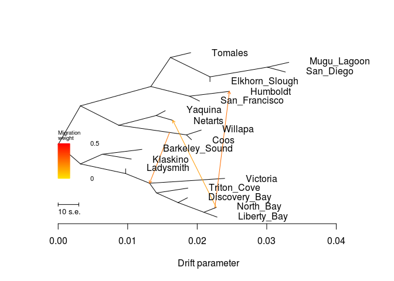

    ##  [1] 0.02058280 0.01205146 0.03317709 0.02395471 0.02285650 0.03268257
    ##  [7] 0.00970499 0.01906826 0.01918084 0.02032764 0.01648980 0.01860579
    ## [13] 0.01052094 0.02183512 0.02273675 0.01540955 0.02462902 0.01866190
    ## [1] 0.003
    ## [1] "mse 0.000296893558641975"

    ## $d
    ##     V1             V2       V3      V4      V5  V6  V7 V8  V9 V10
    ## 1    1        Willapa NOT_ROOT NOT_MIG     TIP 136  NA NA  NA  NA
    ## 2    2           <NA> NOT_ROOT NOT_MIG NOT_TIP 605 536  6 212   4
    ## 3    3 Barkeley_Sound NOT_ROOT NOT_MIG     TIP 304  NA NA  NA  NA
    ## 4    4    Mugu_Lagoon NOT_ROOT NOT_MIG     TIP  52  NA NA  NA  NA
    ## 5   15       Victoria NOT_ROOT NOT_MIG     TIP  32  NA NA  NA  NA
    ## 6   16           <NA> NOT_ROOT NOT_MIG NOT_TIP 605 304  2  76   6
    ## 7   31    Liberty_Bay NOT_ROOT NOT_MIG     TIP 412  NA NA  NA  NA
    ## 8   32           <NA> NOT_ROOT NOT_MIG NOT_TIP  76  15  1 604   4
    ## 9   51      San_Diego NOT_ROOT NOT_MIG     TIP  52  NA NA  NA  NA
    ## 10  52           <NA> NOT_ROOT NOT_MIG NOT_TIP 356   4  1  51   1
    ## 11  75      Ladysmith NOT_ROOT NOT_MIG     TIP  76  NA NA  NA  NA
    ## 12  76           <NA> NOT_ROOT NOT_MIG NOT_TIP  16  75  1  32   5
    ## 13 103        Tomales NOT_ROOT NOT_MIG     TIP 104  NA NA  NA  NA
    ## 14 104           <NA> NOT_ROOT NOT_MIG NOT_TIP 536 103  1 356   3
    ## 15 135           Coos NOT_ROOT NOT_MIG     TIP 136  NA NA  NA  NA
    ## 16 136           <NA> NOT_ROOT NOT_MIG NOT_TIP 212   1  1 135   1
    ## 17 171  San_Francisco NOT_ROOT NOT_MIG     TIP 172  NA NA  NA  NA
    ## 18 172           <NA> NOT_ROOT NOT_MIG NOT_TIP 536 535  1 171   1
    ## 19 211        Netarts NOT_ROOT NOT_MIG     TIP 472  NA NA  NA  NA
    ## 20 212           <NA> NOT_ROOT NOT_MIG NOT_TIP   2 472  2 136   2
    ## 21 255  Discovery_Bay NOT_ROOT NOT_MIG     TIP 256  NA NA  NA  NA
    ## 22 256           <NA> NOT_ROOT NOT_MIG NOT_TIP 604 255  1 412   2
    ## 23 303       Klaskino NOT_ROOT NOT_MIG     TIP 304  NA NA  NA  NA
    ## 24 304           <NA> NOT_ROOT NOT_MIG NOT_TIP  16   3  1 303   1
    ## 25 355 Elkhorn_Slough NOT_ROOT NOT_MIG     TIP 356  NA NA  NA  NA
    ## 26 356           <NA> NOT_ROOT NOT_MIG NOT_TIP 104  52  2 355   1
    ## 27 411      North_Bay NOT_ROOT NOT_MIG     TIP 412  NA NA  NA  NA
    ## 28 412           <NA> NOT_ROOT NOT_MIG NOT_TIP 256 411  1  31   1
    ## 29 471        Yaquina NOT_ROOT NOT_MIG     TIP 472  NA NA  NA  NA
    ## 30 472           <NA> NOT_ROOT NOT_MIG NOT_TIP 212 471  1 211   1
    ## 31 535       Humboldt NOT_ROOT NOT_MIG     TIP 172  NA NA  NA  NA
    ## 32 536           <NA> NOT_ROOT NOT_MIG NOT_TIP   2 104  4 172   2
    ## 33 603    Triton_Cove NOT_ROOT NOT_MIG     TIP 604  NA NA  NA  NA
    ## 34 604           <NA> NOT_ROOT NOT_MIG NOT_TIP  32 603  1 256   3
    ## 35 605           <NA>     ROOT NOT_MIG NOT_TIP 605   2 10  16   8
    ## 36 711           <NA> NOT_ROOT     MIG NOT_TIP 412 411 NA  NA  NA
    ## 37 643           <NA> NOT_ROOT     MIG NOT_TIP 212 136 NA  NA  NA
    ## 38 780           <NA> NOT_ROOT     MIG NOT_TIP 412 411 NA  NA  NA
    ##                                                                                                                                                                                                                                                                                                                                                                                                                                                                                                                                                                                             V11
    ## 1                                                                                                                                                                                                                                                                                                                                                                                                                                                                                                                                                                            Willapa:0.00213291
    ## 2                                                                                                                                                                                                                                                                       (((Tomales:0.00292374,((Mugu_Lagoon:0.00308633,San_Diego:0.00259181):0.00825564,Elkhorn_Slough:0):0.0056906):0.00281442,(Humboldt:0.0105072,San_Francisco:0.00144215):0.00555539):0.0101292,((Yaquina:0.00132331,Netarts:0.00348244):0.00538472,(Willapa:0.00213291,Coos:0.000730948):0.00974837):0.00550062):0.0032009
    ## 3                                                                                                                                                                                                                                                                                                                                                                                                                                                                                                                                                                      Barkeley_Sound:0.0057082
    ## 4                                                                                                                                                                                                                                                                                                                                                                                                                                                                                                                                                                        Mugu_Lagoon:0.00308633
    ## 5                                                                                                                                                                                                                                                                                                                                                                                                                                                                                                                                                                             Victoria:0.010808
    ## 6                                                                                                                                                                                                                                                                                                                             ((Barkeley_Sound:0.0057082,Klaskino:0.00417768):0.00314236,(Ladysmith:0,(Victoria:0.010808,(Triton_Cove:0.00452252,(Discovery_Bay:0.00135973,(North_Bay:0.00178728,Liberty_Bay:0.00190703):0.00370341):0.00310668):0.000992672):0.00604959):0.00650409):0.0032009
    ## 7                                                                                                                                                                                                                                                                                                                                                                                                                                                                                                                                                                        Liberty_Bay:0.00190703
    ## 8                                                                                                                                                                                                                                                                                                                                                                                                                            (Victoria:0.010808,(Triton_Cove:0.00452252,(Discovery_Bay:0.00135973,(North_Bay:0.00178728,Liberty_Bay:0.00190703):0.00370341):0.00310668):0.000992672):0.00604959
    ## 9                                                                                                                                                                                                                                                                                                                                                                                                                                                                                                                                                                          San_Diego:0.00259181
    ## 10                                                                                                                                                                                                                                                                                                                                                                                                                                                                                                                                     (Mugu_Lagoon:0.00308633,San_Diego:0.00259181):0.00825564
    ## 11                                                                                                                                                                                                                                                                                                                                                                                                                                                                                                                                                                                  Ladysmith:0
    ## 12                                                                                                                                                                                                                                                                                                                                                                                                  (Ladysmith:0,(Victoria:0.010808,(Triton_Cove:0.00452252,(Discovery_Bay:0.00135973,(North_Bay:0.00178728,Liberty_Bay:0.00190703):0.00370341):0.00310668):0.000992672):0.00604959):0.00650409
    ## 13                                                                                                                                                                                                                                                                                                                                                                                                                                                                                                                                                                           Tomales:0.00292374
    ## 14                                                                                                                                                                                                                                                                                                                                                                                                                                                                        (Tomales:0.00292374,((Mugu_Lagoon:0.00308633,San_Diego:0.00259181):0.00825564,Elkhorn_Slough:0):0.0056906):0.00281442
    ## 15                                                                                                                                                                                                                                                                                                                                                                                                                                                                                                                                                                             Coos:0.000730948
    ## 16                                                                                                                                                                                                                                                                                                                                                                                                                                                                                                                                             (Willapa:0.00213291,Coos:0.000730948):0.00974837
    ## 17                                                                                                                                                                                                                                                                                                                                                                                                                                                                                                                                                                     San_Francisco:0.00144215
    ## 18                                                                                                                                                                                                                                                                                                                                                                                                                                                                                                                                     (Humboldt:0.0105072,San_Francisco:0.00144215):0.00555539
    ## 19                                                                                                                                                                                                                                                                                                                                                                                                                                                                                                                                                                           Netarts:0.00348244
    ## 20                                                                                                                                                                                                                                                                                                                                                                                                                                                                             ((Yaquina:0.00132331,Netarts:0.00348244):0.00538472,(Willapa:0.00213291,Coos:0.000730948):0.00974837):0.00550062
    ## 21                                                                                                                                                                                                                                                                                                                                                                                                                                                                                                                                                                     Discovery_Bay:0.00135973
    ## 22                                                                                                                                                                                                                                                                                                                                                                                                                                                                                               (Discovery_Bay:0.00135973,(North_Bay:0.00178728,Liberty_Bay:0.00190703):0.00370341):0.00310668
    ## 23                                                                                                                                                                                                                                                                                                                                                                                                                                                                                                                                                                          Klaskino:0.00417768
    ## 24                                                                                                                                                                                                                                                                                                                                                                                                                                                                                                                                    (Barkeley_Sound:0.0057082,Klaskino:0.00417768):0.00314236
    ## 25                                                                                                                                                                                                                                                                                                                                                                                                                                                                                                                                                                             Elkhorn_Slough:0
    ## 26                                                                                                                                                                                                                                                                                                                                                                                                                                                                                                        ((Mugu_Lagoon:0.00308633,San_Diego:0.00259181):0.00825564,Elkhorn_Slough:0):0.0056906
    ## 27                                                                                                                                                                                                                                                                                                                                                                                                                                                                                                                                                                         North_Bay:0.00178728
    ## 28                                                                                                                                                                                                                                                                                                                                                                                                                                                                                                                                     (North_Bay:0.00178728,Liberty_Bay:0.00190703):0.00370341
    ## 29                                                                                                                                                                                                                                                                                                                                                                                                                                                                                                                                                                           Yaquina:0.00132331
    ## 30                                                                                                                                                                                                                                                                                                                                                                                                                                                                                                                                           (Yaquina:0.00132331,Netarts:0.00348244):0.00538472
    ## 31                                                                                                                                                                                                                                                                                                                                                                                                                                                                                                                                                                           Humboldt:0.0105072
    ## 32                                                                                                                                                                                                                                                                                                                                                                                                   ((Tomales:0.00292374,((Mugu_Lagoon:0.00308633,San_Diego:0.00259181):0.00825564,Elkhorn_Slough:0):0.0056906):0.00281442,(Humboldt:0.0105072,San_Francisco:0.00144215):0.00555539):0.0101292
    ## 33                                                                                                                                                                                                                                                                                                                                                                                                                                                                                                                                                                       Triton_Cove:0.00452252
    ## 34                                                                                                                                                                                                                                                                                                                                                                                                                                                          (Triton_Cove:0.00452252,(Discovery_Bay:0.00135973,(North_Bay:0.00178728,Liberty_Bay:0.00190703):0.00370341):0.00310668):0.000992672
    ## 35 ((((Tomales:0.00292374,((Mugu_Lagoon:0.00308633,San_Diego:0.00259181):0.00825564,Elkhorn_Slough:0):0.0056906):0.00281442,(Humboldt:0.0105072,San_Francisco:0.00144215):0.00555539):0.0101292,((Yaquina:0.00132331,Netarts:0.00348244):0.00538472,(Willapa:0.00213291,Coos:0.000730948):0.00974837):0.00550062):0.0032009,((Barkeley_Sound:0.0057082,Klaskino:0.00417768):0.00314236,(Ladysmith:0,(Victoria:0.010808,(Triton_Cove:0.00452252,(Discovery_Bay:0.00135973,(North_Bay:0.00178728,Liberty_Bay:0.00190703):0.00370341):0.00310668):0.000992672):0.00604959):0.00650409):0.0032009);
    ## 36                                                                                                                                                                                                                                                                                                                                                                                                                                                                                                                                                                                         <NA>
    ## 37                                                                                                                                                                                                                                                                                                                                                                                                                                                                                                                                                                                         <NA>
    ## 38                                                                                                                                                                                                                                                                                                                                                                                                                                                                                                                                                                                         <NA>
    ##             x          y       ymin       ymax
    ## 1  0.02058280 0.52777778 0.50000000 0.55555556
    ## 2  0.00320090 0.66666667 0.44444444 1.00000000
    ## 3  0.01205146 0.41666667 0.38888889 0.44444444
    ## 4  0.03317709 0.91666667 0.88888889 0.94444444
    ## 5  0.02395471 0.25000000 0.22222222 0.27777778
    ## 6  0.00320090 0.33333333 0.00000000 0.44444444
    ## 7  0.02285650 0.02777778 0.00000000 0.05555556
    ## 8  0.01314671 0.22222222 0.00000000 0.27777778
    ## 9  0.03268257 0.86111111 0.83333333 0.88888889
    ## 10 0.03009076 0.88888889 0.83333333 0.94444444
    ## 11 0.00970499 0.30555556 0.27777778 0.33333333
    ## 12 0.00970499 0.27777778 0.00000000 0.33333333
    ## 13 0.01906826 0.97222222 0.94444444 1.00000000
    ## 14 0.01614452 0.94444444 0.77777778 1.00000000
    ## 15 0.01918084 0.47222222 0.44444444 0.50000000
    ## 16 0.01844989 0.50000000 0.44444444 0.55555556
    ## 17 0.02032764 0.69444444 0.66666667 0.72222222
    ## 18 0.01888549 0.72222222 0.66666667 0.77777778
    ## 19 0.01648980 0.58333333 0.55555556 0.61111111
    ## 20 0.00870152 0.55555556 0.44444444 0.66666667
    ## 21 0.01860579 0.13888889 0.11111111 0.16666667
    ## 22 0.01724606 0.11111111 0.00000000 0.16666667
    ## 23 0.01052094 0.36111111 0.33333333 0.38888889
    ## 24 0.00634326 0.38888889 0.33333333 0.44444444
    ## 25 0.02183512 0.80555556 0.77777778 0.83333333
    ## 26 0.02183512 0.83333333 0.77777778 0.94444444
    ## 27 0.02273675 0.08333333 0.05555556 0.11111111
    ## 28 0.02094947 0.05555556 0.00000000 0.11111111
    ## 29 0.01540955 0.63888889 0.61111111 0.66666667
    ## 30 0.01408624 0.61111111 0.55555556 0.66666667
    ## 31 0.02462902 0.75000000 0.72222222 0.77777778
    ## 32 0.01333010 0.77777778 0.66666667 1.00000000
    ## 33 0.01866190 0.19444444 0.16666667 0.22222222
    ## 34 0.01413938 0.16666667 0.00000000 0.22222222
    ## 35 0.00000000 0.44444444 0.00000000 1.00000000
    ## 36 0.02253549 0.08020533 0.00000000 0.05555556
    ## 37 0.01602420 0.51382389 0.44444444 0.55555556
    ## 38 0.02273675 0.08333333 0.00000000 0.05555556
    ## 
    ## $e
    ##     V1  V2          V3       V4      V5       V6       V7
    ## 1   32  15 0.010808000 1.000000 NOT_MIG 0.000000 0.568917
    ## 2   52   4 0.003086330 1.000000 NOT_MIG 0.000000 1.000000
    ## 3   52  51 0.002591810 1.000000 NOT_MIG 0.000000 1.000000
    ## 4  104 103 0.002923740 1.000000 NOT_MIG 0.000000 1.000000
    ## 5  136   1 0.002132910 1.000000 NOT_MIG 0.000000 1.000000
    ## 6  256 255 0.001359730 1.000000 NOT_MIG 0.000000 0.568917
    ## 7  104 356 0.005690600 1.000000 NOT_MIG 0.000000 1.000000
    ## 8  356  52 0.008255640 1.000000 NOT_MIG 0.000000 1.000000
    ## 9  356 355 0.000000000 1.000000 NOT_MIG 0.000000 1.000000
    ## 10 472 471 0.001323310 1.000000 NOT_MIG 0.000000 1.000000
    ## 11 604 603 0.004522520 1.000000 NOT_MIG 0.000000 0.568917
    ## 12 605   2 0.003200900 1.000000 NOT_MIG 0.000000 1.000000
    ## 13  16 304 0.003142360 1.000000 NOT_MIG 0.000000 1.000000
    ## 14 605  16 0.003200900 1.000000 NOT_MIG 0.000000 1.000000
    ## 15 304   3 0.005708200 1.000000 NOT_MIG 0.000000 1.000000
    ## 16 304 303 0.004177680 1.000000 NOT_MIG 0.000000 1.000000
    ## 17  76  75 0.000000000 1.000000 NOT_MIG 0.000000 1.000000
    ## 18  76  32 0.003441716 0.754266 NOT_MIG 0.000000 0.568917
    ## 19  16  76 0.006504090 1.000000 NOT_MIG 0.000000 1.000000
    ## 20 536 104 0.002814420 1.000000 NOT_MIG 0.000000 1.000000
    ## 21 536 172 0.005555390 1.000000 NOT_MIG 0.000000 1.000000
    ## 22   2 536 0.010129200 1.000000 NOT_MIG 0.000000 1.000000
    ## 23 172 535 0.005743530 0.739343 NOT_MIG 0.000000 0.546629
    ## 24   2 212 0.005500620 1.000000 NOT_MIG 0.000000 1.000000
    ## 25 172 171 0.001442150 1.000000 NOT_MIG 0.000000 1.000000
    ## 26 604 256 0.003106680 1.000000 NOT_MIG 0.000000 0.568917
    ## 27  32 604 0.000992672 1.000000 NOT_MIG 0.000000 0.568917
    ## 28 212 472 0.005384720 1.000000 NOT_MIG 0.000000 1.000000
    ## 29 472 211 0.002403564 0.830780 NOT_MIG 0.000000 0.690195
    ## 30 256 412 0.003703410 1.000000 NOT_MIG 0.000000 0.568917
    ## 31 711 535 0.000000000 0.260657     MIG 0.887392 0.000000
    ## 32 412 711 0.001586020 1.000000 NOT_MIG 0.000000 0.568917
    ## 33 136 135 0.000730948 1.000000 NOT_MIG 0.000000 1.000000
    ## 34 212 643 0.007322680 1.000000 NOT_MIG 0.000000 1.000000
    ## 35 643 136 0.002425690 1.000000 NOT_MIG 0.751170 1.000000
    ## 36 643  32 0.000000000 0.245734     MIG 0.751170 0.000000
    ## 37 412  31 0.001907030 1.000000 NOT_MIG 0.000000 0.568917
    ## 38 711 780 0.000201261 1.000000 NOT_MIG 0.887392 0.568917
    ## 39 780 411 0.000000000 1.000000 NOT_MIG 1.000000 0.568917
    ## 40 780 211 0.000000000 0.169220     MIG 1.000000 0.000000

Running Treemix on All
======================

``` r
system("treemix -i All/All-m70x62-mac4.pop.TM.gz -o All/All-m70x62-mac4-pop_unrooted > out")
```

``` r
plot_tree("All/All-m70x62-mac4-pop_unrooted")
```

    ## Warning in plot_tree("All/All-m70x62-mac4-pop_unrooted"): NAs introduced by
    ## coercion

    ## Warning in plot_tree("All/All-m70x62-mac4-pop_unrooted"): NAs introduced by
    ## coercion

    ## Warning in plot_tree("All/All-m70x62-mac4-pop_unrooted"): NAs introduced by
    ## coercion

    ## Warning in plot_tree("All/All-m70x62-mac4-pop_unrooted"): NAs introduced by
    ## coercion

    ##     V1             V2       V3      V4      V5  V6  V7 V8  V9 V10
    ## 1    0           <NA>     ROOT NOT_MIG NOT_TIP   0 171  1 676  18
    ## 2    1        Yaquina NOT_ROOT NOT_MIG     TIP  52  NA NA  NA  NA
    ## 3    2           <NA> NOT_ROOT NOT_MIG NOT_TIP  32  76  6   3   1
    ## 4    3       Humboldt NOT_ROOT NOT_MIG     TIP   2  NA NA  NA  NA
    ## 5    4    Conchaphila NOT_ROOT NOT_MIG     TIP 212  NA NA  NA  NA
    ## 6   15           Coos NOT_ROOT NOT_MIG     TIP 256  NA NA  NA  NA
    ## 7   16           <NA> NOT_ROOT NOT_MIG NOT_TIP  32  52  2 256   2
    ## 8   31      Ladysmith NOT_ROOT NOT_MIG     TIP 172  NA NA  NA  NA
    ## 9   32           <NA> NOT_ROOT NOT_MIG NOT_TIP 412  16  4   2   7
    ## 10  51        Netarts NOT_ROOT NOT_MIG     TIP  52  NA NA  NA  NA
    ## 11  52           <NA> NOT_ROOT NOT_MIG NOT_TIP  16   1  1  51   1
    ## 12  75  San_Francisco NOT_ROOT NOT_MIG     TIP  76  NA NA  NA  NA
    ## 13  76           <NA> NOT_ROOT NOT_MIG NOT_TIP   2  75  1 304   5
    ## 14 103      San_Diego NOT_ROOT NOT_MIG     TIP 212  NA NA  NA  NA
    ## 15 104           <NA> NOT_ROOT NOT_MIG NOT_TIP 356 212  2 211   1
    ## 16 135    Triton_Cove NOT_ROOT NOT_MIG     TIP 136  NA NA  NA  NA
    ## 17 136           <NA> NOT_ROOT NOT_MIG NOT_TIP 472 135  1 536  15
    ## 18 171      North_Bay NOT_ROOT NOT_MIG     TIP   0  NA NA  NA  NA
    ## 19 172           <NA> NOT_ROOT NOT_MIG NOT_TIP 536  31  1 412  13
    ## 20 211    Mugu_Lagoon NOT_ROOT NOT_MIG     TIP 104  NA NA  NA  NA
    ## 21 212           <NA> NOT_ROOT NOT_MIG NOT_TIP 104   4  1 103   1
    ## 22 255        Willapa NOT_ROOT NOT_MIG     TIP 256  NA NA  NA  NA
    ## 23 256           <NA> NOT_ROOT NOT_MIG NOT_TIP  16  15  1 255   1
    ## 24 303        Tomales NOT_ROOT NOT_MIG     TIP 304  NA NA  NA  NA
    ## 25 304           <NA> NOT_ROOT NOT_MIG NOT_TIP  76 303  1 356   4
    ## 26 355 Elkhorn_Slough NOT_ROOT NOT_MIG     TIP 356  NA NA  NA  NA
    ## 27 356           <NA> NOT_ROOT NOT_MIG NOT_TIP 304 104  3 355   1
    ## 28 411 Barkeley_Sound NOT_ROOT NOT_MIG     TIP 604  NA NA  NA  NA
    ## 29 412           <NA> NOT_ROOT NOT_MIG NOT_TIP 172  32 11 604   2
    ## 30 471  Discovery_Bay NOT_ROOT NOT_MIG     TIP 472  NA NA  NA  NA
    ## 31 472           <NA> NOT_ROOT NOT_MIG NOT_TIP 676 471  1 136  16
    ## 32 535       Victoria NOT_ROOT NOT_MIG     TIP 536  NA NA  NA  NA
    ## 33 536           <NA> NOT_ROOT NOT_MIG NOT_TIP 136 535  1 172  14
    ## 34 603       Klaskino NOT_ROOT NOT_MIG     TIP 604  NA NA  NA  NA
    ## 35 604           <NA> NOT_ROOT NOT_MIG NOT_TIP 412 411  1 603   1
    ## 36 675    Liberty_Bay NOT_ROOT NOT_MIG     TIP 676  NA NA  NA  NA
    ## 37 676           <NA> NOT_ROOT NOT_MIG NOT_TIP   0 472 17 675   1
    ##                                                                                                                                                                                                                                                                                                                                                                                                                                                                                                                                                                                                                               V11
    ## 1  (North_Bay:0.000306617,((Discovery_Bay:0.00156757,(Triton_Cove:0.00318895,(Victoria:0.00769711,(Ladysmith:0.00186291,((((Yaquina:0.00194383,Netarts:0.000451501):0.00299172,(Coos:0.00021652,Willapa:0.00149929):0.00661549):0.00231981,((San_Francisco:0.0034923,(Tomales:0.00158152,(((Conchaphila:0.0892213,San_Diego:0):0.0014083,Mugu_Lagoon:0):0.00786692,Elkhorn_Slough:0):0.00485055):0.00163701):0.00377004,Humboldt:0.00323072):0.00452481):0.00186913,(Barkeley_Sound:0.00335596,Klaskino:0.00265187):0.00393861):0.00254105):0.000573406):0.000550866):0.00203613):0.00167765,Liberty_Bay:0.0020307):0.000306617);
    ## 2                                                                                                                                                                                                                                                                                                                                                                                                                                                                                                                                                                                                              Yaquina:0.00194383
    ## 3                                                                                                                                                                                                                                                                                                                                                                                                                    ((San_Francisco:0.0034923,(Tomales:0.00158152,(((Conchaphila:0.0892213,San_Diego:0):0.0014083,Mugu_Lagoon:0):0.00786692,Elkhorn_Slough:0):0.00485055):0.00163701):0.00377004,Humboldt:0.00323072):0.00452481
    ## 4                                                                                                                                                                                                                                                                                                                                                                                                                                                                                                                                                                                                             Humboldt:0.00323072
    ## 5                                                                                                                                                                                                                                                                                                                                                                                                                                                                                                                                                                                                           Conchaphila:0.0892213
    ## 6                                                                                                                                                                                                                                                                                                                                                                                                                                                                                                                                                                                                                 Coos:0.00021652
    ## 7                                                                                                                                                                                                                                                                                                                                                                                                                                                                                                                ((Yaquina:0.00194383,Netarts:0.000451501):0.00299172,(Coos:0.00021652,Willapa:0.00149929):0.00661549):0.00231981
    ## 8                                                                                                                                                                                                                                                                                                                                                                                                                                                                                                                                                                                                            Ladysmith:0.00186291
    ## 9                                                                                                                                                                                                                                                                                      (((Yaquina:0.00194383,Netarts:0.000451501):0.00299172,(Coos:0.00021652,Willapa:0.00149929):0.00661549):0.00231981,((San_Francisco:0.0034923,(Tomales:0.00158152,(((Conchaphila:0.0892213,San_Diego:0):0.0014083,Mugu_Lagoon:0):0.00786692,Elkhorn_Slough:0):0.00485055):0.00163701):0.00377004,Humboldt:0.00323072):0.00452481):0.00186913
    ## 10                                                                                                                                                                                                                                                                                                                                                                                                                                                                                                                                                                                                            Netarts:0.000451501
    ## 11                                                                                                                                                                                                                                                                                                                                                                                                                                                                                                                                                                            (Yaquina:0.00194383,Netarts:0.000451501):0.00299172
    ## 12                                                                                                                                                                                                                                                                                                                                                                                                                                                                                                                                                                                                        San_Francisco:0.0034923
    ## 13                                                                                                                                                                                                                                                                                                                                                                                                                                                    (San_Francisco:0.0034923,(Tomales:0.00158152,(((Conchaphila:0.0892213,San_Diego:0):0.0014083,Mugu_Lagoon:0):0.00786692,Elkhorn_Slough:0):0.00485055):0.00163701):0.00377004
    ## 14                                                                                                                                                                                                                                                                                                                                                                                                                                                                                                                                                                                                                    San_Diego:0
    ## 15                                                                                                                                                                                                                                                                                                                                                                                                                                                                                                                                                       ((Conchaphila:0.0892213,San_Diego:0):0.0014083,Mugu_Lagoon:0):0.00786692
    ## 16                                                                                                                                                                                                                                                                                                                                                                                                                                                                                                                                                                                                         Triton_Cove:0.00318895
    ## 17                                                                                                    (Triton_Cove:0.00318895,(Victoria:0.00769711,(Ladysmith:0.00186291,((((Yaquina:0.00194383,Netarts:0.000451501):0.00299172,(Coos:0.00021652,Willapa:0.00149929):0.00661549):0.00231981,((San_Francisco:0.0034923,(Tomales:0.00158152,(((Conchaphila:0.0892213,San_Diego:0):0.0014083,Mugu_Lagoon:0):0.00786692,Elkhorn_Slough:0):0.00485055):0.00163701):0.00377004,Humboldt:0.00323072):0.00452481):0.00186913,(Barkeley_Sound:0.00335596,Klaskino:0.00265187):0.00393861):0.00254105):0.000573406):0.000550866):0.00203613
    ## 18                                                                                                                                                                                                                                                                                                                                                                                                                                                                                                                                                                                                          North_Bay:0.000306617
    ## 19                                                                                                                                                                          (Ladysmith:0.00186291,((((Yaquina:0.00194383,Netarts:0.000451501):0.00299172,(Coos:0.00021652,Willapa:0.00149929):0.00661549):0.00231981,((San_Francisco:0.0034923,(Tomales:0.00158152,(((Conchaphila:0.0892213,San_Diego:0):0.0014083,Mugu_Lagoon:0):0.00786692,Elkhorn_Slough:0):0.00485055):0.00163701):0.00377004,Humboldt:0.00323072):0.00452481):0.00186913,(Barkeley_Sound:0.00335596,Klaskino:0.00265187):0.00393861):0.00254105):0.000573406
    ## 20                                                                                                                                                                                                                                                                                                                                                                                                                                                                                                                                                                                                                  Mugu_Lagoon:0
    ## 21                                                                                                                                                                                                                                                                                                                                                                                                                                                                                                                                                                                  (Conchaphila:0.0892213,San_Diego:0):0.0014083
    ## 22                                                                                                                                                                                                                                                                                                                                                                                                                                                                                                                                                                                                             Willapa:0.00149929
    ## 23                                                                                                                                                                                                                                                                                                                                                                                                                                                                                                                                                                                (Coos:0.00021652,Willapa:0.00149929):0.00661549
    ## 24                                                                                                                                                                                                                                                                                                                                                                                                                                                                                                                                                                                                             Tomales:0.00158152
    ## 25                                                                                                                                                                                                                                                                                                                                                                                                                                                                                         (Tomales:0.00158152,(((Conchaphila:0.0892213,San_Diego:0):0.0014083,Mugu_Lagoon:0):0.00786692,Elkhorn_Slough:0):0.00485055):0.00163701
    ## 26                                                                                                                                                                                                                                                                                                                                                                                                                                                                                                                                                                                                               Elkhorn_Slough:0
    ## 27                                                                                                                                                                                                                                                                                                                                                                                                                                                                                                                         (((Conchaphila:0.0892213,San_Diego:0):0.0014083,Mugu_Lagoon:0):0.00786692,Elkhorn_Slough:0):0.00485055
    ## 28                                                                                                                                                                                                                                                                                                                                                                                                                                                                                                                                                                                                      Barkeley_Sound:0.00335596
    ## 29                                                                                                                                                                                                             ((((Yaquina:0.00194383,Netarts:0.000451501):0.00299172,(Coos:0.00021652,Willapa:0.00149929):0.00661549):0.00231981,((San_Francisco:0.0034923,(Tomales:0.00158152,(((Conchaphila:0.0892213,San_Diego:0):0.0014083,Mugu_Lagoon:0):0.00786692,Elkhorn_Slough:0):0.00485055):0.00163701):0.00377004,Humboldt:0.00323072):0.00452481):0.00186913,(Barkeley_Sound:0.00335596,Klaskino:0.00265187):0.00393861):0.00254105
    ## 30                                                                                                                                                                                                                                                                                                                                                                                                                                                                                                                                                                                                       Discovery_Bay:0.00156757
    ## 31                                                              (Discovery_Bay:0.00156757,(Triton_Cove:0.00318895,(Victoria:0.00769711,(Ladysmith:0.00186291,((((Yaquina:0.00194383,Netarts:0.000451501):0.00299172,(Coos:0.00021652,Willapa:0.00149929):0.00661549):0.00231981,((San_Francisco:0.0034923,(Tomales:0.00158152,(((Conchaphila:0.0892213,San_Diego:0):0.0014083,Mugu_Lagoon:0):0.00786692,Elkhorn_Slough:0):0.00485055):0.00163701):0.00377004,Humboldt:0.00323072):0.00452481):0.00186913,(Barkeley_Sound:0.00335596,Klaskino:0.00265187):0.00393861):0.00254105):0.000573406):0.000550866):0.00203613):0.00167765
    ## 32                                                                                                                                                                                                                                                                                                                                                                                                                                                                                                                                                                                                            Victoria:0.00769711
    ## 33                                                                                                                                        (Victoria:0.00769711,(Ladysmith:0.00186291,((((Yaquina:0.00194383,Netarts:0.000451501):0.00299172,(Coos:0.00021652,Willapa:0.00149929):0.00661549):0.00231981,((San_Francisco:0.0034923,(Tomales:0.00158152,(((Conchaphila:0.0892213,San_Diego:0):0.0014083,Mugu_Lagoon:0):0.00786692,Elkhorn_Slough:0):0.00485055):0.00163701):0.00377004,Humboldt:0.00323072):0.00452481):0.00186913,(Barkeley_Sound:0.00335596,Klaskino:0.00265187):0.00393861):0.00254105):0.000573406):0.000550866
    ## 34                                                                                                                                                                                                                                                                                                                                                                                                                                                                                                                                                                                                            Klaskino:0.00265187
    ## 35                                                                                                                                                                                                                                                                                                                                                                                                                                                                                                                                                                     (Barkeley_Sound:0.00335596,Klaskino:0.00265187):0.00393861
    ## 36                                                                                                                                                                                                                                                                                                                                                                                                                                                                                                                                                                                                          Liberty_Bay:0.0020307
    ## 37                          ((Discovery_Bay:0.00156757,(Triton_Cove:0.00318895,(Victoria:0.00769711,(Ladysmith:0.00186291,((((Yaquina:0.00194383,Netarts:0.000451501):0.00299172,(Coos:0.00021652,Willapa:0.00149929):0.00661549):0.00231981,((San_Francisco:0.0034923,(Tomales:0.00158152,(((Conchaphila:0.0892213,San_Diego:0):0.0014083,Mugu_Lagoon:0):0.00786692,Elkhorn_Slough:0):0.00485055):0.00163701):0.00377004,Humboldt:0.00323072):0.00452481):0.00186913,(Barkeley_Sound:0.00335596,Klaskino:0.00265187):0.00393861):0.00254105):0.000573406):0.000550866):0.00203613):0.00167765,Liberty_Bay:0.0020307):0.000306617
    ##              x          y       ymin       ymax
    ## 1  0.000000000 0.94736842 0.00000000 1.00000000
    ## 2  0.016810209 0.71052632 0.68421053 0.73684211
    ## 3  0.014079659 0.21052632 0.15789474 0.52631579
    ## 4  0.017310379 0.18421053 0.15789474 0.21052632
    ## 5  0.122833779 0.39473684 0.36842105 0.42105263
    ## 6  0.018706669 0.60526316 0.57894737 0.63157895
    ## 7  0.011874659 0.63157895 0.52631579 0.73684211
    ## 8  0.007007579 0.76315789 0.73684211 0.78947368
    ## 9  0.009554849 0.52631579 0.15789474 0.73684211
    ## 10 0.015317880 0.65789474 0.63157895 0.68421053
    ## 11 0.014866379 0.68421053 0.63157895 0.73684211
    ## 12 0.021341999 0.50000000 0.47368421 0.52631579
    ## 13 0.017849699 0.47368421 0.21052632 0.52631579
    ## 14 0.033612479 0.34210526 0.31578947 0.36842105
    ## 15 0.032204179 0.31578947 0.26315789 0.42105263
    ## 16 0.007209347 0.86842105 0.84210526 0.89473684
    ## 17 0.004020397 0.84210526 0.05263158 0.89473684
    ## 18 0.000306617 0.97368421 0.94736842 1.00000000
    ## 19 0.005144669 0.73684211 0.05263158 0.78947368
    ## 20 0.032204179 0.28947368 0.26315789 0.31578947
    ## 21 0.033612479 0.36842105 0.31578947 0.42105263
    ## 22 0.019989439 0.55263158 0.52631579 0.57894737
    ## 23 0.018490149 0.57894737 0.52631579 0.63157895
    ## 24 0.021068229 0.44736842 0.42105263 0.47368421
    ## 25 0.019486709 0.42105263 0.21052632 0.47368421
    ## 26 0.024337259 0.23684211 0.21052632 0.26315789
    ## 27 0.024337259 0.26315789 0.21052632 0.42105263
    ## 28 0.014980289 0.13157895 0.10526316 0.15789474
    ## 29 0.007685719 0.15789474 0.05263158 0.73684211
    ## 30 0.003551837 0.92105263 0.89473684 0.94736842
    ## 31 0.001984267 0.89473684 0.05263158 0.94736842
    ## 32 0.012268373 0.81578947 0.78947368 0.84210526
    ## 33 0.004571263 0.78947368 0.05263158 0.84210526
    ## 34 0.014276199 0.07894737 0.05263158 0.10526316
    ## 35 0.011624329 0.10526316 0.05263158 0.15789474
    ## 36 0.002337317 0.02631579 0.00000000 0.05263158
    ## 37 0.000306617 0.05263158 0.00000000 0.94736842

    ## Warning in max(e[e[, 5] == "MIG", 4]): no non-missing arguments to max;
    ## returning -Inf

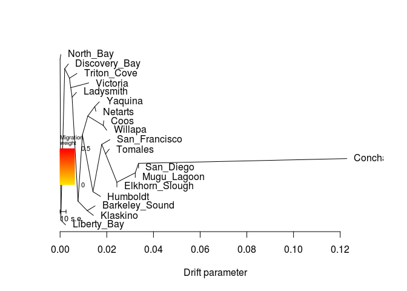

    ##  [1] 0.016810209 0.017310379 0.122833779 0.018706669 0.007007579
    ##  [6] 0.015317880 0.021341999 0.033612479 0.007209347 0.000306617
    ## [11] 0.032204179 0.019989439 0.021068229 0.024337259 0.014980289
    ## [16] 0.003551837 0.012268373 0.014276199 0.002337317
    ## [1] 0.003
    ## [1] "mse 0.000256445290858726"

    ## $d
    ##     V1             V2       V3      V4      V5  V6  V7 V8  V9 V10
    ## 1    0           <NA>     ROOT NOT_MIG NOT_TIP   0 171  1 676  18
    ## 2    1        Yaquina NOT_ROOT NOT_MIG     TIP  52  NA NA  NA  NA
    ## 3    2           <NA> NOT_ROOT NOT_MIG NOT_TIP  32  76  6   3   1
    ## 4    3       Humboldt NOT_ROOT NOT_MIG     TIP   2  NA NA  NA  NA
    ## 5    4    Conchaphila NOT_ROOT NOT_MIG     TIP 212  NA NA  NA  NA
    ## 6   15           Coos NOT_ROOT NOT_MIG     TIP 256  NA NA  NA  NA
    ## 7   16           <NA> NOT_ROOT NOT_MIG NOT_TIP  32  52  2 256   2
    ## 8   31      Ladysmith NOT_ROOT NOT_MIG     TIP 172  NA NA  NA  NA
    ## 9   32           <NA> NOT_ROOT NOT_MIG NOT_TIP 412  16  4   2   7
    ## 10  51        Netarts NOT_ROOT NOT_MIG     TIP  52  NA NA  NA  NA
    ## 11  52           <NA> NOT_ROOT NOT_MIG NOT_TIP  16   1  1  51   1
    ## 12  75  San_Francisco NOT_ROOT NOT_MIG     TIP  76  NA NA  NA  NA
    ## 13  76           <NA> NOT_ROOT NOT_MIG NOT_TIP   2  75  1 304   5
    ## 14 103      San_Diego NOT_ROOT NOT_MIG     TIP 212  NA NA  NA  NA
    ## 15 104           <NA> NOT_ROOT NOT_MIG NOT_TIP 356 212  2 211   1
    ## 16 135    Triton_Cove NOT_ROOT NOT_MIG     TIP 136  NA NA  NA  NA
    ## 17 136           <NA> NOT_ROOT NOT_MIG NOT_TIP 472 135  1 536  15
    ## 18 171      North_Bay NOT_ROOT NOT_MIG     TIP   0  NA NA  NA  NA
    ## 19 172           <NA> NOT_ROOT NOT_MIG NOT_TIP 536  31  1 412  13
    ## 20 211    Mugu_Lagoon NOT_ROOT NOT_MIG     TIP 104  NA NA  NA  NA
    ## 21 212           <NA> NOT_ROOT NOT_MIG NOT_TIP 104   4  1 103   1
    ## 22 255        Willapa NOT_ROOT NOT_MIG     TIP 256  NA NA  NA  NA
    ## 23 256           <NA> NOT_ROOT NOT_MIG NOT_TIP  16  15  1 255   1
    ## 24 303        Tomales NOT_ROOT NOT_MIG     TIP 304  NA NA  NA  NA
    ## 25 304           <NA> NOT_ROOT NOT_MIG NOT_TIP  76 303  1 356   4
    ## 26 355 Elkhorn_Slough NOT_ROOT NOT_MIG     TIP 356  NA NA  NA  NA
    ## 27 356           <NA> NOT_ROOT NOT_MIG NOT_TIP 304 104  3 355   1
    ## 28 411 Barkeley_Sound NOT_ROOT NOT_MIG     TIP 604  NA NA  NA  NA
    ## 29 412           <NA> NOT_ROOT NOT_MIG NOT_TIP 172  32 11 604   2
    ## 30 471  Discovery_Bay NOT_ROOT NOT_MIG     TIP 472  NA NA  NA  NA
    ## 31 472           <NA> NOT_ROOT NOT_MIG NOT_TIP 676 471  1 136  16
    ## 32 535       Victoria NOT_ROOT NOT_MIG     TIP 536  NA NA  NA  NA
    ## 33 536           <NA> NOT_ROOT NOT_MIG NOT_TIP 136 535  1 172  14
    ## 34 603       Klaskino NOT_ROOT NOT_MIG     TIP 604  NA NA  NA  NA
    ## 35 604           <NA> NOT_ROOT NOT_MIG NOT_TIP 412 411  1 603   1
    ## 36 675    Liberty_Bay NOT_ROOT NOT_MIG     TIP 676  NA NA  NA  NA
    ## 37 676           <NA> NOT_ROOT NOT_MIG NOT_TIP   0 472 17 675   1
    ##                                                                                                                                                                                                                                                                                                                                                                                                                                                                                                                                                                                                                               V11
    ## 1  (North_Bay:0.000306617,((Discovery_Bay:0.00156757,(Triton_Cove:0.00318895,(Victoria:0.00769711,(Ladysmith:0.00186291,((((Yaquina:0.00194383,Netarts:0.000451501):0.00299172,(Coos:0.00021652,Willapa:0.00149929):0.00661549):0.00231981,((San_Francisco:0.0034923,(Tomales:0.00158152,(((Conchaphila:0.0892213,San_Diego:0):0.0014083,Mugu_Lagoon:0):0.00786692,Elkhorn_Slough:0):0.00485055):0.00163701):0.00377004,Humboldt:0.00323072):0.00452481):0.00186913,(Barkeley_Sound:0.00335596,Klaskino:0.00265187):0.00393861):0.00254105):0.000573406):0.000550866):0.00203613):0.00167765,Liberty_Bay:0.0020307):0.000306617);
    ## 2                                                                                                                                                                                                                                                                                                                                                                                                                                                                                                                                                                                                              Yaquina:0.00194383
    ## 3                                                                                                                                                                                                                                                                                                                                                                                                                    ((San_Francisco:0.0034923,(Tomales:0.00158152,(((Conchaphila:0.0892213,San_Diego:0):0.0014083,Mugu_Lagoon:0):0.00786692,Elkhorn_Slough:0):0.00485055):0.00163701):0.00377004,Humboldt:0.00323072):0.00452481
    ## 4                                                                                                                                                                                                                                                                                                                                                                                                                                                                                                                                                                                                             Humboldt:0.00323072
    ## 5                                                                                                                                                                                                                                                                                                                                                                                                                                                                                                                                                                                                           Conchaphila:0.0892213
    ## 6                                                                                                                                                                                                                                                                                                                                                                                                                                                                                                                                                                                                                 Coos:0.00021652
    ## 7                                                                                                                                                                                                                                                                                                                                                                                                                                                                                                                ((Yaquina:0.00194383,Netarts:0.000451501):0.00299172,(Coos:0.00021652,Willapa:0.00149929):0.00661549):0.00231981
    ## 8                                                                                                                                                                                                                                                                                                                                                                                                                                                                                                                                                                                                            Ladysmith:0.00186291
    ## 9                                                                                                                                                                                                                                                                                      (((Yaquina:0.00194383,Netarts:0.000451501):0.00299172,(Coos:0.00021652,Willapa:0.00149929):0.00661549):0.00231981,((San_Francisco:0.0034923,(Tomales:0.00158152,(((Conchaphila:0.0892213,San_Diego:0):0.0014083,Mugu_Lagoon:0):0.00786692,Elkhorn_Slough:0):0.00485055):0.00163701):0.00377004,Humboldt:0.00323072):0.00452481):0.00186913
    ## 10                                                                                                                                                                                                                                                                                                                                                                                                                                                                                                                                                                                                            Netarts:0.000451501
    ## 11                                                                                                                                                                                                                                                                                                                                                                                                                                                                                                                                                                            (Yaquina:0.00194383,Netarts:0.000451501):0.00299172
    ## 12                                                                                                                                                                                                                                                                                                                                                                                                                                                                                                                                                                                                        San_Francisco:0.0034923
    ## 13                                                                                                                                                                                                                                                                                                                                                                                                                                                    (San_Francisco:0.0034923,(Tomales:0.00158152,(((Conchaphila:0.0892213,San_Diego:0):0.0014083,Mugu_Lagoon:0):0.00786692,Elkhorn_Slough:0):0.00485055):0.00163701):0.00377004
    ## 14                                                                                                                                                                                                                                                                                                                                                                                                                                                                                                                                                                                                                    San_Diego:0
    ## 15                                                                                                                                                                                                                                                                                                                                                                                                                                                                                                                                                       ((Conchaphila:0.0892213,San_Diego:0):0.0014083,Mugu_Lagoon:0):0.00786692
    ## 16                                                                                                                                                                                                                                                                                                                                                                                                                                                                                                                                                                                                         Triton_Cove:0.00318895
    ## 17                                                                                                    (Triton_Cove:0.00318895,(Victoria:0.00769711,(Ladysmith:0.00186291,((((Yaquina:0.00194383,Netarts:0.000451501):0.00299172,(Coos:0.00021652,Willapa:0.00149929):0.00661549):0.00231981,((San_Francisco:0.0034923,(Tomales:0.00158152,(((Conchaphila:0.0892213,San_Diego:0):0.0014083,Mugu_Lagoon:0):0.00786692,Elkhorn_Slough:0):0.00485055):0.00163701):0.00377004,Humboldt:0.00323072):0.00452481):0.00186913,(Barkeley_Sound:0.00335596,Klaskino:0.00265187):0.00393861):0.00254105):0.000573406):0.000550866):0.00203613
    ## 18                                                                                                                                                                                                                                                                                                                                                                                                                                                                                                                                                                                                          North_Bay:0.000306617
    ## 19                                                                                                                                                                          (Ladysmith:0.00186291,((((Yaquina:0.00194383,Netarts:0.000451501):0.00299172,(Coos:0.00021652,Willapa:0.00149929):0.00661549):0.00231981,((San_Francisco:0.0034923,(Tomales:0.00158152,(((Conchaphila:0.0892213,San_Diego:0):0.0014083,Mugu_Lagoon:0):0.00786692,Elkhorn_Slough:0):0.00485055):0.00163701):0.00377004,Humboldt:0.00323072):0.00452481):0.00186913,(Barkeley_Sound:0.00335596,Klaskino:0.00265187):0.00393861):0.00254105):0.000573406
    ## 20                                                                                                                                                                                                                                                                                                                                                                                                                                                                                                                                                                                                                  Mugu_Lagoon:0
    ## 21                                                                                                                                                                                                                                                                                                                                                                                                                                                                                                                                                                                  (Conchaphila:0.0892213,San_Diego:0):0.0014083
    ## 22                                                                                                                                                                                                                                                                                                                                                                                                                                                                                                                                                                                                             Willapa:0.00149929
    ## 23                                                                                                                                                                                                                                                                                                                                                                                                                                                                                                                                                                                (Coos:0.00021652,Willapa:0.00149929):0.00661549
    ## 24                                                                                                                                                                                                                                                                                                                                                                                                                                                                                                                                                                                                             Tomales:0.00158152
    ## 25                                                                                                                                                                                                                                                                                                                                                                                                                                                                                         (Tomales:0.00158152,(((Conchaphila:0.0892213,San_Diego:0):0.0014083,Mugu_Lagoon:0):0.00786692,Elkhorn_Slough:0):0.00485055):0.00163701
    ## 26                                                                                                                                                                                                                                                                                                                                                                                                                                                                                                                                                                                                               Elkhorn_Slough:0
    ## 27                                                                                                                                                                                                                                                                                                                                                                                                                                                                                                                         (((Conchaphila:0.0892213,San_Diego:0):0.0014083,Mugu_Lagoon:0):0.00786692,Elkhorn_Slough:0):0.00485055
    ## 28                                                                                                                                                                                                                                                                                                                                                                                                                                                                                                                                                                                                      Barkeley_Sound:0.00335596
    ## 29                                                                                                                                                                                                             ((((Yaquina:0.00194383,Netarts:0.000451501):0.00299172,(Coos:0.00021652,Willapa:0.00149929):0.00661549):0.00231981,((San_Francisco:0.0034923,(Tomales:0.00158152,(((Conchaphila:0.0892213,San_Diego:0):0.0014083,Mugu_Lagoon:0):0.00786692,Elkhorn_Slough:0):0.00485055):0.00163701):0.00377004,Humboldt:0.00323072):0.00452481):0.00186913,(Barkeley_Sound:0.00335596,Klaskino:0.00265187):0.00393861):0.00254105
    ## 30                                                                                                                                                                                                                                                                                                                                                                                                                                                                                                                                                                                                       Discovery_Bay:0.00156757
    ## 31                                                              (Discovery_Bay:0.00156757,(Triton_Cove:0.00318895,(Victoria:0.00769711,(Ladysmith:0.00186291,((((Yaquina:0.00194383,Netarts:0.000451501):0.00299172,(Coos:0.00021652,Willapa:0.00149929):0.00661549):0.00231981,((San_Francisco:0.0034923,(Tomales:0.00158152,(((Conchaphila:0.0892213,San_Diego:0):0.0014083,Mugu_Lagoon:0):0.00786692,Elkhorn_Slough:0):0.00485055):0.00163701):0.00377004,Humboldt:0.00323072):0.00452481):0.00186913,(Barkeley_Sound:0.00335596,Klaskino:0.00265187):0.00393861):0.00254105):0.000573406):0.000550866):0.00203613):0.00167765
    ## 32                                                                                                                                                                                                                                                                                                                                                                                                                                                                                                                                                                                                            Victoria:0.00769711
    ## 33                                                                                                                                        (Victoria:0.00769711,(Ladysmith:0.00186291,((((Yaquina:0.00194383,Netarts:0.000451501):0.00299172,(Coos:0.00021652,Willapa:0.00149929):0.00661549):0.00231981,((San_Francisco:0.0034923,(Tomales:0.00158152,(((Conchaphila:0.0892213,San_Diego:0):0.0014083,Mugu_Lagoon:0):0.00786692,Elkhorn_Slough:0):0.00485055):0.00163701):0.00377004,Humboldt:0.00323072):0.00452481):0.00186913,(Barkeley_Sound:0.00335596,Klaskino:0.00265187):0.00393861):0.00254105):0.000573406):0.000550866
    ## 34                                                                                                                                                                                                                                                                                                                                                                                                                                                                                                                                                                                                            Klaskino:0.00265187
    ## 35                                                                                                                                                                                                                                                                                                                                                                                                                                                                                                                                                                     (Barkeley_Sound:0.00335596,Klaskino:0.00265187):0.00393861
    ## 36                                                                                                                                                                                                                                                                                                                                                                                                                                                                                                                                                                                                          Liberty_Bay:0.0020307
    ## 37                          ((Discovery_Bay:0.00156757,(Triton_Cove:0.00318895,(Victoria:0.00769711,(Ladysmith:0.00186291,((((Yaquina:0.00194383,Netarts:0.000451501):0.00299172,(Coos:0.00021652,Willapa:0.00149929):0.00661549):0.00231981,((San_Francisco:0.0034923,(Tomales:0.00158152,(((Conchaphila:0.0892213,San_Diego:0):0.0014083,Mugu_Lagoon:0):0.00786692,Elkhorn_Slough:0):0.00485055):0.00163701):0.00377004,Humboldt:0.00323072):0.00452481):0.00186913,(Barkeley_Sound:0.00335596,Klaskino:0.00265187):0.00393861):0.00254105):0.000573406):0.000550866):0.00203613):0.00167765,Liberty_Bay:0.0020307):0.000306617
    ##              x          y       ymin       ymax
    ## 1  0.000000000 0.94736842 0.00000000 1.00000000
    ## 2  0.016810209 0.71052632 0.68421053 0.73684211
    ## 3  0.014079659 0.21052632 0.15789474 0.52631579
    ## 4  0.017310379 0.18421053 0.15789474 0.21052632
    ## 5  0.122833779 0.39473684 0.36842105 0.42105263
    ## 6  0.018706669 0.60526316 0.57894737 0.63157895
    ## 7  0.011874659 0.63157895 0.52631579 0.73684211
    ## 8  0.007007579 0.76315789 0.73684211 0.78947368
    ## 9  0.009554849 0.52631579 0.15789474 0.73684211
    ## 10 0.015317880 0.65789474 0.63157895 0.68421053
    ## 11 0.014866379 0.68421053 0.63157895 0.73684211
    ## 12 0.021341999 0.50000000 0.47368421 0.52631579
    ## 13 0.017849699 0.47368421 0.21052632 0.52631579
    ## 14 0.033612479 0.34210526 0.31578947 0.36842105
    ## 15 0.032204179 0.31578947 0.26315789 0.42105263
    ## 16 0.007209347 0.86842105 0.84210526 0.89473684
    ## 17 0.004020397 0.84210526 0.05263158 0.89473684
    ## 18 0.000306617 0.97368421 0.94736842 1.00000000
    ## 19 0.005144669 0.73684211 0.05263158 0.78947368
    ## 20 0.032204179 0.28947368 0.26315789 0.31578947
    ## 21 0.033612479 0.36842105 0.31578947 0.42105263
    ## 22 0.019989439 0.55263158 0.52631579 0.57894737
    ## 23 0.018490149 0.57894737 0.52631579 0.63157895
    ## 24 0.021068229 0.44736842 0.42105263 0.47368421
    ## 25 0.019486709 0.42105263 0.21052632 0.47368421
    ## 26 0.024337259 0.23684211 0.21052632 0.26315789
    ## 27 0.024337259 0.26315789 0.21052632 0.42105263
    ## 28 0.014980289 0.13157895 0.10526316 0.15789474
    ## 29 0.007685719 0.15789474 0.05263158 0.73684211
    ## 30 0.003551837 0.92105263 0.89473684 0.94736842
    ## 31 0.001984267 0.89473684 0.05263158 0.94736842
    ## 32 0.012268373 0.81578947 0.78947368 0.84210526
    ## 33 0.004571263 0.78947368 0.05263158 0.84210526
    ## 34 0.014276199 0.07894737 0.05263158 0.10526316
    ## 35 0.011624329 0.10526316 0.05263158 0.15789474
    ## 36 0.002337317 0.02631579 0.00000000 0.05263158
    ## 37 0.000306617 0.05263158 0.00000000 0.94736842
    ## 
    ## $e
    ##     V1  V2          V3 V4      V5 V6 V7
    ## 1   32  16 0.002319810  1 NOT_MIG  0  1
    ## 2   16  52 0.002991720  1 NOT_MIG  0  1
    ## 3   52   1 0.001943830  1 NOT_MIG  0  1
    ## 4   52  51 0.000451501  1 NOT_MIG  0  1
    ## 5    2  76 0.003770040  1 NOT_MIG  0  1
    ## 6   76  75 0.003492300  1 NOT_MIG  0  1
    ## 7    2   3 0.003230720  1 NOT_MIG  0  1
    ## 8  104 212 0.001408300  1 NOT_MIG  0  1
    ## 9  212   4 0.089221300  1 NOT_MIG  0  1
    ## 10  32   2 0.004524810  1 NOT_MIG  0  1
    ## 11  16 256 0.006615490  1 NOT_MIG  0  1
    ## 12 256  15 0.000216520  1 NOT_MIG  0  1
    ## 13 256 255 0.001499290  1 NOT_MIG  0  1
    ## 14  76 304 0.001637010  1 NOT_MIG  0  1
    ## 15 304 303 0.001581520  1 NOT_MIG  0  1
    ## 16 212 103 0.000000000  1 NOT_MIG  0  1
    ## 17 104 211 0.000000000  1 NOT_MIG  0  1
    ## 18 304 356 0.004850550  1 NOT_MIG  0  1
    ## 19 356 104 0.007866920  1 NOT_MIG  0  1
    ## 20 356 355 0.000000000  1 NOT_MIG  0  1
    ## 21 412  32 0.001869130  1 NOT_MIG  0  1
    ## 22 472 471 0.001567570  1 NOT_MIG  0  1
    ## 23 136 135 0.003188950  1 NOT_MIG  0  1
    ## 24 172  31 0.001862910  1 NOT_MIG  0  1
    ## 25 536 535 0.007697110  1 NOT_MIG  0  1
    ## 26 412 604 0.003938610  1 NOT_MIG  0  1
    ## 27 604 411 0.003355960  1 NOT_MIG  0  1
    ## 28 604 603 0.002651870  1 NOT_MIG  0  1
    ## 29 172 412 0.002541050  1 NOT_MIG  0  1
    ## 30 536 172 0.000573406  1 NOT_MIG  0  1
    ## 31 136 536 0.000550866  1 NOT_MIG  0  1
    ## 32 472 136 0.002036130  1 NOT_MIG  0  1
    ## 33   0 171 0.000306617  1 NOT_MIG  0  1
    ## 34   0 676 0.000306617  1 NOT_MIG  0  1
    ## 35 676 472 0.001677650  1 NOT_MIG  0  1
    ## 36 676 675 0.002030700  1 NOT_MIG  0  1

``` r
plot_resid("All/All-m70x62-mac4-pop_unrooted","TMorder.All")
```

    ## [1] 0.0002564453
    ## [1] "here"

    ## Warning in xy.coords(x, y, xlabel, ylabel, log): NAs introduced by coercion

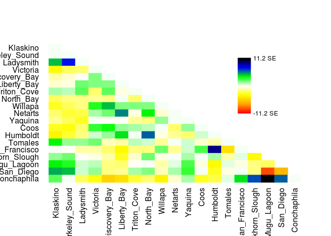

    ## [1] "1 1 4.64999999999841e-06"
    ## [1] "2 1 9.30000000000028e-06"
    ## [1] "2 2 4.6400000000002e-06"
    ## [1] "3 1 0.00116984"
    ## [1] "3 2 0.00185818"
    ## [1] "3 3 4.65000000000014e-06"
    ## [1] "4 1 -0.000939321"
    ## [1] "4 2 -0.000612075"
    ## [1] "4 3 -0.0005437"
    ## [1] "4 4 4.69999999999984e-06"
    ## [1] "5 1 -0.000352644"
    ## [1] "5 2 -0.000201227"
    ## [1] "5 3 -5.33899999999999e-05"
    ## [1] "5 4 0.00049378"
    ## [1] "5 5 4.65000000000014e-06"
    ## [1] "6 1 -0.000176984"
    ## [1] "6 2 -0.000115576"
    ## [1] "6 3 0.00050126"
    ## [1] "6 4 0.00046503"
    ## [1] "6 5 0.0004868"
    ## [1] "6 6 4.65000000000014e-06"
    ## [1] "7 1 0.00029926"
    ## [1] "7 2 0.00028392"
    ## [1] "7 3 0.00060579"
    ## [1] "7 4 -0.00052852"
    ## [1] "7 5 0.00061421"
    ## [1] "7 6 -8.35600000000003e-05"
    ## [1] "7 7 4.64999999999927e-06"
    ## [1] "8 1 -0.000621522"
    ## [1] "8 2 -0.000480314"
    ## [1] "8 3 -0.0004635"
    ## [1] "8 4 -0.00039311"
    ## [1] "8 5 -0.00046821"
    ## [1] "8 6 9.28999999999947e-06"
    ## [1] "8 7 -0.00050276"
    ## [1] "8 8 4.65000000000014e-06"
    ## [1] "9 1 -0.000809778"
    ## [1] "9 2 -0.000643076"
    ## [1] "9 3 -0.000479786"
    ## [1] "9 4 0.000851921"
    ## [1] "9 5 0.001175215"
    ## [1] "9 6 0.000499735"
    ## [1] "9 7 0.0004423932"
    ## [1] "9 8 0.000449974"
    ## [1] "9 9 4.69999999999984e-06"
    ## [1] "10 1 -0.000517812"
    ## [1] "10 2 -0.0007375169"
    ## [1] "10 3 -0.00064957"
    ## [1] "10 4 0.000355029"
    ## [1] "10 5 0.000538622"
    ## [1] "10 6 0.00139659"
    ## [1] "10 7 -0.00013990232"
    ## [1] "10 8 0.000964846"
    ## [1] "10 9 -0.00018668"
    ## [1] "10 10 4.65000000000014e-06"
    ## [1] "11 1 -0.000429189"
    ## [1] "11 2 -0.0006430481"
    ## [1] "11 3 -0.00080821"
    ## [1] "11 4 4.1688e-05"
    ## [1] "11 5 -2.3278e-05"
    ## [1] "11 6 -7.04999999999998e-06"
    ## [1] "11 7 -0.0004045726"
    ## [1] "11 8 -0.000460435"
    ## [1] "11 9 0.00037944"
    ## [1] "11 10 9.28999999999947e-06"
    ## [1] "11 11 4.6400000000002e-06"
    ## [1] "12 1 -0.000831093"
    ## [1] "12 2 -0.000888744"
    ## [1] "12 3 -0.0005073118"
    ## [1] "12 4 0.000748075"
    ## [1] "12 5 0.00091433"
    ## [1] "12 6 0.000358607"
    ## [1] "12 7 0.0003104484"
    ## [1] "12 8 0.000230365"
    ## [1] "12 9 9.29000000000034e-06"
    ## [1] "12 10 -0.00055307"
    ## [1] "12 11 0.00039749"
    ## [1] "12 12 4.65000000000014e-06"
    ## [1] "13 1 -0.001015625"
    ## [1] "13 2 -0.000746458"
    ## [1] "13 3 -0.000433832"
    ## [1] "13 4 0.000144938"
    ## [1] "13 5 0.000398635"
    ## [1] "13 6 0.001026946"
    ## [1] "13 7 4.13e-05"
    ## [1] "13 8 0.001536716"
    ## [1] "13 9 -0.000101385"
    ## [1] "13 10 -0.000378022"
    ## [1] "13 11 -0.000511237"
    ## [1] "13 12 0.0001495757"
    ## [1] "13 13 4.65000000000014e-06"
    ## [1] "14 1 0.000966979"
    ## [1] "14 2 0.00035798"
    ## [1] "14 3 0.00035852"
    ## [1] "14 4 0.00054659"
    ## [1] "14 5 -0.00027998"
    ## [1] "14 6 -0.00035675"
    ## [1] "14 7 0.00025545"
    ## [1] "14 8 0.000214"
    ## [1] "14 9 -0.00038914"
    ## [1] "14 10 2.36399999999999e-05"
    ## [1] "14 11 0.00019841"
    ## [1] "14 12 -0.00018175"
    ## [1] "14 13 -0.0003314"
    ## [1] "14 14 4.65000000000014e-06"
    ## [1] "15 1 3.66399999999999e-05"
    ## [1] "15 2 -5.93500000000001e-05"
    ## [1] "15 3 -0.00032492"
    ## [1] "15 4 -0.00031089"
    ## [1] "15 5 -0.00057179"
    ## [1] "15 6 -0.00097652"
    ## [1] "15 7 -0.00047337"
    ## [1] "15 8 -0.00049429"
    ## [1] "15 9 0.000502079"
    ## [1] "15 10 -0.00039116"
    ## [1] "15 11 0.000164405"
    ## [1] "15 12 0.000667635"
    ## [1] "15 13 0.00235238"
    ## [1] "15 14 -0.00125243"
    ## [1] "15 15 4.65000000000014e-06"
    ## [1] "16 1 0.00042072"
    ## [1] "16 2 0.00051532"
    ## [1] "16 3 -3.92499999999998e-05"
    ## [1] "16 4 -7.901e-05"
    ## [1] "16 5 -0.00031851"
    ## [1] "16 6 -0.0008529"
    ## [1] "16 7 -0.00019505"
    ## [1] "16 8 0.00050302"
    ## [1] "16 9 -0.0001284"
    ## [1] "16 10 6.95999999999987e-06"
    ## [1] "16 11 0.00034401"
    ## [1] "16 12 3.395e-05"
    ## [1] "16 13 0.00029284"
    ## [1] "16 14 -0.00028741"
    ## [1] "16 15 7.71399999999998e-05"
    ## [1] "16 16 -0.00097072"
    ## [1] "17 1 0.00094373"
    ## [1] "17 2 0.00084451"
    ## [1] "17 3 0.00018638"
    ## [1] "17 4 0.00024705"
    ## [1] "17 5 -0.00047942"
    ## [1] "17 6 -0.000572570000000001"
    ## [1] "17 7 -6.43000000000006e-05"
    ## [1] "17 8 4.99900000000006e-05"
    ## [1] "17 9 -0.00031237"
    ## [1] "17 10 9.18300000000002e-05"
    ## [1] "17 11 0.00067851"
    ## [1] "17 12 -9.245e-05"
    ## [1] "17 13 -0.0009339797"
    ## [1] "17 14 0.00011132"
    ## [1] "17 15 -7.507e-05"
    ## [1] "17 16 -0.00046466"
    ## [1] "17 17 -0.0005757"
    ## [1] "18 1 0.00125863"
    ## [1] "18 2 0.00120948"
    ## [1] "18 3 0.000192739999999999"
    ## [1] "18 4 0.00037563"
    ## [1] "18 5 -0.000486660000000001"
    ## [1] "18 6 -0.000366040000000001"
    ## [1] "18 7 0.00030369"
    ## [1] "18 8 0.00044427"
    ## [1] "18 9 -0.00025178"
    ## [1] "18 10 0.00034312"
    ## [1] "18 11 0.00074719"
    ## [1] "18 12 4.02299999999996e-05"
    ## [1] "18 13 -0.000793485"
    ## [1] "18 14 -8.46900000000001e-05"
    ## [1] "18 15 6.64999999999997e-05"
    ## [1] "18 16 -0.000442629999999999"
    ## [1] "18 17 -0.00239"
    ## [1] "18 18 -0.0017071"
    ## [1] "19 1 0.00058421"
    ## [1] "19 2 4.40200000000005e-05"
    ## [1] "19 3 -0.00057391"
    ## [1] "19 4 -0.000867709999999999"
    ## [1] "19 5 -0.00139115"
    ## [1] "19 6 -0.001241"
    ## [1] "19 7 -0.00076911"
    ## [1] "19 8 -0.000522979999999999"
    ## [1] "19 9 -0.0010123"
    ## [1] "19 10 -0.00018083"
    ## [1] "19 11 0.00032192"
    ## [1] "19 12 -0.00081024"
    ## [1] "19 13 -0.00070256"
    ## [1] "19 14 0.000126004"
    ## [1] "19 15 0.00105835"
    ## [1] "19 16 0.00158456"
    ## [1] "19 17 0.00280719"
    ## [1] "19 18 0.0015408"
    ## [1] "19 19 4.60000000000738e-06"
    ##  [1] "#FF0000" "#FF0C00" "#FF1900" "#FF2500" "#FF3200" "#FF3E00" "#FF4B00"
    ##  [8] "#FF5700" "#FF6400" "#FF7000" "#FF7D00" "#FF8900" "#FF9600" "#FFA200"
    ## [15] "#FFAA00" "#FFB100" "#FFB800" "#FFBF00" "#FFC600" "#FFCC00" "#FFD300"
    ## [22] "#FFDA00" "#FFE100" "#FFE800" "#FFEF00" "#FFF500" "#FFFC00" "#FFFF0C"
    ## [29] "#FFFF20" "#FFFF33" "#FFFF47" "#FFFF5A" "#FFFF6D" "#FFFF81" "#FFFF94"
    ## [36] "#FFFFA7" "#FFFFBB" "#FFFFCE" "#FFFFE1" "#FFFFF5" "#F5FFF5" "#E1FFE1"
    ## [43] "#CEFFCE" "#BBFFBB" "#A7FFA7" "#94FF94" "#81FF81" "#6DFF6D" "#5AFF5A"
    ## [50] "#47FF47" "#33FF33" "#20FF20" "#0CFF0C" "#00F806" "#00E519" "#00D12D"
    ## [57] "#00BE40" "#00AB53" "#009767" "#00847A" "#00708E" "#005DA1" "#004AB4"
    ## [64] "#0036C8" "#0023DB" "#0010EE" "#0000FB" "#0000E8" "#0000D5" "#0000C1"
    ## [71] "#0000AE" "#00009A" "#000087" "#000074" "#000060" "#00004D" "#00003A"
    ## [78] "#000026" "#000013" "#000000"
    ##  [1] 0.500 0.505 0.510 0.515 0.520 0.525 0.530 0.535 0.540 0.545 0.550
    ## [12] 0.555 0.560 0.565 0.570 0.575 0.580 0.585 0.590 0.595 0.600 0.605
    ## [23] 0.610 0.615 0.620 0.625 0.630 0.635 0.640 0.645 0.650 0.655 0.660
    ## [34] 0.665 0.670 0.675 0.680 0.685 0.690 0.695 0.700 0.705 0.710 0.715
    ## [45] 0.720 0.725 0.730 0.735 0.740 0.745 0.750 0.755 0.760 0.765 0.770
    ## [56] 0.775 0.780 0.785 0.790 0.795 0.800 0.805 0.810 0.815 0.820 0.825
    ## [67] 0.830 0.835 0.840 0.845 0.850 0.855 0.860 0.865 0.870 0.875 0.880
    ## [78] 0.885 0.890 0.895 0.900

    ##        Klaskino Barkeley_Sound     Ladysmith     Victoria Discovery_Bay
    ## 1   0.000004650   0.0000093000  0.0011698400 -0.000939321  -0.000352644
    ## 2   0.000009300   0.0000046400  0.0018581800 -0.000612075  -0.000201227
    ## 3   0.001169840   0.0018581800  0.0000046500 -0.000543700  -0.000053390
    ## 4  -0.000939321  -0.0006120750 -0.0005437000  0.000004700   0.000493780
    ## 5  -0.000352644  -0.0002012270 -0.0000533900  0.000493780   0.000004650
    ## 6  -0.000176984  -0.0001155760  0.0005012600  0.000465030   0.000486800
    ## 7   0.000299260   0.0002839200  0.0006057900 -0.000528520   0.000614210
    ## 8  -0.000621522  -0.0004803140 -0.0004635000 -0.000393110  -0.000468210
    ## 9  -0.000809778  -0.0006430760 -0.0004797860  0.000851921   0.001175215
    ## 10 -0.000517812  -0.0007375169 -0.0006495700  0.000355029   0.000538622
    ## 11 -0.000429189  -0.0006430481 -0.0008082100  0.000041688  -0.000023278
    ## 12 -0.000831093  -0.0008887440 -0.0005073118  0.000748075   0.000914330
    ## 13 -0.001015625  -0.0007464580 -0.0004338320  0.000144938   0.000398635
    ## 14  0.000966979   0.0003579800  0.0003585200  0.000546590  -0.000279980
    ## 15  0.000036640  -0.0000593500 -0.0003249200 -0.000310890  -0.000571790
    ## 16  0.000420720   0.0005153200 -0.0000392500 -0.000079010  -0.000318510
    ## 17  0.000943730   0.0008445100  0.0001863800  0.000247050  -0.000479420
    ## 18  0.001258630   0.0012094800  0.0001927400  0.000375630  -0.000486660
    ## 19  0.000584210   0.0000440200 -0.0005739100 -0.000867710  -0.001391150
    ##     Liberty_Bay   Triton_Cove    North_Bay       Willapa       Netarts
    ## 1  -0.000176984  0.0002992600 -0.000621522 -0.0008097780 -0.0005178120
    ## 2  -0.000115576  0.0002839200 -0.000480314 -0.0006430760 -0.0007375169
    ## 3   0.000501260  0.0006057900 -0.000463500 -0.0004797860 -0.0006495700
    ## 4   0.000465030 -0.0005285200 -0.000393110  0.0008519210  0.0003550290
    ## 5   0.000486800  0.0006142100 -0.000468210  0.0011752150  0.0005386220
    ## 6   0.000004650 -0.0000835600  0.000009290  0.0004997350  0.0013965900
    ## 7  -0.000083560  0.0000046500 -0.000502760  0.0004423932 -0.0001399023
    ## 8   0.000009290 -0.0005027600  0.000004650  0.0004499740  0.0009648460
    ## 9   0.000499735  0.0004423932  0.000449974  0.0000047000 -0.0001866800
    ## 10  0.001396590 -0.0001399023  0.000964846 -0.0001866800  0.0000046500
    ## 11 -0.000007050 -0.0004045726 -0.000460435  0.0003794400  0.0000092900
    ## 12  0.000358607  0.0003104484  0.000230365  0.0000092900 -0.0005530700
    ## 13  0.001026946  0.0000413000  0.001536716 -0.0001013850 -0.0003780220
    ## 14 -0.000356750  0.0002554500  0.000214000 -0.0003891400  0.0000236400
    ## 15 -0.000976520 -0.0004733700 -0.000494290  0.0005020790 -0.0003911600
    ## 16 -0.000852900 -0.0001950500  0.000503020 -0.0001284000  0.0000069600
    ## 17 -0.000572570 -0.0000643000  0.000049990 -0.0003123700  0.0000918300
    ## 18 -0.000366040  0.0003036900  0.000444270 -0.0002517800  0.0003431200
    ## 19 -0.001241000 -0.0007691100 -0.000522980 -0.0010123000 -0.0001808300
    ##          Yaquina          Coos      Humboldt      Tomales San_Francisco
    ## 1  -0.0004291890 -0.0008310930 -0.0010156250  0.000966979   0.000036640
    ## 2  -0.0006430481 -0.0008887440 -0.0007464580  0.000357980  -0.000059350
    ## 3  -0.0008082100 -0.0005073118 -0.0004338320  0.000358520  -0.000324920
    ## 4   0.0000416880  0.0007480750  0.0001449380  0.000546590  -0.000310890
    ## 5  -0.0000232780  0.0009143300  0.0003986350 -0.000279980  -0.000571790
    ## 6  -0.0000070500  0.0003586070  0.0010269460 -0.000356750  -0.000976520
    ## 7  -0.0004045726  0.0003104484  0.0000413000  0.000255450  -0.000473370
    ## 8  -0.0004604350  0.0002303650  0.0015367160  0.000214000  -0.000494290
    ## 9   0.0003794400  0.0000092900 -0.0001013850 -0.000389140   0.000502079
    ## 10  0.0000092900 -0.0005530700 -0.0003780220  0.000023640  -0.000391160
    ## 11  0.0000046400  0.0003974900 -0.0005112370  0.000198410   0.000164405
    ## 12  0.0003974900  0.0000046500  0.0001495757 -0.000181750   0.000667635
    ## 13 -0.0005112370  0.0001495757  0.0000046500 -0.000331400   0.002352380
    ## 14  0.0001984100 -0.0001817500 -0.0003314000  0.000004650  -0.001252430
    ## 15  0.0001644050  0.0006676350  0.0023523800 -0.001252430   0.000004650
    ## 16  0.0003440100  0.0000339500  0.0002928400 -0.000287410   0.000077140
    ## 17  0.0006785100 -0.0000924500 -0.0009339797  0.000111320  -0.000075070
    ## 18  0.0007471900  0.0000402300 -0.0007934850 -0.000084690   0.000066500
    ## 19  0.0003219200 -0.0008102400 -0.0007025600  0.000126004   0.001058350
    ##    Elkhorn_Slough   Mugu_Lagoon    San_Diego  Conchaphila
    ## 1      0.00042072  0.0009437300  0.001258630  0.000584210
    ## 2      0.00051532  0.0008445100  0.001209480  0.000044020
    ## 3     -0.00003925  0.0001863800  0.000192740 -0.000573910
    ## 4     -0.00007901  0.0002470500  0.000375630 -0.000867710
    ## 5     -0.00031851 -0.0004794200 -0.000486660 -0.001391150
    ## 6     -0.00085290 -0.0005725700 -0.000366040 -0.001241000
    ## 7     -0.00019505 -0.0000643000  0.000303690 -0.000769110
    ## 8      0.00050302  0.0000499900  0.000444270 -0.000522980
    ## 9     -0.00012840 -0.0003123700 -0.000251780 -0.001012300
    ## 10     0.00000696  0.0000918300  0.000343120 -0.000180830
    ## 11     0.00034401  0.0006785100  0.000747190  0.000321920
    ## 12     0.00003395 -0.0000924500  0.000040230 -0.000810240
    ## 13     0.00029284 -0.0009339797 -0.000793485 -0.000702560
    ## 14    -0.00028741  0.0001113200 -0.000084690  0.000126004
    ## 15     0.00007714 -0.0000750700  0.000066500  0.001058350
    ## 16    -0.00097072 -0.0004646600 -0.000442630  0.001584560
    ## 17    -0.00046466 -0.0005757000 -0.002390000  0.002807190
    ## 18    -0.00044263 -0.0023900000 -0.001707100  0.001540800
    ## 19     0.00158456  0.0028071900  0.001540800  0.000004600

Possible admixture: \* Conchaphila &lt;-&gt; San\_Diego \* Conchaphila &lt;-&gt; Mugu\_Lagoon \* Conchaphila &lt;-&gt; Elkhorn\_Slough \* Hiumboldt &lt;-&gt; SF

``` r
system("treemix -i All/All-m70x62-mac4.pop.TM.gz -root Conchaphila -o All/All-m70x62-mac4-pop_rooted > out")
```

``` r
plot_tree("All/All-m70x62-mac4-pop_rooted")
```

    ## Warning in plot_tree("All/All-m70x62-mac4-pop_rooted"): NAs introduced by
    ## coercion

    ## Warning in plot_tree("All/All-m70x62-mac4-pop_rooted"): NAs introduced by
    ## coercion

    ## Warning in plot_tree("All/All-m70x62-mac4-pop_rooted"): NAs introduced by
    ## coercion

    ## Warning in plot_tree("All/All-m70x62-mac4-pop_rooted"): NAs introduced by
    ## coercion

    ##     V1             V2       V3      V4      V5  V6  V7 V8  V9 V10
    ## 1    1  Discovery_Bay NOT_ROOT NOT_MIG     TIP 356  NA NA  NA  NA
    ## 2    2           <NA> NOT_ROOT NOT_MIG NOT_TIP  32   3  1  76  14
    ## 3    3        Tomales NOT_ROOT NOT_MIG     TIP   2  NA NA  NA  NA
    ## 4    4      San_Diego NOT_ROOT NOT_MIG     TIP 472  NA NA  NA  NA
    ## 5   15      Ladysmith NOT_ROOT NOT_MIG     TIP 304  NA NA  NA  NA
    ## 6   16           <NA> NOT_ROOT NOT_MIG NOT_TIP 304 136  4 303   1
    ## 7   31 Elkhorn_Slough NOT_ROOT NOT_MIG     TIP  32  NA NA  NA  NA
    ## 8   32           <NA> NOT_ROOT NOT_MIG NOT_TIP  52  31  1   2  15
    ## 9   51    Mugu_Lagoon NOT_ROOT NOT_MIG     TIP  52  NA NA  NA  NA
    ## 10  52           <NA> NOT_ROOT NOT_MIG NOT_TIP 472  51  1  32  16
    ## 11  75  San_Francisco NOT_ROOT NOT_MIG     TIP  76  NA NA  NA  NA
    ## 12  76           <NA> NOT_ROOT NOT_MIG NOT_TIP   2  75  1 412  13
    ## 13 103        Willapa NOT_ROOT NOT_MIG     TIP 172  NA NA  NA  NA
    ## 14 104           <NA> NOT_ROOT NOT_MIG NOT_TIP 412 212  4 256   8
    ## 15 135    Triton_Cove NOT_ROOT NOT_MIG     TIP 136  NA NA  NA  NA
    ## 16 136           <NA> NOT_ROOT NOT_MIG NOT_TIP  16 135  1 356   3
    ## 17 171           Coos NOT_ROOT NOT_MIG     TIP 172  NA NA  NA  NA
    ## 18 172           <NA> NOT_ROOT NOT_MIG NOT_TIP 212 103  1 171   1
    ## 19 211        Netarts NOT_ROOT NOT_MIG     TIP 604  NA NA  NA  NA
    ## 20 212           <NA> NOT_ROOT NOT_MIG NOT_TIP 104 172  2 604   2
    ## 21 255       Klaskino NOT_ROOT NOT_MIG     TIP 676  NA NA  NA  NA
    ## 22 256           <NA> NOT_ROOT NOT_MIG NOT_TIP 104 304  6 676   2
    ## 23 303       Victoria NOT_ROOT NOT_MIG     TIP  16  NA NA  NA  NA
    ## 24 304           <NA> NOT_ROOT NOT_MIG NOT_TIP 256  16  5  15   1
    ## 25 355      North_Bay NOT_ROOT NOT_MIG     TIP 536  NA NA  NA  NA
    ## 26 356           <NA> NOT_ROOT NOT_MIG NOT_TIP 136   1  1 536   2
    ## 27 411       Humboldt NOT_ROOT NOT_MIG     TIP 412  NA NA  NA  NA
    ## 28 412           <NA> NOT_ROOT NOT_MIG NOT_TIP  76 411  1 104  12
    ## 29 471    Conchaphila NOT_ROOT NOT_MIG     TIP 677  NA NA  NA  NA
    ## 30 472           <NA> NOT_ROOT NOT_MIG NOT_TIP 677   4  1  52  17
    ## 31 535    Liberty_Bay NOT_ROOT NOT_MIG     TIP 536  NA NA  NA  NA
    ## 32 536           <NA> NOT_ROOT NOT_MIG NOT_TIP 356 355  1 535   1
    ## 33 603        Yaquina NOT_ROOT NOT_MIG     TIP 604  NA NA  NA  NA
    ## 34 604           <NA> NOT_ROOT NOT_MIG NOT_TIP 212 211  1 603   1
    ## 35 675 Barkeley_Sound NOT_ROOT NOT_MIG     TIP 676  NA NA  NA  NA
    ## 36 676           <NA> NOT_ROOT NOT_MIG NOT_TIP 256 675  1 255   1
    ## 37 677           <NA>     ROOT NOT_MIG NOT_TIP 677 471  1 472  18
    ##                                                                                                                                                                                                                                                                                                                                                                                                                                                                                                                                                                                                                             V11
    ## 1                                                                                                                                                                                                                                                                                                                                                                                                                                                                                                                                                                                                      Discovery_Bay:0.00156757
    ## 2                                                                                                           (Tomales:0.00158152,(San_Francisco:0.0034923,(Humboldt:0.00323072,(((Willapa:0.00149929,Coos:0.00021652):0.00661549,(Netarts:0.000451501,Yaquina:0.00194383):0.00299172):0.00231981,((((Triton_Cove:0.00318895,(Discovery_Bay:0.00156757,(North_Bay:0.000613235,Liberty_Bay:0.0020307):0.00167765):0.00203613):0.000550866,Victoria:0.00769711):0.000573406,Ladysmith:0.00186291):0.00254105,(Barkeley_Sound:0.00335596,Klaskino:0.00265187):0.00393861):0.00186913):0.00452481):0.00377004):0.00163701):0.00485055
    ## 3                                                                                                                                                                                                                                                                                                                                                                                                                                                                                                                                                                                                            Tomales:0.00158152
    ## 4                                                                                                                                                                                                                                                                                                                                                                                                                                                                                                                                                                                                                   San_Diego:0
    ## 5                                                                                                                                                                                                                                                                                                                                                                                                                                                                                                                                                                                                          Ladysmith:0.00186291
    ## 6                                                                                                                                                                                                                                                                                                                                                                                                                                                         ((Triton_Cove:0.00318895,(Discovery_Bay:0.00156757,(North_Bay:0.000613235,Liberty_Bay:0.0020307):0.00167765):0.00203613):0.000550866,Victoria:0.00769711):0.000573406
    ## 7                                                                                                                                                                                                                                                                                                                                                                                                                                                                                                                                                                                                              Elkhorn_Slough:0
    ## 8                                                                             (Elkhorn_Slough:0,(Tomales:0.00158152,(San_Francisco:0.0034923,(Humboldt:0.00323072,(((Willapa:0.00149929,Coos:0.00021652):0.00661549,(Netarts:0.000451501,Yaquina:0.00194383):0.00299172):0.00231981,((((Triton_Cove:0.00318895,(Discovery_Bay:0.00156757,(North_Bay:0.000613235,Liberty_Bay:0.0020307):0.00167765):0.00203613):0.000550866,Victoria:0.00769711):0.000573406,Ladysmith:0.00186291):0.00254105,(Barkeley_Sound:0.00335596,Klaskino:0.00265187):0.00393861):0.00186913):0.00452481):0.00377004):0.00163701):0.00485055):0.00786692
    ## 9                                                                                                                                                                                                                                                                                                                                                                                                                                                                                                                                                                                                                 Mugu_Lagoon:0
    ## 10                                                  (Mugu_Lagoon:0,(Elkhorn_Slough:0,(Tomales:0.00158152,(San_Francisco:0.0034923,(Humboldt:0.00323072,(((Willapa:0.00149929,Coos:0.00021652):0.00661549,(Netarts:0.000451501,Yaquina:0.00194383):0.00299172):0.00231981,((((Triton_Cove:0.00318895,(Discovery_Bay:0.00156757,(North_Bay:0.000613235,Liberty_Bay:0.0020307):0.00167765):0.00203613):0.000550866,Victoria:0.00769711):0.000573406,Ladysmith:0.00186291):0.00254105,(Barkeley_Sound:0.00335596,Klaskino:0.00265187):0.00393861):0.00186913):0.00452481):0.00377004):0.00163701):0.00485055):0.00786692):0.0014083
    ## 11                                                                                                                                                                                                                                                                                                                                                                                                                                                                                                                                                                                                      San_Francisco:0.0034923
    ## 12                                                                                                                                          (San_Francisco:0.0034923,(Humboldt:0.00323072,(((Willapa:0.00149929,Coos:0.00021652):0.00661549,(Netarts:0.000451501,Yaquina:0.00194383):0.00299172):0.00231981,((((Triton_Cove:0.00318895,(Discovery_Bay:0.00156757,(North_Bay:0.000613235,Liberty_Bay:0.0020307):0.00167765):0.00203613):0.000550866,Victoria:0.00769711):0.000573406,Ladysmith:0.00186291):0.00254105,(Barkeley_Sound:0.00335596,Klaskino:0.00265187):0.00393861):0.00186913):0.00452481):0.00377004):0.00163701
    ## 13                                                                                                                                                                                                                                                                                                                                                                                                                                                                                                                                                                                                           Willapa:0.00149929
    ## 14                                                                                                                                                                                                                (((Willapa:0.00149929,Coos:0.00021652):0.00661549,(Netarts:0.000451501,Yaquina:0.00194383):0.00299172):0.00231981,((((Triton_Cove:0.00318895,(Discovery_Bay:0.00156757,(North_Bay:0.000613235,Liberty_Bay:0.0020307):0.00167765):0.00203613):0.000550866,Victoria:0.00769711):0.000573406,Ladysmith:0.00186291):0.00254105,(Barkeley_Sound:0.00335596,Klaskino:0.00265187):0.00393861):0.00186913):0.00452481
    ## 15                                                                                                                                                                                                                                                                                                                                                                                                                                                                                                                                                                                                       Triton_Cove:0.00318895
    ## 16                                                                                                                                                                                                                                                                                                                                                                                                                                                                                          (Triton_Cove:0.00318895,(Discovery_Bay:0.00156757,(North_Bay:0.000613235,Liberty_Bay:0.0020307):0.00167765):0.00203613):0.000550866
    ## 17                                                                                                                                                                                                                                                                                                                                                                                                                                                                                                                                                                                                              Coos:0.00021652
    ## 18                                                                                                                                                                                                                                                                                                                                                                                                                                                                                                                                                                              (Willapa:0.00149929,Coos:0.00021652):0.00661549
    ## 19                                                                                                                                                                                                                                                                                                                                                                                                                                                                                                                                                                                                          Netarts:0.000451501
    ## 20                                                                                                                                                                                                                                                                                                                                                                                                                                                                                                             ((Willapa:0.00149929,Coos:0.00021652):0.00661549,(Netarts:0.000451501,Yaquina:0.00194383):0.00299172):0.00231981
    ## 21                                                                                                                                                                                                                                                                                                                                                                                                                                                                                                                                                                                                          Klaskino:0.00265187
    ## 22                                                                                                                                                                                                                                                                                                                                              ((((Triton_Cove:0.00318895,(Discovery_Bay:0.00156757,(North_Bay:0.000613235,Liberty_Bay:0.0020307):0.00167765):0.00203613):0.000550866,Victoria:0.00769711):0.000573406,Ladysmith:0.00186291):0.00254105,(Barkeley_Sound:0.00335596,Klaskino:0.00265187):0.00393861):0.00186913
    ## 23                                                                                                                                                                                                                                                                                                                                                                                                                                                                                                                                                                                                          Victoria:0.00769711
    ## 24                                                                                                                                                                                                                                                                                                                                                                                                                      (((Triton_Cove:0.00318895,(Discovery_Bay:0.00156757,(North_Bay:0.000613235,Liberty_Bay:0.0020307):0.00167765):0.00203613):0.000550866,Victoria:0.00769711):0.000573406,Ladysmith:0.00186291):0.00254105
    ## 25                                                                                                                                                                                                                                                                                                                                                                                                                                                                                                                                                                                                        North_Bay:0.000613235
    ## 26                                                                                                                                                                                                                                                                                                                                                                                                                                                                                                                               (Discovery_Bay:0.00156757,(North_Bay:0.000613235,Liberty_Bay:0.0020307):0.00167765):0.00203613
    ## 27                                                                                                                                                                                                                                                                                                                                                                                                                                                                                                                                                                                                          Humboldt:0.00323072
    ## 28                                                                                                                                                                               (Humboldt:0.00323072,(((Willapa:0.00149929,Coos:0.00021652):0.00661549,(Netarts:0.000451501,Yaquina:0.00194383):0.00299172):0.00231981,((((Triton_Cove:0.00318895,(Discovery_Bay:0.00156757,(North_Bay:0.000613235,Liberty_Bay:0.0020307):0.00167765):0.00203613):0.000550866,Victoria:0.00769711):0.000573406,Ladysmith:0.00186291):0.00254105,(Barkeley_Sound:0.00335596,Klaskino:0.00265187):0.00393861):0.00186913):0.00452481):0.00377004
    ## 29                                                                                                                                                                                                                                                                                                                                                                                                                                                                                                                                                                                                        Conchaphila:0.0446106
    ## 30                          (San_Diego:0,(Mugu_Lagoon:0,(Elkhorn_Slough:0,(Tomales:0.00158152,(San_Francisco:0.0034923,(Humboldt:0.00323072,(((Willapa:0.00149929,Coos:0.00021652):0.00661549,(Netarts:0.000451501,Yaquina:0.00194383):0.00299172):0.00231981,((((Triton_Cove:0.00318895,(Discovery_Bay:0.00156757,(North_Bay:0.000613235,Liberty_Bay:0.0020307):0.00167765):0.00203613):0.000550866,Victoria:0.00769711):0.000573406,Ladysmith:0.00186291):0.00254105,(Barkeley_Sound:0.00335596,Klaskino:0.00265187):0.00393861):0.00186913):0.00452481):0.00377004):0.00163701):0.00485055):0.00786692):0.0014083):0.0446106
    ## 31                                                                                                                                                                                                                                                                                                                                                                                                                                                                                                                                                                                                        Liberty_Bay:0.0020307
    ## 32                                                                                                                                                                                                                                                                                                                                                                                                                                                                                                                                                                     (North_Bay:0.000613235,Liberty_Bay:0.0020307):0.00167765
    ## 33                                                                                                                                                                                                                                                                                                                                                                                                                                                                                                                                                                                                           Yaquina:0.00194383
    ## 34                                                                                                                                                                                                                                                                                                                                                                                                                                                                                                                                                                          (Netarts:0.000451501,Yaquina:0.00194383):0.00299172
    ## 35                                                                                                                                                                                                                                                                                                                                                                                                                                                                                                                                                                                                    Barkeley_Sound:0.00335596
    ## 36                                                                                                                                                                                                                                                                                                                                                                                                                                                                                                                                                                   (Barkeley_Sound:0.00335596,Klaskino:0.00265187):0.00393861
    ## 37 (Conchaphila:0.0446106,(San_Diego:0,(Mugu_Lagoon:0,(Elkhorn_Slough:0,(Tomales:0.00158152,(San_Francisco:0.0034923,(Humboldt:0.00323072,(((Willapa:0.00149929,Coos:0.00021652):0.00661549,(Netarts:0.000451501,Yaquina:0.00194383):0.00299172):0.00231981,((((Triton_Cove:0.00318895,(Discovery_Bay:0.00156757,(North_Bay:0.000613235,Liberty_Bay:0.0020307):0.00167765):0.00203613):0.000550866,Victoria:0.00769711):0.000573406,Ladysmith:0.00186291):0.00254105,(Barkeley_Sound:0.00335596,Klaskino:0.00265187):0.00393861):0.00186913):0.00452481):0.00377004):0.00163701):0.00485055):0.00786692):0.0014083):0.0446106);
    ##             x          y       ymin       ymax
    ## 1  0.07780638 0.34210526 0.31578947 0.36842105
    ## 2  0.05873637 0.73684211 0.00000000 0.78947368
    ## 3  0.06031789 0.76315789 0.73684211 0.78947368
    ## 4  0.04461060 0.92105263 0.89473684 0.94736842
    ## 5  0.07494132 0.13157895 0.10526316 0.15789474
    ## 6  0.07365182 0.21052632 0.15789474 0.42105263
    ## 7  0.05388582 0.81578947 0.78947368 0.84210526
    ## 8  0.05388582 0.78947368 0.00000000 0.84210526
    ## 9  0.04601890 0.86842105 0.84210526 0.89473684
    ## 10 0.04601890 0.84210526 0.00000000 0.89473684
    ## 11 0.06386568 0.71052632 0.68421053 0.73684211
    ## 12 0.06037338 0.68421053 0.00000000 0.73684211
    ## 13 0.07910282 0.60526316 0.57894737 0.63157895
    ## 14 0.06866823 0.42105263 0.00000000 0.63157895
    ## 15 0.07739163 0.39473684 0.36842105 0.42105263
    ## 16 0.07420268 0.36842105 0.21052632 0.42105263
    ## 17 0.07782005 0.55263158 0.52631579 0.57894737
    ## 18 0.07760353 0.57894737 0.52631579 0.63157895
    ## 19 0.07443126 0.50000000 0.47368421 0.52631579
    ## 20 0.07098804 0.52631579 0.42105263 0.63157895
    ## 21 0.07712784 0.02631579 0.00000000 0.05263158
    ## 22 0.07053736 0.10526316 0.00000000 0.42105263
    ## 23 0.08134893 0.18421053 0.15789474 0.21052632
    ## 24 0.07307841 0.15789474 0.10526316 0.42105263
    ## 25 0.07852970 0.28947368 0.26315789 0.31578947
    ## 26 0.07623881 0.31578947 0.21052632 0.36842105
    ## 27 0.06737414 0.65789474 0.63157895 0.68421053
    ## 28 0.06414342 0.63157895 0.00000000 0.68421053
    ## 29 0.04461060 0.97368421 0.94736842 1.00000000
    ## 30 0.04461060 0.89473684 0.00000000 0.94736842
    ## 31 0.07994716 0.23684211 0.21052632 0.26315789
    ## 32 0.07791646 0.26315789 0.21052632 0.31578947
    ## 33 0.07592359 0.44736842 0.42105263 0.47368421
    ## 34 0.07397976 0.47368421 0.42105263 0.52631579
    ## 35 0.07783193 0.07894737 0.05263158 0.10526316
    ## 36 0.07447597 0.05263158 0.00000000 0.10526316
    ## 37 0.00000000 0.94736842 0.00000000 1.00000000

    ## Warning in max(e[e[, 5] == "MIG", 4]): no non-missing arguments to max;
    ## returning -Inf

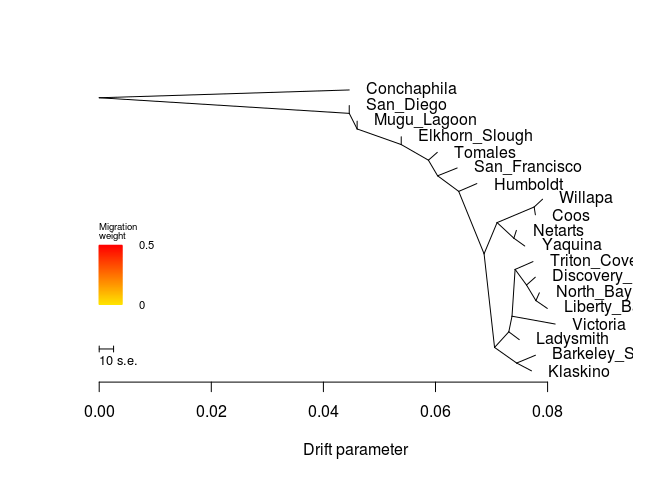

    ##  [1] 0.07780638 0.06031789 0.04461060 0.07494132 0.05388582 0.04601890
    ##  [7] 0.06386568 0.07910282 0.07739163 0.07782005 0.07443126 0.07712784
    ## [13] 0.08134893 0.07852970 0.06737414 0.04461060 0.07994716 0.07592359
    ## [19] 0.07783193
    ## [1] 0.003
    ## [1] "mse 0.000256445290858726"

    ## $d
    ##     V1             V2       V3      V4      V5  V6  V7 V8  V9 V10
    ## 1    1  Discovery_Bay NOT_ROOT NOT_MIG     TIP 356  NA NA  NA  NA
    ## 2    2           <NA> NOT_ROOT NOT_MIG NOT_TIP  32   3  1  76  14
    ## 3    3        Tomales NOT_ROOT NOT_MIG     TIP   2  NA NA  NA  NA
    ## 4    4      San_Diego NOT_ROOT NOT_MIG     TIP 472  NA NA  NA  NA
    ## 5   15      Ladysmith NOT_ROOT NOT_MIG     TIP 304  NA NA  NA  NA
    ## 6   16           <NA> NOT_ROOT NOT_MIG NOT_TIP 304 136  4 303   1
    ## 7   31 Elkhorn_Slough NOT_ROOT NOT_MIG     TIP  32  NA NA  NA  NA
    ## 8   32           <NA> NOT_ROOT NOT_MIG NOT_TIP  52  31  1   2  15
    ## 9   51    Mugu_Lagoon NOT_ROOT NOT_MIG     TIP  52  NA NA  NA  NA
    ## 10  52           <NA> NOT_ROOT NOT_MIG NOT_TIP 472  51  1  32  16
    ## 11  75  San_Francisco NOT_ROOT NOT_MIG     TIP  76  NA NA  NA  NA
    ## 12  76           <NA> NOT_ROOT NOT_MIG NOT_TIP   2  75  1 412  13
    ## 13 103        Willapa NOT_ROOT NOT_MIG     TIP 172  NA NA  NA  NA
    ## 14 104           <NA> NOT_ROOT NOT_MIG NOT_TIP 412 212  4 256   8
    ## 15 135    Triton_Cove NOT_ROOT NOT_MIG     TIP 136  NA NA  NA  NA
    ## 16 136           <NA> NOT_ROOT NOT_MIG NOT_TIP  16 135  1 356   3
    ## 17 171           Coos NOT_ROOT NOT_MIG     TIP 172  NA NA  NA  NA
    ## 18 172           <NA> NOT_ROOT NOT_MIG NOT_TIP 212 103  1 171   1
    ## 19 211        Netarts NOT_ROOT NOT_MIG     TIP 604  NA NA  NA  NA
    ## 20 212           <NA> NOT_ROOT NOT_MIG NOT_TIP 104 172  2 604   2
    ## 21 255       Klaskino NOT_ROOT NOT_MIG     TIP 676  NA NA  NA  NA
    ## 22 256           <NA> NOT_ROOT NOT_MIG NOT_TIP 104 304  6 676   2
    ## 23 303       Victoria NOT_ROOT NOT_MIG     TIP  16  NA NA  NA  NA
    ## 24 304           <NA> NOT_ROOT NOT_MIG NOT_TIP 256  16  5  15   1
    ## 25 355      North_Bay NOT_ROOT NOT_MIG     TIP 536  NA NA  NA  NA
    ## 26 356           <NA> NOT_ROOT NOT_MIG NOT_TIP 136   1  1 536   2
    ## 27 411       Humboldt NOT_ROOT NOT_MIG     TIP 412  NA NA  NA  NA
    ## 28 412           <NA> NOT_ROOT NOT_MIG NOT_TIP  76 411  1 104  12
    ## 29 471    Conchaphila NOT_ROOT NOT_MIG     TIP 677  NA NA  NA  NA
    ## 30 472           <NA> NOT_ROOT NOT_MIG NOT_TIP 677   4  1  52  17
    ## 31 535    Liberty_Bay NOT_ROOT NOT_MIG     TIP 536  NA NA  NA  NA
    ## 32 536           <NA> NOT_ROOT NOT_MIG NOT_TIP 356 355  1 535   1
    ## 33 603        Yaquina NOT_ROOT NOT_MIG     TIP 604  NA NA  NA  NA
    ## 34 604           <NA> NOT_ROOT NOT_MIG NOT_TIP 212 211  1 603   1
    ## 35 675 Barkeley_Sound NOT_ROOT NOT_MIG     TIP 676  NA NA  NA  NA
    ## 36 676           <NA> NOT_ROOT NOT_MIG NOT_TIP 256 675  1 255   1
    ## 37 677           <NA>     ROOT NOT_MIG NOT_TIP 677 471  1 472  18
    ##                                                                                                                                                                                                                                                                                                                                                                                                                                                                                                                                                                                                                             V11
    ## 1                                                                                                                                                                                                                                                                                                                                                                                                                                                                                                                                                                                                      Discovery_Bay:0.00156757
    ## 2                                                                                                           (Tomales:0.00158152,(San_Francisco:0.0034923,(Humboldt:0.00323072,(((Willapa:0.00149929,Coos:0.00021652):0.00661549,(Netarts:0.000451501,Yaquina:0.00194383):0.00299172):0.00231981,((((Triton_Cove:0.00318895,(Discovery_Bay:0.00156757,(North_Bay:0.000613235,Liberty_Bay:0.0020307):0.00167765):0.00203613):0.000550866,Victoria:0.00769711):0.000573406,Ladysmith:0.00186291):0.00254105,(Barkeley_Sound:0.00335596,Klaskino:0.00265187):0.00393861):0.00186913):0.00452481):0.00377004):0.00163701):0.00485055
    ## 3                                                                                                                                                                                                                                                                                                                                                                                                                                                                                                                                                                                                            Tomales:0.00158152
    ## 4                                                                                                                                                                                                                                                                                                                                                                                                                                                                                                                                                                                                                   San_Diego:0
    ## 5                                                                                                                                                                                                                                                                                                                                                                                                                                                                                                                                                                                                          Ladysmith:0.00186291
    ## 6                                                                                                                                                                                                                                                                                                                                                                                                                                                         ((Triton_Cove:0.00318895,(Discovery_Bay:0.00156757,(North_Bay:0.000613235,Liberty_Bay:0.0020307):0.00167765):0.00203613):0.000550866,Victoria:0.00769711):0.000573406
    ## 7                                                                                                                                                                                                                                                                                                                                                                                                                                                                                                                                                                                                              Elkhorn_Slough:0
    ## 8                                                                             (Elkhorn_Slough:0,(Tomales:0.00158152,(San_Francisco:0.0034923,(Humboldt:0.00323072,(((Willapa:0.00149929,Coos:0.00021652):0.00661549,(Netarts:0.000451501,Yaquina:0.00194383):0.00299172):0.00231981,((((Triton_Cove:0.00318895,(Discovery_Bay:0.00156757,(North_Bay:0.000613235,Liberty_Bay:0.0020307):0.00167765):0.00203613):0.000550866,Victoria:0.00769711):0.000573406,Ladysmith:0.00186291):0.00254105,(Barkeley_Sound:0.00335596,Klaskino:0.00265187):0.00393861):0.00186913):0.00452481):0.00377004):0.00163701):0.00485055):0.00786692
    ## 9                                                                                                                                                                                                                                                                                                                                                                                                                                                                                                                                                                                                                 Mugu_Lagoon:0
    ## 10                                                  (Mugu_Lagoon:0,(Elkhorn_Slough:0,(Tomales:0.00158152,(San_Francisco:0.0034923,(Humboldt:0.00323072,(((Willapa:0.00149929,Coos:0.00021652):0.00661549,(Netarts:0.000451501,Yaquina:0.00194383):0.00299172):0.00231981,((((Triton_Cove:0.00318895,(Discovery_Bay:0.00156757,(North_Bay:0.000613235,Liberty_Bay:0.0020307):0.00167765):0.00203613):0.000550866,Victoria:0.00769711):0.000573406,Ladysmith:0.00186291):0.00254105,(Barkeley_Sound:0.00335596,Klaskino:0.00265187):0.00393861):0.00186913):0.00452481):0.00377004):0.00163701):0.00485055):0.00786692):0.0014083
    ## 11                                                                                                                                                                                                                                                                                                                                                                                                                                                                                                                                                                                                      San_Francisco:0.0034923
    ## 12                                                                                                                                          (San_Francisco:0.0034923,(Humboldt:0.00323072,(((Willapa:0.00149929,Coos:0.00021652):0.00661549,(Netarts:0.000451501,Yaquina:0.00194383):0.00299172):0.00231981,((((Triton_Cove:0.00318895,(Discovery_Bay:0.00156757,(North_Bay:0.000613235,Liberty_Bay:0.0020307):0.00167765):0.00203613):0.000550866,Victoria:0.00769711):0.000573406,Ladysmith:0.00186291):0.00254105,(Barkeley_Sound:0.00335596,Klaskino:0.00265187):0.00393861):0.00186913):0.00452481):0.00377004):0.00163701
    ## 13                                                                                                                                                                                                                                                                                                                                                                                                                                                                                                                                                                                                           Willapa:0.00149929
    ## 14                                                                                                                                                                                                                (((Willapa:0.00149929,Coos:0.00021652):0.00661549,(Netarts:0.000451501,Yaquina:0.00194383):0.00299172):0.00231981,((((Triton_Cove:0.00318895,(Discovery_Bay:0.00156757,(North_Bay:0.000613235,Liberty_Bay:0.0020307):0.00167765):0.00203613):0.000550866,Victoria:0.00769711):0.000573406,Ladysmith:0.00186291):0.00254105,(Barkeley_Sound:0.00335596,Klaskino:0.00265187):0.00393861):0.00186913):0.00452481
    ## 15                                                                                                                                                                                                                                                                                                                                                                                                                                                                                                                                                                                                       Triton_Cove:0.00318895
    ## 16                                                                                                                                                                                                                                                                                                                                                                                                                                                                                          (Triton_Cove:0.00318895,(Discovery_Bay:0.00156757,(North_Bay:0.000613235,Liberty_Bay:0.0020307):0.00167765):0.00203613):0.000550866
    ## 17                                                                                                                                                                                                                                                                                                                                                                                                                                                                                                                                                                                                              Coos:0.00021652
    ## 18                                                                                                                                                                                                                                                                                                                                                                                                                                                                                                                                                                              (Willapa:0.00149929,Coos:0.00021652):0.00661549
    ## 19                                                                                                                                                                                                                                                                                                                                                                                                                                                                                                                                                                                                          Netarts:0.000451501
    ## 20                                                                                                                                                                                                                                                                                                                                                                                                                                                                                                             ((Willapa:0.00149929,Coos:0.00021652):0.00661549,(Netarts:0.000451501,Yaquina:0.00194383):0.00299172):0.00231981
    ## 21                                                                                                                                                                                                                                                                                                                                                                                                                                                                                                                                                                                                          Klaskino:0.00265187
    ## 22                                                                                                                                                                                                                                                                                                                                              ((((Triton_Cove:0.00318895,(Discovery_Bay:0.00156757,(North_Bay:0.000613235,Liberty_Bay:0.0020307):0.00167765):0.00203613):0.000550866,Victoria:0.00769711):0.000573406,Ladysmith:0.00186291):0.00254105,(Barkeley_Sound:0.00335596,Klaskino:0.00265187):0.00393861):0.00186913
    ## 23                                                                                                                                                                                                                                                                                                                                                                                                                                                                                                                                                                                                          Victoria:0.00769711
    ## 24                                                                                                                                                                                                                                                                                                                                                                                                                      (((Triton_Cove:0.00318895,(Discovery_Bay:0.00156757,(North_Bay:0.000613235,Liberty_Bay:0.0020307):0.00167765):0.00203613):0.000550866,Victoria:0.00769711):0.000573406,Ladysmith:0.00186291):0.00254105
    ## 25                                                                                                                                                                                                                                                                                                                                                                                                                                                                                                                                                                                                        North_Bay:0.000613235
    ## 26                                                                                                                                                                                                                                                                                                                                                                                                                                                                                                                               (Discovery_Bay:0.00156757,(North_Bay:0.000613235,Liberty_Bay:0.0020307):0.00167765):0.00203613
    ## 27                                                                                                                                                                                                                                                                                                                                                                                                                                                                                                                                                                                                          Humboldt:0.00323072
    ## 28                                                                                                                                                                               (Humboldt:0.00323072,(((Willapa:0.00149929,Coos:0.00021652):0.00661549,(Netarts:0.000451501,Yaquina:0.00194383):0.00299172):0.00231981,((((Triton_Cove:0.00318895,(Discovery_Bay:0.00156757,(North_Bay:0.000613235,Liberty_Bay:0.0020307):0.00167765):0.00203613):0.000550866,Victoria:0.00769711):0.000573406,Ladysmith:0.00186291):0.00254105,(Barkeley_Sound:0.00335596,Klaskino:0.00265187):0.00393861):0.00186913):0.00452481):0.00377004
    ## 29                                                                                                                                                                                                                                                                                                                                                                                                                                                                                                                                                                                                        Conchaphila:0.0446106
    ## 30                          (San_Diego:0,(Mugu_Lagoon:0,(Elkhorn_Slough:0,(Tomales:0.00158152,(San_Francisco:0.0034923,(Humboldt:0.00323072,(((Willapa:0.00149929,Coos:0.00021652):0.00661549,(Netarts:0.000451501,Yaquina:0.00194383):0.00299172):0.00231981,((((Triton_Cove:0.00318895,(Discovery_Bay:0.00156757,(North_Bay:0.000613235,Liberty_Bay:0.0020307):0.00167765):0.00203613):0.000550866,Victoria:0.00769711):0.000573406,Ladysmith:0.00186291):0.00254105,(Barkeley_Sound:0.00335596,Klaskino:0.00265187):0.00393861):0.00186913):0.00452481):0.00377004):0.00163701):0.00485055):0.00786692):0.0014083):0.0446106
    ## 31                                                                                                                                                                                                                                                                                                                                                                                                                                                                                                                                                                                                        Liberty_Bay:0.0020307
    ## 32                                                                                                                                                                                                                                                                                                                                                                                                                                                                                                                                                                     (North_Bay:0.000613235,Liberty_Bay:0.0020307):0.00167765
    ## 33                                                                                                                                                                                                                                                                                                                                                                                                                                                                                                                                                                                                           Yaquina:0.00194383
    ## 34                                                                                                                                                                                                                                                                                                                                                                                                                                                                                                                                                                          (Netarts:0.000451501,Yaquina:0.00194383):0.00299172
    ## 35                                                                                                                                                                                                                                                                                                                                                                                                                                                                                                                                                                                                    Barkeley_Sound:0.00335596
    ## 36                                                                                                                                                                                                                                                                                                                                                                                                                                                                                                                                                                   (Barkeley_Sound:0.00335596,Klaskino:0.00265187):0.00393861
    ## 37 (Conchaphila:0.0446106,(San_Diego:0,(Mugu_Lagoon:0,(Elkhorn_Slough:0,(Tomales:0.00158152,(San_Francisco:0.0034923,(Humboldt:0.00323072,(((Willapa:0.00149929,Coos:0.00021652):0.00661549,(Netarts:0.000451501,Yaquina:0.00194383):0.00299172):0.00231981,((((Triton_Cove:0.00318895,(Discovery_Bay:0.00156757,(North_Bay:0.000613235,Liberty_Bay:0.0020307):0.00167765):0.00203613):0.000550866,Victoria:0.00769711):0.000573406,Ladysmith:0.00186291):0.00254105,(Barkeley_Sound:0.00335596,Klaskino:0.00265187):0.00393861):0.00186913):0.00452481):0.00377004):0.00163701):0.00485055):0.00786692):0.0014083):0.0446106);
    ##             x          y       ymin       ymax
    ## 1  0.07780638 0.34210526 0.31578947 0.36842105
    ## 2  0.05873637 0.73684211 0.00000000 0.78947368
    ## 3  0.06031789 0.76315789 0.73684211 0.78947368
    ## 4  0.04461060 0.92105263 0.89473684 0.94736842
    ## 5  0.07494132 0.13157895 0.10526316 0.15789474
    ## 6  0.07365182 0.21052632 0.15789474 0.42105263
    ## 7  0.05388582 0.81578947 0.78947368 0.84210526
    ## 8  0.05388582 0.78947368 0.00000000 0.84210526
    ## 9  0.04601890 0.86842105 0.84210526 0.89473684
    ## 10 0.04601890 0.84210526 0.00000000 0.89473684
    ## 11 0.06386568 0.71052632 0.68421053 0.73684211
    ## 12 0.06037338 0.68421053 0.00000000 0.73684211
    ## 13 0.07910282 0.60526316 0.57894737 0.63157895
    ## 14 0.06866823 0.42105263 0.00000000 0.63157895
    ## 15 0.07739163 0.39473684 0.36842105 0.42105263
    ## 16 0.07420268 0.36842105 0.21052632 0.42105263
    ## 17 0.07782005 0.55263158 0.52631579 0.57894737
    ## 18 0.07760353 0.57894737 0.52631579 0.63157895
    ## 19 0.07443126 0.50000000 0.47368421 0.52631579
    ## 20 0.07098804 0.52631579 0.42105263 0.63157895
    ## 21 0.07712784 0.02631579 0.00000000 0.05263158
    ## 22 0.07053736 0.10526316 0.00000000 0.42105263
    ## 23 0.08134893 0.18421053 0.15789474 0.21052632
    ## 24 0.07307841 0.15789474 0.10526316 0.42105263
    ## 25 0.07852970 0.28947368 0.26315789 0.31578947
    ## 26 0.07623881 0.31578947 0.21052632 0.36842105
    ## 27 0.06737414 0.65789474 0.63157895 0.68421053
    ## 28 0.06414342 0.63157895 0.00000000 0.68421053
    ## 29 0.04461060 0.97368421 0.94736842 1.00000000
    ## 30 0.04461060 0.89473684 0.00000000 0.94736842
    ## 31 0.07994716 0.23684211 0.21052632 0.26315789
    ## 32 0.07791646 0.26315789 0.21052632 0.31578947
    ## 33 0.07592359 0.44736842 0.42105263 0.47368421
    ## 34 0.07397976 0.47368421 0.42105263 0.52631579
    ## 35 0.07783193 0.07894737 0.05263158 0.10526316
    ## 36 0.07447597 0.05263158 0.00000000 0.10526316
    ## 37 0.00000000 0.94736842 0.00000000 1.00000000
    ## 
    ## $e
    ##     V1  V2          V3 V4      V5 V6 V7
    ## 1    2   3 0.001581520  1 NOT_MIG  0  1
    ## 2   32  31 0.000000000  1 NOT_MIG  0  1
    ## 3   52  51 0.000000000  1 NOT_MIG  0  1
    ## 4   76  75 0.003492300  1 NOT_MIG  0  1
    ## 5   16 136 0.000550866  1 NOT_MIG  0  1
    ## 6  136 135 0.003188950  1 NOT_MIG  0  1
    ## 7  172 103 0.001499290  1 NOT_MIG  0  1
    ## 8  172 171 0.000216520  1 NOT_MIG  0  1
    ## 9  212 172 0.006615490  1 NOT_MIG  0  1
    ## 10 304  16 0.000573406  1 NOT_MIG  0  1
    ## 11 136 356 0.002036130  1 NOT_MIG  0  1
    ## 12 356   1 0.001567570  1 NOT_MIG  0  1
    ## 13 412 411 0.003230720  1 NOT_MIG  0  1
    ## 14 472   4 0.000000000  1 NOT_MIG  0  1
    ## 15 356 536 0.001677650  1 NOT_MIG  0  1
    ## 16 536 355 0.000613235  1 NOT_MIG  0  1
    ## 17 536 535 0.002030700  1 NOT_MIG  0  1
    ## 18 256 304 0.002541050  1 NOT_MIG  0  1
    ## 19  16 303 0.007697110  1 NOT_MIG  0  1
    ## 20 304  15 0.001862910  1 NOT_MIG  0  1
    ## 21 212 604 0.002991720  1 NOT_MIG  0  1
    ## 22 604 211 0.000451501  1 NOT_MIG  0  1
    ## 23 604 603 0.001943830  1 NOT_MIG  0  1
    ## 24 104 212 0.002319810  1 NOT_MIG  0  1
    ## 25 676 675 0.003355960  1 NOT_MIG  0  1
    ## 26  32   2 0.004850550  1 NOT_MIG  0  1
    ## 27 104 256 0.001869130  1 NOT_MIG  0  1
    ## 28   2  76 0.001637010  1 NOT_MIG  0  1
    ## 29 256 676 0.003938610  1 NOT_MIG  0  1
    ## 30  76 412 0.003770040  1 NOT_MIG  0  1
    ## 31  52  32 0.007866920  1 NOT_MIG  0  1
    ## 32 472  52 0.001408300  1 NOT_MIG  0  1
    ## 33 412 104 0.004524810  1 NOT_MIG  0  1
    ## 34 677 471 0.044610600  1 NOT_MIG  0  1
    ## 35 677 472 0.044610600  1 NOT_MIG  0  1
    ## 36 676 255 0.002651870  1 NOT_MIG  0  1

``` r
system("treemix -i All/All-m70x62-mac4.pop.TM.gz -root Conchaphila -m 1 -o All/All-m70x62-mac4-pop_m1 > out")
```

``` r
plot_tree("All/All-m70x62-mac4-pop_m1")
```

    ## Warning in plot_tree("All/All-m70x62-mac4-pop_m1"): NAs introduced by
    ## coercion

    ## Warning in plot_tree("All/All-m70x62-mac4-pop_m1"): NAs introduced by
    ## coercion

    ## Warning in plot_tree("All/All-m70x62-mac4-pop_m1"): NAs introduced by
    ## coercion

    ## Warning in plot_tree("All/All-m70x62-mac4-pop_m1"): NAs introduced by
    ## coercion

    ##     V1             V2       V3      V4      V5  V6  V7 V8  V9 V10
    ## 1    1      San_Diego NOT_ROOT NOT_MIG     TIP 676  NA NA  NA  NA
    ## 2    2           <NA> NOT_ROOT NOT_MIG NOT_TIP  32  52 12  31   1
    ## 3    3  San_Francisco NOT_ROOT NOT_MIG     TIP  32  NA NA  NA  NA
    ## 4    4    Liberty_Bay NOT_ROOT NOT_MIG     TIP  76  NA NA  NA  NA
    ## 5   15    Triton_Cove NOT_ROOT NOT_MIG     TIP 256  NA NA  NA  NA
    ## 6   16           <NA> NOT_ROOT NOT_MIG NOT_TIP 212 604  3 256   2
    ## 7   31       Humboldt NOT_ROOT NOT_MIG     TIP   2  NA NA  NA  NA
    ## 8   32           <NA> NOT_ROOT NOT_MIG NOT_TIP 304   2 13   3   1
    ## 9   51        Yaquina NOT_ROOT NOT_MIG     TIP 172  NA NA  NA  NA
    ## 10  52           <NA> NOT_ROOT NOT_MIG NOT_TIP   2 356  4 412   8
    ## 11  75      North_Bay NOT_ROOT NOT_MIG     TIP  76  NA NA  NA  NA
    ## 12  76           <NA> NOT_ROOT NOT_MIG NOT_TIP 604   4  1  75   1
    ## 13 103    Mugu_Lagoon NOT_ROOT NOT_MIG     TIP 104  NA NA  NA  NA
    ## 14 104           <NA> NOT_ROOT NOT_MIG NOT_TIP 676 103  1 136  16
    ## 15 135 Elkhorn_Slough NOT_ROOT NOT_MIG     TIP 136  NA NA  NA  NA
    ## 16 136           <NA> NOT_ROOT NOT_MIG NOT_TIP 104 304 15 135   1
    ## 17 171        Netarts NOT_ROOT NOT_MIG     TIP 172  NA NA  NA  NA
    ## 18 172           <NA> NOT_ROOT NOT_MIG NOT_TIP 356  51  1 171   1
    ## 19 211       Victoria NOT_ROOT NOT_MIG     TIP 212  NA NA  NA  NA
    ## 20 212           <NA> NOT_ROOT NOT_MIG NOT_TIP 412 211  1  16   5
    ## 21 255      Ladysmith NOT_ROOT NOT_MIG     TIP 256  NA NA  NA  NA
    ## 22 256           <NA> NOT_ROOT NOT_MIG NOT_TIP  16  15  1 255   1
    ## 23 303        Tomales NOT_ROOT NOT_MIG     TIP 304  NA NA  NA  NA
    ## 24 304           <NA> NOT_ROOT NOT_MIG NOT_TIP 136 303  1  32  14
    ## 25 355        Willapa NOT_ROOT NOT_MIG     TIP 536  NA NA  NA  NA
    ## 26 356           <NA> NOT_ROOT NOT_MIG NOT_TIP  52 172  2 536   2
    ## 27 411 Barkeley_Sound NOT_ROOT NOT_MIG     TIP 472  NA NA  NA  NA
    ## 28 412           <NA> NOT_ROOT NOT_MIG NOT_TIP  52 212  6 472   2
    ## 29 471       Klaskino NOT_ROOT NOT_MIG     TIP 472  NA NA  NA  NA
    ## 30 472           <NA> NOT_ROOT NOT_MIG NOT_TIP 412 471  1 411   1
    ## 31 535           Coos NOT_ROOT NOT_MIG     TIP 536  NA NA  NA  NA
    ## 32 536           <NA> NOT_ROOT NOT_MIG NOT_TIP 356 355  1 535   1
    ## 33 603  Discovery_Bay NOT_ROOT NOT_MIG     TIP 604  NA NA  NA  NA
    ## 34 604           <NA> NOT_ROOT NOT_MIG NOT_TIP  16  76  2 603   1
    ## 35 675    Conchaphila NOT_ROOT NOT_MIG     TIP 677  NA NA  NA  NA
    ## 36 676           <NA> NOT_ROOT NOT_MIG NOT_TIP 677 104 17   1   1
    ## 37 677           <NA>     ROOT NOT_MIG NOT_TIP 677 676 18 675   1
    ## 38 688           <NA> NOT_ROOT     MIG NOT_TIP 472 411 NA  NA  NA
    ##                                                                                                                                                                                                                                                                                                                                                                                                                                                                                                                                                                                                                               V11
    ## 1                                                                                                                                                                                                                                                                                                                                                                                                                                                                                                                                                                                                                     San_Diego:0
    ## 2                                                                                                                                                                                  ((((Yaquina:0.00194386,Netarts:0.000451529):0.00299172,(Willapa:0.00149932,Coos:0.000216548):0.00661549):0.00231981,((Victoria:0.00762453,(((Liberty_Bay:0.00203073,North_Bay:0.000613262):0.00167765,Discovery_Bay:0.00156759):0.00186641,(Triton_Cove:0.00197712,Ladysmith:0.00376189):0.00117905):0.00073233):0.00329574,(Klaskino:0.00249529,Barkeley_Sound:0.00333949):0.00434862):0.00157877):0.00452481,Humboldt:0.00323075):0.00377004
    ## 3                                                                                                                                                                                                                                                                                                                                                                                                                                                                                                                                                                                                        San_Francisco:0.00349233
    ## 4                                                                                                                                                                                                                                                                                                                                                                                                                                                                                                                                                                                                          Liberty_Bay:0.00203073
    ## 5                                                                                                                                                                                                                                                                                                                                                                                                                                                                                                                                                                                                          Triton_Cove:0.00197712
    ## 6                                                                                                                                                                                                                                                                                                                                                                                                                                                           (((Liberty_Bay:0.00203073,North_Bay:0.000613262):0.00167765,Discovery_Bay:0.00156759):0.00186641,(Triton_Cove:0.00197712,Ladysmith:0.00376189):0.00117905):0.00073233
    ## 7                                                                                                                                                                                                                                                                                                                                                                                                                                                                                                                                                                                                             Humboldt:0.00323075
    ## 8                                                                                                                                            (((((Yaquina:0.00194386,Netarts:0.000451529):0.00299172,(Willapa:0.00149932,Coos:0.000216548):0.00661549):0.00231981,((Victoria:0.00762453,(((Liberty_Bay:0.00203073,North_Bay:0.000613262):0.00167765,Discovery_Bay:0.00156759):0.00186641,(Triton_Cove:0.00197712,Ladysmith:0.00376189):0.00117905):0.00073233):0.00329574,(Klaskino:0.00249529,Barkeley_Sound:0.00333949):0.00434862):0.00157877):0.00452481,Humboldt:0.00323075):0.00377004,San_Francisco:0.00349233):0.00163701
    ## 9                                                                                                                                                                                                                                                                                                                                                                                                                                                                                                                                                                                                              Yaquina:0.00194386
    ## 10                                                                                                                                                                                                                  (((Yaquina:0.00194386,Netarts:0.000451529):0.00299172,(Willapa:0.00149932,Coos:0.000216548):0.00661549):0.00231981,((Victoria:0.00762453,(((Liberty_Bay:0.00203073,North_Bay:0.000613262):0.00167765,Discovery_Bay:0.00156759):0.00186641,(Triton_Cove:0.00197712,Ladysmith:0.00376189):0.00117905):0.00073233):0.00329574,(Klaskino:0.00249529,Barkeley_Sound:0.00333949):0.00434862):0.00157877):0.00452481
    ## 11                                                                                                                                                                                                                                                                                                                                                                                                                                                                                                                                                                                                          North_Bay:0.000613262
    ## 12                                                                                                                                                                                                                                                                                                                                                                                                                                                                                                                                                                      (Liberty_Bay:0.00203073,North_Bay:0.000613262):0.00167765
    ## 13                                                                                                                                                                                                                                                                                                                                                                                                                                                                                                                                                                                                                  Mugu_Lagoon:0
    ## 14                                                  (Mugu_Lagoon:0,((Tomales:0.00158155,(((((Yaquina:0.00194386,Netarts:0.000451529):0.00299172,(Willapa:0.00149932,Coos:0.000216548):0.00661549):0.00231981,((Victoria:0.00762453,(((Liberty_Bay:0.00203073,North_Bay:0.000613262):0.00167765,Discovery_Bay:0.00156759):0.00186641,(Triton_Cove:0.00197712,Ladysmith:0.00376189):0.00117905):0.00073233):0.00329574,(Klaskino:0.00249529,Barkeley_Sound:0.00333949):0.00434862):0.00157877):0.00452481,Humboldt:0.00323075):0.00377004,San_Francisco:0.00349233):0.00163701):0.00485055,Elkhorn_Slough:0):0.00786693):0.00140831
    ## 15                                                                                                                                                                                                                                                                                                                                                                                                                                                                                                                                                                                                               Elkhorn_Slough:0
    ## 16                                                                             ((Tomales:0.00158155,(((((Yaquina:0.00194386,Netarts:0.000451529):0.00299172,(Willapa:0.00149932,Coos:0.000216548):0.00661549):0.00231981,((Victoria:0.00762453,(((Liberty_Bay:0.00203073,North_Bay:0.000613262):0.00167765,Discovery_Bay:0.00156759):0.00186641,(Triton_Cove:0.00197712,Ladysmith:0.00376189):0.00117905):0.00073233):0.00329574,(Klaskino:0.00249529,Barkeley_Sound:0.00333949):0.00434862):0.00157877):0.00452481,Humboldt:0.00323075):0.00377004,San_Francisco:0.00349233):0.00163701):0.00485055,Elkhorn_Slough:0):0.00786693
    ## 17                                                                                                                                                                                                                                                                                                                                                                                                                                                                                                                                                                                                            Netarts:0.000451529
    ## 18                                                                                                                                                                                                                                                                                                                                                                                                                                                                                                                                                                            (Yaquina:0.00194386,Netarts:0.000451529):0.00299172
    ## 19                                                                                                                                                                                                                                                                                                                                                                                                                                                                                                                                                                                                            Victoria:0.00762453
    ## 20                                                                                                                                                                                                                                                                                                                                                                                                                         (Victoria:0.00762453,(((Liberty_Bay:0.00203073,North_Bay:0.000613262):0.00167765,Discovery_Bay:0.00156759):0.00186641,(Triton_Cove:0.00197712,Ladysmith:0.00376189):0.00117905):0.00073233):0.00329574
    ## 21                                                                                                                                                                                                                                                                                                                                                                                                                                                                                                                                                                                                           Ladysmith:0.00376189
    ## 22                                                                                                                                                                                                                                                                                                                                                                                                                                                                                                                                                                       (Triton_Cove:0.00197712,Ladysmith:0.00376189):0.00117905
    ## 23                                                                                                                                                                                                                                                                                                                                                                                                                                                                                                                                                                                                             Tomales:0.00158155
    ## 24                                                                                                           (Tomales:0.00158155,(((((Yaquina:0.00194386,Netarts:0.000451529):0.00299172,(Willapa:0.00149932,Coos:0.000216548):0.00661549):0.00231981,((Victoria:0.00762453,(((Liberty_Bay:0.00203073,North_Bay:0.000613262):0.00167765,Discovery_Bay:0.00156759):0.00186641,(Triton_Cove:0.00197712,Ladysmith:0.00376189):0.00117905):0.00073233):0.00329574,(Klaskino:0.00249529,Barkeley_Sound:0.00333949):0.00434862):0.00157877):0.00452481,Humboldt:0.00323075):0.00377004,San_Francisco:0.00349233):0.00163701):0.00485055
    ## 25                                                                                                                                                                                                                                                                                                                                                                                                                                                                                                                                                                                                             Willapa:0.00149932
    ## 26                                                                                                                                                                                                                                                                                                                                                                                                                                                                                                              ((Yaquina:0.00194386,Netarts:0.000451529):0.00299172,(Willapa:0.00149932,Coos:0.000216548):0.00661549):0.00231981
    ## 27                                                                                                                                                                                                                                                                                                                                                                                                                                                                                                                                                                                                      Barkeley_Sound:0.00333949
    ## 28                                                                                                                                                                                                                                                                                                                                                 ((Victoria:0.00762453,(((Liberty_Bay:0.00203073,North_Bay:0.000613262):0.00167765,Discovery_Bay:0.00156759):0.00186641,(Triton_Cove:0.00197712,Ladysmith:0.00376189):0.00117905):0.00073233):0.00329574,(Klaskino:0.00249529,Barkeley_Sound:0.00333949):0.00434862):0.00157877
    ## 29                                                                                                                                                                                                                                                                                                                                                                                                                                                                                                                                                                                                            Klaskino:0.00249529
    ## 30                                                                                                                                                                                                                                                                                                                                                                                                                                                                                                                                                                     (Klaskino:0.00249529,Barkeley_Sound:0.00333949):0.00434862
    ## 31                                                                                                                                                                                                                                                                                                                                                                                                                                                                                                                                                                                                               Coos:0.000216548
    ## 32                                                                                                                                                                                                                                                                                                                                                                                                                                                                                                                                                                               (Willapa:0.00149932,Coos:0.000216548):0.00661549
    ## 33                                                                                                                                                                                                                                                                                                                                                                                                                                                                                                                                                                                                       Discovery_Bay:0.00156759
    ## 34                                                                                                                                                                                                                                                                                                                                                                                                                                                                                                                                ((Liberty_Bay:0.00203073,North_Bay:0.000613262):0.00167765,Discovery_Bay:0.00156759):0.00186641
    ## 35                                                                                                                                                                                                                                                                                                                                                                                                                                                                                                                                                                                                          Conchaphila:0.0446106
    ## 36                          ((Mugu_Lagoon:0,((Tomales:0.00158155,(((((Yaquina:0.00194386,Netarts:0.000451529):0.00299172,(Willapa:0.00149932,Coos:0.000216548):0.00661549):0.00231981,((Victoria:0.00762453,(((Liberty_Bay:0.00203073,North_Bay:0.000613262):0.00167765,Discovery_Bay:0.00156759):0.00186641,(Triton_Cove:0.00197712,Ladysmith:0.00376189):0.00117905):0.00073233):0.00329574,(Klaskino:0.00249529,Barkeley_Sound:0.00333949):0.00434862):0.00157877):0.00452481,Humboldt:0.00323075):0.00377004,San_Francisco:0.00349233):0.00163701):0.00485055,Elkhorn_Slough:0):0.00786693):0.00140831,San_Diego:0):0.0446106
    ## 37 (((Mugu_Lagoon:0,((Tomales:0.00158155,(((((Yaquina:0.00194386,Netarts:0.000451529):0.00299172,(Willapa:0.00149932,Coos:0.000216548):0.00661549):0.00231981,((Victoria:0.00762453,(((Liberty_Bay:0.00203073,North_Bay:0.000613262):0.00167765,Discovery_Bay:0.00156759):0.00186641,(Triton_Cove:0.00197712,Ladysmith:0.00376189):0.00117905):0.00073233):0.00329574,(Klaskino:0.00249529,Barkeley_Sound:0.00333949):0.00434862):0.00157877):0.00452481,Humboldt:0.00323075):0.00377004,San_Francisco:0.00349233):0.00163701):0.00485055,Elkhorn_Slough:0):0.00786693):0.00140831,San_Diego:0):0.0446106,Conchaphila:0.0446106);
    ## 38                                                                                                                                                                                                                                                                                                                                                                                                                                                                                                                                                                                                                           <NA>
    ##             x          y       ymin       ymax
    ## 1  0.04461060 0.07894737 0.05263158 0.10526316
    ## 2  0.06414344 0.26315789 0.21052632 0.89473684
    ## 3  0.06386573 0.18421053 0.15789474 0.21052632
    ## 4  0.07984988 0.60526316 0.57894737 0.63157895
    ## 5  0.07743126 0.44736842 0.42105263 0.47368421
    ## 6  0.07427509 0.47368421 0.36842105 0.63157895
    ## 7  0.06737419 0.23684211 0.21052632 0.26315789
    ## 8  0.06037340 0.21052632 0.15789474 0.89473684
    ## 9  0.07592364 0.86842105 0.84210526 0.89473684
    ## 10 0.06866825 0.68421053 0.26315789 0.89473684
    ## 11 0.07843241 0.55263158 0.52631579 0.57894737
    ## 12 0.07781915 0.57894737 0.52631579 0.63157895
    ## 13 0.04601891 0.97368421 0.94736842 1.00000000
    ## 14 0.04601891 0.94736842 0.10526316 1.00000000
    ## 15 0.05388584 0.13157895 0.10526316 0.15789474
    ## 16 0.05388584 0.15789474 0.10526316 0.94736842
    ## 17 0.07443131 0.81578947 0.78947368 0.84210526
    ## 18 0.07397978 0.84210526 0.78947368 0.89473684
    ## 19 0.08116729 0.65789474 0.63157895 0.68421053
    ## 20 0.07354276 0.63157895 0.36842105 0.68421053
    ## 21 0.07729289 0.39473684 0.36842105 0.42105263
    ## 22 0.07545414 0.42105263 0.36842105 0.47368421
    ## 23 0.06031794 0.92105263 0.89473684 0.94736842
    ## 24 0.05873639 0.89473684 0.15789474 0.94736842
    ## 25 0.07910287 0.76315789 0.73684211 0.78947368
    ## 26 0.07098806 0.78947368 0.68421053 0.89473684
    ## 27 0.07793513 0.28947368 0.26315789 0.31578947
    ## 28 0.07024702 0.36842105 0.26315789 0.68421053
    ## 29 0.07709093 0.34210526 0.31578947 0.36842105
    ## 30 0.07459564 0.31578947 0.26315789 0.36842105
    ## 31 0.07782010 0.71052632 0.68421053 0.73684211
    ## 32 0.07760355 0.73684211 0.68421053 0.78947368
    ## 33 0.07770909 0.50000000 0.47368421 0.52631579
    ## 34 0.07614150 0.52631579 0.47368421 0.63157895
    ## 35 0.04461060 0.02631579 0.00000000 0.05263158
    ## 36 0.04461060 0.10526316 0.05263158 1.00000000
    ## 37 0.00000000 0.05263158 0.00000000 1.00000000
    ## 38 0.07793513         NA 0.26315789 0.31578947
    ## [1] "1 0.07459564 0.07793513"

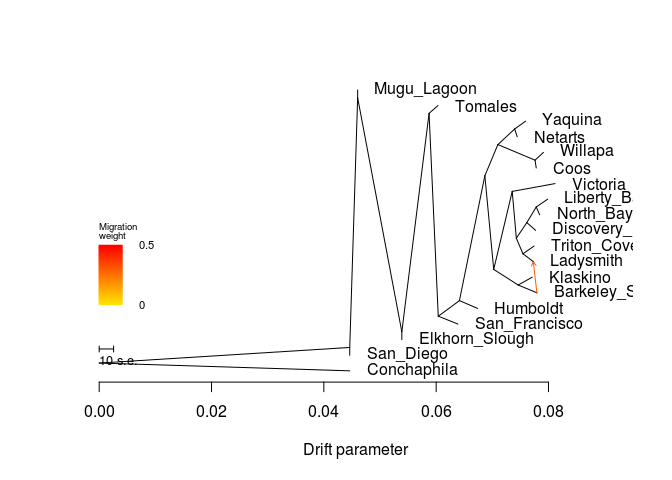

    ##  [1] 0.04461060 0.06386573 0.07984988 0.07743126 0.06737419 0.07592364
    ##  [7] 0.07843241 0.04601891 0.05388584 0.07443131 0.08116729 0.07729289
    ## [13] 0.06031794 0.07910287 0.07793513 0.07709093 0.07782010 0.07770909
    ## [19] 0.04461060
    ## [1] 0.003
    ## [1] "mse 0.000256445290858726"

    ## $d
    ##     V1             V2       V3      V4      V5  V6  V7 V8  V9 V10
    ## 1    1      San_Diego NOT_ROOT NOT_MIG     TIP 676  NA NA  NA  NA
    ## 2    2           <NA> NOT_ROOT NOT_MIG NOT_TIP  32  52 12  31   1
    ## 3    3  San_Francisco NOT_ROOT NOT_MIG     TIP  32  NA NA  NA  NA
    ## 4    4    Liberty_Bay NOT_ROOT NOT_MIG     TIP  76  NA NA  NA  NA
    ## 5   15    Triton_Cove NOT_ROOT NOT_MIG     TIP 256  NA NA  NA  NA
    ## 6   16           <NA> NOT_ROOT NOT_MIG NOT_TIP 212 604  3 256   2
    ## 7   31       Humboldt NOT_ROOT NOT_MIG     TIP   2  NA NA  NA  NA
    ## 8   32           <NA> NOT_ROOT NOT_MIG NOT_TIP 304   2 13   3   1
    ## 9   51        Yaquina NOT_ROOT NOT_MIG     TIP 172  NA NA  NA  NA
    ## 10  52           <NA> NOT_ROOT NOT_MIG NOT_TIP   2 356  4 412   8
    ## 11  75      North_Bay NOT_ROOT NOT_MIG     TIP  76  NA NA  NA  NA
    ## 12  76           <NA> NOT_ROOT NOT_MIG NOT_TIP 604   4  1  75   1
    ## 13 103    Mugu_Lagoon NOT_ROOT NOT_MIG     TIP 104  NA NA  NA  NA
    ## 14 104           <NA> NOT_ROOT NOT_MIG NOT_TIP 676 103  1 136  16
    ## 15 135 Elkhorn_Slough NOT_ROOT NOT_MIG     TIP 136  NA NA  NA  NA
    ## 16 136           <NA> NOT_ROOT NOT_MIG NOT_TIP 104 304 15 135   1
    ## 17 171        Netarts NOT_ROOT NOT_MIG     TIP 172  NA NA  NA  NA
    ## 18 172           <NA> NOT_ROOT NOT_MIG NOT_TIP 356  51  1 171   1
    ## 19 211       Victoria NOT_ROOT NOT_MIG     TIP 212  NA NA  NA  NA
    ## 20 212           <NA> NOT_ROOT NOT_MIG NOT_TIP 412 211  1  16   5
    ## 21 255      Ladysmith NOT_ROOT NOT_MIG     TIP 256  NA NA  NA  NA
    ## 22 256           <NA> NOT_ROOT NOT_MIG NOT_TIP  16  15  1 255   1
    ## 23 303        Tomales NOT_ROOT NOT_MIG     TIP 304  NA NA  NA  NA
    ## 24 304           <NA> NOT_ROOT NOT_MIG NOT_TIP 136 303  1  32  14
    ## 25 355        Willapa NOT_ROOT NOT_MIG     TIP 536  NA NA  NA  NA
    ## 26 356           <NA> NOT_ROOT NOT_MIG NOT_TIP  52 172  2 536   2
    ## 27 411 Barkeley_Sound NOT_ROOT NOT_MIG     TIP 472  NA NA  NA  NA
    ## 28 412           <NA> NOT_ROOT NOT_MIG NOT_TIP  52 212  6 472   2
    ## 29 471       Klaskino NOT_ROOT NOT_MIG     TIP 472  NA NA  NA  NA
    ## 30 472           <NA> NOT_ROOT NOT_MIG NOT_TIP 412 471  1 411   1
    ## 31 535           Coos NOT_ROOT NOT_MIG     TIP 536  NA NA  NA  NA
    ## 32 536           <NA> NOT_ROOT NOT_MIG NOT_TIP 356 355  1 535   1
    ## 33 603  Discovery_Bay NOT_ROOT NOT_MIG     TIP 604  NA NA  NA  NA
    ## 34 604           <NA> NOT_ROOT NOT_MIG NOT_TIP  16  76  2 603   1
    ## 35 675    Conchaphila NOT_ROOT NOT_MIG     TIP 677  NA NA  NA  NA
    ## 36 676           <NA> NOT_ROOT NOT_MIG NOT_TIP 677 104 17   1   1
    ## 37 677           <NA>     ROOT NOT_MIG NOT_TIP 677 676 18 675   1
    ## 38 688           <NA> NOT_ROOT     MIG NOT_TIP 472 411 NA  NA  NA
    ##                                                                                                                                                                                                                                                                                                                                                                                                                                                                                                                                                                                                                               V11
    ## 1                                                                                                                                                                                                                                                                                                                                                                                                                                                                                                                                                                                                                     San_Diego:0
    ## 2                                                                                                                                                                                  ((((Yaquina:0.00194386,Netarts:0.000451529):0.00299172,(Willapa:0.00149932,Coos:0.000216548):0.00661549):0.00231981,((Victoria:0.00762453,(((Liberty_Bay:0.00203073,North_Bay:0.000613262):0.00167765,Discovery_Bay:0.00156759):0.00186641,(Triton_Cove:0.00197712,Ladysmith:0.00376189):0.00117905):0.00073233):0.00329574,(Klaskino:0.00249529,Barkeley_Sound:0.00333949):0.00434862):0.00157877):0.00452481,Humboldt:0.00323075):0.00377004
    ## 3                                                                                                                                                                                                                                                                                                                                                                                                                                                                                                                                                                                                        San_Francisco:0.00349233
    ## 4                                                                                                                                                                                                                                                                                                                                                                                                                                                                                                                                                                                                          Liberty_Bay:0.00203073
    ## 5                                                                                                                                                                                                                                                                                                                                                                                                                                                                                                                                                                                                          Triton_Cove:0.00197712
    ## 6                                                                                                                                                                                                                                                                                                                                                                                                                                                           (((Liberty_Bay:0.00203073,North_Bay:0.000613262):0.00167765,Discovery_Bay:0.00156759):0.00186641,(Triton_Cove:0.00197712,Ladysmith:0.00376189):0.00117905):0.00073233
    ## 7                                                                                                                                                                                                                                                                                                                                                                                                                                                                                                                                                                                                             Humboldt:0.00323075
    ## 8                                                                                                                                            (((((Yaquina:0.00194386,Netarts:0.000451529):0.00299172,(Willapa:0.00149932,Coos:0.000216548):0.00661549):0.00231981,((Victoria:0.00762453,(((Liberty_Bay:0.00203073,North_Bay:0.000613262):0.00167765,Discovery_Bay:0.00156759):0.00186641,(Triton_Cove:0.00197712,Ladysmith:0.00376189):0.00117905):0.00073233):0.00329574,(Klaskino:0.00249529,Barkeley_Sound:0.00333949):0.00434862):0.00157877):0.00452481,Humboldt:0.00323075):0.00377004,San_Francisco:0.00349233):0.00163701
    ## 9                                                                                                                                                                                                                                                                                                                                                                                                                                                                                                                                                                                                              Yaquina:0.00194386
    ## 10                                                                                                                                                                                                                  (((Yaquina:0.00194386,Netarts:0.000451529):0.00299172,(Willapa:0.00149932,Coos:0.000216548):0.00661549):0.00231981,((Victoria:0.00762453,(((Liberty_Bay:0.00203073,North_Bay:0.000613262):0.00167765,Discovery_Bay:0.00156759):0.00186641,(Triton_Cove:0.00197712,Ladysmith:0.00376189):0.00117905):0.00073233):0.00329574,(Klaskino:0.00249529,Barkeley_Sound:0.00333949):0.00434862):0.00157877):0.00452481
    ## 11                                                                                                                                                                                                                                                                                                                                                                                                                                                                                                                                                                                                          North_Bay:0.000613262
    ## 12                                                                                                                                                                                                                                                                                                                                                                                                                                                                                                                                                                      (Liberty_Bay:0.00203073,North_Bay:0.000613262):0.00167765
    ## 13                                                                                                                                                                                                                                                                                                                                                                                                                                                                                                                                                                                                                  Mugu_Lagoon:0
    ## 14                                                  (Mugu_Lagoon:0,((Tomales:0.00158155,(((((Yaquina:0.00194386,Netarts:0.000451529):0.00299172,(Willapa:0.00149932,Coos:0.000216548):0.00661549):0.00231981,((Victoria:0.00762453,(((Liberty_Bay:0.00203073,North_Bay:0.000613262):0.00167765,Discovery_Bay:0.00156759):0.00186641,(Triton_Cove:0.00197712,Ladysmith:0.00376189):0.00117905):0.00073233):0.00329574,(Klaskino:0.00249529,Barkeley_Sound:0.00333949):0.00434862):0.00157877):0.00452481,Humboldt:0.00323075):0.00377004,San_Francisco:0.00349233):0.00163701):0.00485055,Elkhorn_Slough:0):0.00786693):0.00140831
    ## 15                                                                                                                                                                                                                                                                                                                                                                                                                                                                                                                                                                                                               Elkhorn_Slough:0
    ## 16                                                                             ((Tomales:0.00158155,(((((Yaquina:0.00194386,Netarts:0.000451529):0.00299172,(Willapa:0.00149932,Coos:0.000216548):0.00661549):0.00231981,((Victoria:0.00762453,(((Liberty_Bay:0.00203073,North_Bay:0.000613262):0.00167765,Discovery_Bay:0.00156759):0.00186641,(Triton_Cove:0.00197712,Ladysmith:0.00376189):0.00117905):0.00073233):0.00329574,(Klaskino:0.00249529,Barkeley_Sound:0.00333949):0.00434862):0.00157877):0.00452481,Humboldt:0.00323075):0.00377004,San_Francisco:0.00349233):0.00163701):0.00485055,Elkhorn_Slough:0):0.00786693
    ## 17                                                                                                                                                                                                                                                                                                                                                                                                                                                                                                                                                                                                            Netarts:0.000451529
    ## 18                                                                                                                                                                                                                                                                                                                                                                                                                                                                                                                                                                            (Yaquina:0.00194386,Netarts:0.000451529):0.00299172
    ## 19                                                                                                                                                                                                                                                                                                                                                                                                                                                                                                                                                                                                            Victoria:0.00762453
    ## 20                                                                                                                                                                                                                                                                                                                                                                                                                         (Victoria:0.00762453,(((Liberty_Bay:0.00203073,North_Bay:0.000613262):0.00167765,Discovery_Bay:0.00156759):0.00186641,(Triton_Cove:0.00197712,Ladysmith:0.00376189):0.00117905):0.00073233):0.00329574
    ## 21                                                                                                                                                                                                                                                                                                                                                                                                                                                                                                                                                                                                           Ladysmith:0.00376189
    ## 22                                                                                                                                                                                                                                                                                                                                                                                                                                                                                                                                                                       (Triton_Cove:0.00197712,Ladysmith:0.00376189):0.00117905
    ## 23                                                                                                                                                                                                                                                                                                                                                                                                                                                                                                                                                                                                             Tomales:0.00158155
    ## 24                                                                                                           (Tomales:0.00158155,(((((Yaquina:0.00194386,Netarts:0.000451529):0.00299172,(Willapa:0.00149932,Coos:0.000216548):0.00661549):0.00231981,((Victoria:0.00762453,(((Liberty_Bay:0.00203073,North_Bay:0.000613262):0.00167765,Discovery_Bay:0.00156759):0.00186641,(Triton_Cove:0.00197712,Ladysmith:0.00376189):0.00117905):0.00073233):0.00329574,(Klaskino:0.00249529,Barkeley_Sound:0.00333949):0.00434862):0.00157877):0.00452481,Humboldt:0.00323075):0.00377004,San_Francisco:0.00349233):0.00163701):0.00485055
    ## 25                                                                                                                                                                                                                                                                                                                                                                                                                                                                                                                                                                                                             Willapa:0.00149932
    ## 26                                                                                                                                                                                                                                                                                                                                                                                                                                                                                                              ((Yaquina:0.00194386,Netarts:0.000451529):0.00299172,(Willapa:0.00149932,Coos:0.000216548):0.00661549):0.00231981
    ## 27                                                                                                                                                                                                                                                                                                                                                                                                                                                                                                                                                                                                      Barkeley_Sound:0.00333949
    ## 28                                                                                                                                                                                                                                                                                                                                                 ((Victoria:0.00762453,(((Liberty_Bay:0.00203073,North_Bay:0.000613262):0.00167765,Discovery_Bay:0.00156759):0.00186641,(Triton_Cove:0.00197712,Ladysmith:0.00376189):0.00117905):0.00073233):0.00329574,(Klaskino:0.00249529,Barkeley_Sound:0.00333949):0.00434862):0.00157877
    ## 29                                                                                                                                                                                                                                                                                                                                                                                                                                                                                                                                                                                                            Klaskino:0.00249529
    ## 30                                                                                                                                                                                                                                                                                                                                                                                                                                                                                                                                                                     (Klaskino:0.00249529,Barkeley_Sound:0.00333949):0.00434862
    ## 31                                                                                                                                                                                                                                                                                                                                                                                                                                                                                                                                                                                                               Coos:0.000216548
    ## 32                                                                                                                                                                                                                                                                                                                                                                                                                                                                                                                                                                               (Willapa:0.00149932,Coos:0.000216548):0.00661549
    ## 33                                                                                                                                                                                                                                                                                                                                                                                                                                                                                                                                                                                                       Discovery_Bay:0.00156759
    ## 34                                                                                                                                                                                                                                                                                                                                                                                                                                                                                                                                ((Liberty_Bay:0.00203073,North_Bay:0.000613262):0.00167765,Discovery_Bay:0.00156759):0.00186641
    ## 35                                                                                                                                                                                                                                                                                                                                                                                                                                                                                                                                                                                                          Conchaphila:0.0446106
    ## 36                          ((Mugu_Lagoon:0,((Tomales:0.00158155,(((((Yaquina:0.00194386,Netarts:0.000451529):0.00299172,(Willapa:0.00149932,Coos:0.000216548):0.00661549):0.00231981,((Victoria:0.00762453,(((Liberty_Bay:0.00203073,North_Bay:0.000613262):0.00167765,Discovery_Bay:0.00156759):0.00186641,(Triton_Cove:0.00197712,Ladysmith:0.00376189):0.00117905):0.00073233):0.00329574,(Klaskino:0.00249529,Barkeley_Sound:0.00333949):0.00434862):0.00157877):0.00452481,Humboldt:0.00323075):0.00377004,San_Francisco:0.00349233):0.00163701):0.00485055,Elkhorn_Slough:0):0.00786693):0.00140831,San_Diego:0):0.0446106
    ## 37 (((Mugu_Lagoon:0,((Tomales:0.00158155,(((((Yaquina:0.00194386,Netarts:0.000451529):0.00299172,(Willapa:0.00149932,Coos:0.000216548):0.00661549):0.00231981,((Victoria:0.00762453,(((Liberty_Bay:0.00203073,North_Bay:0.000613262):0.00167765,Discovery_Bay:0.00156759):0.00186641,(Triton_Cove:0.00197712,Ladysmith:0.00376189):0.00117905):0.00073233):0.00329574,(Klaskino:0.00249529,Barkeley_Sound:0.00333949):0.00434862):0.00157877):0.00452481,Humboldt:0.00323075):0.00377004,San_Francisco:0.00349233):0.00163701):0.00485055,Elkhorn_Slough:0):0.00786693):0.00140831,San_Diego:0):0.0446106,Conchaphila:0.0446106);
    ## 38                                                                                                                                                                                                                                                                                                                                                                                                                                                                                                                                                                                                                           <NA>
    ##             x          y       ymin       ymax
    ## 1  0.04461060 0.07894737 0.05263158 0.10526316
    ## 2  0.06414344 0.26315789 0.21052632 0.89473684
    ## 3  0.06386573 0.18421053 0.15789474 0.21052632
    ## 4  0.07984988 0.60526316 0.57894737 0.63157895
    ## 5  0.07743126 0.44736842 0.42105263 0.47368421
    ## 6  0.07427509 0.47368421 0.36842105 0.63157895
    ## 7  0.06737419 0.23684211 0.21052632 0.26315789
    ## 8  0.06037340 0.21052632 0.15789474 0.89473684
    ## 9  0.07592364 0.86842105 0.84210526 0.89473684
    ## 10 0.06866825 0.68421053 0.26315789 0.89473684
    ## 11 0.07843241 0.55263158 0.52631579 0.57894737
    ## 12 0.07781915 0.57894737 0.52631579 0.63157895
    ## 13 0.04601891 0.97368421 0.94736842 1.00000000
    ## 14 0.04601891 0.94736842 0.10526316 1.00000000
    ## 15 0.05388584 0.13157895 0.10526316 0.15789474
    ## 16 0.05388584 0.15789474 0.10526316 0.94736842
    ## 17 0.07443131 0.81578947 0.78947368 0.84210526
    ## 18 0.07397978 0.84210526 0.78947368 0.89473684
    ## 19 0.08116729 0.65789474 0.63157895 0.68421053
    ## 20 0.07354276 0.63157895 0.36842105 0.68421053
    ## 21 0.07729289 0.39473684 0.36842105 0.42105263
    ## 22 0.07545414 0.42105263 0.36842105 0.47368421
    ## 23 0.06031794 0.92105263 0.89473684 0.94736842
    ## 24 0.05873639 0.89473684 0.15789474 0.94736842
    ## 25 0.07910287 0.76315789 0.73684211 0.78947368
    ## 26 0.07098806 0.78947368 0.68421053 0.89473684
    ## 27 0.07793513 0.28947368 0.26315789 0.31578947
    ## 28 0.07024702 0.36842105 0.26315789 0.68421053
    ## 29 0.07709093 0.34210526 0.31578947 0.36842105
    ## 30 0.07459564 0.31578947 0.26315789 0.36842105
    ## 31 0.07782010 0.71052632 0.68421053 0.73684211
    ## 32 0.07760355 0.73684211 0.68421053 0.78947368
    ## 33 0.07770909 0.50000000 0.47368421 0.52631579
    ## 34 0.07614150 0.52631579 0.47368421 0.63157895
    ## 35 0.04461060 0.02631579 0.00000000 0.05263158
    ## 36 0.04461060 0.10526316 0.05263158 1.00000000
    ## 37 0.00000000 0.05263158 0.00000000 1.00000000
    ## 38 0.07793513 0.28947368 0.26315789 0.31578947
    ## 
    ## $e
    ##     V1  V2          V3       V4      V5 V6       V7
    ## 1   76   4 0.002030730 1.000000 NOT_MIG  0 1.000000
    ## 2   76  75 0.000613262 1.000000 NOT_MIG  0 1.000000
    ## 3  104 103 0.000000000 1.000000 NOT_MIG  0 1.000000
    ## 4  172  51 0.001943860 1.000000 NOT_MIG  0 1.000000
    ## 5  172 171 0.000451529 1.000000 NOT_MIG  0 1.000000
    ## 6  256  15 0.001977120 1.000000 NOT_MIG  0 1.000000
    ## 7  304 303 0.001581550 1.000000 NOT_MIG  0 1.000000
    ## 8   52 356 0.002319810 1.000000 NOT_MIG  0 1.000000
    ## 9  356 172 0.002991720 1.000000 NOT_MIG  0 1.000000
    ## 10 412 212 0.003295740 1.000000 NOT_MIG  0 1.000000
    ## 11 472 471 0.002495290 1.000000 NOT_MIG  0 1.000000
    ## 12   2  52 0.004524810 1.000000 NOT_MIG  0 1.000000
    ## 13 356 536 0.006615490 1.000000 NOT_MIG  0 1.000000
    ## 14 536 355 0.001499320 1.000000 NOT_MIG  0 1.000000
    ## 15 536 535 0.000216548 1.000000 NOT_MIG  0 1.000000
    ## 16  32   2 0.003770040 1.000000 NOT_MIG  0 1.000000
    ## 17 604  76 0.001677650 1.000000 NOT_MIG  0 1.000000
    ## 18 604 603 0.001567590 1.000000 NOT_MIG  0 1.000000
    ## 19 136 304 0.004850550 1.000000 NOT_MIG  0 1.000000
    ## 20 676 104 0.001408310 1.000000 NOT_MIG  0 1.000000
    ## 21 677 676 0.044610600 1.000000 NOT_MIG  0 1.000000
    ## 22 676   1 0.000000000 1.000000 NOT_MIG  0 1.000000
    ## 23 136 135 0.000000000 1.000000 NOT_MIG  0 1.000000
    ## 24 677 675 0.044610600 1.000000 NOT_MIG  0 1.000000
    ## 25 104 136 0.007866930 1.000000 NOT_MIG  0 1.000000
    ## 26   2  31 0.003230750 1.000000 NOT_MIG  0 1.000000
    ## 27  32   3 0.003492330 1.000000 NOT_MIG  0 1.000000
    ## 28 304  32 0.001637010 1.000000 NOT_MIG  0 1.000000
    ## 29 412 472 0.004348620 1.000000 NOT_MIG  0 1.000000
    ## 30  52 412 0.001578770 1.000000 NOT_MIG  0 1.000000
    ## 31 472 688 0.003339490 1.000000 NOT_MIG  0 1.000000
    ## 32 688 411 0.000000000 1.000000 NOT_MIG  1 1.000000
    ## 33 688 255 0.000000000 0.300869     MIG  1 0.000000
    ## 34 212 211 0.007624530 1.000000 NOT_MIG  0 1.000000
    ## 35 212  16 0.000732330 1.000000 NOT_MIG  0 1.000000
    ## 36  16 604 0.001866410 1.000000 NOT_MIG  0 1.000000
    ## 37  16 256 0.001179050 1.000000 NOT_MIG  0 1.000000
    ## 38 256 255 0.001838752 0.699131 NOT_MIG  0 0.488784

``` r
system("treemix -i All/All-m70x62-mac4.pop.TM.gz -root Conchaphila -m 2 -o All/All-m70x62-mac4-pop_m2 > out")
```

``` r
plot_tree("All/All-m70x62-mac4-pop_m2")
```

    ## Warning in plot_tree("All/All-m70x62-mac4-pop_m2"): NAs introduced by
    ## coercion

    ## Warning in plot_tree("All/All-m70x62-mac4-pop_m2"): NAs introduced by
    ## coercion

    ## Warning in plot_tree("All/All-m70x62-mac4-pop_m2"): NAs introduced by
    ## coercion

    ## Warning in plot_tree("All/All-m70x62-mac4-pop_m2"): NAs introduced by
    ## coercion

    ##     V1             V2       V3      V4      V5  V6  V7 V8  V9 V10
    ## 1    0           <NA> NOT_ROOT NOT_MIG NOT_TIP 304 675  1 212  14
    ## 2    1       Victoria NOT_ROOT NOT_MIG     TIP  32  NA NA  NA  NA
    ## 3    2           <NA> NOT_ROOT NOT_MIG NOT_TIP 172  76  2  32   6
    ## 4    3      San_Diego NOT_ROOT NOT_MIG     TIP 256  NA NA  NA  NA
    ## 5    4      Ladysmith NOT_ROOT NOT_MIG     TIP 412  NA NA  NA  NA
    ## 6   15    Liberty_Bay NOT_ROOT NOT_MIG     TIP 472  NA NA  NA  NA
    ## 7   16           <NA> NOT_ROOT NOT_MIG NOT_TIP  32 356  3 412   2
    ## 8   31 Barkeley_Sound NOT_ROOT NOT_MIG     TIP  76  NA NA  NA  NA
    ## 9   32           <NA> NOT_ROOT NOT_MIG NOT_TIP   2   1  1  16   5
    ## 10  51    Conchaphila NOT_ROOT NOT_MIG     TIP 677  NA NA  NA  NA
    ## 11  52           <NA> NOT_ROOT NOT_MIG NOT_TIP 256 304 16 255   1
    ## 12  75       Klaskino NOT_ROOT NOT_MIG     TIP  76  NA NA  NA  NA
    ## 13  76           <NA> NOT_ROOT NOT_MIG NOT_TIP   2  75  1  31   1
    ## 14 103           Coos NOT_ROOT NOT_MIG     TIP 604  NA NA  NA  NA
    ## 15 104           <NA> NOT_ROOT     MIG NOT_TIP   2  32 NA  NA  NA
    ## 16 135        Netarts NOT_ROOT NOT_MIG     TIP 536  NA NA  NA  NA
    ## 17 136           <NA> NOT_ROOT NOT_MIG NOT_TIP 172 536  2 604   2
    ## 18 171       Humboldt NOT_ROOT NOT_MIG     TIP 715  NA NA  NA  NA
    ## 19 172           <NA> NOT_ROOT NOT_MIG NOT_TIP 212 136  4   2   8
    ## 20 211  San_Francisco NOT_ROOT NOT_MIG     TIP 715  NA NA  NA  NA
    ## 21 212           <NA> NOT_ROOT NOT_MIG NOT_TIP   0 172 12 715   2
    ## 22 255    Mugu_Lagoon NOT_ROOT NOT_MIG     TIP  52  NA NA  NA  NA
    ## 23 256           <NA> NOT_ROOT NOT_MIG NOT_TIP 677  52 17   3   1
    ## 24 303 Elkhorn_Slough NOT_ROOT NOT_MIG     TIP 304  NA NA  NA  NA
    ## 25 304           <NA> NOT_ROOT NOT_MIG NOT_TIP  52   0 15 303   1
    ## 26 355  Discovery_Bay NOT_ROOT NOT_MIG     TIP 356  NA NA  NA  NA
    ## 27 356           <NA> NOT_ROOT NOT_MIG NOT_TIP  16 355  1 472   2
    ## 28 411    Triton_Cove NOT_ROOT NOT_MIG     TIP 412  NA NA  NA  NA
    ## 29 412           <NA> NOT_ROOT NOT_MIG NOT_TIP  16 411  1   4   1
    ## 30 471      North_Bay NOT_ROOT NOT_MIG     TIP 472  NA NA  NA  NA
    ## 31 472           <NA> NOT_ROOT NOT_MIG NOT_TIP 356  15  1 471   1
    ## 32 535        Yaquina NOT_ROOT NOT_MIG     TIP 536  NA NA  NA  NA
    ## 33 536           <NA> NOT_ROOT NOT_MIG NOT_TIP 136 135  1 535   1
    ## 34 603        Willapa NOT_ROOT NOT_MIG     TIP 604  NA NA  NA  NA
    ## 35 604           <NA> NOT_ROOT NOT_MIG NOT_TIP 136 103  1 603   1
    ## 36 675        Tomales NOT_ROOT NOT_MIG     TIP   0  NA NA  NA  NA
    ## 37 677           <NA>     ROOT NOT_MIG NOT_TIP 677 256 18  51   1
    ## 38 693           <NA> NOT_ROOT     MIG NOT_TIP  76  31 NA  NA  NA
    ## 39 715           <NA> NOT_ROOT NOT_MIG NOT_TIP 212 211  1 171   1
    ##                                                                                                                                                                                                                                                                                                                                                                                                                                                                                                                                                                                                                     V11
    ## 1                                                                                                            (Tomales:0.00158187,((((Netarts:0.000451853,Yaquina:0.00194418):0.00299172,(Coos:0.000216871,Willapa:0.00149964):0.00661549):0.00215985,((Klaskino:0.00248875,Barkeley_Sound:0.00333431):0.00432106,(Victoria:0.0076174,((Discovery_Bay:0.00156792,(Liberty_Bay:0.00203105,North_Bay:0.000613586):0.00167765):0.00184402,(Triton_Cove:0.00190895,Ladysmith:0.00383805):0.00123412):0.000748554):0.00344284):0.00159404):0.00827396,(San_Francisco:0,Humboldt:0.0115585):0.00400221):0.00157423):0.00485062
    ## 2                                                                                                                                                                                                                                                                                                                                                                                                                                                                                                                                                                                                    Victoria:0.0076174
    ## 3                                                                                                                                                                                                                                                                                                                                        ((Klaskino:0.00248875,Barkeley_Sound:0.00333431):0.00432106,(Victoria:0.0076174,((Discovery_Bay:0.00156792,(Liberty_Bay:0.00203105,North_Bay:0.000613586):0.00167765):0.00184402,(Triton_Cove:0.00190895,Ladysmith:0.00383805):0.00123412):0.000748554):0.00344284):0.00159404
    ## 4                                                                                                                                                                                                                                                                                                                                                                                                                                                                                                                                                                                                           San_Diego:0
    ## 5                                                                                                                                                                                                                                                                                                                                                                                                                                                                                                                                                                                                  Ladysmith:0.00383805
    ## 6                                                                                                                                                                                                                                                                                                                                                                                                                                                                                                                                                                                                Liberty_Bay:0.00203105
    ## 7                                                                                                                                                                                                                                                                                                                                                                                                                                                ((Discovery_Bay:0.00156792,(Liberty_Bay:0.00203105,North_Bay:0.000613586):0.00167765):0.00184402,(Triton_Cove:0.00190895,Ladysmith:0.00383805):0.00123412):0.000748554
    ## 8                                                                                                                                                                                                                                                                                                                                                                                                                                                                                                                                                                                             Barkeley_Sound:0.00333431
    ## 9                                                                                                                                                                                                                                                                                                                                                                                                                (Victoria:0.0076174,((Discovery_Bay:0.00156792,(Liberty_Bay:0.00203105,North_Bay:0.000613586):0.00167765):0.00184402,(Triton_Cove:0.00190895,Ladysmith:0.00383805):0.00123412):0.000748554):0.00344284
    ## 10                                                                                                                                                                                                                                                                                                                                                                                                                                                                                                                                                                                                Conchaphila:0.0446107
    ## 11                                                  (((Tomales:0.00158187,((((Netarts:0.000451853,Yaquina:0.00194418):0.00299172,(Coos:0.000216871,Willapa:0.00149964):0.00661549):0.00215985,((Klaskino:0.00248875,Barkeley_Sound:0.00333431):0.00432106,(Victoria:0.0076174,((Discovery_Bay:0.00156792,(Liberty_Bay:0.00203105,North_Bay:0.000613586):0.00167765):0.00184402,(Triton_Cove:0.00190895,Ladysmith:0.00383805):0.00123412):0.000748554):0.00344284):0.00159404):0.00827396,(San_Francisco:0,Humboldt:0.0115585):0.00400221):0.00157423):0.00485062,Elkhorn_Slough:0):0.00786697,Mugu_Lagoon:0):0.00140838
    ## 12                                                                                                                                                                                                                                                                                                                                                                                                                                                                                                                                                                                                  Klaskino:0.00248875
    ## 13                                                                                                                                                                                                                                                                                                                                                                                                                                                                                                                                                           (Klaskino:0.00248875,Barkeley_Sound:0.00333431):0.00432106
    ## 14                                                                                                                                                                                                                                                                                                                                                                                                                                                                                                                                                                                                     Coos:0.000216871
    ## 15                                                                                                                                                                                                                                                                                                                                                                                                                                                                                                                                                                                                                 <NA>
    ## 16                                                                                                                                                                                                                                                                                                                                                                                                                                                                                                                                                                                                  Netarts:0.000451853
    ## 17                                                                                                                                                                                                                                                                                                                                                                                                                                                                                                    ((Netarts:0.000451853,Yaquina:0.00194418):0.00299172,(Coos:0.000216871,Willapa:0.00149964):0.00661549):0.00215985
    ## 18                                                                                                                                                                                                                                                                                                                                                                                                                                                                                                                                                                                                   Humboldt:0.0115585
    ## 19                                                                                                                                                                                                        (((Netarts:0.000451853,Yaquina:0.00194418):0.00299172,(Coos:0.000216871,Willapa:0.00149964):0.00661549):0.00215985,((Klaskino:0.00248875,Barkeley_Sound:0.00333431):0.00432106,(Victoria:0.0076174,((Discovery_Bay:0.00156792,(Liberty_Bay:0.00203105,North_Bay:0.000613586):0.00167765):0.00184402,(Triton_Cove:0.00190895,Ladysmith:0.00383805):0.00123412):0.000748554):0.00344284):0.00159404):0.00827396
    ## 20                                                                                                                                                                                                                                                                                                                                                                                                                                                                                                                                                                                                      San_Francisco:0
    ## 21                                                                                                                                           ((((Netarts:0.000451853,Yaquina:0.00194418):0.00299172,(Coos:0.000216871,Willapa:0.00149964):0.00661549):0.00215985,((Klaskino:0.00248875,Barkeley_Sound:0.00333431):0.00432106,(Victoria:0.0076174,((Discovery_Bay:0.00156792,(Liberty_Bay:0.00203105,North_Bay:0.000613586):0.00167765):0.00184402,(Triton_Cove:0.00190895,Ladysmith:0.00383805):0.00123412):0.000748554):0.00344284):0.00159404):0.00827396,(San_Francisco:0,Humboldt:0.0115585):0.00400221):0.00157423
    ## 22                                                                                                                                                                                                                                                                                                                                                                                                                                                                                                                                                                                                        Mugu_Lagoon:0
    ## 23                          ((((Tomales:0.00158187,((((Netarts:0.000451853,Yaquina:0.00194418):0.00299172,(Coos:0.000216871,Willapa:0.00149964):0.00661549):0.00215985,((Klaskino:0.00248875,Barkeley_Sound:0.00333431):0.00432106,(Victoria:0.0076174,((Discovery_Bay:0.00156792,(Liberty_Bay:0.00203105,North_Bay:0.000613586):0.00167765):0.00184402,(Triton_Cove:0.00190895,Ladysmith:0.00383805):0.00123412):0.000748554):0.00344284):0.00159404):0.00827396,(San_Francisco:0,Humboldt:0.0115585):0.00400221):0.00157423):0.00485062,Elkhorn_Slough:0):0.00786697,Mugu_Lagoon:0):0.00140838,San_Diego:0):0.0446107
    ## 24                                                                                                                                                                                                                                                                                                                                                                                                                                                                                                                                                                                                     Elkhorn_Slough:0
    ## 25                                                                             ((Tomales:0.00158187,((((Netarts:0.000451853,Yaquina:0.00194418):0.00299172,(Coos:0.000216871,Willapa:0.00149964):0.00661549):0.00215985,((Klaskino:0.00248875,Barkeley_Sound:0.00333431):0.00432106,(Victoria:0.0076174,((Discovery_Bay:0.00156792,(Liberty_Bay:0.00203105,North_Bay:0.000613586):0.00167765):0.00184402,(Triton_Cove:0.00190895,Ladysmith:0.00383805):0.00123412):0.000748554):0.00344284):0.00159404):0.00827396,(San_Francisco:0,Humboldt:0.0115585):0.00400221):0.00157423):0.00485062,Elkhorn_Slough:0):0.00786697
    ## 26                                                                                                                                                                                                                                                                                                                                                                                                                                                                                                                                                                                             Discovery_Bay:0.00156792
    ## 27                                                                                                                                                                                                                                                                                                                                                                                                                                                                                                                      (Discovery_Bay:0.00156792,(Liberty_Bay:0.00203105,North_Bay:0.000613586):0.00167765):0.00184402
    ## 28                                                                                                                                                                                                                                                                                                                                                                                                                                                                                                                                                                                               Triton_Cove:0.00190895
    ## 29                                                                                                                                                                                                                                                                                                                                                                                                                                                                                                                                                             (Triton_Cove:0.00190895,Ladysmith:0.00383805):0.00123412
    ## 30                                                                                                                                                                                                                                                                                                                                                                                                                                                                                                                                                                                                North_Bay:0.000613586
    ## 31                                                                                                                                                                                                                                                                                                                                                                                                                                                                                                                                                            (Liberty_Bay:0.00203105,North_Bay:0.000613586):0.00167765
    ## 32                                                                                                                                                                                                                                                                                                                                                                                                                                                                                                                                                                                                   Yaquina:0.00194418
    ## 33                                                                                                                                                                                                                                                                                                                                                                                                                                                                                                                                                                  (Netarts:0.000451853,Yaquina:0.00194418):0.00299172
    ## 34                                                                                                                                                                                                                                                                                                                                                                                                                                                                                                                                                                                                   Willapa:0.00149964
    ## 35                                                                                                                                                                                                                                                                                                                                                                                                                                                                                                                                                                     (Coos:0.000216871,Willapa:0.00149964):0.00661549
    ## 36                                                                                                                                                                                                                                                                                                                                                                                                                                                                                                                                                                                                   Tomales:0.00158187
    ## 37 (((((Tomales:0.00158187,((((Netarts:0.000451853,Yaquina:0.00194418):0.00299172,(Coos:0.000216871,Willapa:0.00149964):0.00661549):0.00215985,((Klaskino:0.00248875,Barkeley_Sound:0.00333431):0.00432106,(Victoria:0.0076174,((Discovery_Bay:0.00156792,(Liberty_Bay:0.00203105,North_Bay:0.000613586):0.00167765):0.00184402,(Triton_Cove:0.00190895,Ladysmith:0.00383805):0.00123412):0.000748554):0.00344284):0.00159404):0.00827396,(San_Francisco:0,Humboldt:0.0115585):0.00400221):0.00157423):0.00485062,Elkhorn_Slough:0):0.00786697,Mugu_Lagoon:0):0.00140838,San_Diego:0):0.0446107,Conchaphila:0.0446107);
    ## 38                                                                                                                                                                                                                                                                                                                                                                                                                                                                                                                                                                                                                 <NA>
    ## 39                                                                                                                                                                                                                                                                                                                                                                                                                                                                                                                                                                      (San_Francisco:0,Humboldt:0.0115585):0.00400221
    ##             x          y       ymin       ymax
    ## 1  0.05873667 0.94736842 0.21052632 1.00000000
    ## 2  0.08123914 0.60526316 0.57894737 0.63157895
    ## 3  0.07017890 0.63157895 0.31578947 0.73684211
    ## 4  0.04461070 0.07894737 0.05263158 0.10526316
    ## 5  0.07745001 0.34210526 0.31578947 0.36842105
    ## 6  0.07992301 0.50000000 0.47368421 0.52631579
    ## 7  0.07437029 0.42105263 0.31578947 0.57894737
    ## 8  0.07783427 0.65789474 0.63157895 0.68421053
    ## 9  0.07362174 0.57894737 0.31578947 0.63157895
    ## 10 0.04461070 0.02631579 0.00000000 0.05263158
    ## 11 0.04601908 0.15789474 0.10526316 1.00000000
    ## 12 0.07698871 0.71052632 0.68421053 0.73684211
    ## 13 0.07449996 0.68421053 0.63157895 0.73684211
    ## 14 0.07757707 0.81578947 0.78947368 0.84210526
    ## 15 0.07222276         NA 0.31578947 0.63157895
    ## 16 0.07418828 0.92105263 0.89473684 0.94736842
    ## 17 0.07074471 0.84210526 0.73684211 0.94736842
    ## 18 0.06861717 0.23684211 0.21052632 0.26315789
    ## 19 0.06858486 0.73684211 0.31578947 0.94736842
    ## 20 0.06431311 0.28947368 0.26315789 0.31578947
    ## 21 0.06031090 0.31578947 0.21052632 0.94736842
    ## 22 0.04601908 0.13157895 0.10526316 0.15789474
    ## 23 0.04461070 0.10526316 0.05263158 1.00000000
    ## 24 0.05388605 0.18421053 0.15789474 0.21052632
    ## 25 0.05388605 0.21052632 0.15789474 1.00000000
    ## 26 0.07778223 0.55263158 0.52631579 0.57894737
    ## 27 0.07621431 0.52631579 0.42105263 0.57894737
    ## 28 0.07751336 0.39473684 0.36842105 0.42105263
    ## 29 0.07560441 0.36842105 0.31578947 0.42105263
    ## 30 0.07850555 0.44736842 0.42105263 0.47368421
    ## 31 0.07789196 0.47368421 0.42105263 0.52631579
    ## 32 0.07568061 0.86842105 0.84210526 0.89473684
    ## 33 0.07373643 0.89473684 0.84210526 0.94736842
    ## 34 0.07885984 0.76315789 0.73684211 0.78947368
    ## 35 0.07736020 0.78947368 0.73684211 0.84210526
    ## 36 0.06031854 0.97368421 0.94736842 1.00000000
    ## 37 0.00000000 0.05263158 0.00000000 1.00000000
    ## 38 0.07783427         NA 0.63157895 0.68421053
    ## 39 0.06431311 0.26315789 0.21052632 0.31578947
    ## [1] "0.593654 0.0701789 0.07362174"
    ## [1] "1 0.07449996 0.07783427"

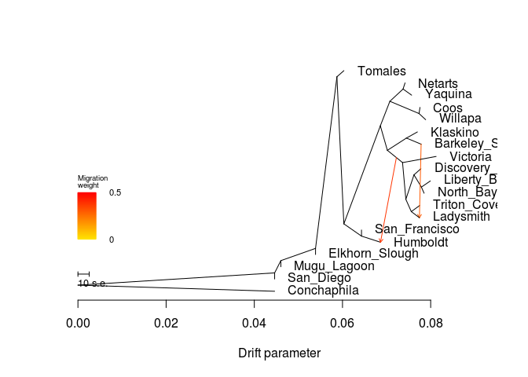

    ##  [1] 0.08123914 0.04461070 0.07745001 0.07992301 0.07783427 0.04461070
    ##  [7] 0.07698871 0.07757707 0.07418828 0.06861717 0.06431311 0.04601908
    ## [13] 0.05388605 0.07778223 0.07751336 0.07850555 0.07568061 0.07885984
    ## [19] 0.06031854
    ## [1] 0.003
    ## [1] "mse 0.000256445290858726"

    ## $d
    ##     V1             V2       V3      V4      V5  V6  V7 V8  V9 V10
    ## 1    0           <NA> NOT_ROOT NOT_MIG NOT_TIP 304 675  1 212  14
    ## 2    1       Victoria NOT_ROOT NOT_MIG     TIP  32  NA NA  NA  NA
    ## 3    2           <NA> NOT_ROOT NOT_MIG NOT_TIP 172  76  2  32   6
    ## 4    3      San_Diego NOT_ROOT NOT_MIG     TIP 256  NA NA  NA  NA
    ## 5    4      Ladysmith NOT_ROOT NOT_MIG     TIP 412  NA NA  NA  NA
    ## 6   15    Liberty_Bay NOT_ROOT NOT_MIG     TIP 472  NA NA  NA  NA
    ## 7   16           <NA> NOT_ROOT NOT_MIG NOT_TIP  32 356  3 412   2
    ## 8   31 Barkeley_Sound NOT_ROOT NOT_MIG     TIP  76  NA NA  NA  NA
    ## 9   32           <NA> NOT_ROOT NOT_MIG NOT_TIP   2   1  1  16   5
    ## 10  51    Conchaphila NOT_ROOT NOT_MIG     TIP 677  NA NA  NA  NA
    ## 11  52           <NA> NOT_ROOT NOT_MIG NOT_TIP 256 304 16 255   1
    ## 12  75       Klaskino NOT_ROOT NOT_MIG     TIP  76  NA NA  NA  NA
    ## 13  76           <NA> NOT_ROOT NOT_MIG NOT_TIP   2  75  1  31   1
    ## 14 103           Coos NOT_ROOT NOT_MIG     TIP 604  NA NA  NA  NA
    ## 15 104           <NA> NOT_ROOT     MIG NOT_TIP   2  32 NA  NA  NA
    ## 16 135        Netarts NOT_ROOT NOT_MIG     TIP 536  NA NA  NA  NA
    ## 17 136           <NA> NOT_ROOT NOT_MIG NOT_TIP 172 536  2 604   2
    ## 18 171       Humboldt NOT_ROOT NOT_MIG     TIP 715  NA NA  NA  NA
    ## 19 172           <NA> NOT_ROOT NOT_MIG NOT_TIP 212 136  4   2   8
    ## 20 211  San_Francisco NOT_ROOT NOT_MIG     TIP 715  NA NA  NA  NA
    ## 21 212           <NA> NOT_ROOT NOT_MIG NOT_TIP   0 172 12 715   2
    ## 22 255    Mugu_Lagoon NOT_ROOT NOT_MIG     TIP  52  NA NA  NA  NA
    ## 23 256           <NA> NOT_ROOT NOT_MIG NOT_TIP 677  52 17   3   1
    ## 24 303 Elkhorn_Slough NOT_ROOT NOT_MIG     TIP 304  NA NA  NA  NA
    ## 25 304           <NA> NOT_ROOT NOT_MIG NOT_TIP  52   0 15 303   1
    ## 26 355  Discovery_Bay NOT_ROOT NOT_MIG     TIP 356  NA NA  NA  NA
    ## 27 356           <NA> NOT_ROOT NOT_MIG NOT_TIP  16 355  1 472   2
    ## 28 411    Triton_Cove NOT_ROOT NOT_MIG     TIP 412  NA NA  NA  NA
    ## 29 412           <NA> NOT_ROOT NOT_MIG NOT_TIP  16 411  1   4   1
    ## 30 471      North_Bay NOT_ROOT NOT_MIG     TIP 472  NA NA  NA  NA
    ## 31 472           <NA> NOT_ROOT NOT_MIG NOT_TIP 356  15  1 471   1
    ## 32 535        Yaquina NOT_ROOT NOT_MIG     TIP 536  NA NA  NA  NA
    ## 33 536           <NA> NOT_ROOT NOT_MIG NOT_TIP 136 135  1 535   1
    ## 34 603        Willapa NOT_ROOT NOT_MIG     TIP 604  NA NA  NA  NA
    ## 35 604           <NA> NOT_ROOT NOT_MIG NOT_TIP 136 103  1 603   1
    ## 36 675        Tomales NOT_ROOT NOT_MIG     TIP   0  NA NA  NA  NA
    ## 37 677           <NA>     ROOT NOT_MIG NOT_TIP 677 256 18  51   1
    ## 38 693           <NA> NOT_ROOT     MIG NOT_TIP  76  31 NA  NA  NA
    ## 39 715           <NA> NOT_ROOT NOT_MIG NOT_TIP 212 211  1 171   1
    ##                                                                                                                                                                                                                                                                                                                                                                                                                                                                                                                                                                                                                     V11
    ## 1                                                                                                            (Tomales:0.00158187,((((Netarts:0.000451853,Yaquina:0.00194418):0.00299172,(Coos:0.000216871,Willapa:0.00149964):0.00661549):0.00215985,((Klaskino:0.00248875,Barkeley_Sound:0.00333431):0.00432106,(Victoria:0.0076174,((Discovery_Bay:0.00156792,(Liberty_Bay:0.00203105,North_Bay:0.000613586):0.00167765):0.00184402,(Triton_Cove:0.00190895,Ladysmith:0.00383805):0.00123412):0.000748554):0.00344284):0.00159404):0.00827396,(San_Francisco:0,Humboldt:0.0115585):0.00400221):0.00157423):0.00485062
    ## 2                                                                                                                                                                                                                                                                                                                                                                                                                                                                                                                                                                                                    Victoria:0.0076174
    ## 3                                                                                                                                                                                                                                                                                                                                        ((Klaskino:0.00248875,Barkeley_Sound:0.00333431):0.00432106,(Victoria:0.0076174,((Discovery_Bay:0.00156792,(Liberty_Bay:0.00203105,North_Bay:0.000613586):0.00167765):0.00184402,(Triton_Cove:0.00190895,Ladysmith:0.00383805):0.00123412):0.000748554):0.00344284):0.00159404
    ## 4                                                                                                                                                                                                                                                                                                                                                                                                                                                                                                                                                                                                           San_Diego:0
    ## 5                                                                                                                                                                                                                                                                                                                                                                                                                                                                                                                                                                                                  Ladysmith:0.00383805
    ## 6                                                                                                                                                                                                                                                                                                                                                                                                                                                                                                                                                                                                Liberty_Bay:0.00203105
    ## 7                                                                                                                                                                                                                                                                                                                                                                                                                                                ((Discovery_Bay:0.00156792,(Liberty_Bay:0.00203105,North_Bay:0.000613586):0.00167765):0.00184402,(Triton_Cove:0.00190895,Ladysmith:0.00383805):0.00123412):0.000748554
    ## 8                                                                                                                                                                                                                                                                                                                                                                                                                                                                                                                                                                                             Barkeley_Sound:0.00333431
    ## 9                                                                                                                                                                                                                                                                                                                                                                                                                (Victoria:0.0076174,((Discovery_Bay:0.00156792,(Liberty_Bay:0.00203105,North_Bay:0.000613586):0.00167765):0.00184402,(Triton_Cove:0.00190895,Ladysmith:0.00383805):0.00123412):0.000748554):0.00344284
    ## 10                                                                                                                                                                                                                                                                                                                                                                                                                                                                                                                                                                                                Conchaphila:0.0446107
    ## 11                                                  (((Tomales:0.00158187,((((Netarts:0.000451853,Yaquina:0.00194418):0.00299172,(Coos:0.000216871,Willapa:0.00149964):0.00661549):0.00215985,((Klaskino:0.00248875,Barkeley_Sound:0.00333431):0.00432106,(Victoria:0.0076174,((Discovery_Bay:0.00156792,(Liberty_Bay:0.00203105,North_Bay:0.000613586):0.00167765):0.00184402,(Triton_Cove:0.00190895,Ladysmith:0.00383805):0.00123412):0.000748554):0.00344284):0.00159404):0.00827396,(San_Francisco:0,Humboldt:0.0115585):0.00400221):0.00157423):0.00485062,Elkhorn_Slough:0):0.00786697,Mugu_Lagoon:0):0.00140838
    ## 12                                                                                                                                                                                                                                                                                                                                                                                                                                                                                                                                                                                                  Klaskino:0.00248875
    ## 13                                                                                                                                                                                                                                                                                                                                                                                                                                                                                                                                                           (Klaskino:0.00248875,Barkeley_Sound:0.00333431):0.00432106
    ## 14                                                                                                                                                                                                                                                                                                                                                                                                                                                                                                                                                                                                     Coos:0.000216871
    ## 15                                                                                                                                                                                                                                                                                                                                                                                                                                                                                                                                                                                                                 <NA>
    ## 16                                                                                                                                                                                                                                                                                                                                                                                                                                                                                                                                                                                                  Netarts:0.000451853
    ## 17                                                                                                                                                                                                                                                                                                                                                                                                                                                                                                    ((Netarts:0.000451853,Yaquina:0.00194418):0.00299172,(Coos:0.000216871,Willapa:0.00149964):0.00661549):0.00215985
    ## 18                                                                                                                                                                                                                                                                                                                                                                                                                                                                                                                                                                                                   Humboldt:0.0115585
    ## 19                                                                                                                                                                                                        (((Netarts:0.000451853,Yaquina:0.00194418):0.00299172,(Coos:0.000216871,Willapa:0.00149964):0.00661549):0.00215985,((Klaskino:0.00248875,Barkeley_Sound:0.00333431):0.00432106,(Victoria:0.0076174,((Discovery_Bay:0.00156792,(Liberty_Bay:0.00203105,North_Bay:0.000613586):0.00167765):0.00184402,(Triton_Cove:0.00190895,Ladysmith:0.00383805):0.00123412):0.000748554):0.00344284):0.00159404):0.00827396
    ## 20                                                                                                                                                                                                                                                                                                                                                                                                                                                                                                                                                                                                      San_Francisco:0
    ## 21                                                                                                                                           ((((Netarts:0.000451853,Yaquina:0.00194418):0.00299172,(Coos:0.000216871,Willapa:0.00149964):0.00661549):0.00215985,((Klaskino:0.00248875,Barkeley_Sound:0.00333431):0.00432106,(Victoria:0.0076174,((Discovery_Bay:0.00156792,(Liberty_Bay:0.00203105,North_Bay:0.000613586):0.00167765):0.00184402,(Triton_Cove:0.00190895,Ladysmith:0.00383805):0.00123412):0.000748554):0.00344284):0.00159404):0.00827396,(San_Francisco:0,Humboldt:0.0115585):0.00400221):0.00157423
    ## 22                                                                                                                                                                                                                                                                                                                                                                                                                                                                                                                                                                                                        Mugu_Lagoon:0
    ## 23                          ((((Tomales:0.00158187,((((Netarts:0.000451853,Yaquina:0.00194418):0.00299172,(Coos:0.000216871,Willapa:0.00149964):0.00661549):0.00215985,((Klaskino:0.00248875,Barkeley_Sound:0.00333431):0.00432106,(Victoria:0.0076174,((Discovery_Bay:0.00156792,(Liberty_Bay:0.00203105,North_Bay:0.000613586):0.00167765):0.00184402,(Triton_Cove:0.00190895,Ladysmith:0.00383805):0.00123412):0.000748554):0.00344284):0.00159404):0.00827396,(San_Francisco:0,Humboldt:0.0115585):0.00400221):0.00157423):0.00485062,Elkhorn_Slough:0):0.00786697,Mugu_Lagoon:0):0.00140838,San_Diego:0):0.0446107
    ## 24                                                                                                                                                                                                                                                                                                                                                                                                                                                                                                                                                                                                     Elkhorn_Slough:0
    ## 25                                                                             ((Tomales:0.00158187,((((Netarts:0.000451853,Yaquina:0.00194418):0.00299172,(Coos:0.000216871,Willapa:0.00149964):0.00661549):0.00215985,((Klaskino:0.00248875,Barkeley_Sound:0.00333431):0.00432106,(Victoria:0.0076174,((Discovery_Bay:0.00156792,(Liberty_Bay:0.00203105,North_Bay:0.000613586):0.00167765):0.00184402,(Triton_Cove:0.00190895,Ladysmith:0.00383805):0.00123412):0.000748554):0.00344284):0.00159404):0.00827396,(San_Francisco:0,Humboldt:0.0115585):0.00400221):0.00157423):0.00485062,Elkhorn_Slough:0):0.00786697
    ## 26                                                                                                                                                                                                                                                                                                                                                                                                                                                                                                                                                                                             Discovery_Bay:0.00156792
    ## 27                                                                                                                                                                                                                                                                                                                                                                                                                                                                                                                      (Discovery_Bay:0.00156792,(Liberty_Bay:0.00203105,North_Bay:0.000613586):0.00167765):0.00184402
    ## 28                                                                                                                                                                                                                                                                                                                                                                                                                                                                                                                                                                                               Triton_Cove:0.00190895
    ## 29                                                                                                                                                                                                                                                                                                                                                                                                                                                                                                                                                             (Triton_Cove:0.00190895,Ladysmith:0.00383805):0.00123412
    ## 30                                                                                                                                                                                                                                                                                                                                                                                                                                                                                                                                                                                                North_Bay:0.000613586
    ## 31                                                                                                                                                                                                                                                                                                                                                                                                                                                                                                                                                            (Liberty_Bay:0.00203105,North_Bay:0.000613586):0.00167765
    ## 32                                                                                                                                                                                                                                                                                                                                                                                                                                                                                                                                                                                                   Yaquina:0.00194418
    ## 33                                                                                                                                                                                                                                                                                                                                                                                                                                                                                                                                                                  (Netarts:0.000451853,Yaquina:0.00194418):0.00299172
    ## 34                                                                                                                                                                                                                                                                                                                                                                                                                                                                                                                                                                                                   Willapa:0.00149964
    ## 35                                                                                                                                                                                                                                                                                                                                                                                                                                                                                                                                                                     (Coos:0.000216871,Willapa:0.00149964):0.00661549
    ## 36                                                                                                                                                                                                                                                                                                                                                                                                                                                                                                                                                                                                   Tomales:0.00158187
    ## 37 (((((Tomales:0.00158187,((((Netarts:0.000451853,Yaquina:0.00194418):0.00299172,(Coos:0.000216871,Willapa:0.00149964):0.00661549):0.00215985,((Klaskino:0.00248875,Barkeley_Sound:0.00333431):0.00432106,(Victoria:0.0076174,((Discovery_Bay:0.00156792,(Liberty_Bay:0.00203105,North_Bay:0.000613586):0.00167765):0.00184402,(Triton_Cove:0.00190895,Ladysmith:0.00383805):0.00123412):0.000748554):0.00344284):0.00159404):0.00827396,(San_Francisco:0,Humboldt:0.0115585):0.00400221):0.00157423):0.00485062,Elkhorn_Slough:0):0.00786697,Mugu_Lagoon:0):0.00140838,San_Diego:0):0.0446107,Conchaphila:0.0446107);
    ## 38                                                                                                                                                                                                                                                                                                                                                                                                                                                                                                                                                                                                                 <NA>
    ## 39                                                                                                                                                                                                                                                                                                                                                                                                                                                                                                                                                                      (San_Francisco:0,Humboldt:0.0115585):0.00400221
    ##             x          y       ymin       ymax
    ## 1  0.05873667 0.94736842 0.21052632 1.00000000
    ## 2  0.08123914 0.60526316 0.57894737 0.63157895
    ## 3  0.07017890 0.63157895 0.31578947 0.73684211
    ## 4  0.04461070 0.07894737 0.05263158 0.10526316
    ## 5  0.07745001 0.34210526 0.31578947 0.36842105
    ## 6  0.07992301 0.50000000 0.47368421 0.52631579
    ## 7  0.07437029 0.42105263 0.31578947 0.57894737
    ## 8  0.07783427 0.65789474 0.63157895 0.68421053
    ## 9  0.07362174 0.57894737 0.31578947 0.63157895
    ## 10 0.04461070 0.02631579 0.00000000 0.05263158
    ## 11 0.04601908 0.15789474 0.10526316 1.00000000
    ## 12 0.07698871 0.71052632 0.68421053 0.73684211
    ## 13 0.07449996 0.68421053 0.63157895 0.73684211
    ## 14 0.07757707 0.81578947 0.78947368 0.84210526
    ## 15 0.07222276 0.60033400 0.31578947 0.63157895
    ## 16 0.07418828 0.92105263 0.89473684 0.94736842
    ## 17 0.07074471 0.84210526 0.73684211 0.94736842
    ## 18 0.06861717 0.23684211 0.21052632 0.26315789
    ## 19 0.06858486 0.73684211 0.31578947 0.94736842
    ## 20 0.06431311 0.28947368 0.26315789 0.31578947
    ## 21 0.06031090 0.31578947 0.21052632 0.94736842
    ## 22 0.04601908 0.13157895 0.10526316 0.15789474
    ## 23 0.04461070 0.10526316 0.05263158 1.00000000
    ## 24 0.05388605 0.18421053 0.15789474 0.21052632
    ## 25 0.05388605 0.21052632 0.15789474 1.00000000
    ## 26 0.07778223 0.55263158 0.52631579 0.57894737
    ## 27 0.07621431 0.52631579 0.42105263 0.57894737
    ## 28 0.07751336 0.39473684 0.36842105 0.42105263
    ## 29 0.07560441 0.36842105 0.31578947 0.42105263
    ## 30 0.07850555 0.44736842 0.42105263 0.47368421
    ## 31 0.07789196 0.47368421 0.42105263 0.52631579
    ## 32 0.07568061 0.86842105 0.84210526 0.89473684
    ## 33 0.07373643 0.89473684 0.84210526 0.94736842
    ## 34 0.07885984 0.76315789 0.73684211 0.78947368
    ## 35 0.07736020 0.78947368 0.73684211 0.84210526
    ## 36 0.06031854 0.97368421 0.94736842 1.00000000
    ## 37 0.00000000 0.05263158 0.00000000 1.00000000
    ## 38 0.07783427 0.65789474 0.63157895 0.68421053
    ## 39 0.06431311 0.26315789 0.21052632 0.31578947
    ## 
    ## $e
    ##     V1  V2          V3       V4      V5       V6       V7
    ## 1   76  75 0.002488750 1.000000 NOT_MIG 0.000000 1.000000
    ## 2  104  32 0.001398980 1.000000 NOT_MIG 0.593654 1.000000
    ## 3  356 355 0.001567920 1.000000 NOT_MIG 0.000000 1.000000
    ## 4  412 411 0.001908950 1.000000 NOT_MIG 0.000000 1.000000
    ## 5  356 472 0.001677650 1.000000 NOT_MIG 0.000000 1.000000
    ## 6  472  15 0.002031050 1.000000 NOT_MIG 0.000000 1.000000
    ## 7  472 471 0.000613586 1.000000 NOT_MIG 0.000000 1.000000
    ## 8  136 536 0.002991720 1.000000 NOT_MIG 0.000000 1.000000
    ## 9  536 135 0.000451853 1.000000 NOT_MIG 0.000000 1.000000
    ## 10 536 535 0.001944180 1.000000 NOT_MIG 0.000000 1.000000
    ## 11 136 604 0.006615490 1.000000 NOT_MIG 0.000000 1.000000
    ## 12 604 103 0.000216871 1.000000 NOT_MIG 0.000000 1.000000
    ## 13 604 603 0.001499640 1.000000 NOT_MIG 0.000000 1.000000
    ## 14 212 172 0.008273960 1.000000 NOT_MIG 0.000000 1.000000
    ## 15 304   0 0.004850620 1.000000 NOT_MIG 0.000000 1.000000
    ## 16 677 256 0.044610700 1.000000 NOT_MIG 0.000000 1.000000
    ## 17   0 675 0.001581870 1.000000 NOT_MIG 0.000000 1.000000
    ## 18   0 212 0.001574230 1.000000 NOT_MIG 0.000000 1.000000
    ## 19  76 693 0.003334310 1.000000 NOT_MIG 0.000000 1.000000
    ## 20 693  31 0.000000000 1.000000 NOT_MIG 1.000000 1.000000
    ## 21 693   4 0.000000000 0.306554     MIG 1.000000 0.000000
    ## 22  32   1 0.007617400 1.000000 NOT_MIG 0.000000 1.000000
    ## 23  32  16 0.000748554 1.000000 NOT_MIG 0.000000 1.000000
    ## 24  16 356 0.001844020 1.000000 NOT_MIG 0.000000 1.000000
    ## 25  16 412 0.001234120 1.000000 NOT_MIG 0.000000 1.000000
    ## 26 412   4 0.001845593 0.693446 NOT_MIG 0.000000 0.480867
    ## 27 304 303 0.000000000 1.000000 NOT_MIG 0.000000 1.000000
    ## 28  52 304 0.007866970 1.000000 NOT_MIG 0.000000 1.000000
    ## 29  52 255 0.000000000 1.000000 NOT_MIG 0.000000 1.000000
    ## 30 256  52 0.001408380 1.000000 NOT_MIG 0.000000 1.000000
    ## 31 677  51 0.044610700 1.000000 NOT_MIG 0.000000 1.000000
    ## 32 256   3 0.000000000 1.000000 NOT_MIG 0.000000 1.000000
    ## 33 212 715 0.004002210 1.000000 NOT_MIG 0.000000 1.000000
    ## 34 715 211 0.000000000 1.000000 NOT_MIG 0.000000 1.000000
    ## 35 715 171 0.004304063 0.610223 NOT_MIG 0.000000 0.372372
    ## 36 172 136 0.002159850 1.000000 NOT_MIG 0.000000 1.000000
    ## 37 172   2 0.001594040 1.000000 NOT_MIG 0.000000 1.000000
    ## 38   2  76 0.004321060 1.000000 NOT_MIG 0.000000 1.000000
    ## 39   2 104 0.002043860 1.000000 NOT_MIG 0.000000 1.000000
    ## 40 104 171 0.000000000 0.389777     MIG 0.593654 0.000000

``` r
system("treemix -i All/All-m70x62-mac4.pop.TM.gz -root Conchaphila -m 3 -o All/All-m70x62-mac4-pop_m3 > out")
```

``` r
plot_tree("All/All-m70x62-mac4-pop_m3")
```

    ## Warning in plot_tree("All/All-m70x62-mac4-pop_m3"): NAs introduced by
    ## coercion

    ## Warning in plot_tree("All/All-m70x62-mac4-pop_m3"): NAs introduced by
    ## coercion

    ## Warning in plot_tree("All/All-m70x62-mac4-pop_m3"): NAs introduced by
    ## coercion

    ## Warning in plot_tree("All/All-m70x62-mac4-pop_m3"): NAs introduced by
    ## coercion

    ##     V1             V2       V3      V4      V5  V6  V7 V8  V9 V10
    ## 1    1        Yaquina NOT_ROOT NOT_MIG     TIP  16  NA NA  NA  NA
    ## 2    2           <NA> NOT_ROOT NOT_MIG NOT_TIP  32 536  2 676   6
    ## 3    3      San_Diego NOT_ROOT NOT_MIG     TIP 136  NA NA  NA  NA
    ## 4    4    Liberty_Bay NOT_ROOT NOT_MIG     TIP 172  NA NA  NA  NA
    ## 5   15        Netarts NOT_ROOT NOT_MIG     TIP  16  NA NA  NA  NA
    ## 6   16           <NA> NOT_ROOT NOT_MIG NOT_TIP  52   1  1  15   1
    ## 7   31  San_Francisco NOT_ROOT NOT_MIG     TIP 715  NA NA  NA  NA
    ## 8   32           <NA> NOT_ROOT NOT_MIG NOT_TIP  76  52  4   2   8
    ## 9   51           Coos NOT_ROOT NOT_MIG     TIP 356  NA NA  NA  NA
    ## 10  52           <NA> NOT_ROOT NOT_MIG NOT_TIP  32 356  2  16   2
    ## 11  75       Humboldt NOT_ROOT NOT_MIG     TIP 715  NA NA  NA  NA
    ## 12  76           <NA> NOT_ROOT NOT_MIG NOT_TIP 256  32 12 715   2
    ## 13 103  Discovery_Bay NOT_ROOT NOT_MIG     TIP 104  NA NA  NA  NA
    ## 14 104           <NA> NOT_ROOT NOT_MIG NOT_TIP 304 103  1 172   2
    ## 15 135    Conchaphila NOT_ROOT NOT_MIG     TIP 677  NA NA  NA  NA
    ## 16 136           <NA> NOT_ROOT NOT_MIG NOT_TIP 677 412 17   3   1
    ## 17 171      North_Bay NOT_ROOT NOT_MIG     TIP 172  NA NA  NA  NA
    ## 18 172           <NA> NOT_ROOT NOT_MIG NOT_TIP 104 171  1   4   1
    ## 19 211 Barkeley_Sound NOT_ROOT NOT_MIG     TIP 536  NA NA  NA  NA
    ## 20 212           <NA> NOT_ROOT     MIG NOT_TIP   2 676 NA  NA  NA
    ## 21 255        Tomales NOT_ROOT NOT_MIG     TIP 256  NA NA  NA  NA
    ## 22 256           <NA> NOT_ROOT NOT_MIG NOT_TIP 604 255  1  76  14
    ## 23 303       Victoria NOT_ROOT NOT_MIG     TIP 676  NA NA  NA  NA
    ## 24 304           <NA> NOT_ROOT NOT_MIG NOT_TIP 676 472  2 104   3
    ## 25 355        Willapa NOT_ROOT NOT_MIG     TIP 356  NA NA  NA  NA
    ## 26 356           <NA> NOT_ROOT NOT_MIG NOT_TIP  52  51  1 355   1
    ## 27 411    Mugu_Lagoon NOT_ROOT NOT_MIG     TIP 412  NA NA  NA  NA
    ## 28 412           <NA> NOT_ROOT NOT_MIG NOT_TIP 136 604 16 411   1
    ## 29 471    Triton_Cove NOT_ROOT NOT_MIG     TIP 472  NA NA  NA  NA
    ## 30 472           <NA> NOT_ROOT NOT_MIG NOT_TIP 304 471  1 675   1
    ## 31 535       Klaskino NOT_ROOT NOT_MIG     TIP 536  NA NA  NA  NA
    ## 32 536           <NA> NOT_ROOT NOT_MIG NOT_TIP   2 535  1 211   1
    ## 33 603 Elkhorn_Slough NOT_ROOT NOT_MIG     TIP 604  NA NA  NA  NA
    ## 34 604           <NA> NOT_ROOT NOT_MIG NOT_TIP 412 256 15 603   1
    ## 35 675      Ladysmith NOT_ROOT NOT_MIG     TIP 472  NA NA  NA  NA
    ## 36 676           <NA> NOT_ROOT NOT_MIG NOT_TIP   2 303  1 304   5
    ## 37 677           <NA>     ROOT NOT_MIG NOT_TIP 677 136 18 135   1
    ## 38 681           <NA> NOT_ROOT     MIG NOT_TIP 536 211 NA  NA  NA
    ## 39 715           <NA> NOT_ROOT NOT_MIG NOT_TIP  76  31  1  75   1
    ## 40 748           <NA> NOT_ROOT     MIG NOT_TIP 172   4 NA  NA  NA
    ##                                                                                                                                                                                                                                                                                                                                                                                                                                                                                                                                                                                                                   V11
    ## 1                                                                                                                                                                                                                                                                                                                                                                                                                                                                                                                                                                                                 Yaquina:0.000740114
    ## 2                                                                                                                                                                                                                                                                                                                                       ((Klaskino:0.00249055,Barkeley_Sound:0.00333386):0.00424912,(Victoria:0.0075866,((Triton_Cove:0.00190981,Ladysmith:0.00383772):0.00121541,(Discovery_Bay:0.00154489,(North_Bay:0.000572201,Liberty_Bay:0.0020736):0.00172903):0.00189144):0.000743347):0.00352359):0.00173317
    ## 3                                                                                                                                                                                                                                                                                                                                                                                                                                                                                                                                                                                                         San_Diego:0
    ## 4                                                                                                                                                                                                                                                                                                                                                                                                                                                                                                                                                                                               Liberty_Bay:0.0020736
    ## 5                                                                                                                                                                                                                                                                                                                                                                                                                                                                                                                                                                                                   Netarts:0.0017775
    ## 6                                                                                                                                                                                                                                                                                                                                                                                                                                                                                                                                                                  (Yaquina:0.000740114,Netarts:0.0017775):0.00389542
    ## 7                                                                                                                                                                                                                                                                                                                                                                                                                                                                                                                                                                                                     San_Francisco:0
    ## 8                                                                                                                                                                                                         (((Coos:0.000216913,Willapa:0.00149969):0.00622342,(Yaquina:0.000740114,Netarts:0.0017775):0.00389542):0.00252953,((Klaskino:0.00249055,Barkeley_Sound:0.00333386):0.00424912,(Victoria:0.0075866,((Triton_Cove:0.00190981,Ladysmith:0.00383772):0.00121541,(Discovery_Bay:0.00154489,(North_Bay:0.000572201,Liberty_Bay:0.0020736):0.00172903):0.00189144):0.000743347):0.00352359):0.00173317):0.00807227
    ## 9                                                                                                                                                                                                                                                                                                                                                                                                                                                                                                                                                                                                    Coos:0.000216913
    ## 10                                                                                                                                                                                                                                                                                                                                                                                                                                                                                                   ((Coos:0.000216913,Willapa:0.00149969):0.00622342,(Yaquina:0.000740114,Netarts:0.0017775):0.00389542):0.00252953
    ## 11                                                                                                                                                                                                                                                                                                                                                                                                                                                                                                                                                                                                 Humboldt:0.0113079
    ## 12                                                                                                                                           ((((Coos:0.000216913,Willapa:0.00149969):0.00622342,(Yaquina:0.000740114,Netarts:0.0017775):0.00389542):0.00252953,((Klaskino:0.00249055,Barkeley_Sound:0.00333386):0.00424912,(Victoria:0.0075866,((Triton_Cove:0.00190981,Ladysmith:0.00383772):0.00121541,(Discovery_Bay:0.00154489,(North_Bay:0.000572201,Liberty_Bay:0.0020736):0.00172903):0.00189144):0.000743347):0.00352359):0.00173317):0.00807227,(San_Francisco:0,Humboldt:0.0113079):0.00399292):0.00158443
    ## 13                                                                                                                                                                                                                                                                                                                                                                                                                                                                                                                                                                                           Discovery_Bay:0.00154489
    ## 14                                                                                                                                                                                                                                                                                                                                                                                                                                                                                                                     (Discovery_Bay:0.00154489,(North_Bay:0.000572201,Liberty_Bay:0.0020736):0.00172903):0.00189144
    ## 15                                                                                                                                                                                                                                                                                                                                                                                                                                                                                                                                                                                              Conchaphila:0.0446108
    ## 16                          ((((Tomales:0.00158192,((((Coos:0.000216913,Willapa:0.00149969):0.00622342,(Yaquina:0.000740114,Netarts:0.0017775):0.00389542):0.00252953,((Klaskino:0.00249055,Barkeley_Sound:0.00333386):0.00424912,(Victoria:0.0075866,((Triton_Cove:0.00190981,Ladysmith:0.00383772):0.00121541,(Discovery_Bay:0.00154489,(North_Bay:0.000572201,Liberty_Bay:0.0020736):0.00172903):0.00189144):0.000743347):0.00352359):0.00173317):0.00807227,(San_Francisco:0,Humboldt:0.0113079):0.00399292):0.00158443):0.00485063,Elkhorn_Slough:0):0.00786697,Mugu_Lagoon:0):0.00140839,San_Diego:0):0.0446108
    ## 17                                                                                                                                                                                                                                                                                                                                                                                                                                                                                                                                                                                              North_Bay:0.000572201
    ## 18                                                                                                                                                                                                                                                                                                                                                                                                                                                                                                                                                           (North_Bay:0.000572201,Liberty_Bay:0.0020736):0.00172903
    ## 19                                                                                                                                                                                                                                                                                                                                                                                                                                                                                                                                                                                          Barkeley_Sound:0.00333386
    ## 20                                                                                                                                                                                                                                                                                                                                                                                                                                                                                                                                                                                                               <NA>
    ## 21                                                                                                                                                                                                                                                                                                                                                                                                                                                                                                                                                                                                 Tomales:0.00158192
    ## 22                                                                                                           (Tomales:0.00158192,((((Coos:0.000216913,Willapa:0.00149969):0.00622342,(Yaquina:0.000740114,Netarts:0.0017775):0.00389542):0.00252953,((Klaskino:0.00249055,Barkeley_Sound:0.00333386):0.00424912,(Victoria:0.0075866,((Triton_Cove:0.00190981,Ladysmith:0.00383772):0.00121541,(Discovery_Bay:0.00154489,(North_Bay:0.000572201,Liberty_Bay:0.0020736):0.00172903):0.00189144):0.000743347):0.00352359):0.00173317):0.00807227,(San_Francisco:0,Humboldt:0.0113079):0.00399292):0.00158443):0.00485063
    ## 23                                                                                                                                                                                                                                                                                                                                                                                                                                                                                                                                                                                                 Victoria:0.0075866
    ## 24                                                                                                                                                                                                                                                                                                                                                                                                                                              ((Triton_Cove:0.00190981,Ladysmith:0.00383772):0.00121541,(Discovery_Bay:0.00154489,(North_Bay:0.000572201,Liberty_Bay:0.0020736):0.00172903):0.00189144):0.000743347
    ## 25                                                                                                                                                                                                                                                                                                                                                                                                                                                                                                                                                                                                 Willapa:0.00149969
    ## 26                                                                                                                                                                                                                                                                                                                                                                                                                                                                                                                                                                   (Coos:0.000216913,Willapa:0.00149969):0.00622342
    ## 27                                                                                                                                                                                                                                                                                                                                                                                                                                                                                                                                                                                                      Mugu_Lagoon:0
    ## 28                                                  (((Tomales:0.00158192,((((Coos:0.000216913,Willapa:0.00149969):0.00622342,(Yaquina:0.000740114,Netarts:0.0017775):0.00389542):0.00252953,((Klaskino:0.00249055,Barkeley_Sound:0.00333386):0.00424912,(Victoria:0.0075866,((Triton_Cove:0.00190981,Ladysmith:0.00383772):0.00121541,(Discovery_Bay:0.00154489,(North_Bay:0.000572201,Liberty_Bay:0.0020736):0.00172903):0.00189144):0.000743347):0.00352359):0.00173317):0.00807227,(San_Francisco:0,Humboldt:0.0113079):0.00399292):0.00158443):0.00485063,Elkhorn_Slough:0):0.00786697,Mugu_Lagoon:0):0.00140839
    ## 29                                                                                                                                                                                                                                                                                                                                                                                                                                                                                                                                                                                             Triton_Cove:0.00190981
    ## 30                                                                                                                                                                                                                                                                                                                                                                                                                                                                                                                                                           (Triton_Cove:0.00190981,Ladysmith:0.00383772):0.00121541
    ## 31                                                                                                                                                                                                                                                                                                                                                                                                                                                                                                                                                                                                Klaskino:0.00249055
    ## 32                                                                                                                                                                                                                                                                                                                                                                                                                                                                                                                                                         (Klaskino:0.00249055,Barkeley_Sound:0.00333386):0.00424912
    ## 33                                                                                                                                                                                                                                                                                                                                                                                                                                                                                                                                                                                                   Elkhorn_Slough:0
    ## 34                                                                             ((Tomales:0.00158192,((((Coos:0.000216913,Willapa:0.00149969):0.00622342,(Yaquina:0.000740114,Netarts:0.0017775):0.00389542):0.00252953,((Klaskino:0.00249055,Barkeley_Sound:0.00333386):0.00424912,(Victoria:0.0075866,((Triton_Cove:0.00190981,Ladysmith:0.00383772):0.00121541,(Discovery_Bay:0.00154489,(North_Bay:0.000572201,Liberty_Bay:0.0020736):0.00172903):0.00189144):0.000743347):0.00352359):0.00173317):0.00807227,(San_Francisco:0,Humboldt:0.0113079):0.00399292):0.00158443):0.00485063,Elkhorn_Slough:0):0.00786697
    ## 35                                                                                                                                                                                                                                                                                                                                                                                                                                                                                                                                                                                               Ladysmith:0.00383772
    ## 36                                                                                                                                                                                                                                                                                                                                                                                                              (Victoria:0.0075866,((Triton_Cove:0.00190981,Ladysmith:0.00383772):0.00121541,(Discovery_Bay:0.00154489,(North_Bay:0.000572201,Liberty_Bay:0.0020736):0.00172903):0.00189144):0.000743347):0.00352359
    ## 37 (((((Tomales:0.00158192,((((Coos:0.000216913,Willapa:0.00149969):0.00622342,(Yaquina:0.000740114,Netarts:0.0017775):0.00389542):0.00252953,((Klaskino:0.00249055,Barkeley_Sound:0.00333386):0.00424912,(Victoria:0.0075866,((Triton_Cove:0.00190981,Ladysmith:0.00383772):0.00121541,(Discovery_Bay:0.00154489,(North_Bay:0.000572201,Liberty_Bay:0.0020736):0.00172903):0.00189144):0.000743347):0.00352359):0.00173317):0.00807227,(San_Francisco:0,Humboldt:0.0113079):0.00399292):0.00158443):0.00485063,Elkhorn_Slough:0):0.00786697,Mugu_Lagoon:0):0.00140839,San_Diego:0):0.0446108,Conchaphila:0.0446108);
    ## 38                                                                                                                                                                                                                                                                                                                                                                                                                                                                                                                                                                                                               <NA>
    ## 39                                                                                                                                                                                                                                                                                                                                                                                                                                                                                                                                                                    (San_Francisco:0,Humboldt:0.0113079):0.00399292
    ## 40                                                                                                                                                                                                                                                                                                                                                                                                                                                                                                                                                                                                               <NA>
    ##             x          y       ymin       ymax
    ## 1  0.07555855 0.81578947 0.78947368 0.84210526
    ## 2  0.07012666 0.63157895 0.31578947 0.73684211
    ## 3  0.04461080 0.07894737 0.05263158 0.10526316
    ## 4  0.08008768 0.34210526 0.31578947 0.36842105
    ## 5  0.07615569 0.76315789 0.73684211 0.78947368
    ## 6  0.07481844 0.78947368 0.73684211 0.84210526
    ## 7  0.06431414 0.28947368 0.26315789 0.31578947
    ## 8  0.06839349 0.73684211 0.31578947 0.94736842
    ## 9  0.07736335 0.92105263 0.89473684 0.94736842
    ## 10 0.07092302 0.84210526 0.73684211 0.94736842
    ## 11 0.06858463 0.23684211 0.21052632 0.26315789
    ## 12 0.06032122 0.31578947 0.21052632 0.94736842
    ## 13 0.07782994 0.44736842 0.42105263 0.47368421
    ## 14 0.07628505 0.42105263 0.31578947 0.47368421
    ## 15 0.04461080 0.02631579 0.00000000 0.05263158
    ## 16 0.04461080 0.10526316 0.05263158 1.00000000
    ## 17 0.07858628 0.39473684 0.36842105 0.42105263
    ## 18 0.07801408 0.36842105 0.31578947 0.42105263
    ## 19 0.07770964 0.65789474 0.63157895 0.68421053
    ## 20 0.07240825         NA 0.31578947 0.63157895
    ## 21 0.06031871 0.97368421 0.94736842 1.00000000
    ## 22 0.05873679 0.94736842 0.21052632 1.00000000
    ## 23 0.08123686 0.60526316 0.57894737 0.63157895
    ## 24 0.07439361 0.47368421 0.31578947 0.57894737
    ## 25 0.07864613 0.86842105 0.84210526 0.89473684
    ## 26 0.07714644 0.89473684 0.84210526 0.94736842
    ## 27 0.04601919 0.13157895 0.10526316 0.15789474
    ## 28 0.04601919 0.15789474 0.10526316 1.00000000
    ## 29 0.07751883 0.55263158 0.52631579 0.57894737
    ## 30 0.07560902 0.52631579 0.47368421 0.57894737
    ## 31 0.07686633 0.71052632 0.68421053 0.73684211
    ## 32 0.07437578 0.68421053 0.63157895 0.73684211
    ## 33 0.05388616 0.18421053 0.15789474 0.21052632
    ## 34 0.05388616 0.21052632 0.15789474 1.00000000
    ## 35 0.07745279 0.50000000 0.47368421 0.52631579
    ## 36 0.07365026 0.57894737 0.31578947 0.63157895
    ## 37 0.00000000 0.05263158 0.00000000 1.00000000
    ## 38 0.07770964         NA 0.63157895 0.68421053
    ## 39 0.06431414 0.26315789 0.21052632 0.31578947
    ## 40 0.08008768         NA 0.31578947 0.36842105
    ## [1] "0.647517 0.07012666 0.07365026"
    ## [1] "1 0.07437578 0.07770964"
    ## [1] "1 0.078014077 0.080087677"


    ##  [1] 0.07555855 0.04461080 0.08008768 0.07615569 0.06431414 0.07736335
    ##  [7] 0.06858463 0.07782994 0.04461080 0.07858628 0.07770964 0.06031871
    ## [13] 0.08123686 0.07864613 0.04601919 0.07751883 0.07686633 0.05388616
    ## [19] 0.07745279
    ## [1] 0.003
    ## [1] "mse 0.000256445290858726"

    ## $d
    ##     V1             V2       V3      V4      V5  V6  V7 V8  V9 V10
    ## 1    1        Yaquina NOT_ROOT NOT_MIG     TIP  16  NA NA  NA  NA
    ## 2    2           <NA> NOT_ROOT NOT_MIG NOT_TIP  32 536  2 676   6
    ## 3    3      San_Diego NOT_ROOT NOT_MIG     TIP 136  NA NA  NA  NA
    ## 4    4    Liberty_Bay NOT_ROOT NOT_MIG     TIP 172  NA NA  NA  NA
    ## 5   15        Netarts NOT_ROOT NOT_MIG     TIP  16  NA NA  NA  NA
    ## 6   16           <NA> NOT_ROOT NOT_MIG NOT_TIP  52   1  1  15   1
    ## 7   31  San_Francisco NOT_ROOT NOT_MIG     TIP 715  NA NA  NA  NA
    ## 8   32           <NA> NOT_ROOT NOT_MIG NOT_TIP  76  52  4   2   8
    ## 9   51           Coos NOT_ROOT NOT_MIG     TIP 356  NA NA  NA  NA
    ## 10  52           <NA> NOT_ROOT NOT_MIG NOT_TIP  32 356  2  16   2
    ## 11  75       Humboldt NOT_ROOT NOT_MIG     TIP 715  NA NA  NA  NA
    ## 12  76           <NA> NOT_ROOT NOT_MIG NOT_TIP 256  32 12 715   2
    ## 13 103  Discovery_Bay NOT_ROOT NOT_MIG     TIP 104  NA NA  NA  NA
    ## 14 104           <NA> NOT_ROOT NOT_MIG NOT_TIP 304 103  1 172   2
    ## 15 135    Conchaphila NOT_ROOT NOT_MIG     TIP 677  NA NA  NA  NA
    ## 16 136           <NA> NOT_ROOT NOT_MIG NOT_TIP 677 412 17   3   1
    ## 17 171      North_Bay NOT_ROOT NOT_MIG     TIP 172  NA NA  NA  NA
    ## 18 172           <NA> NOT_ROOT NOT_MIG NOT_TIP 104 171  1   4   1
    ## 19 211 Barkeley_Sound NOT_ROOT NOT_MIG     TIP 536  NA NA  NA  NA
    ## 20 212           <NA> NOT_ROOT     MIG NOT_TIP   2 676 NA  NA  NA
    ## 21 255        Tomales NOT_ROOT NOT_MIG     TIP 256  NA NA  NA  NA
    ## 22 256           <NA> NOT_ROOT NOT_MIG NOT_TIP 604 255  1  76  14
    ## 23 303       Victoria NOT_ROOT NOT_MIG     TIP 676  NA NA  NA  NA
    ## 24 304           <NA> NOT_ROOT NOT_MIG NOT_TIP 676 472  2 104   3
    ## 25 355        Willapa NOT_ROOT NOT_MIG     TIP 356  NA NA  NA  NA
    ## 26 356           <NA> NOT_ROOT NOT_MIG NOT_TIP  52  51  1 355   1
    ## 27 411    Mugu_Lagoon NOT_ROOT NOT_MIG     TIP 412  NA NA  NA  NA
    ## 28 412           <NA> NOT_ROOT NOT_MIG NOT_TIP 136 604 16 411   1
    ## 29 471    Triton_Cove NOT_ROOT NOT_MIG     TIP 472  NA NA  NA  NA
    ## 30 472           <NA> NOT_ROOT NOT_MIG NOT_TIP 304 471  1 675   1
    ## 31 535       Klaskino NOT_ROOT NOT_MIG     TIP 536  NA NA  NA  NA
    ## 32 536           <NA> NOT_ROOT NOT_MIG NOT_TIP   2 535  1 211   1
    ## 33 603 Elkhorn_Slough NOT_ROOT NOT_MIG     TIP 604  NA NA  NA  NA
    ## 34 604           <NA> NOT_ROOT NOT_MIG NOT_TIP 412 256 15 603   1
    ## 35 675      Ladysmith NOT_ROOT NOT_MIG     TIP 472  NA NA  NA  NA
    ## 36 676           <NA> NOT_ROOT NOT_MIG NOT_TIP   2 303  1 304   5
    ## 37 677           <NA>     ROOT NOT_MIG NOT_TIP 677 136 18 135   1
    ## 38 681           <NA> NOT_ROOT     MIG NOT_TIP 536 211 NA  NA  NA
    ## 39 715           <NA> NOT_ROOT NOT_MIG NOT_TIP  76  31  1  75   1
    ## 40 748           <NA> NOT_ROOT     MIG NOT_TIP 172   4 NA  NA  NA
    ##                                                                                                                                                                                                                                                                                                                                                                                                                                                                                                                                                                                                                   V11
    ## 1                                                                                                                                                                                                                                                                                                                                                                                                                                                                                                                                                                                                 Yaquina:0.000740114
    ## 2                                                                                                                                                                                                                                                                                                                                       ((Klaskino:0.00249055,Barkeley_Sound:0.00333386):0.00424912,(Victoria:0.0075866,((Triton_Cove:0.00190981,Ladysmith:0.00383772):0.00121541,(Discovery_Bay:0.00154489,(North_Bay:0.000572201,Liberty_Bay:0.0020736):0.00172903):0.00189144):0.000743347):0.00352359):0.00173317
    ## 3                                                                                                                                                                                                                                                                                                                                                                                                                                                                                                                                                                                                         San_Diego:0
    ## 4                                                                                                                                                                                                                                                                                                                                                                                                                                                                                                                                                                                               Liberty_Bay:0.0020736
    ## 5                                                                                                                                                                                                                                                                                                                                                                                                                                                                                                                                                                                                   Netarts:0.0017775
    ## 6                                                                                                                                                                                                                                                                                                                                                                                                                                                                                                                                                                  (Yaquina:0.000740114,Netarts:0.0017775):0.00389542
    ## 7                                                                                                                                                                                                                                                                                                                                                                                                                                                                                                                                                                                                     San_Francisco:0
    ## 8                                                                                                                                                                                                         (((Coos:0.000216913,Willapa:0.00149969):0.00622342,(Yaquina:0.000740114,Netarts:0.0017775):0.00389542):0.00252953,((Klaskino:0.00249055,Barkeley_Sound:0.00333386):0.00424912,(Victoria:0.0075866,((Triton_Cove:0.00190981,Ladysmith:0.00383772):0.00121541,(Discovery_Bay:0.00154489,(North_Bay:0.000572201,Liberty_Bay:0.0020736):0.00172903):0.00189144):0.000743347):0.00352359):0.00173317):0.00807227
    ## 9                                                                                                                                                                                                                                                                                                                                                                                                                                                                                                                                                                                                    Coos:0.000216913
    ## 10                                                                                                                                                                                                                                                                                                                                                                                                                                                                                                   ((Coos:0.000216913,Willapa:0.00149969):0.00622342,(Yaquina:0.000740114,Netarts:0.0017775):0.00389542):0.00252953
    ## 11                                                                                                                                                                                                                                                                                                                                                                                                                                                                                                                                                                                                 Humboldt:0.0113079
    ## 12                                                                                                                                           ((((Coos:0.000216913,Willapa:0.00149969):0.00622342,(Yaquina:0.000740114,Netarts:0.0017775):0.00389542):0.00252953,((Klaskino:0.00249055,Barkeley_Sound:0.00333386):0.00424912,(Victoria:0.0075866,((Triton_Cove:0.00190981,Ladysmith:0.00383772):0.00121541,(Discovery_Bay:0.00154489,(North_Bay:0.000572201,Liberty_Bay:0.0020736):0.00172903):0.00189144):0.000743347):0.00352359):0.00173317):0.00807227,(San_Francisco:0,Humboldt:0.0113079):0.00399292):0.00158443
    ## 13                                                                                                                                                                                                                                                                                                                                                                                                                                                                                                                                                                                           Discovery_Bay:0.00154489
    ## 14                                                                                                                                                                                                                                                                                                                                                                                                                                                                                                                     (Discovery_Bay:0.00154489,(North_Bay:0.000572201,Liberty_Bay:0.0020736):0.00172903):0.00189144
    ## 15                                                                                                                                                                                                                                                                                                                                                                                                                                                                                                                                                                                              Conchaphila:0.0446108
    ## 16                          ((((Tomales:0.00158192,((((Coos:0.000216913,Willapa:0.00149969):0.00622342,(Yaquina:0.000740114,Netarts:0.0017775):0.00389542):0.00252953,((Klaskino:0.00249055,Barkeley_Sound:0.00333386):0.00424912,(Victoria:0.0075866,((Triton_Cove:0.00190981,Ladysmith:0.00383772):0.00121541,(Discovery_Bay:0.00154489,(North_Bay:0.000572201,Liberty_Bay:0.0020736):0.00172903):0.00189144):0.000743347):0.00352359):0.00173317):0.00807227,(San_Francisco:0,Humboldt:0.0113079):0.00399292):0.00158443):0.00485063,Elkhorn_Slough:0):0.00786697,Mugu_Lagoon:0):0.00140839,San_Diego:0):0.0446108
    ## 17                                                                                                                                                                                                                                                                                                                                                                                                                                                                                                                                                                                              North_Bay:0.000572201
    ## 18                                                                                                                                                                                                                                                                                                                                                                                                                                                                                                                                                           (North_Bay:0.000572201,Liberty_Bay:0.0020736):0.00172903
    ## 19                                                                                                                                                                                                                                                                                                                                                                                                                                                                                                                                                                                          Barkeley_Sound:0.00333386
    ## 20                                                                                                                                                                                                                                                                                                                                                                                                                                                                                                                                                                                                               <NA>
    ## 21                                                                                                                                                                                                                                                                                                                                                                                                                                                                                                                                                                                                 Tomales:0.00158192
    ## 22                                                                                                           (Tomales:0.00158192,((((Coos:0.000216913,Willapa:0.00149969):0.00622342,(Yaquina:0.000740114,Netarts:0.0017775):0.00389542):0.00252953,((Klaskino:0.00249055,Barkeley_Sound:0.00333386):0.00424912,(Victoria:0.0075866,((Triton_Cove:0.00190981,Ladysmith:0.00383772):0.00121541,(Discovery_Bay:0.00154489,(North_Bay:0.000572201,Liberty_Bay:0.0020736):0.00172903):0.00189144):0.000743347):0.00352359):0.00173317):0.00807227,(San_Francisco:0,Humboldt:0.0113079):0.00399292):0.00158443):0.00485063
    ## 23                                                                                                                                                                                                                                                                                                                                                                                                                                                                                                                                                                                                 Victoria:0.0075866
    ## 24                                                                                                                                                                                                                                                                                                                                                                                                                                              ((Triton_Cove:0.00190981,Ladysmith:0.00383772):0.00121541,(Discovery_Bay:0.00154489,(North_Bay:0.000572201,Liberty_Bay:0.0020736):0.00172903):0.00189144):0.000743347
    ## 25                                                                                                                                                                                                                                                                                                                                                                                                                                                                                                                                                                                                 Willapa:0.00149969
    ## 26                                                                                                                                                                                                                                                                                                                                                                                                                                                                                                                                                                   (Coos:0.000216913,Willapa:0.00149969):0.00622342
    ## 27                                                                                                                                                                                                                                                                                                                                                                                                                                                                                                                                                                                                      Mugu_Lagoon:0
    ## 28                                                  (((Tomales:0.00158192,((((Coos:0.000216913,Willapa:0.00149969):0.00622342,(Yaquina:0.000740114,Netarts:0.0017775):0.00389542):0.00252953,((Klaskino:0.00249055,Barkeley_Sound:0.00333386):0.00424912,(Victoria:0.0075866,((Triton_Cove:0.00190981,Ladysmith:0.00383772):0.00121541,(Discovery_Bay:0.00154489,(North_Bay:0.000572201,Liberty_Bay:0.0020736):0.00172903):0.00189144):0.000743347):0.00352359):0.00173317):0.00807227,(San_Francisco:0,Humboldt:0.0113079):0.00399292):0.00158443):0.00485063,Elkhorn_Slough:0):0.00786697,Mugu_Lagoon:0):0.00140839
    ## 29                                                                                                                                                                                                                                                                                                                                                                                                                                                                                                                                                                                             Triton_Cove:0.00190981
    ## 30                                                                                                                                                                                                                                                                                                                                                                                                                                                                                                                                                           (Triton_Cove:0.00190981,Ladysmith:0.00383772):0.00121541
    ## 31                                                                                                                                                                                                                                                                                                                                                                                                                                                                                                                                                                                                Klaskino:0.00249055
    ## 32                                                                                                                                                                                                                                                                                                                                                                                                                                                                                                                                                         (Klaskino:0.00249055,Barkeley_Sound:0.00333386):0.00424912
    ## 33                                                                                                                                                                                                                                                                                                                                                                                                                                                                                                                                                                                                   Elkhorn_Slough:0
    ## 34                                                                             ((Tomales:0.00158192,((((Coos:0.000216913,Willapa:0.00149969):0.00622342,(Yaquina:0.000740114,Netarts:0.0017775):0.00389542):0.00252953,((Klaskino:0.00249055,Barkeley_Sound:0.00333386):0.00424912,(Victoria:0.0075866,((Triton_Cove:0.00190981,Ladysmith:0.00383772):0.00121541,(Discovery_Bay:0.00154489,(North_Bay:0.000572201,Liberty_Bay:0.0020736):0.00172903):0.00189144):0.000743347):0.00352359):0.00173317):0.00807227,(San_Francisco:0,Humboldt:0.0113079):0.00399292):0.00158443):0.00485063,Elkhorn_Slough:0):0.00786697
    ## 35                                                                                                                                                                                                                                                                                                                                                                                                                                                                                                                                                                                               Ladysmith:0.00383772
    ## 36                                                                                                                                                                                                                                                                                                                                                                                                              (Victoria:0.0075866,((Triton_Cove:0.00190981,Ladysmith:0.00383772):0.00121541,(Discovery_Bay:0.00154489,(North_Bay:0.000572201,Liberty_Bay:0.0020736):0.00172903):0.00189144):0.000743347):0.00352359
    ## 37 (((((Tomales:0.00158192,((((Coos:0.000216913,Willapa:0.00149969):0.00622342,(Yaquina:0.000740114,Netarts:0.0017775):0.00389542):0.00252953,((Klaskino:0.00249055,Barkeley_Sound:0.00333386):0.00424912,(Victoria:0.0075866,((Triton_Cove:0.00190981,Ladysmith:0.00383772):0.00121541,(Discovery_Bay:0.00154489,(North_Bay:0.000572201,Liberty_Bay:0.0020736):0.00172903):0.00189144):0.000743347):0.00352359):0.00173317):0.00807227,(San_Francisco:0,Humboldt:0.0113079):0.00399292):0.00158443):0.00485063,Elkhorn_Slough:0):0.00786697,Mugu_Lagoon:0):0.00140839,San_Diego:0):0.0446108,Conchaphila:0.0446108);
    ## 38                                                                                                                                                                                                                                                                                                                                                                                                                                                                                                                                                                                                               <NA>
    ## 39                                                                                                                                                                                                                                                                                                                                                                                                                                                                                                                                                                    (San_Francisco:0,Humboldt:0.0113079):0.00399292
    ## 40                                                                                                                                                                                                                                                                                                                                                                                                                                                                                                                                                                                                               <NA>
    ##             x          y       ymin       ymax
    ## 1  0.07555855 0.81578947 0.78947368 0.84210526
    ## 2  0.07012666 0.63157895 0.31578947 0.73684211
    ## 3  0.04461080 0.07894737 0.05263158 0.10526316
    ## 4  0.08008768 0.34210526 0.31578947 0.36842105
    ## 5  0.07615569 0.76315789 0.73684211 0.78947368
    ## 6  0.07481844 0.78947368 0.73684211 0.84210526
    ## 7  0.06431414 0.28947368 0.26315789 0.31578947
    ## 8  0.06839349 0.73684211 0.31578947 0.94736842
    ## 9  0.07736335 0.92105263 0.89473684 0.94736842
    ## 10 0.07092302 0.84210526 0.73684211 0.94736842
    ## 11 0.06858463 0.23684211 0.21052632 0.26315789
    ## 12 0.06032122 0.31578947 0.21052632 0.94736842
    ## 13 0.07782994 0.44736842 0.42105263 0.47368421
    ## 14 0.07628505 0.42105263 0.31578947 0.47368421
    ## 15 0.04461080 0.02631579 0.00000000 0.05263158
    ## 16 0.04461080 0.10526316 0.05263158 1.00000000
    ## 17 0.07858628 0.39473684 0.36842105 0.42105263
    ## 18 0.07801408 0.36842105 0.31578947 0.42105263
    ## 19 0.07770964 0.65789474 0.63157895 0.68421053
    ## 20 0.07240825 0.59749911 0.31578947 0.63157895
    ## 21 0.06031871 0.97368421 0.94736842 1.00000000
    ## 22 0.05873679 0.94736842 0.21052632 1.00000000
    ## 23 0.08123686 0.60526316 0.57894737 0.63157895
    ## 24 0.07439361 0.47368421 0.31578947 0.57894737
    ## 25 0.07864613 0.86842105 0.84210526 0.89473684
    ## 26 0.07714644 0.89473684 0.84210526 0.94736842
    ## 27 0.04601919 0.13157895 0.10526316 0.15789474
    ## 28 0.04601919 0.15789474 0.10526316 1.00000000
    ## 29 0.07751883 0.55263158 0.52631579 0.57894737
    ## 30 0.07560902 0.52631579 0.47368421 0.57894737
    ## 31 0.07686633 0.71052632 0.68421053 0.73684211
    ## 32 0.07437578 0.68421053 0.63157895 0.73684211
    ## 33 0.05388616 0.18421053 0.15789474 0.21052632
    ## 34 0.05388616 0.21052632 0.15789474 1.00000000
    ## 35 0.07745279 0.50000000 0.47368421 0.52631579
    ## 36 0.07365026 0.57894737 0.31578947 0.63157895
    ## 37 0.00000000 0.05263158 0.00000000 1.00000000
    ## 38 0.07770964 0.65789474 0.63157895 0.68421053
    ## 39 0.06431414 0.26315789 0.21052632 0.31578947
    ## 40 0.08008768 0.34210526 0.31578947 0.36842105
    ## 
    ## $e
    ##     V1  V2          V3       V4      V5       V6       V7
    ## 1   16   1 0.000740114 1.000000 NOT_MIG 0.000000 1.000000
    ## 2  104 103 0.001544890 1.000000 NOT_MIG 0.000000 1.000000
    ## 3  172 171 0.000572201 1.000000 NOT_MIG 0.000000 1.000000
    ## 4  256 255 0.001581920 1.000000 NOT_MIG 0.000000 1.000000
    ## 5   52 356 0.006223420 1.000000 NOT_MIG 0.000000 1.000000
    ## 6  356  51 0.000216913 1.000000 NOT_MIG 0.000000 1.000000
    ## 7  356 355 0.001499690 1.000000 NOT_MIG 0.000000 1.000000
    ## 8  472 471 0.001909810 1.000000 NOT_MIG 0.000000 1.000000
    ## 9  536 535 0.002490550 1.000000 NOT_MIG 0.000000 1.000000
    ## 10  76  32 0.008072270 1.000000 NOT_MIG 0.000000 1.000000
    ## 11 604 256 0.004850630 1.000000 NOT_MIG 0.000000 1.000000
    ## 12 256  76 0.001584430 1.000000 NOT_MIG 0.000000 1.000000
    ## 13 677 136 0.044610800 1.000000 NOT_MIG 0.000000 1.000000
    ## 14 212 676 0.001242010 1.000000 NOT_MIG 0.647517 1.000000
    ## 15 536 681 0.003333860 1.000000 NOT_MIG 0.000000 1.000000
    ## 16 681 211 0.000000000 1.000000 NOT_MIG 1.000000 1.000000
    ## 17 681 675 0.000000000 0.306867     MIG 1.000000 0.000000
    ## 18 676 303 0.007586600 1.000000 NOT_MIG 0.000000 1.000000
    ## 19 304 472 0.001215410 1.000000 NOT_MIG 0.000000 1.000000
    ## 20 472 675 0.001843769 0.693133 NOT_MIG 0.000000 0.480433
    ## 21  76 715 0.003992920 1.000000 NOT_MIG 0.000000 1.000000
    ## 22 715  31 0.000000000 1.000000 NOT_MIG 0.000000 1.000000
    ## 23 715  75 0.004270493 0.614537 NOT_MIG 0.000000 0.377656
    ## 24  32  52 0.002529530 1.000000 NOT_MIG 0.000000 1.000000
    ## 25  32   2 0.001733170 1.000000 NOT_MIG 0.000000 1.000000
    ## 26   2 536 0.004249120 1.000000 NOT_MIG 0.000000 1.000000
    ## 27   2 212 0.002281590 1.000000 NOT_MIG 0.000000 1.000000
    ## 28 212  75 0.000000000 0.385463     MIG 0.647517 0.000000
    ## 29 604 603 0.000000000 1.000000 NOT_MIG 0.000000 1.000000
    ## 30 412 604 0.007866970 1.000000 NOT_MIG 0.000000 1.000000
    ## 31 412 411 0.000000000 1.000000 NOT_MIG 0.000000 1.000000
    ## 32 136 412 0.001408390 1.000000 NOT_MIG 0.000000 1.000000
    ## 33 677 135 0.044610800 1.000000 NOT_MIG 0.000000 1.000000
    ## 34 136   3 0.000000000 1.000000 NOT_MIG 0.000000 1.000000
    ## 35 104 172 0.001729030 1.000000 NOT_MIG 0.000000 1.000000
    ## 36 304 104 0.001891440 1.000000 NOT_MIG 0.000000 1.000000
    ## 37  16  15 0.001337252 0.867365 NOT_MIG 0.000000 0.752323
    ## 38 676 304 0.000743347 1.000000 NOT_MIG 0.000000 1.000000
    ## 39  52  16 0.003895420 1.000000 NOT_MIG 0.000000 1.000000
    ## 40 172 748 0.002073600 1.000000 NOT_MIG 0.000000 1.000000
    ## 41 748   4 0.000000000 1.000000 NOT_MIG 1.000000 1.000000
    ## 42 748  15 0.000000000 0.132635     MIG 1.000000 0.000000

``` r
system("treemix -i All/All-m70x62-mac4.pop.TM.gz -root Conchaphila -m 4 -o All/All-m70x62-mac4-pop_m4 > out")
```

``` r
plot_tree("All/All-m70x62-mac4-pop_m4")
```

    ## Warning in plot_tree("All/All-m70x62-mac4-pop_m4"): NAs introduced by
    ## coercion

    ## Warning in plot_tree("All/All-m70x62-mac4-pop_m4"): NAs introduced by
    ## coercion

    ## Warning in plot_tree("All/All-m70x62-mac4-pop_m4"): NAs introduced by
    ## coercion

    ## Warning in plot_tree("All/All-m70x62-mac4-pop_m4"): NAs introduced by
    ## coercion

    ##     V1             V2       V3      V4      V5  V6  V7 V8  V9 V10
    ## 1    1        Yaquina NOT_ROOT NOT_MIG     TIP  52  NA NA  NA  NA
    ## 2    2           <NA> NOT_ROOT NOT_MIG NOT_TIP  16  32 15   3   1
    ## 3    3 Elkhorn_Slough NOT_ROOT NOT_MIG     TIP   2  NA NA  NA  NA
    ## 4    4    Conchaphila NOT_ROOT NOT_MIG     TIP 677  NA NA  NA  NA
    ## 5   15    Mugu_Lagoon NOT_ROOT NOT_MIG     TIP  16  NA NA  NA  NA
    ## 6   16           <NA> NOT_ROOT NOT_MIG NOT_TIP 676   2 16  15   1
    ## 7   31        Tomales NOT_ROOT NOT_MIG     TIP  32  NA NA  NA  NA
    ## 8   32           <NA> NOT_ROOT NOT_MIG NOT_TIP   2  31  1 104  14
    ## 9   51        Netarts NOT_ROOT NOT_MIG     TIP  52  NA NA  NA  NA
    ## 10  52           <NA> NOT_ROOT NOT_MIG NOT_TIP  76   1  1  51   1
    ## 11  75           Coos NOT_ROOT NOT_MIG     TIP 304  NA NA  NA  NA
    ## 12  76           <NA> NOT_ROOT NOT_MIG NOT_TIP 472  52  2 304   2
    ## 13 103  San_Francisco NOT_ROOT NOT_MIG     TIP 715  NA NA  NA  NA
    ## 14 104           <NA> NOT_ROOT NOT_MIG NOT_TIP  32 472 12 715   2
    ## 15 135 Barkeley_Sound NOT_ROOT NOT_MIG     TIP 604  NA NA  NA  NA
    ## 16 136           <NA> NOT_ROOT NOT_MIG NOT_TIP 472 604  2 356   6
    ## 17 171  Discovery_Bay NOT_ROOT NOT_MIG     TIP 212  NA NA  NA  NA
    ## 18 211    Liberty_Bay NOT_ROOT NOT_MIG     TIP 536  NA NA  NA  NA
    ## 19 212           <NA> NOT_ROOT NOT_MIG NOT_TIP 256 171  1 536   2
    ## 20 255       Victoria NOT_ROOT NOT_MIG     TIP 356  NA NA  NA  NA
    ## 21 256           <NA> NOT_ROOT NOT_MIG NOT_TIP 356 412  2 212   3
    ## 22 303        Willapa NOT_ROOT NOT_MIG     TIP 304  NA NA  NA  NA
    ## 23 304           <NA> NOT_ROOT NOT_MIG NOT_TIP  76 303  1  75   1
    ## 24 355      Ladysmith NOT_ROOT NOT_MIG     TIP 412  NA NA  NA  NA
    ## 25 356           <NA> NOT_ROOT NOT_MIG NOT_TIP 136 255  1 256   5
    ## 26 411    Triton_Cove NOT_ROOT NOT_MIG     TIP 412  NA NA  NA  NA
    ## 27 412           <NA> NOT_ROOT NOT_MIG NOT_TIP 256 411  1 355   1
    ## 28 471       Humboldt NOT_ROOT NOT_MIG     TIP 715  NA NA  NA  NA
    ## 29 472           <NA> NOT_ROOT NOT_MIG NOT_TIP 104  76  4 136   8
    ## 30 535      North_Bay NOT_ROOT NOT_MIG     TIP 536  NA NA  NA  NA
    ## 31 536           <NA> NOT_ROOT NOT_MIG NOT_TIP 212 211  1 535   1
    ## 32 603       Klaskino NOT_ROOT NOT_MIG     TIP 604  NA NA  NA  NA
    ## 33 604           <NA> NOT_ROOT NOT_MIG NOT_TIP 136 603  1 135   1
    ## 34 675      San_Diego NOT_ROOT NOT_MIG     TIP 676  NA NA  NA  NA
    ## 35 676           <NA> NOT_ROOT NOT_MIG NOT_TIP 677  16 17 675   1
    ## 36 677           <NA>     ROOT NOT_MIG NOT_TIP 677 676 18   4   1
    ## 37 678           <NA> NOT_ROOT     MIG NOT_TIP 604 135 NA  NA  NA
    ## 38 715           <NA> NOT_ROOT NOT_MIG NOT_TIP 104 103  1 471   1
    ## 39 746           <NA> NOT_ROOT     MIG NOT_TIP 536 211 NA  NA  NA
    ## 40 780           <NA> NOT_ROOT     MIG NOT_TIP 212 171 NA  NA  NA
    ## 41 172           <NA> NOT_ROOT     MIG NOT_TIP 536 535 NA  NA  NA
    ##                                                                                                                                                                                                                                                                                                                                                                                                                                                                                                                                                                                                                  V11
    ## 1                                                                                                                                                                                                                                                                                                                                                                                                                                                                                                                                                                                                          Yaquina:0
    ## 2                                                                              ((Tomales:0.00158182,((((Yaquina:0,Netarts:0.00299578):0.00282949,(Willapa:0.00149959,Coos:0.00021682):0.0118278):0.0043027,((Klaskino:0.00250459,Barkeley_Sound:0.00333867):0.00385675,(Victoria:0.00739355,((Triton_Cove:0.00199386,Ladysmith:0.00374647):0.00100106,(Discovery_Bay:0.00162758,(Liberty_Bay:0.00208275,North_Bay:0.000623466):0.00174617):0.00207765):0.000726737):0.00386826):0.00252151):0.0069889,(San_Francisco:0.00017074,Humboldt:0.00744048):0.00368802):0.00175182):0.00485061,Elkhorn_Slough:0):0.00786696
    ## 3                                                                                                                                                                                                                                                                                                                                                                                                                                                                                                                                                                                                   Elkhorn_Slough:0
    ## 4                                                                                                                                                                                                                                                                                                                                                                                                                                                                                                                                                                                              Conchaphila:0.0446107
    ## 5                                                                                                                                                                                                                                                                                                                                                                                                                                                                                                                                                                                                      Mugu_Lagoon:0
    ## 6                                                   (((Tomales:0.00158182,((((Yaquina:0,Netarts:0.00299578):0.00282949,(Willapa:0.00149959,Coos:0.00021682):0.0118278):0.0043027,((Klaskino:0.00250459,Barkeley_Sound:0.00333867):0.00385675,(Victoria:0.00739355,((Triton_Cove:0.00199386,Ladysmith:0.00374647):0.00100106,(Discovery_Bay:0.00162758,(Liberty_Bay:0.00208275,North_Bay:0.000623466):0.00174617):0.00207765):0.000726737):0.00386826):0.00252151):0.0069889,(San_Francisco:0.00017074,Humboldt:0.00744048):0.00368802):0.00175182):0.00485061,Elkhorn_Slough:0):0.00786696,Mugu_Lagoon:0):0.00140837
    ## 7                                                                                                                                                                                                                                                                                                                                                                                                                                                                                                                                                                                                 Tomales:0.00158182
    ## 8                                                                                                            (Tomales:0.00158182,((((Yaquina:0,Netarts:0.00299578):0.00282949,(Willapa:0.00149959,Coos:0.00021682):0.0118278):0.0043027,((Klaskino:0.00250459,Barkeley_Sound:0.00333867):0.00385675,(Victoria:0.00739355,((Triton_Cove:0.00199386,Ladysmith:0.00374647):0.00100106,(Discovery_Bay:0.00162758,(Liberty_Bay:0.00208275,North_Bay:0.000623466):0.00174617):0.00207765):0.000726737):0.00386826):0.00252151):0.0069889,(San_Francisco:0.00017074,Humboldt:0.00744048):0.00368802):0.00175182):0.00485061
    ## 9                                                                                                                                                                                                                                                                                                                                                                                                                                                                                                                                                                                                 Netarts:0.00299578
    ## 10                                                                                                                                                                                                                                                                                                                                                                                                                                                                                                                                                                         (Yaquina:0,Netarts:0.00299578):0.00282949
    ## 11                                                                                                                                                                                                                                                                                                                                                                                                                                                                                                                                                                                                   Coos:0.00021682
    ## 12                                                                                                                                                                                                                                                                                                                                                                                                                                                                                                              ((Yaquina:0,Netarts:0.00299578):0.00282949,(Willapa:0.00149959,Coos:0.00021682):0.0118278):0.0043027
    ## 13                                                                                                                                                                                                                                                                                                                                                                                                                                                                                                                                                                                          San_Francisco:0.00017074
    ## 14                                                                                                                                           ((((Yaquina:0,Netarts:0.00299578):0.00282949,(Willapa:0.00149959,Coos:0.00021682):0.0118278):0.0043027,((Klaskino:0.00250459,Barkeley_Sound:0.00333867):0.00385675,(Victoria:0.00739355,((Triton_Cove:0.00199386,Ladysmith:0.00374647):0.00100106,(Discovery_Bay:0.00162758,(Liberty_Bay:0.00208275,North_Bay:0.000623466):0.00174617):0.00207765):0.000726737):0.00386826):0.00252151):0.0069889,(San_Francisco:0.00017074,Humboldt:0.00744048):0.00368802):0.00175182
    ## 15                                                                                                                                                                                                                                                                                                                                                                                                                                                                                                                                                                                         Barkeley_Sound:0.00333867
    ## 16                                                                                                                                                                                                                                                                                                                                   ((Klaskino:0.00250459,Barkeley_Sound:0.00333867):0.00385675,(Victoria:0.00739355,((Triton_Cove:0.00199386,Ladysmith:0.00374647):0.00100106,(Discovery_Bay:0.00162758,(Liberty_Bay:0.00208275,North_Bay:0.000623466):0.00174617):0.00207765):0.000726737):0.00386826):0.00252151
    ## 17                                                                                                                                                                                                                                                                                                                                                                                                                                                                                                                                                                                          Discovery_Bay:0.00162758
    ## 18                                                                                                                                                                                                                                                                                                                                                                                                                                                                                                                                                                                            Liberty_Bay:0.00208275
    ## 19                                                                                                                                                                                                                                                                                                                                                                                                                                                                                                                   (Discovery_Bay:0.00162758,(Liberty_Bay:0.00208275,North_Bay:0.000623466):0.00174617):0.00207765
    ## 20                                                                                                                                                                                                                                                                                                                                                                                                                                                                                                                                                                                               Victoria:0.00739355
    ## 21                                                                                                                                                                                                                                                                                                                                                                                                                                            ((Triton_Cove:0.00199386,Ladysmith:0.00374647):0.00100106,(Discovery_Bay:0.00162758,(Liberty_Bay:0.00208275,North_Bay:0.000623466):0.00174617):0.00207765):0.000726737
    ## 22                                                                                                                                                                                                                                                                                                                                                                                                                                                                                                                                                                                                Willapa:0.00149959
    ## 23                                                                                                                                                                                                                                                                                                                                                                                                                                                                                                                                                                    (Willapa:0.00149959,Coos:0.00021682):0.0118278
    ## 24                                                                                                                                                                                                                                                                                                                                                                                                                                                                                                                                                                                              Ladysmith:0.00374647
    ## 25                                                                                                                                                                                                                                                                                                                                                                                                           (Victoria:0.00739355,((Triton_Cove:0.00199386,Ladysmith:0.00374647):0.00100106,(Discovery_Bay:0.00162758,(Liberty_Bay:0.00208275,North_Bay:0.000623466):0.00174617):0.00207765):0.000726737):0.00386826
    ## 26                                                                                                                                                                                                                                                                                                                                                                                                                                                                                                                                                                                            Triton_Cove:0.00199386
    ## 27                                                                                                                                                                                                                                                                                                                                                                                                                                                                                                                                                          (Triton_Cove:0.00199386,Ladysmith:0.00374647):0.00100106
    ## 28                                                                                                                                                                                                                                                                                                                                                                                                                                                                                                                                                                                               Humboldt:0.00744048
    ## 29                                                                                                                                                                                                                  (((Yaquina:0,Netarts:0.00299578):0.00282949,(Willapa:0.00149959,Coos:0.00021682):0.0118278):0.0043027,((Klaskino:0.00250459,Barkeley_Sound:0.00333867):0.00385675,(Victoria:0.00739355,((Triton_Cove:0.00199386,Ladysmith:0.00374647):0.00100106,(Discovery_Bay:0.00162758,(Liberty_Bay:0.00208275,North_Bay:0.000623466):0.00174617):0.00207765):0.000726737):0.00386826):0.00252151):0.0069889
    ## 30                                                                                                                                                                                                                                                                                                                                                                                                                                                                                                                                                                                             North_Bay:0.000623466
    ## 31                                                                                                                                                                                                                                                                                                                                                                                                                                                                                                                                                         (Liberty_Bay:0.00208275,North_Bay:0.000623466):0.00174617
    ## 32                                                                                                                                                                                                                                                                                                                                                                                                                                                                                                                                                                                               Klaskino:0.00250459
    ## 33                                                                                                                                                                                                                                                                                                                                                                                                                                                                                                                                                        (Klaskino:0.00250459,Barkeley_Sound:0.00333867):0.00385675
    ## 34                                                                                                                                                                                                                                                                                                                                                                                                                                                                                                                                                                                                       San_Diego:0
    ## 35                          ((((Tomales:0.00158182,((((Yaquina:0,Netarts:0.00299578):0.00282949,(Willapa:0.00149959,Coos:0.00021682):0.0118278):0.0043027,((Klaskino:0.00250459,Barkeley_Sound:0.00333867):0.00385675,(Victoria:0.00739355,((Triton_Cove:0.00199386,Ladysmith:0.00374647):0.00100106,(Discovery_Bay:0.00162758,(Liberty_Bay:0.00208275,North_Bay:0.000623466):0.00174617):0.00207765):0.000726737):0.00386826):0.00252151):0.0069889,(San_Francisco:0.00017074,Humboldt:0.00744048):0.00368802):0.00175182):0.00485061,Elkhorn_Slough:0):0.00786696,Mugu_Lagoon:0):0.00140837,San_Diego:0):0.0446107
    ## 36 (((((Tomales:0.00158182,((((Yaquina:0,Netarts:0.00299578):0.00282949,(Willapa:0.00149959,Coos:0.00021682):0.0118278):0.0043027,((Klaskino:0.00250459,Barkeley_Sound:0.00333867):0.00385675,(Victoria:0.00739355,((Triton_Cove:0.00199386,Ladysmith:0.00374647):0.00100106,(Discovery_Bay:0.00162758,(Liberty_Bay:0.00208275,North_Bay:0.000623466):0.00174617):0.00207765):0.000726737):0.00386826):0.00252151):0.0069889,(San_Francisco:0.00017074,Humboldt:0.00744048):0.00368802):0.00175182):0.00485061,Elkhorn_Slough:0):0.00786696,Mugu_Lagoon:0):0.00140837,San_Diego:0):0.0446107,Conchaphila:0.0446107);
    ## 37                                                                                                                                                                                                                                                                                                                                                                                                                                                                                                                                                                                                              <NA>
    ## 38                                                                                                                                                                                                                                                                                                                                                                                                                                                                                                                                                         (San_Francisco:0.00017074,Humboldt:0.00744048):0.00368802
    ## 39                                                                                                                                                                                                                                                                                                                                                                                                                                                                                                                                                                                                              <NA>
    ## 40                                                                                                                                                                                                                                                                                                                                                                                                                                                                                                                                                                                                              <NA>
    ## 41                                                                                                                                                                                                                                                                                                                                                                                                                                                                                                                                                                                                              <NA>
    ##             x          y       ymin       ymax
    ## 1  0.07460955 0.92105263 0.89473684 0.94736842
    ## 2  0.05388603 0.21052632 0.15789474 1.00000000
    ## 3  0.05388603 0.18421053 0.15789474 0.21052632
    ## 4  0.04461070 0.02631579 0.00000000 0.05263158
    ## 5  0.04601907 0.13157895 0.10526316 0.15789474
    ## 6  0.04601907 0.15789474 0.10526316 1.00000000
    ## 7  0.06031846 0.97368421 0.94736842 1.00000000
    ## 8  0.05873664 0.94736842 0.21052632 1.00000000
    ## 9  0.07649593 0.86842105 0.84210526 0.89473684
    ## 10 0.07460955 0.89473684 0.84210526 0.94736842
    ## 11 0.07912018 0.76315789 0.73684211 0.78947368
    ## 12 0.07178006 0.84210526 0.73684211 0.94736842
    ## 13 0.06434722 0.28947368 0.26315789 0.31578947
    ## 14 0.06048846 0.31578947 0.21052632 0.94736842
    ## 15 0.07719429 0.65789474 0.63157895 0.68421053
    ## 16 0.06999887 0.63157895 0.31578947 0.73684211
    ## 17 0.07829910 0.44736842 0.42105263 0.47368421
    ## 18 0.07904115 0.39473684 0.36842105 0.42105263
    ## 19 0.07667152 0.42105263 0.31578947 0.47368421
    ## 20 0.08126068 0.60526316 0.57894737 0.63157895
    ## 21 0.07459387 0.47368421 0.31578947 0.57894737
    ## 22 0.08040295 0.81578947 0.78947368 0.84210526
    ## 23 0.07890336 0.78947368 0.73684211 0.84210526
    ## 24 0.07742458 0.50000000 0.47368421 0.52631579
    ## 25 0.07386713 0.57894737 0.31578947 0.63157895
    ## 26 0.07758879 0.55263158 0.52631579 0.57894737
    ## 27 0.07559493 0.52631579 0.47368421 0.57894737
    ## 28 0.06786212 0.23684211 0.21052632 0.26315789
    ## 29 0.06747736 0.73684211 0.31578947 0.94736842
    ## 30 0.07904115 0.34210526 0.31578947 0.36842105
    ## 31 0.07841769 0.36842105 0.31578947 0.42105263
    ## 32 0.07636021 0.71052632 0.68421053 0.73684211
    ## 33 0.07385562 0.68421053 0.63157895 0.73684211
    ## 34 0.04461070 0.07894737 0.05263158 0.10526316
    ## 35 0.04461070 0.10526316 0.05263158 1.00000000
    ## 36 0.00000000 0.05263158 0.00000000 1.00000000
    ## 37 0.07719429         NA 0.63157895 0.68421053
    ## 38 0.06417648 0.26315789 0.21052632 0.31578947
    ## 39 0.08050044         NA 0.31578947 0.36842105
    ## 40 0.07829910         NA 0.31578947 0.42105263
    ## 41 0.07904115         NA 0.31578947 0.36842105
    ## [1] "1 0.07385562 0.07719429"
    ## [1] "1 0.078417687 0.079041153"
    ## [1] "1 0.076671517 0.078299097"
    ## [1] "1 0.078417687 0.079041153"

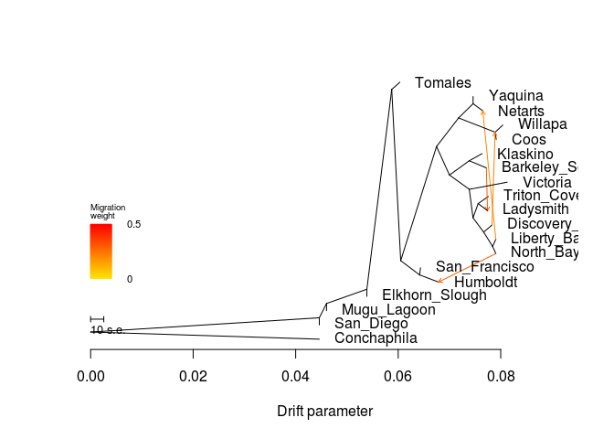

    ##  [1] 0.07460955 0.05388603 0.04461070 0.04601907 0.06031846 0.07649593
    ##  [7] 0.07912018 0.06434722 0.07719429 0.07829910 0.07904115 0.08126068
    ## [13] 0.08040295 0.07742458 0.07758879 0.06786212 0.07904115 0.07636021
    ## [19] 0.04461070
    ## [1] 0.003
    ## [1] "mse 0.000256445290858726"

    ## $d
    ##     V1             V2       V3      V4      V5  V6  V7 V8  V9 V10
    ## 1    1        Yaquina NOT_ROOT NOT_MIG     TIP  52  NA NA  NA  NA
    ## 2    2           <NA> NOT_ROOT NOT_MIG NOT_TIP  16  32 15   3   1
    ## 3    3 Elkhorn_Slough NOT_ROOT NOT_MIG     TIP   2  NA NA  NA  NA
    ## 4    4    Conchaphila NOT_ROOT NOT_MIG     TIP 677  NA NA  NA  NA
    ## 5   15    Mugu_Lagoon NOT_ROOT NOT_MIG     TIP  16  NA NA  NA  NA
    ## 6   16           <NA> NOT_ROOT NOT_MIG NOT_TIP 676   2 16  15   1
    ## 7   31        Tomales NOT_ROOT NOT_MIG     TIP  32  NA NA  NA  NA
    ## 8   32           <NA> NOT_ROOT NOT_MIG NOT_TIP   2  31  1 104  14
    ## 9   51        Netarts NOT_ROOT NOT_MIG     TIP  52  NA NA  NA  NA
    ## 10  52           <NA> NOT_ROOT NOT_MIG NOT_TIP  76   1  1  51   1
    ## 11  75           Coos NOT_ROOT NOT_MIG     TIP 304  NA NA  NA  NA
    ## 12  76           <NA> NOT_ROOT NOT_MIG NOT_TIP 472  52  2 304   2
    ## 13 103  San_Francisco NOT_ROOT NOT_MIG     TIP 715  NA NA  NA  NA
    ## 14 104           <NA> NOT_ROOT NOT_MIG NOT_TIP  32 472 12 715   2
    ## 15 135 Barkeley_Sound NOT_ROOT NOT_MIG     TIP 604  NA NA  NA  NA
    ## 16 136           <NA> NOT_ROOT NOT_MIG NOT_TIP 472 604  2 356   6
    ## 17 171  Discovery_Bay NOT_ROOT NOT_MIG     TIP 212  NA NA  NA  NA
    ## 18 211    Liberty_Bay NOT_ROOT NOT_MIG     TIP 536  NA NA  NA  NA
    ## 19 212           <NA> NOT_ROOT NOT_MIG NOT_TIP 256 171  1 536   2
    ## 20 255       Victoria NOT_ROOT NOT_MIG     TIP 356  NA NA  NA  NA
    ## 21 256           <NA> NOT_ROOT NOT_MIG NOT_TIP 356 412  2 212   3
    ## 22 303        Willapa NOT_ROOT NOT_MIG     TIP 304  NA NA  NA  NA
    ## 23 304           <NA> NOT_ROOT NOT_MIG NOT_TIP  76 303  1  75   1
    ## 24 355      Ladysmith NOT_ROOT NOT_MIG     TIP 412  NA NA  NA  NA
    ## 25 356           <NA> NOT_ROOT NOT_MIG NOT_TIP 136 255  1 256   5
    ## 26 411    Triton_Cove NOT_ROOT NOT_MIG     TIP 412  NA NA  NA  NA
    ## 27 412           <NA> NOT_ROOT NOT_MIG NOT_TIP 256 411  1 355   1
    ## 28 471       Humboldt NOT_ROOT NOT_MIG     TIP 715  NA NA  NA  NA
    ## 29 472           <NA> NOT_ROOT NOT_MIG NOT_TIP 104  76  4 136   8
    ## 30 535      North_Bay NOT_ROOT NOT_MIG     TIP 536  NA NA  NA  NA
    ## 31 536           <NA> NOT_ROOT NOT_MIG NOT_TIP 212 211  1 535   1
    ## 32 603       Klaskino NOT_ROOT NOT_MIG     TIP 604  NA NA  NA  NA
    ## 33 604           <NA> NOT_ROOT NOT_MIG NOT_TIP 136 603  1 135   1
    ## 34 675      San_Diego NOT_ROOT NOT_MIG     TIP 676  NA NA  NA  NA
    ## 35 676           <NA> NOT_ROOT NOT_MIG NOT_TIP 677  16 17 675   1
    ## 36 677           <NA>     ROOT NOT_MIG NOT_TIP 677 676 18   4   1
    ## 37 678           <NA> NOT_ROOT     MIG NOT_TIP 604 135 NA  NA  NA
    ## 38 715           <NA> NOT_ROOT NOT_MIG NOT_TIP 104 103  1 471   1
    ## 39 746           <NA> NOT_ROOT     MIG NOT_TIP 536 211 NA  NA  NA
    ## 40 780           <NA> NOT_ROOT     MIG NOT_TIP 212 171 NA  NA  NA
    ## 41 172           <NA> NOT_ROOT     MIG NOT_TIP 536 535 NA  NA  NA
    ##                                                                                                                                                                                                                                                                                                                                                                                                                                                                                                                                                                                                                  V11
    ## 1                                                                                                                                                                                                                                                                                                                                                                                                                                                                                                                                                                                                          Yaquina:0
    ## 2                                                                              ((Tomales:0.00158182,((((Yaquina:0,Netarts:0.00299578):0.00282949,(Willapa:0.00149959,Coos:0.00021682):0.0118278):0.0043027,((Klaskino:0.00250459,Barkeley_Sound:0.00333867):0.00385675,(Victoria:0.00739355,((Triton_Cove:0.00199386,Ladysmith:0.00374647):0.00100106,(Discovery_Bay:0.00162758,(Liberty_Bay:0.00208275,North_Bay:0.000623466):0.00174617):0.00207765):0.000726737):0.00386826):0.00252151):0.0069889,(San_Francisco:0.00017074,Humboldt:0.00744048):0.00368802):0.00175182):0.00485061,Elkhorn_Slough:0):0.00786696
    ## 3                                                                                                                                                                                                                                                                                                                                                                                                                                                                                                                                                                                                   Elkhorn_Slough:0
    ## 4                                                                                                                                                                                                                                                                                                                                                                                                                                                                                                                                                                                              Conchaphila:0.0446107
    ## 5                                                                                                                                                                                                                                                                                                                                                                                                                                                                                                                                                                                                      Mugu_Lagoon:0
    ## 6                                                   (((Tomales:0.00158182,((((Yaquina:0,Netarts:0.00299578):0.00282949,(Willapa:0.00149959,Coos:0.00021682):0.0118278):0.0043027,((Klaskino:0.00250459,Barkeley_Sound:0.00333867):0.00385675,(Victoria:0.00739355,((Triton_Cove:0.00199386,Ladysmith:0.00374647):0.00100106,(Discovery_Bay:0.00162758,(Liberty_Bay:0.00208275,North_Bay:0.000623466):0.00174617):0.00207765):0.000726737):0.00386826):0.00252151):0.0069889,(San_Francisco:0.00017074,Humboldt:0.00744048):0.00368802):0.00175182):0.00485061,Elkhorn_Slough:0):0.00786696,Mugu_Lagoon:0):0.00140837
    ## 7                                                                                                                                                                                                                                                                                                                                                                                                                                                                                                                                                                                                 Tomales:0.00158182
    ## 8                                                                                                            (Tomales:0.00158182,((((Yaquina:0,Netarts:0.00299578):0.00282949,(Willapa:0.00149959,Coos:0.00021682):0.0118278):0.0043027,((Klaskino:0.00250459,Barkeley_Sound:0.00333867):0.00385675,(Victoria:0.00739355,((Triton_Cove:0.00199386,Ladysmith:0.00374647):0.00100106,(Discovery_Bay:0.00162758,(Liberty_Bay:0.00208275,North_Bay:0.000623466):0.00174617):0.00207765):0.000726737):0.00386826):0.00252151):0.0069889,(San_Francisco:0.00017074,Humboldt:0.00744048):0.00368802):0.00175182):0.00485061
    ## 9                                                                                                                                                                                                                                                                                                                                                                                                                                                                                                                                                                                                 Netarts:0.00299578
    ## 10                                                                                                                                                                                                                                                                                                                                                                                                                                                                                                                                                                         (Yaquina:0,Netarts:0.00299578):0.00282949
    ## 11                                                                                                                                                                                                                                                                                                                                                                                                                                                                                                                                                                                                   Coos:0.00021682
    ## 12                                                                                                                                                                                                                                                                                                                                                                                                                                                                                                              ((Yaquina:0,Netarts:0.00299578):0.00282949,(Willapa:0.00149959,Coos:0.00021682):0.0118278):0.0043027
    ## 13                                                                                                                                                                                                                                                                                                                                                                                                                                                                                                                                                                                          San_Francisco:0.00017074
    ## 14                                                                                                                                           ((((Yaquina:0,Netarts:0.00299578):0.00282949,(Willapa:0.00149959,Coos:0.00021682):0.0118278):0.0043027,((Klaskino:0.00250459,Barkeley_Sound:0.00333867):0.00385675,(Victoria:0.00739355,((Triton_Cove:0.00199386,Ladysmith:0.00374647):0.00100106,(Discovery_Bay:0.00162758,(Liberty_Bay:0.00208275,North_Bay:0.000623466):0.00174617):0.00207765):0.000726737):0.00386826):0.00252151):0.0069889,(San_Francisco:0.00017074,Humboldt:0.00744048):0.00368802):0.00175182
    ## 15                                                                                                                                                                                                                                                                                                                                                                                                                                                                                                                                                                                         Barkeley_Sound:0.00333867
    ## 16                                                                                                                                                                                                                                                                                                                                   ((Klaskino:0.00250459,Barkeley_Sound:0.00333867):0.00385675,(Victoria:0.00739355,((Triton_Cove:0.00199386,Ladysmith:0.00374647):0.00100106,(Discovery_Bay:0.00162758,(Liberty_Bay:0.00208275,North_Bay:0.000623466):0.00174617):0.00207765):0.000726737):0.00386826):0.00252151
    ## 17                                                                                                                                                                                                                                                                                                                                                                                                                                                                                                                                                                                          Discovery_Bay:0.00162758
    ## 18                                                                                                                                                                                                                                                                                                                                                                                                                                                                                                                                                                                            Liberty_Bay:0.00208275
    ## 19                                                                                                                                                                                                                                                                                                                                                                                                                                                                                                                   (Discovery_Bay:0.00162758,(Liberty_Bay:0.00208275,North_Bay:0.000623466):0.00174617):0.00207765
    ## 20                                                                                                                                                                                                                                                                                                                                                                                                                                                                                                                                                                                               Victoria:0.00739355
    ## 21                                                                                                                                                                                                                                                                                                                                                                                                                                            ((Triton_Cove:0.00199386,Ladysmith:0.00374647):0.00100106,(Discovery_Bay:0.00162758,(Liberty_Bay:0.00208275,North_Bay:0.000623466):0.00174617):0.00207765):0.000726737
    ## 22                                                                                                                                                                                                                                                                                                                                                                                                                                                                                                                                                                                                Willapa:0.00149959
    ## 23                                                                                                                                                                                                                                                                                                                                                                                                                                                                                                                                                                    (Willapa:0.00149959,Coos:0.00021682):0.0118278
    ## 24                                                                                                                                                                                                                                                                                                                                                                                                                                                                                                                                                                                              Ladysmith:0.00374647
    ## 25                                                                                                                                                                                                                                                                                                                                                                                                           (Victoria:0.00739355,((Triton_Cove:0.00199386,Ladysmith:0.00374647):0.00100106,(Discovery_Bay:0.00162758,(Liberty_Bay:0.00208275,North_Bay:0.000623466):0.00174617):0.00207765):0.000726737):0.00386826
    ## 26                                                                                                                                                                                                                                                                                                                                                                                                                                                                                                                                                                                            Triton_Cove:0.00199386
    ## 27                                                                                                                                                                                                                                                                                                                                                                                                                                                                                                                                                          (Triton_Cove:0.00199386,Ladysmith:0.00374647):0.00100106
    ## 28                                                                                                                                                                                                                                                                                                                                                                                                                                                                                                                                                                                               Humboldt:0.00744048
    ## 29                                                                                                                                                                                                                  (((Yaquina:0,Netarts:0.00299578):0.00282949,(Willapa:0.00149959,Coos:0.00021682):0.0118278):0.0043027,((Klaskino:0.00250459,Barkeley_Sound:0.00333867):0.00385675,(Victoria:0.00739355,((Triton_Cove:0.00199386,Ladysmith:0.00374647):0.00100106,(Discovery_Bay:0.00162758,(Liberty_Bay:0.00208275,North_Bay:0.000623466):0.00174617):0.00207765):0.000726737):0.00386826):0.00252151):0.0069889
    ## 30                                                                                                                                                                                                                                                                                                                                                                                                                                                                                                                                                                                             North_Bay:0.000623466
    ## 31                                                                                                                                                                                                                                                                                                                                                                                                                                                                                                                                                         (Liberty_Bay:0.00208275,North_Bay:0.000623466):0.00174617
    ## 32                                                                                                                                                                                                                                                                                                                                                                                                                                                                                                                                                                                               Klaskino:0.00250459
    ## 33                                                                                                                                                                                                                                                                                                                                                                                                                                                                                                                                                        (Klaskino:0.00250459,Barkeley_Sound:0.00333867):0.00385675
    ## 34                                                                                                                                                                                                                                                                                                                                                                                                                                                                                                                                                                                                       San_Diego:0
    ## 35                          ((((Tomales:0.00158182,((((Yaquina:0,Netarts:0.00299578):0.00282949,(Willapa:0.00149959,Coos:0.00021682):0.0118278):0.0043027,((Klaskino:0.00250459,Barkeley_Sound:0.00333867):0.00385675,(Victoria:0.00739355,((Triton_Cove:0.00199386,Ladysmith:0.00374647):0.00100106,(Discovery_Bay:0.00162758,(Liberty_Bay:0.00208275,North_Bay:0.000623466):0.00174617):0.00207765):0.000726737):0.00386826):0.00252151):0.0069889,(San_Francisco:0.00017074,Humboldt:0.00744048):0.00368802):0.00175182):0.00485061,Elkhorn_Slough:0):0.00786696,Mugu_Lagoon:0):0.00140837,San_Diego:0):0.0446107
    ## 36 (((((Tomales:0.00158182,((((Yaquina:0,Netarts:0.00299578):0.00282949,(Willapa:0.00149959,Coos:0.00021682):0.0118278):0.0043027,((Klaskino:0.00250459,Barkeley_Sound:0.00333867):0.00385675,(Victoria:0.00739355,((Triton_Cove:0.00199386,Ladysmith:0.00374647):0.00100106,(Discovery_Bay:0.00162758,(Liberty_Bay:0.00208275,North_Bay:0.000623466):0.00174617):0.00207765):0.000726737):0.00386826):0.00252151):0.0069889,(San_Francisco:0.00017074,Humboldt:0.00744048):0.00368802):0.00175182):0.00485061,Elkhorn_Slough:0):0.00786696,Mugu_Lagoon:0):0.00140837,San_Diego:0):0.0446107,Conchaphila:0.0446107);
    ## 37                                                                                                                                                                                                                                                                                                                                                                                                                                                                                                                                                                                                              <NA>
    ## 38                                                                                                                                                                                                                                                                                                                                                                                                                                                                                                                                                         (San_Francisco:0.00017074,Humboldt:0.00744048):0.00368802
    ## 39                                                                                                                                                                                                                                                                                                                                                                                                                                                                                                                                                                                                              <NA>
    ## 40                                                                                                                                                                                                                                                                                                                                                                                                                                                                                                                                                                                                              <NA>
    ## 41                                                                                                                                                                                                                                                                                                                                                                                                                                                                                                                                                                                                              <NA>
    ##             x          y       ymin       ymax
    ## 1  0.07460955 0.92105263 0.89473684 0.94736842
    ## 2  0.05388603 0.21052632 0.15789474 1.00000000
    ## 3  0.05388603 0.18421053 0.15789474 0.21052632
    ## 4  0.04461070 0.02631579 0.00000000 0.05263158
    ## 5  0.04601907 0.13157895 0.10526316 0.15789474
    ## 6  0.04601907 0.15789474 0.10526316 1.00000000
    ## 7  0.06031846 0.97368421 0.94736842 1.00000000
    ## 8  0.05873664 0.94736842 0.21052632 1.00000000
    ## 9  0.07649593 0.86842105 0.84210526 0.89473684
    ## 10 0.07460955 0.89473684 0.84210526 0.94736842
    ## 11 0.07912018 0.76315789 0.73684211 0.78947368
    ## 12 0.07178006 0.84210526 0.73684211 0.94736842
    ## 13 0.06434722 0.28947368 0.26315789 0.31578947
    ## 14 0.06048846 0.31578947 0.21052632 0.94736842
    ## 15 0.07719429 0.65789474 0.63157895 0.68421053
    ## 16 0.06999887 0.63157895 0.31578947 0.73684211
    ## 17 0.07829910 0.44736842 0.42105263 0.47368421
    ## 18 0.07904115 0.39473684 0.36842105 0.42105263
    ## 19 0.07667152 0.42105263 0.31578947 0.47368421
    ## 20 0.08126068 0.60526316 0.57894737 0.63157895
    ## 21 0.07459387 0.47368421 0.31578947 0.57894737
    ## 22 0.08040295 0.81578947 0.78947368 0.84210526
    ## 23 0.07890336 0.78947368 0.73684211 0.84210526
    ## 24 0.07742458 0.50000000 0.47368421 0.52631579
    ## 25 0.07386713 0.57894737 0.31578947 0.63157895
    ## 26 0.07758879 0.55263158 0.52631579 0.57894737
    ## 27 0.07559493 0.52631579 0.47368421 0.57894737
    ## 28 0.06786212 0.23684211 0.21052632 0.26315789
    ## 29 0.06747736 0.73684211 0.31578947 0.94736842
    ## 30 0.07904115 0.34210526 0.31578947 0.36842105
    ## 31 0.07841769 0.36842105 0.31578947 0.42105263
    ## 32 0.07636021 0.71052632 0.68421053 0.73684211
    ## 33 0.07385562 0.68421053 0.63157895 0.73684211
    ## 34 0.04461070 0.07894737 0.05263158 0.10526316
    ## 35 0.04461070 0.10526316 0.05263158 1.00000000
    ## 36 0.00000000 0.05263158 0.00000000 1.00000000
    ## 37 0.07719429 0.65789474 0.63157895 0.68421053
    ## 38 0.06417648 0.26315789 0.21052632 0.31578947
    ## 39 0.07904115 0.39473684 0.31578947 0.36842105
    ## 40 0.07829910 0.44736842 0.31578947 0.42105263
    ## 41 0.07904115 0.34210526 0.31578947 0.36842105
    ## 
    ## $e
    ##     V1  V2          V3       V4      V5 V6       V7
    ## 1   32  31 0.001581820 1.000000 NOT_MIG  0 1.000000
    ## 2   52   1 0.000000000 1.000000 NOT_MIG  0 1.000000
    ## 3  304 303 0.001499590 1.000000 NOT_MIG  0 0.602250
    ## 4  412 411 0.001993860 1.000000 NOT_MIG  0 1.000000
    ## 5  104 472 0.006988900 1.000000 NOT_MIG  0 1.000000
    ## 6  604 603 0.002504590 1.000000 NOT_MIG  0 1.000000
    ## 7   32 104 0.001751820 1.000000 NOT_MIG  0 1.000000
    ## 8    2  32 0.004850610 1.000000 NOT_MIG  0 1.000000
    ## 9  677 676 0.044610700 1.000000 NOT_MIG  0 1.000000
    ## 10 604 678 0.003338670 1.000000 NOT_MIG  0 1.000000
    ## 11 678 135 0.000000000 1.000000 NOT_MIG  1 1.000000
    ## 12 678 355 0.000000000 0.301168     MIG  1 0.000000
    ## 13 256 412 0.001001060 1.000000 NOT_MIG  0 1.000000
    ## 14 412 355 0.001829649 0.698832 NOT_MIG  0 0.488366
    ## 15 104 715 0.003688020 1.000000 NOT_MIG  0 1.000000
    ## 16 715 103 0.000170740 1.000000 NOT_MIG  0 1.000000
    ## 17 715 471 0.003685641 0.703811 NOT_MIG  0 0.495350
    ## 18 472  76 0.004302700 1.000000 NOT_MIG  0 1.000000
    ## 19 472 136 0.002521510 1.000000 NOT_MIG  0 1.000000
    ## 20 136 604 0.003856750 1.000000 NOT_MIG  0 1.000000
    ## 21  76  52 0.002829490 1.000000 NOT_MIG  0 1.000000
    ## 22  52  51 0.001886384 0.793524 NOT_MIG  0 0.629680
    ## 23 536 746 0.002082750 1.000000 NOT_MIG  0 1.000000
    ## 24 746 211 0.000000000 1.000000 NOT_MIG  1 1.000000
    ## 25 746  51 0.000000000 0.206476     MIG  1 0.000000
    ## 26   2   3 0.000000000 1.000000 NOT_MIG  0 1.000000
    ## 27  16   2 0.007866960 1.000000 NOT_MIG  0 1.000000
    ## 28  16  15 0.000000000 1.000000 NOT_MIG  0 1.000000
    ## 29 676  16 0.001408370 1.000000 NOT_MIG  0 1.000000
    ## 30 677   4 0.044610700 1.000000 NOT_MIG  0 1.000000
    ## 31 676 675 0.000000000 1.000000 NOT_MIG  0 1.000000
    ## 32 304  75 0.000216820 1.000000 NOT_MIG  0 0.602250
    ## 33  76 304 0.007123298 0.776048 NOT_MIG  0 0.602250
    ## 34 212 780 0.001627580 1.000000 NOT_MIG  0 1.000000
    ## 35 780 171 0.000000000 1.000000 NOT_MIG  1 1.000000
    ## 36 780 304 0.000000000 0.223952     MIG  1 0.000000
    ## 37 356 255 0.007393550 1.000000 NOT_MIG  0 1.000000
    ## 38 136 356 0.003868260 1.000000 NOT_MIG  0 1.000000
    ## 39 356 256 0.000726737 1.000000 NOT_MIG  0 1.000000
    ## 40 256 212 0.002077650 1.000000 NOT_MIG  0 1.000000
    ## 41 212 536 0.001746170 1.000000 NOT_MIG  0 1.000000
    ## 42 536 172 0.000623466 1.000000 NOT_MIG  0 1.000000
    ## 43 172 535 0.000000000 1.000000 NOT_MIG  1 1.000000
    ## 44 172 471 0.000000000 0.296189     MIG  1 0.000000

``` r
system("treemix -i All/All-m70x62-mac4.pop.TM.gz -root Conchaphila -m 5 -o All/All-m70x62-mac4-pop_m5 > out")
```

``` r
plot_tree("All/All-m70x62-mac4-pop_m5")
```

    ## Warning in plot_tree("All/All-m70x62-mac4-pop_m5"): NAs introduced by
    ## coercion

    ## Warning in plot_tree("All/All-m70x62-mac4-pop_m5"): NAs introduced by
    ## coercion

    ## Warning in plot_tree("All/All-m70x62-mac4-pop_m5"): NAs introduced by
    ## coercion

    ## Warning in plot_tree("All/All-m70x62-mac4-pop_m5"): NAs introduced by
    ## coercion

    ##     V1             V2       V3      V4      V5  V6  V7 V8  V9 V10
    ## 1    1 Elkhorn_Slough NOT_ROOT NOT_MIG     TIP  16  NA NA  NA  NA
    ## 2    2           <NA> NOT_ROOT NOT_MIG NOT_TIP 604 104  2 304   6
    ## 3    3        Willapa NOT_ROOT NOT_MIG     TIP 536  NA NA  NA  NA
    ## 4    4       Klaskino NOT_ROOT NOT_MIG     TIP 104  NA NA  NA  NA
    ## 5   15    Conchaphila NOT_ROOT NOT_MIG     TIP 677  NA NA  NA  NA
    ## 6   16           <NA> NOT_ROOT NOT_MIG NOT_TIP 256 212 15   1   1
    ## 7   31       Victoria NOT_ROOT NOT_MIG     TIP 304  NA NA  NA  NA
    ## 8   51        Netarts NOT_ROOT NOT_MIG     TIP 136  NA NA  NA  NA
    ## 9   52           <NA> NOT_ROOT NOT_MIG NOT_TIP 604 136  2 536   2
    ## 10  75      San_Diego NOT_ROOT NOT_MIG     TIP  76  NA NA  NA  NA
    ## 11  76           <NA> NOT_ROOT NOT_MIG NOT_TIP 677 256 17  75   1
    ## 12 103 Barkeley_Sound NOT_ROOT NOT_MIG     TIP 104  NA NA  NA  NA
    ## 13 104           <NA> NOT_ROOT NOT_MIG NOT_TIP   2   4  1 103   1
    ## 14 135        Yaquina NOT_ROOT NOT_MIG     TIP 136  NA NA  NA  NA
    ## 15 136           <NA> NOT_ROOT NOT_MIG NOT_TIP  52 135  1  51   1
    ## 16 171  San_Francisco NOT_ROOT NOT_MIG     TIP 715  NA NA  NA  NA
    ## 17 172           <NA> NOT_ROOT NOT_MIG NOT_TIP 212 604 12 211   1
    ## 18 211        Tomales NOT_ROOT NOT_MIG     TIP 172  NA NA  NA  NA
    ## 19 212           <NA> NOT_ROOT NOT_MIG NOT_TIP  16 715  2 172  13
    ## 20 255    Mugu_Lagoon NOT_ROOT NOT_MIG     TIP 256  NA NA  NA  NA
    ## 21 256           <NA> NOT_ROOT NOT_MIG NOT_TIP  76  16 16 255   1
    ## 22 303    Triton_Cove NOT_ROOT NOT_MIG     TIP 412  NA NA  NA  NA
    ## 23 304           <NA> NOT_ROOT NOT_MIG NOT_TIP   2  31  1 356   5
    ## 24 355      Ladysmith NOT_ROOT NOT_MIG     TIP 412  NA NA  NA  NA
    ## 25 356           <NA> NOT_ROOT NOT_MIG NOT_TIP 304 412  2 472   3
    ## 26 411  Discovery_Bay NOT_ROOT NOT_MIG     TIP 472  NA NA  NA  NA
    ## 27 412           <NA> NOT_ROOT NOT_MIG NOT_TIP 356 303  1 355   1
    ## 28 471      North_Bay NOT_ROOT NOT_MIG     TIP 676  NA NA  NA  NA
    ## 29 472           <NA> NOT_ROOT NOT_MIG NOT_TIP 356 411  1 676   2
    ## 30 535           Coos NOT_ROOT NOT_MIG     TIP 536  NA NA  NA  NA
    ## 31 536           <NA> NOT_ROOT NOT_MIG NOT_TIP  52   3  1 535   1
    ## 32 603       Humboldt NOT_ROOT NOT_MIG     TIP 715  NA NA  NA  NA
    ## 33 604           <NA> NOT_ROOT NOT_MIG NOT_TIP 172  52  4   2   8
    ## 34 675    Liberty_Bay NOT_ROOT NOT_MIG     TIP 676  NA NA  NA  NA
    ## 35 676           <NA> NOT_ROOT NOT_MIG NOT_TIP 472 675  1 471   1
    ## 36 677           <NA>     ROOT NOT_MIG NOT_TIP 677  76 18  15   1
    ## 37 678           <NA> NOT_ROOT     MIG NOT_TIP 104 103 NA  NA  NA
    ## 38 715           <NA> NOT_ROOT NOT_MIG NOT_TIP 212 171  1 603   1
    ## 39 749           <NA> NOT_ROOT     MIG NOT_TIP 676 675 NA  NA  NA
    ## 40 780           <NA> NOT_ROOT     MIG NOT_TIP 472 411 NA  NA  NA
    ## 41 894           <NA> NOT_ROOT     MIG NOT_TIP  52 536 NA  NA  NA
    ## 42  32           <NA> NOT_ROOT     MIG NOT_TIP 676 471 NA  NA  NA
    ##                                                                                                                                                                                                                                                                                                                                                                                                                                                                                                                                                                                                          V11
    ## 1                                                                                                                                                                                                                                                                                                                                                                                                                                                                                                                                                                                           Elkhorn_Slough:0
    ## 2                                                                                                                                                                                                                                                                                                                              ((Klaskino:0.00250837,Barkeley_Sound:0.00333948):0.00380023,(Victoria:0.00736627,((Triton_Cove:0.00200993,Ladysmith:0.0037298):0.000957314,(Discovery_Bay:0.0016382,(Liberty_Bay:0.00206687,North_Bay:0.000630535):0.00179856):0.00203443):0.000731559):0.0039035):0.00226432
    ## 3                                                                                                                                                                                                                                                                                                                                                                                                                                                                                                                                                                                         Willapa:0.00149977
    ## 4                                                                                                                                                                                                                                                                                                                                                                                                                                                                                                                                                                                        Klaskino:0.00250837
    ## 5                                                                                                                                                                                                                                                                                                                                                                                                                                                                                                                                                                                      Conchaphila:0.0446108
    ## 6                                                                              (((San_Francisco:0,Humboldt:0.00850643):0.00794092,((((Yaquina:0,Netarts:0.00288477):0.00247217,(Willapa:0.00149977,Coos:0.000216998):0.0129852):0.00482406,((Klaskino:0.00250837,Barkeley_Sound:0.00333948):0.00380023,(Victoria:0.00736627,((Triton_Cove:0.00200993,Ladysmith:0.0037298):0.000957314,(Discovery_Bay:0.0016382,(Liberty_Bay:0.00206687,North_Bay:0.000630535):0.00179856):0.00203443):0.000731559):0.0039035):0.00226432):0.00863923,Tomales:0.00154381):0.00106266):0.00399237,Elkhorn_Slough:0):0.00786698
    ## 7                                                                                                                                                                                                                                                                                                                                                                                                                                                                                                                                                                                        Victoria:0.00736627
    ## 8                                                                                                                                                                                                                                                                                                                                                                                                                                                                                                                                                                                         Netarts:0.00288477
    ## 9                                                                                                                                                                                                                                                                                                                                                                                                                                                                                                     ((Yaquina:0,Netarts:0.00288477):0.00247217,(Willapa:0.00149977,Coos:0.000216998):0.0129852):0.00482406
    ## 10                                                                                                                                                                                                                                                                                                                                                                                                                                                                                                                                                                                               San_Diego:0
    ## 11                          (((((San_Francisco:0,Humboldt:0.00850643):0.00794092,((((Yaquina:0,Netarts:0.00288477):0.00247217,(Willapa:0.00149977,Coos:0.000216998):0.0129852):0.00482406,((Klaskino:0.00250837,Barkeley_Sound:0.00333948):0.00380023,(Victoria:0.00736627,((Triton_Cove:0.00200993,Ladysmith:0.0037298):0.000957314,(Discovery_Bay:0.0016382,(Liberty_Bay:0.00206687,North_Bay:0.000630535):0.00179856):0.00203443):0.000731559):0.0039035):0.00226432):0.00863923,Tomales:0.00154381):0.00106266):0.00399237,Elkhorn_Slough:0):0.00786698,Mugu_Lagoon:0):0.00140841,San_Diego:0):0.0446108
    ## 12                                                                                                                                                                                                                                                                                                                                                                                                                                                                                                                                                                                 Barkeley_Sound:0.00333948
    ## 13                                                                                                                                                                                                                                                                                                                                                                                                                                                                                                                                                (Klaskino:0.00250837,Barkeley_Sound:0.00333948):0.00380023
    ## 14                                                                                                                                                                                                                                                                                                                                                                                                                                                                                                                                                                                                 Yaquina:0
    ## 15                                                                                                                                                                                                                                                                                                                                                                                                                                                                                                                                                                 (Yaquina:0,Netarts:0.00288477):0.00247217
    ## 16                                                                                                                                                                                                                                                                                                                                                                                                                                                                                                                                                                                           San_Francisco:0
    ## 17                                                                                                                                                                         ((((Yaquina:0,Netarts:0.00288477):0.00247217,(Willapa:0.00149977,Coos:0.000216998):0.0129852):0.00482406,((Klaskino:0.00250837,Barkeley_Sound:0.00333948):0.00380023,(Victoria:0.00736627,((Triton_Cove:0.00200993,Ladysmith:0.0037298):0.000957314,(Discovery_Bay:0.0016382,(Liberty_Bay:0.00206687,North_Bay:0.000630535):0.00179856):0.00203443):0.000731559):0.0039035):0.00226432):0.00863923,Tomales:0.00154381):0.00106266
    ## 18                                                                                                                                                                                                                                                                                                                                                                                                                                                                                                                                                                                        Tomales:0.00154381
    ## 19                                                                                                           ((San_Francisco:0,Humboldt:0.00850643):0.00794092,((((Yaquina:0,Netarts:0.00288477):0.00247217,(Willapa:0.00149977,Coos:0.000216998):0.0129852):0.00482406,((Klaskino:0.00250837,Barkeley_Sound:0.00333948):0.00380023,(Victoria:0.00736627,((Triton_Cove:0.00200993,Ladysmith:0.0037298):0.000957314,(Discovery_Bay:0.0016382,(Liberty_Bay:0.00206687,North_Bay:0.000630535):0.00179856):0.00203443):0.000731559):0.0039035):0.00226432):0.00863923,Tomales:0.00154381):0.00106266):0.00399237
    ## 20                                                                                                                                                                                                                                                                                                                                                                                                                                                                                                                                                                                             Mugu_Lagoon:0
    ## 21                                                  ((((San_Francisco:0,Humboldt:0.00850643):0.00794092,((((Yaquina:0,Netarts:0.00288477):0.00247217,(Willapa:0.00149977,Coos:0.000216998):0.0129852):0.00482406,((Klaskino:0.00250837,Barkeley_Sound:0.00333948):0.00380023,(Victoria:0.00736627,((Triton_Cove:0.00200993,Ladysmith:0.0037298):0.000957314,(Discovery_Bay:0.0016382,(Liberty_Bay:0.00206687,North_Bay:0.000630535):0.00179856):0.00203443):0.000731559):0.0039035):0.00226432):0.00863923,Tomales:0.00154381):0.00106266):0.00399237,Elkhorn_Slough:0):0.00786698,Mugu_Lagoon:0):0.00140841
    ## 22                                                                                                                                                                                                                                                                                                                                                                                                                                                                                                                                                                                    Triton_Cove:0.00200993
    ## 23                                                                                                                                                                                                                                                                                                                                                                                                     (Victoria:0.00736627,((Triton_Cove:0.00200993,Ladysmith:0.0037298):0.000957314,(Discovery_Bay:0.0016382,(Liberty_Bay:0.00206687,North_Bay:0.000630535):0.00179856):0.00203443):0.000731559):0.0039035
    ## 24                                                                                                                                                                                                                                                                                                                                                                                                                                                                                                                                                                                       Ladysmith:0.0037298
    ## 25                                                                                                                                                                                                                                                                                                                                                                                                                                     ((Triton_Cove:0.00200993,Ladysmith:0.0037298):0.000957314,(Discovery_Bay:0.0016382,(Liberty_Bay:0.00206687,North_Bay:0.000630535):0.00179856):0.00203443):0.000731559
    ## 26                                                                                                                                                                                                                                                                                                                                                                                                                                                                                                                                                                                   Discovery_Bay:0.0016382
    ## 27                                                                                                                                                                                                                                                                                                                                                                                                                                                                                                                                                  (Triton_Cove:0.00200993,Ladysmith:0.0037298):0.000957314
    ## 28                                                                                                                                                                                                                                                                                                                                                                                                                                                                                                                                                                                     North_Bay:0.000630535
    ## 29                                                                                                                                                                                                                                                                                                                                                                                                                                                                                                            (Discovery_Bay:0.0016382,(Liberty_Bay:0.00206687,North_Bay:0.000630535):0.00179856):0.00203443
    ## 30                                                                                                                                                                                                                                                                                                                                                                                                                                                                                                                                                                                          Coos:0.000216998
    ## 31                                                                                                                                                                                                                                                                                                                                                                                                                                                                                                                                                           (Willapa:0.00149977,Coos:0.000216998):0.0129852
    ## 32                                                                                                                                                                                                                                                                                                                                                                                                                                                                                                                                                                                       Humboldt:0.00850643
    ## 33                                                                                                                                                                                                         (((Yaquina:0,Netarts:0.00288477):0.00247217,(Willapa:0.00149977,Coos:0.000216998):0.0129852):0.00482406,((Klaskino:0.00250837,Barkeley_Sound:0.00333948):0.00380023,(Victoria:0.00736627,((Triton_Cove:0.00200993,Ladysmith:0.0037298):0.000957314,(Discovery_Bay:0.0016382,(Liberty_Bay:0.00206687,North_Bay:0.000630535):0.00179856):0.00203443):0.000731559):0.0039035):0.00226432):0.00863923
    ## 34                                                                                                                                                                                                                                                                                                                                                                                                                                                                                                                                                                                    Liberty_Bay:0.00206687
    ## 35                                                                                                                                                                                                                                                                                                                                                                                                                                                                                                                                                 (Liberty_Bay:0.00206687,North_Bay:0.000630535):0.00179856
    ## 36 ((((((San_Francisco:0,Humboldt:0.00850643):0.00794092,((((Yaquina:0,Netarts:0.00288477):0.00247217,(Willapa:0.00149977,Coos:0.000216998):0.0129852):0.00482406,((Klaskino:0.00250837,Barkeley_Sound:0.00333948):0.00380023,(Victoria:0.00736627,((Triton_Cove:0.00200993,Ladysmith:0.0037298):0.000957314,(Discovery_Bay:0.0016382,(Liberty_Bay:0.00206687,North_Bay:0.000630535):0.00179856):0.00203443):0.000731559):0.0039035):0.00226432):0.00863923,Tomales:0.00154381):0.00106266):0.00399237,Elkhorn_Slough:0):0.00786698,Mugu_Lagoon:0):0.00140841,San_Diego:0):0.0446108,Conchaphila:0.0446108);
    ## 37                                                                                                                                                                                                                                                                                                                                                                                                                                                                                                                                                                                                      <NA>
    ## 38                                                                                                                                                                                                                                                                                                                                                                                                                                                                                                                                                          (San_Francisco:0,Humboldt:0.00850643):0.00794092
    ## 39                                                                                                                                                                                                                                                                                                                                                                                                                                                                                                                                                                                                      <NA>
    ## 40                                                                                                                                                                                                                                                                                                                                                                                                                                                                                                                                                                                                      <NA>
    ## 41                                                                                                                                                                                                                                                                                                                                                                                                                                                                                                                                                                                                      <NA>
    ## 42                                                                                                                                                                                                                                                                                                                                                                                                                                                                                                                                                                                                      <NA>
    ##             x          y       ymin       ymax
    ## 1  0.05388619 0.18421053 0.15789474 0.21052632
    ## 2  0.06984477 0.57894737 0.26315789 0.68421053
    ## 3  0.08129040 0.76315789 0.73684211 0.78947368
    ## 4  0.07615337 0.65789474 0.63157895 0.68421053
    ## 5  0.04461080 0.02631579 0.00000000 0.05263158
    ## 6  0.05388619 0.21052632 0.15789474 1.00000000
    ## 7  0.08111454 0.55263158 0.52631579 0.57894737
    ## 8  0.07671533 0.81578947 0.78947368 0.84210526
    ## 9  0.07240451 0.78947368 0.68421053 0.89473684
    ## 10 0.04461080 0.07894737 0.05263158 0.10526316
    ## 11 0.04461080 0.10526316 0.05263158 1.00000000
    ## 12 0.07698448 0.60526316 0.57894737 0.63157895
    ## 13 0.07364500 0.63157895 0.57894737 0.68421053
    ## 14 0.07487668 0.86842105 0.84210526 0.89473684
    ## 15 0.07487668 0.84210526 0.78947368 0.89473684
    ## 16 0.06309439 0.97368421 0.94736842 1.00000000
    ## 17 0.05894122 0.26315789 0.21052632 0.89473684
    ## 18 0.06048503 0.23684211 0.21052632 0.26315789
    ## 19 0.05787856 0.89473684 0.21052632 1.00000000
    ## 20 0.04601921 0.13157895 0.10526316 0.15789474
    ## 21 0.04601921 0.15789474 0.10526316 1.00000000
    ## 22 0.07744707 0.50000000 0.47368421 0.52631579
    ## 23 0.07374827 0.52631579 0.26315789 0.57894737
    ## 24 0.07726331 0.44736842 0.42105263 0.47368421
    ## 25 0.07447983 0.42105263 0.26315789 0.52631579
    ## 26 0.07815246 0.39473684 0.36842105 0.42105263
    ## 27 0.07543714 0.47368421 0.42105263 0.52631579
    ## 28 0.07894335 0.28947368 0.26315789 0.31578947
    ## 29 0.07651426 0.36842105 0.26315789 0.42105263
    ## 30 0.08000763 0.71052632 0.68421053 0.73684211
    ## 31 0.07979063 0.73684211 0.68421053 0.78947368
    ## 32 0.06705249 0.92105263 0.89473684 0.94736842
    ## 33 0.06758045 0.68421053 0.26315789 0.89473684
    ## 34 0.07894335 0.34210526 0.31578947 0.36842105
    ## 35 0.07831282 0.31578947 0.26315789 0.36842105
    ## 36 0.00000000 0.05263158 0.00000000 1.00000000
    ## 37 0.07698448         NA 0.57894737 0.63157895
    ## 38 0.06309439 0.94736842 0.89473684 1.00000000
    ## 39 0.08037969         NA 0.26315789 0.31578947
    ## 40 0.07815246         NA 0.26315789 0.36842105
    ## 41 0.07708213         NA 0.68421053 0.78947368
    ## 42 0.07894335         NA 0.26315789 0.31578947
    ## [1] "1 0.073645 0.07698448"
    ## [1] "1 0.078312819 0.078943354"
    ## [1] "1 0.076514259 0.078152459"
    ## [1] "0.633299 0.07240451 0.0797906310954009"
    ## [1] "1 0.078312819 0.078943354"

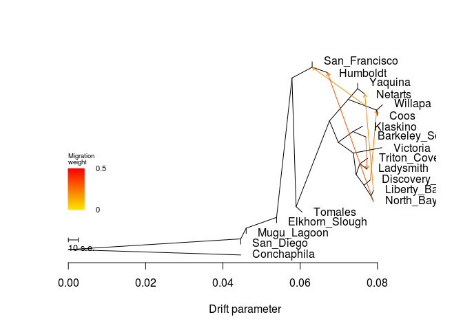

    ##  [1] 0.05388619 0.08129040 0.07615337 0.04461080 0.08111454 0.07671533
    ##  [7] 0.04461080 0.07698448 0.07487668 0.06309439 0.06048503 0.04601921
    ## [13] 0.07744707 0.07726331 0.07815246 0.07894335 0.08000763 0.06705249
    ## [19] 0.07894335
    ## [1] 0.003
    ## [1] "mse 0.000256445290858726"

    ## $d
    ##     V1             V2       V3      V4      V5  V6  V7 V8  V9 V10
    ## 1    1 Elkhorn_Slough NOT_ROOT NOT_MIG     TIP  16  NA NA  NA  NA
    ## 2    2           <NA> NOT_ROOT NOT_MIG NOT_TIP 604 104  2 304   6
    ## 3    3        Willapa NOT_ROOT NOT_MIG     TIP 536  NA NA  NA  NA
    ## 4    4       Klaskino NOT_ROOT NOT_MIG     TIP 104  NA NA  NA  NA
    ## 5   15    Conchaphila NOT_ROOT NOT_MIG     TIP 677  NA NA  NA  NA
    ## 6   16           <NA> NOT_ROOT NOT_MIG NOT_TIP 256 212 15   1   1
    ## 7   31       Victoria NOT_ROOT NOT_MIG     TIP 304  NA NA  NA  NA
    ## 8   51        Netarts NOT_ROOT NOT_MIG     TIP 136  NA NA  NA  NA
    ## 9   52           <NA> NOT_ROOT NOT_MIG NOT_TIP 604 136  2 536   2
    ## 10  75      San_Diego NOT_ROOT NOT_MIG     TIP  76  NA NA  NA  NA
    ## 11  76           <NA> NOT_ROOT NOT_MIG NOT_TIP 677 256 17  75   1
    ## 12 103 Barkeley_Sound NOT_ROOT NOT_MIG     TIP 104  NA NA  NA  NA
    ## 13 104           <NA> NOT_ROOT NOT_MIG NOT_TIP   2   4  1 103   1
    ## 14 135        Yaquina NOT_ROOT NOT_MIG     TIP 136  NA NA  NA  NA
    ## 15 136           <NA> NOT_ROOT NOT_MIG NOT_TIP  52 135  1  51   1
    ## 16 171  San_Francisco NOT_ROOT NOT_MIG     TIP 715  NA NA  NA  NA
    ## 17 172           <NA> NOT_ROOT NOT_MIG NOT_TIP 212 604 12 211   1
    ## 18 211        Tomales NOT_ROOT NOT_MIG     TIP 172  NA NA  NA  NA
    ## 19 212           <NA> NOT_ROOT NOT_MIG NOT_TIP  16 715  2 172  13
    ## 20 255    Mugu_Lagoon NOT_ROOT NOT_MIG     TIP 256  NA NA  NA  NA
    ## 21 256           <NA> NOT_ROOT NOT_MIG NOT_TIP  76  16 16 255   1
    ## 22 303    Triton_Cove NOT_ROOT NOT_MIG     TIP 412  NA NA  NA  NA
    ## 23 304           <NA> NOT_ROOT NOT_MIG NOT_TIP   2  31  1 356   5
    ## 24 355      Ladysmith NOT_ROOT NOT_MIG     TIP 412  NA NA  NA  NA
    ## 25 356           <NA> NOT_ROOT NOT_MIG NOT_TIP 304 412  2 472   3
    ## 26 411  Discovery_Bay NOT_ROOT NOT_MIG     TIP 472  NA NA  NA  NA
    ## 27 412           <NA> NOT_ROOT NOT_MIG NOT_TIP 356 303  1 355   1
    ## 28 471      North_Bay NOT_ROOT NOT_MIG     TIP 676  NA NA  NA  NA
    ## 29 472           <NA> NOT_ROOT NOT_MIG NOT_TIP 356 411  1 676   2
    ## 30 535           Coos NOT_ROOT NOT_MIG     TIP 536  NA NA  NA  NA
    ## 31 536           <NA> NOT_ROOT NOT_MIG NOT_TIP  52   3  1 535   1
    ## 32 603       Humboldt NOT_ROOT NOT_MIG     TIP 715  NA NA  NA  NA
    ## 33 604           <NA> NOT_ROOT NOT_MIG NOT_TIP 172  52  4   2   8
    ## 34 675    Liberty_Bay NOT_ROOT NOT_MIG     TIP 676  NA NA  NA  NA
    ## 35 676           <NA> NOT_ROOT NOT_MIG NOT_TIP 472 675  1 471   1
    ## 36 677           <NA>     ROOT NOT_MIG NOT_TIP 677  76 18  15   1
    ## 37 678           <NA> NOT_ROOT     MIG NOT_TIP 104 103 NA  NA  NA
    ## 38 715           <NA> NOT_ROOT NOT_MIG NOT_TIP 212 171  1 603   1
    ## 39 749           <NA> NOT_ROOT     MIG NOT_TIP 676 675 NA  NA  NA
    ## 40 780           <NA> NOT_ROOT     MIG NOT_TIP 472 411 NA  NA  NA
    ## 41 894           <NA> NOT_ROOT     MIG NOT_TIP  52 536 NA  NA  NA
    ## 42  32           <NA> NOT_ROOT     MIG NOT_TIP 676 471 NA  NA  NA
    ##                                                                                                                                                                                                                                                                                                                                                                                                                                                                                                                                                                                                          V11
    ## 1                                                                                                                                                                                                                                                                                                                                                                                                                                                                                                                                                                                           Elkhorn_Slough:0
    ## 2                                                                                                                                                                                                                                                                                                                              ((Klaskino:0.00250837,Barkeley_Sound:0.00333948):0.00380023,(Victoria:0.00736627,((Triton_Cove:0.00200993,Ladysmith:0.0037298):0.000957314,(Discovery_Bay:0.0016382,(Liberty_Bay:0.00206687,North_Bay:0.000630535):0.00179856):0.00203443):0.000731559):0.0039035):0.00226432
    ## 3                                                                                                                                                                                                                                                                                                                                                                                                                                                                                                                                                                                         Willapa:0.00149977
    ## 4                                                                                                                                                                                                                                                                                                                                                                                                                                                                                                                                                                                        Klaskino:0.00250837
    ## 5                                                                                                                                                                                                                                                                                                                                                                                                                                                                                                                                                                                      Conchaphila:0.0446108
    ## 6                                                                              (((San_Francisco:0,Humboldt:0.00850643):0.00794092,((((Yaquina:0,Netarts:0.00288477):0.00247217,(Willapa:0.00149977,Coos:0.000216998):0.0129852):0.00482406,((Klaskino:0.00250837,Barkeley_Sound:0.00333948):0.00380023,(Victoria:0.00736627,((Triton_Cove:0.00200993,Ladysmith:0.0037298):0.000957314,(Discovery_Bay:0.0016382,(Liberty_Bay:0.00206687,North_Bay:0.000630535):0.00179856):0.00203443):0.000731559):0.0039035):0.00226432):0.00863923,Tomales:0.00154381):0.00106266):0.00399237,Elkhorn_Slough:0):0.00786698
    ## 7                                                                                                                                                                                                                                                                                                                                                                                                                                                                                                                                                                                        Victoria:0.00736627
    ## 8                                                                                                                                                                                                                                                                                                                                                                                                                                                                                                                                                                                         Netarts:0.00288477
    ## 9                                                                                                                                                                                                                                                                                                                                                                                                                                                                                                     ((Yaquina:0,Netarts:0.00288477):0.00247217,(Willapa:0.00149977,Coos:0.000216998):0.0129852):0.00482406
    ## 10                                                                                                                                                                                                                                                                                                                                                                                                                                                                                                                                                                                               San_Diego:0
    ## 11                          (((((San_Francisco:0,Humboldt:0.00850643):0.00794092,((((Yaquina:0,Netarts:0.00288477):0.00247217,(Willapa:0.00149977,Coos:0.000216998):0.0129852):0.00482406,((Klaskino:0.00250837,Barkeley_Sound:0.00333948):0.00380023,(Victoria:0.00736627,((Triton_Cove:0.00200993,Ladysmith:0.0037298):0.000957314,(Discovery_Bay:0.0016382,(Liberty_Bay:0.00206687,North_Bay:0.000630535):0.00179856):0.00203443):0.000731559):0.0039035):0.00226432):0.00863923,Tomales:0.00154381):0.00106266):0.00399237,Elkhorn_Slough:0):0.00786698,Mugu_Lagoon:0):0.00140841,San_Diego:0):0.0446108
    ## 12                                                                                                                                                                                                                                                                                                                                                                                                                                                                                                                                                                                 Barkeley_Sound:0.00333948
    ## 13                                                                                                                                                                                                                                                                                                                                                                                                                                                                                                                                                (Klaskino:0.00250837,Barkeley_Sound:0.00333948):0.00380023
    ## 14                                                                                                                                                                                                                                                                                                                                                                                                                                                                                                                                                                                                 Yaquina:0
    ## 15                                                                                                                                                                                                                                                                                                                                                                                                                                                                                                                                                                 (Yaquina:0,Netarts:0.00288477):0.00247217
    ## 16                                                                                                                                                                                                                                                                                                                                                                                                                                                                                                                                                                                           San_Francisco:0
    ## 17                                                                                                                                                                         ((((Yaquina:0,Netarts:0.00288477):0.00247217,(Willapa:0.00149977,Coos:0.000216998):0.0129852):0.00482406,((Klaskino:0.00250837,Barkeley_Sound:0.00333948):0.00380023,(Victoria:0.00736627,((Triton_Cove:0.00200993,Ladysmith:0.0037298):0.000957314,(Discovery_Bay:0.0016382,(Liberty_Bay:0.00206687,North_Bay:0.000630535):0.00179856):0.00203443):0.000731559):0.0039035):0.00226432):0.00863923,Tomales:0.00154381):0.00106266
    ## 18                                                                                                                                                                                                                                                                                                                                                                                                                                                                                                                                                                                        Tomales:0.00154381
    ## 19                                                                                                           ((San_Francisco:0,Humboldt:0.00850643):0.00794092,((((Yaquina:0,Netarts:0.00288477):0.00247217,(Willapa:0.00149977,Coos:0.000216998):0.0129852):0.00482406,((Klaskino:0.00250837,Barkeley_Sound:0.00333948):0.00380023,(Victoria:0.00736627,((Triton_Cove:0.00200993,Ladysmith:0.0037298):0.000957314,(Discovery_Bay:0.0016382,(Liberty_Bay:0.00206687,North_Bay:0.000630535):0.00179856):0.00203443):0.000731559):0.0039035):0.00226432):0.00863923,Tomales:0.00154381):0.00106266):0.00399237
    ## 20                                                                                                                                                                                                                                                                                                                                                                                                                                                                                                                                                                                             Mugu_Lagoon:0
    ## 21                                                  ((((San_Francisco:0,Humboldt:0.00850643):0.00794092,((((Yaquina:0,Netarts:0.00288477):0.00247217,(Willapa:0.00149977,Coos:0.000216998):0.0129852):0.00482406,((Klaskino:0.00250837,Barkeley_Sound:0.00333948):0.00380023,(Victoria:0.00736627,((Triton_Cove:0.00200993,Ladysmith:0.0037298):0.000957314,(Discovery_Bay:0.0016382,(Liberty_Bay:0.00206687,North_Bay:0.000630535):0.00179856):0.00203443):0.000731559):0.0039035):0.00226432):0.00863923,Tomales:0.00154381):0.00106266):0.00399237,Elkhorn_Slough:0):0.00786698,Mugu_Lagoon:0):0.00140841
    ## 22                                                                                                                                                                                                                                                                                                                                                                                                                                                                                                                                                                                    Triton_Cove:0.00200993
    ## 23                                                                                                                                                                                                                                                                                                                                                                                                     (Victoria:0.00736627,((Triton_Cove:0.00200993,Ladysmith:0.0037298):0.000957314,(Discovery_Bay:0.0016382,(Liberty_Bay:0.00206687,North_Bay:0.000630535):0.00179856):0.00203443):0.000731559):0.0039035
    ## 24                                                                                                                                                                                                                                                                                                                                                                                                                                                                                                                                                                                       Ladysmith:0.0037298
    ## 25                                                                                                                                                                                                                                                                                                                                                                                                                                     ((Triton_Cove:0.00200993,Ladysmith:0.0037298):0.000957314,(Discovery_Bay:0.0016382,(Liberty_Bay:0.00206687,North_Bay:0.000630535):0.00179856):0.00203443):0.000731559
    ## 26                                                                                                                                                                                                                                                                                                                                                                                                                                                                                                                                                                                   Discovery_Bay:0.0016382
    ## 27                                                                                                                                                                                                                                                                                                                                                                                                                                                                                                                                                  (Triton_Cove:0.00200993,Ladysmith:0.0037298):0.000957314
    ## 28                                                                                                                                                                                                                                                                                                                                                                                                                                                                                                                                                                                     North_Bay:0.000630535
    ## 29                                                                                                                                                                                                                                                                                                                                                                                                                                                                                                            (Discovery_Bay:0.0016382,(Liberty_Bay:0.00206687,North_Bay:0.000630535):0.00179856):0.00203443
    ## 30                                                                                                                                                                                                                                                                                                                                                                                                                                                                                                                                                                                          Coos:0.000216998
    ## 31                                                                                                                                                                                                                                                                                                                                                                                                                                                                                                                                                           (Willapa:0.00149977,Coos:0.000216998):0.0129852
    ## 32                                                                                                                                                                                                                                                                                                                                                                                                                                                                                                                                                                                       Humboldt:0.00850643
    ## 33                                                                                                                                                                                                         (((Yaquina:0,Netarts:0.00288477):0.00247217,(Willapa:0.00149977,Coos:0.000216998):0.0129852):0.00482406,((Klaskino:0.00250837,Barkeley_Sound:0.00333948):0.00380023,(Victoria:0.00736627,((Triton_Cove:0.00200993,Ladysmith:0.0037298):0.000957314,(Discovery_Bay:0.0016382,(Liberty_Bay:0.00206687,North_Bay:0.000630535):0.00179856):0.00203443):0.000731559):0.0039035):0.00226432):0.00863923
    ## 34                                                                                                                                                                                                                                                                                                                                                                                                                                                                                                                                                                                    Liberty_Bay:0.00206687
    ## 35                                                                                                                                                                                                                                                                                                                                                                                                                                                                                                                                                 (Liberty_Bay:0.00206687,North_Bay:0.000630535):0.00179856
    ## 36 ((((((San_Francisco:0,Humboldt:0.00850643):0.00794092,((((Yaquina:0,Netarts:0.00288477):0.00247217,(Willapa:0.00149977,Coos:0.000216998):0.0129852):0.00482406,((Klaskino:0.00250837,Barkeley_Sound:0.00333948):0.00380023,(Victoria:0.00736627,((Triton_Cove:0.00200993,Ladysmith:0.0037298):0.000957314,(Discovery_Bay:0.0016382,(Liberty_Bay:0.00206687,North_Bay:0.000630535):0.00179856):0.00203443):0.000731559):0.0039035):0.00226432):0.00863923,Tomales:0.00154381):0.00106266):0.00399237,Elkhorn_Slough:0):0.00786698,Mugu_Lagoon:0):0.00140841,San_Diego:0):0.0446108,Conchaphila:0.0446108);
    ## 37                                                                                                                                                                                                                                                                                                                                                                                                                                                                                                                                                                                                      <NA>
    ## 38                                                                                                                                                                                                                                                                                                                                                                                                                                                                                                                                                          (San_Francisco:0,Humboldt:0.00850643):0.00794092
    ## 39                                                                                                                                                                                                                                                                                                                                                                                                                                                                                                                                                                                                      <NA>
    ## 40                                                                                                                                                                                                                                                                                                                                                                                                                                                                                                                                                                                                      <NA>
    ## 41                                                                                                                                                                                                                                                                                                                                                                                                                                                                                                                                                                                                      <NA>
    ## 42                                                                                                                                                                                                                                                                                                                                                                                                                                                                                                                                                                                                      <NA>
    ##             x          y       ymin       ymax
    ## 1  0.05388619 0.18421053 0.15789474 0.21052632
    ## 2  0.06984477 0.57894737 0.26315789 0.68421053
    ## 3  0.08129040 0.76315789 0.73684211 0.78947368
    ## 4  0.07615337 0.65789474 0.63157895 0.68421053
    ## 5  0.04461080 0.02631579 0.00000000 0.05263158
    ## 6  0.05388619 0.21052632 0.15789474 1.00000000
    ## 7  0.08111454 0.55263158 0.52631579 0.57894737
    ## 8  0.07671533 0.81578947 0.78947368 0.84210526
    ## 9  0.07240451 0.78947368 0.68421053 0.89473684
    ## 10 0.04461080 0.07894737 0.05263158 0.10526316
    ## 11 0.04461080 0.10526316 0.05263158 1.00000000
    ## 12 0.07698448 0.60526316 0.57894737 0.63157895
    ## 13 0.07364500 0.63157895 0.57894737 0.68421053
    ## 14 0.07487668 0.86842105 0.84210526 0.89473684
    ## 15 0.07487668 0.84210526 0.78947368 0.89473684
    ## 16 0.06309439 0.97368421 0.94736842 1.00000000
    ## 17 0.05894122 0.26315789 0.21052632 0.89473684
    ## 18 0.06048503 0.23684211 0.21052632 0.26315789
    ## 19 0.05787856 0.89473684 0.21052632 1.00000000
    ## 20 0.04601921 0.13157895 0.10526316 0.15789474
    ## 21 0.04601921 0.15789474 0.10526316 1.00000000
    ## 22 0.07744707 0.50000000 0.47368421 0.52631579
    ## 23 0.07374827 0.52631579 0.26315789 0.57894737
    ## 24 0.07726331 0.44736842 0.42105263 0.47368421
    ## 25 0.07447983 0.42105263 0.26315789 0.52631579
    ## 26 0.07815246 0.39473684 0.36842105 0.42105263
    ## 27 0.07543714 0.47368421 0.42105263 0.52631579
    ## 28 0.07894335 0.28947368 0.26315789 0.31578947
    ## 29 0.07651426 0.36842105 0.26315789 0.42105263
    ## 30 0.08000763 0.71052632 0.68421053 0.73684211
    ## 31 0.07979063 0.73684211 0.68421053 0.78947368
    ## 32 0.06705249 0.92105263 0.89473684 0.94736842
    ## 33 0.06758045 0.68421053 0.26315789 0.89473684
    ## 34 0.07894335 0.34210526 0.31578947 0.36842105
    ## 35 0.07831282 0.31578947 0.26315789 0.36842105
    ## 36 0.00000000 0.05263158 0.00000000 1.00000000
    ## 37 0.07698448 0.60526316 0.57894737 0.63157895
    ## 38 0.06309439 0.94736842 0.89473684 1.00000000
    ## 39 0.07894335 0.34210526 0.26315789 0.31578947
    ## 40 0.07815246 0.39473684 0.26315789 0.36842105
    ## 41 0.07708213 0.75614216 0.68421053 0.78947368
    ## 42 0.07894335 0.28947368 0.26315789 0.31578947
    ## 
    ## $e
    ##     V1  V2          V3       V4      V5       V6       V7
    ## 1  104   4 0.002508370 1.000000 NOT_MIG 0.000000 1.000000
    ## 2  136 135 0.000000000 1.000000 NOT_MIG 0.000000 1.000000
    ## 3  412 303 0.002009930 1.000000 NOT_MIG 0.000000 1.000000
    ## 4  536   3 0.001499770 1.000000 NOT_MIG 0.000000 0.568812
    ## 5   16 212 0.003992370 1.000000 NOT_MIG 0.000000 1.000000
    ## 6  172 604 0.008639230 1.000000 NOT_MIG 0.000000 1.000000
    ## 7  677  76 0.044610800 1.000000 NOT_MIG 0.000000 1.000000
    ## 8  104 678 0.003339480 1.000000 NOT_MIG 0.000000 1.000000
    ## 9  678 103 0.000000000 1.000000 NOT_MIG 1.000000 1.000000
    ## 10 678 355 0.000000000 0.300274     MIG 1.000000 0.000000
    ## 11 356 412 0.000957314 1.000000 NOT_MIG 0.000000 1.000000
    ## 12 412 355 0.001826172 0.699726 NOT_MIG 0.000000 0.489617
    ## 13 715 171 0.000000000 1.000000 NOT_MIG 0.000000 0.656829
    ## 14 604  52 0.004824060 1.000000 NOT_MIG 0.000000 1.000000
    ## 15 604   2 0.002264320 1.000000 NOT_MIG 0.000000 1.000000
    ## 16   2 104 0.003800230 1.000000 NOT_MIG 0.000000 1.000000
    ## 17  52 136 0.002472170 1.000000 NOT_MIG 0.000000 1.000000
    ## 18 136  51 0.001838649 0.798351 NOT_MIG 0.000000 0.637364
    ## 19 676 749 0.002066870 1.000000 NOT_MIG 0.000000 1.000000
    ## 20 749 675 0.000000000 1.000000 NOT_MIG 1.000000 1.000000
    ## 21 749  51 0.000000000 0.201650     MIG 1.000000 0.000000
    ## 22 472 780 0.001638200 1.000000 NOT_MIG 0.000000 1.000000
    ## 23 780 411 0.000000000 1.000000 NOT_MIG 1.000000 1.000000
    ## 24 780 536 0.000000000 0.245804     MIG 1.000000 0.000000
    ## 25 304  31 0.007366270 1.000000 NOT_MIG 0.000000 1.000000
    ## 26   2 304 0.003903500 1.000000 NOT_MIG 0.000000 1.000000
    ## 27 304 356 0.000731559 1.000000 NOT_MIG 0.000000 1.000000
    ## 28 356 472 0.002034430 1.000000 NOT_MIG 0.000000 1.000000
    ## 29  16   1 0.000000000 1.000000 NOT_MIG 0.000000 1.000000
    ## 30 256  16 0.007866980 1.000000 NOT_MIG 0.000000 1.000000
    ## 31 256 255 0.000000000 1.000000 NOT_MIG 0.000000 1.000000
    ## 32  76 256 0.001408410 1.000000 NOT_MIG 0.000000 1.000000
    ## 33 677  15 0.044610800 1.000000 NOT_MIG 0.000000 1.000000
    ## 34  76  75 0.000000000 1.000000 NOT_MIG 0.000000 1.000000
    ## 35 715 603 0.003958100 0.682134 NOT_MIG 0.000000 0.305627
    ## 36 536 535 0.000216998 1.000000 NOT_MIG 0.000000 0.568812
    ## 37  52 894 0.004677622 0.754196 NOT_MIG 0.000000 0.568812
    ## 38 894 536 0.002708499 0.754196 NOT_MIG 0.633299 0.568812
    ## 39 894 715 0.000000000 0.189550     MIG 0.633299 0.000000
    ## 40 212 715 0.005215828 0.810450 NOT_MIG 0.000000 0.656829
    ## 41 212 172 0.001062660 1.000000 NOT_MIG 0.000000 1.000000
    ## 42 172 211 0.001543810 1.000000 NOT_MIG 0.000000 1.000000
    ## 43 472 676 0.001798560 1.000000 NOT_MIG 0.000000 1.000000
    ## 44 676  32 0.000630535 1.000000 NOT_MIG 0.000000 1.000000
    ## 45  32 471 0.000000000 1.000000 NOT_MIG 1.000000 1.000000
    ## 46  32 603 0.000000000 0.317866     MIG 1.000000 0.000000
