PCA Analysis of Ostrea lurida
================
Katherine Silliman

-   [Reading in files](#reading-in-files)
-   [Filling in missing data](#filling-in-missing-data)
-   [PCA](#pca)
-   [Graphing PCA](#graphing-pca)
    -   [Graphing with adegenet](#graphing-with-adegenet)
    -   [Plotting with pcaviz](#plotting-with-pcaviz)

``` r
library("adegenet") #inputting genetic data from structure, PCA, DAPC
library("PCAviz") #This package was obtained early from developers, will be available soon on github
library("cowplot")
library("hierfstat")
```

Reading in files
================

Creating genind objects from .str files using adegenet.

``` r
infile = "../../Making_Files/Inputs/OL-c80-66-s67-m70x62-maf025-u.str"
nloci.m50x65 = 9170
nind.65 = 137
g.indF <- read.structure(infile, n.ind=nind.65,n.loc=nloci.m50x65,onerowperind=FALSE,col.lab=1,col.pop=2,row.marknames=1,ask=FALSE)
```

    ## 
    ##  Converting data from a STRUCTURE .stru file to a genind object...

``` r
g.indF
```

    ## /// GENIND OBJECT /////////
    ## 
    ##  // 137 individuals; 9,170 loci; 18,340 alleles; size: 13.9 Mb
    ## 
    ##  // Basic content
    ##    @tab:  137 x 18340 matrix of allele counts
    ##    @loc.n.all: number of alleles per locus (range: 2-2)
    ##    @loc.fac: locus factor for the 18340 columns of @tab
    ##    @all.names: list of allele names for each locus
    ##    @ploidy: ploidy of each individual  (range: 2-2)
    ##    @type:  codom
    ##    @call: read.structure(file = infile, n.ind = nind.65, n.loc = nloci.m50x65, 
    ##     onerowperind = FALSE, col.lab = 1, col.pop = 2, row.marknames = 1, 
    ##     ask = FALSE)
    ## 
    ##  // Optional content
    ##    @pop: population of each individual (group size range: 3-11)

Read in file to designate strata in genind object, with Sampling site -&gt; population -&gt; region -&gt; North/South.

``` r
#Example of file
system("cat ../../Making_Files/OLPop2Int_Loc.txt")
```

``` r
#Converting integer population identifiers to strings
popfile = "../../Making_Files/OLPop2Int_Loc.txt"
pop_conv <- read.table(popfile, stringsAsFactors = FALSE, header = TRUE)
locpopsx65 = as.character(g.indF@pop)
popsx65 = as.character(g.indF@pop)
regsx65 = as.character(g.indF@pop)
nscx65 = as.character(g.indF@pop)
Latitude = as.character(g.indF@pop)
Longitude = as.character(g.indF@pop)

for(i in 1:nrow(pop_conv)){
    popmatch <- grep(pop_conv[i,1],indNames(g.indF),value=FALSE)
    for(j in popmatch){
        locpopsx65[j] <-pop_conv[i,3] 
        popsx65[j] <-pop_conv[i,4]
        regsx65[j] <- pop_conv[i,5]
        nscx65[j] <- pop_conv[i,6]
        Latitude[j] <- pop_conv[i,7]
        Longitude[j] <- pop_conv[i,8]
    }
}
# Make vectors of latitude and longitude for pcaviz
Latitude_OL <- as.numeric(Latitude)
Longitude_OL <- as.numeric(Longitude)

#Set strata, which is Population, Region, then North or South
g.indF@pop <- as.factor(locpopsx65)
mystrats_OL <- as.data.frame(cbind(popsx65,regsx65,nscx65))
colnames(mystrats_OL) <- c("Population","Region","North.South")
g.indF <- strata(g.indF, formula= ~North.South/Region/Population, combine = TRUE,mystrats_OL)
```

Save as R object, as it takes a long time to load from .str file.

``` r
save(g.indF, file="OL-c80-66-s67-m70x62-maf025-u.adegenet")
```

Filling in missing data
=======================

Filling in NA values by randomly sampling alleles based on the overall allele frequency.

``` r
NA.afDraw<- function(ind){
  ind.mat <- ind@tab
  new.mat <- ind.mat
  af = colSums(ind.mat[,seq(1,ncol(ind.mat)-1,2)],na.rm = TRUE)/
      (2*apply(ind.mat[,seq(1,ncol(ind.mat)-1,2)],2,function(x) sum(!is.na(x))))
  af.Draw <- function(geno, af){
     new <- function(geno,af){
        if(is.na(geno)){
        newA = rbinom(1,2,af)
        }
        else {newA <- geno}
        return(newA)
   }
  new.row <- mapply(geno,af,FUN = new)
  return(new.row)}
  
  new.mat[,seq(1,ncol(ind.mat)-1,2)] <- t(apply(ind.mat[,seq(1,ncol(ind.mat)-1,2)],1,af.Draw,af))
  new.mat[,seq(2,ncol(ind.mat),2)] <- 2-new.mat[,seq(1,ncol(ind.mat)-1,2)]
  new.ind <- ind
  new.ind@tab <- new.mat
  return(new.ind)
}
```

Use afDraw() function to fill in missing data in genind object. Required to fill in missing data for pca.

``` r
g.indF.NA <- NA.afDraw(g.indF)
```

PCA
===

Use adegenet to do a pca on NA-filled dataset.

``` r
pca.gindF.na <- dudi.pca(g.indF.NA,cent=TRUE,scale=TRUE,scannf = FALSE,nf=20)
```

Graphing PCA
============

Graphing with adegenet
----------------------

Adegenet's native plotting functions are nice (and have decent documentation), but not super flexible.

``` r
col18 <- funky(length(unique(g.indF@strata$Population)))
#Colorblind friendly colors
col8 <-  c("#999999", "#E69F00", "#56B4E9", "#009E73", "#F0E442", "#0072B2", "#D55E00", "#CC79A7")
col6 <-  c("#999999", "#E69F00", "#56B4E9", "#009E73", "#D55E00", "#CC79A7","#0072B2")

par(mfrow=c(2,2))
s.class(pca.gindF.na$li, strata(g.indF.NA)$Region,xax=1,yax=2, sub = "OL-c80-66-m70x62,PC 1-2, 137 individuals, 9,170 SNPs, maf 2.5%",possub = "topleft",col=transp(col6,.6), axesell=FALSE,cstar=0, cpoint=3, grid=FALSE, cellipse = 0)
s.class(pca.gindF.na$li, strata(g.indF.NA)$Region,xax=1,yax=3, sub = "OL-c80-66-m70x62,PC 1-3, 137 individuals, 9,170 SNPs, maf 2.5%",possub = "topleft",col=transp(col6,.6), axesell=FALSE,cstar=0, cpoint=3, grid=FALSE, cellipse = 0)
s.class(pca.gindF.na$li, strata(g.indF.NA)$Region,xax=1,yax=4, sub = "OL-c80-66-m70x62,PC 1-4, 137 individuals, 9,170 SNPs, maf 2.5%",possub = "topleft",col=transp(col6,.6), axesell=FALSE,cstar=0, cpoint=3, grid=FALSE, cellipse = 0)
s.class(pca.gindF.na$li, strata(g.indF.NA)$Region,xax=1,yax=5, sub = "OL-c80-66-m70x62,PC 1-5, 137 individuals, 9,170 SNPs, maf 2.5%",possub = "topleft",col=transp(col6,.6), axesell=FALSE,cstar=0, cpoint=3, grid=FALSE, cellipse = 0)
```

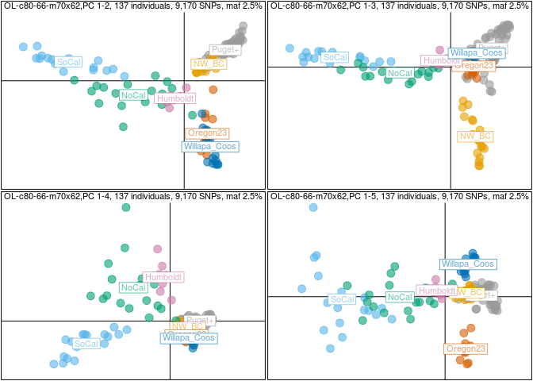 I use s.label to help identify individuals that are in weird places

``` r
s.label(pca.gindF.na$li, xax=1,yax=4, sub = "m70,PC 1-5, 137 individuals, 15,514 SNPs, maf 2.5%",possub = "topleft")
```

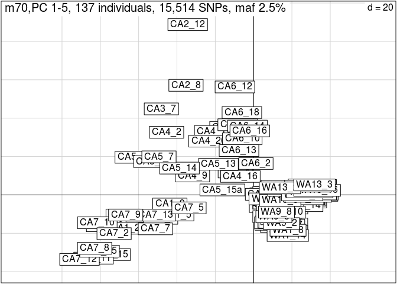

Get percent contribution of each PC

``` r
eig.perc <- 100*pca.gindF.na$eig/sum(pca.gindF.na$eig)
head(eig.perc)
```

    ## [1] 5.566897 2.324141 1.737369 1.720214 1.260430 1.237249

Plotting with pcaviz
--------------------

I am testing this package out for the developers. It will be released soon on Github, then CRAN.

``` r
#Get li and c1 from pca
li <-pca.gindF.na$li
c1 <- pca.gindF.na$c1
#Create dataframe of info like latitude and population for each individual
info_mat <- as.data.frame(cbind(g.indF.NA$strata, Latitude_OL,Longitude_OL))
colnames(info_mat) <- c("Population","Region","North.South","Latitude","Longitude")
colnames(c1) <- colnames(li)
#create pcaviz object
pviz <- pcaviz(x=li,rotation=c1,dat=info_mat)
```

``` r
pcaviz_violin(pviz,data.col="Region",sorted=FALSE,pc.dims = paste0("Axis",1:4))
```

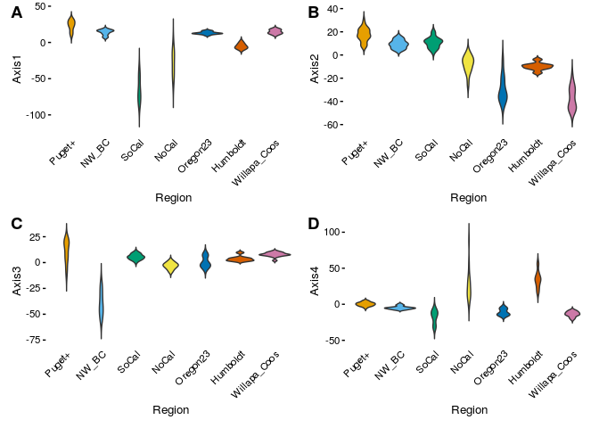

``` r
pcaviz_violin(pviz,data.col = "North.South",sorted = FALSE,pc.dims = paste0("Axis",1:4))
```

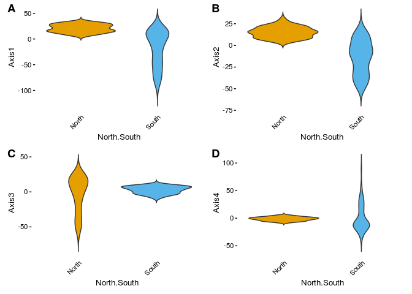 Plot with population colored by latitude.

``` r
p = list(size=4) 
plot(pviz,color = "Latitude", draw.points = T, group.summary.labels = T, draw.pc.axes = T, geom.point.params = p)
```

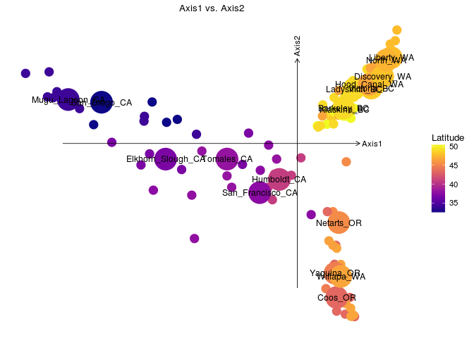

``` r
#set size of points
p = list(size=6)
plot(pviz,coords = c("Axis1","Latitude"),group="Population",
              show.legend = F,color="Latitude", group.summary.labels = T, draw.points = T)
```

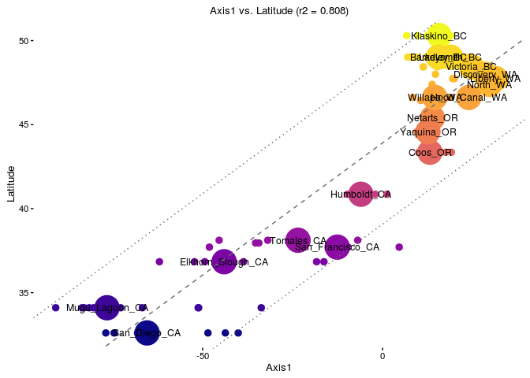

``` r
plot(pviz,coords = c("Axis1","Latitude"),group="Population",show.legend = T,color="Region", group.summary.labels = F, draw.points = T)
```

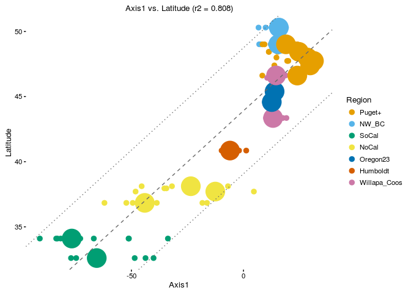

``` r
plot(pviz,coords = c("Axis2","Latitude"),group="Population",show.legend = T,color="Region", group.summary.labels = F, draw.points = T, geom.point.params =p)
```

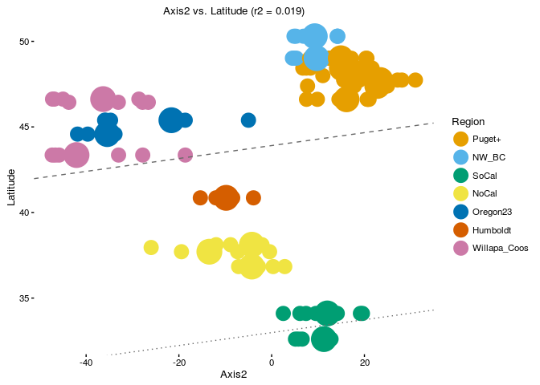

``` r
plot(pviz,coords = c("Axis3","Latitude"),group="Population",show.legend = F,color="Latitude")
```

    ## Abbreviations used in plot:
    ##  Population        Population.abbrv
    ##  Victoria_BC       V_              
    ##  Klaskino_BC       K_              
    ##  Barkeley_BC       B_              
    ##  Ladysmith_BC      L_              
    ##  San_Diego_CA      S_              
    ##  San_Francisco_CA  CA              
    ##  Netarts_OR        N_              
    ##  Tomales_CA        T_              
    ##  Elkhorn_Slough_CA E_              
    ##  Humboldt_CA       H_              
    ##  Mugu_Lagoon_CA    M_              
    ##  Coos_OR           C_              
    ##  Yaquina_OR        Y_              
    ##  Hood_Canal_WA     H_C             
    ##  Liberty_WA        L_W             
    ##  Discovery_WA      D_              
    ##  North_WA          N_W             
    ##  Willapa_WA        W_

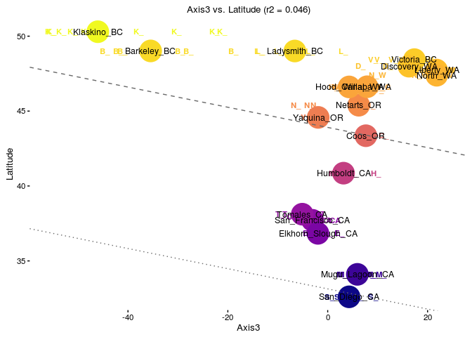

``` r
plot(pviz,coords = c("Axis4","Latitude"),group="Population",show.legend = F,color="Latitude")
```

    ## Abbreviations used in plot:
    ##  Population        Population.abbrv
    ##  Victoria_BC       V_              
    ##  Klaskino_BC       K_              
    ##  Barkeley_BC       B_              
    ##  Ladysmith_BC      L_              
    ##  San_Diego_CA      S_              
    ##  San_Francisco_CA  CA              
    ##  Netarts_OR        N_              
    ##  Tomales_CA        T_              
    ##  Elkhorn_Slough_CA E_              
    ##  Humboldt_CA       H_              
    ##  Mugu_Lagoon_CA    M_              
    ##  Coos_OR           C_              
    ##  Yaquina_OR        Y_              
    ##  Hood_Canal_WA     H_C             
    ##  Liberty_WA        L_W             
    ##  Discovery_WA      D_              
    ##  North_WA          N_W             
    ##  Willapa_WA        W_

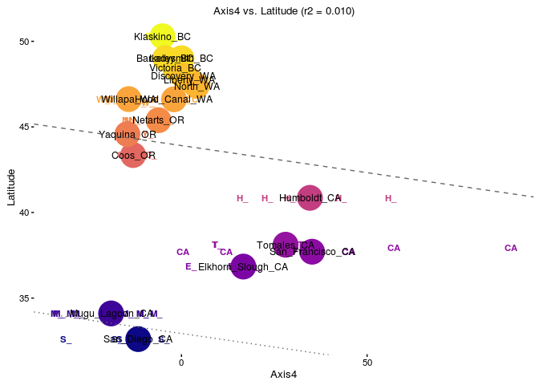

``` r
plot(pviz,coords = c("Axis5","Latitude"),group="Population",show.legend = F,color="Latitude")
```

    ## Abbreviations used in plot:
    ##  Population        Population.abbrv
    ##  Victoria_BC       V_              
    ##  Klaskino_BC       K_              
    ##  Barkeley_BC       B_              
    ##  Ladysmith_BC      L_              
    ##  San_Diego_CA      S_              
    ##  San_Francisco_CA  CA              
    ##  Netarts_OR        N_              
    ##  Tomales_CA        T_              
    ##  Elkhorn_Slough_CA E_              
    ##  Humboldt_CA       H_              
    ##  Mugu_Lagoon_CA    M_              
    ##  Coos_OR           C_              
    ##  Yaquina_OR        Y_              
    ##  Hood_Canal_WA     H_C             
    ##  Liberty_WA        L_W             
    ##  Discovery_WA      D_              
    ##  North_WA          N_W             
    ##  Willapa_WA        W_

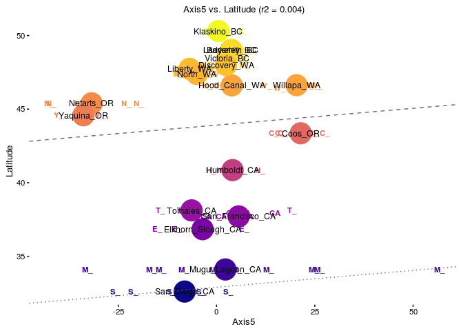

``` r
plot(pviz,coords = c("Axis6","Latitude"),group="Population",show.legend = F,color="Latitude")
```

    ## Abbreviations used in plot:
    ##  Population        Population.abbrv
    ##  Victoria_BC       V_              
    ##  Klaskino_BC       K_              
    ##  Barkeley_BC       B_              
    ##  Ladysmith_BC      L_              
    ##  San_Diego_CA      S_              
    ##  San_Francisco_CA  CA              
    ##  Netarts_OR        N_              
    ##  Tomales_CA        T_              
    ##  Elkhorn_Slough_CA E_              
    ##  Humboldt_CA       H_              
    ##  Mugu_Lagoon_CA    M_              
    ##  Coos_OR           C_              
    ##  Yaquina_OR        Y_              
    ##  Hood_Canal_WA     H_C             
    ##  Liberty_WA        L_W             
    ##  Discovery_WA      D_              
    ##  North_WA          N_W             
    ##  Willapa_WA        W_

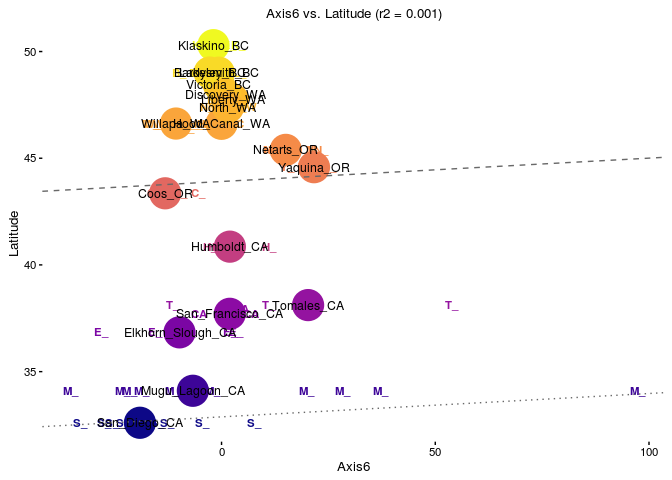

``` r
plot(pviz,coords = c("Axis1","Axis2","Axis3","Axis4","Axis5","Latitude"),group = NULL,color= "Region",draw.points = T,scale.pc.axes = 0.6, show.legend=F)
```

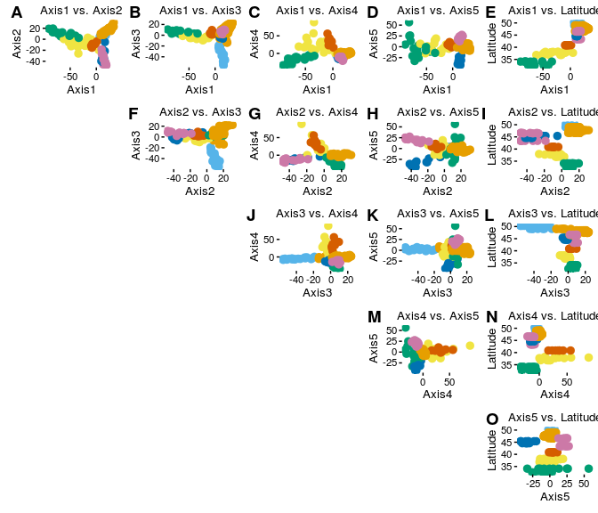
